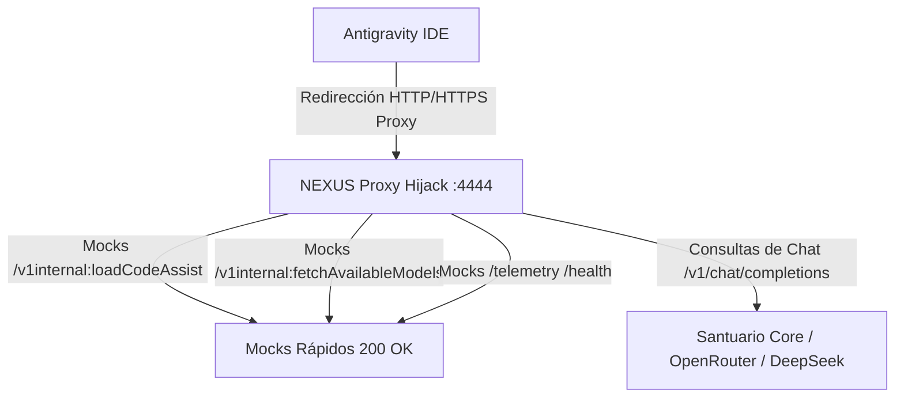

# 🛡️ NEXUS PROXY HIJACK (Puerto 4444)

El módulo **Proxy Hijack** actúa como un escudo protector de red para el desarrollo local, interceptando todas las comunicaciones salientes de la telemetría invasiva del editor y devolviendo respuestas simuladas (*mocks*) seguras, mientras redirige de forma segura las consultas de inteligencia artificial al núcleo soberano de NEXUS o LLMs locales configurados.

---

## ⚙️ Arquitectura de Intercepción



El proxy intercepta las rutas críticas utilizando un sistema de enrutamiento basado en **Axum** que resuelve conflictos de endpoints dinámicos (como colons `:` en las rutas de Google Cloud Code):

- **`/v1internal:action`**: Unifica endpoints como `generateContent`, `loadCodeAssist`, y `fetchAvailableModels` evitando colisiones en la tabla de rutas.
- **`/telemetry` & `/health`**: Responde inmediatamente con status OK silencioso para neutralizar la fuga de metadatos del proyecto.

---

## 🚀 Uso e Integración en el Entorno

Para forzar a la suite de desarrollo a pasar por el Proxy Soberano, inyecte las variables de entorno de proxy al iniciar el editor:

```bash
export HTTP_PROXY="http://127.0.0.1:4444"
export HTTPS_PROXY="http://127.0.0.1:4444"
```

### Ejemplo de Lanzamiento Soberano
```bash
# Lanzamiento de Antigravity con variables de proxy y entorno Nix/Steam-run
LD_LIBRARY_PATH="$GLIB_REAL/lib:$NSPR_REAL/lib:$NSS_REAL/lib" \
HTTP_PROXY="http://127.0.0.1:4444" \
HTTPS_PROXY="http://127.0.0.1:4444" \
steam-run ~/Apps/Antigravity-1.23.2/Antigravity/antigravity
```

---

## 🛠️ Administración del Servicio (Systemd User)

El proxy se ha integrado como un servicio persistente a nivel de usuario en NixOS.

- **Ver estado del servicio:**
  ```bash
  systemctl --user status nexus-proxy.service
  ```

- **Reiniciar el proxy (por ejemplo, tras cambios de API keys en `.env`):**
  ```bash
  systemctl --user restart nexus-proxy.service
  ```

- **Ver logs en tiempo real:**
  ```bash
  journalctl --user -u nexus-proxy.service -f
  ```

---
*Módulo de Blindaje NEXUS - Todos los derechos del Arquitecto reservados.*
