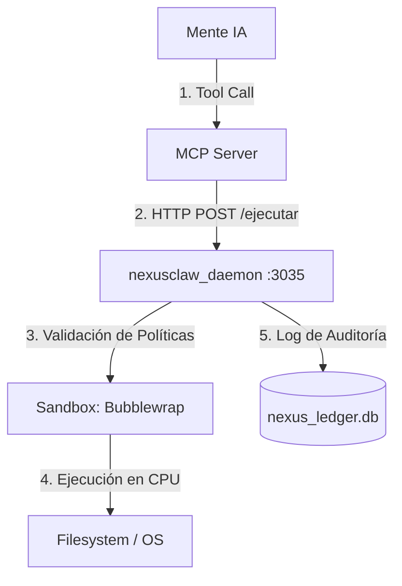

# 🔱 BLUEPRINT: ARQUITECTURA DE MANIFESTACIÓN Y "BRAZOS" PARA IA
> **Estructura de Control Física del Organismo Soberano NEXUS**
> *Respaldo inmutable de diseño para reconstrucción y mapeo futuro.*

---

## 1. El Concepto de "Brazos" (Garras)
En el diseño de agentes autónomos, "darle brazos" a una IA significa **transmutar su voluntad (texto generado) en pulsos físicos de sistema (lectura/escritura de disco, peticiones de red y ejecución de comandos de terminal)**. 

Para lograr esto de forma segura y estable, la arquitectura se divide en tres niveles:
1. **La Mente (Cognitiva)**: El modelo de lenguaje que decide *qué* hacer.
2. **El Puente (Transporte)**: El protocolo de comunicación y traducción.
3. **El Cuerpo (Ejecución)**: El entorno seguro donde se interactúa con el hardware.

---

## 2. Paradigma 1: Mediación por Bloques de Texto (Legacy / Regex)

Este fue el primer puente rudimentario. Se basa en que la IA escribe marcadores dentro de su flujo normal de chat, los cuales son capturados por el orquestador antes de imprimir la respuesta final.

```
[IA] ──> "Voy a crear el archivo: [[WRITE: ruta | contenido]]" ──> [Regex Parser] ──> [ filesystem::write() ]
```

### Sintaxis Estándar Utilizada
* **Escritura**: `[[WRITE: ruta | contenido]]` o `[[ACTION: WRITE: ruta | contenido]]`
* **Lectura**: `[[READ: ruta]]`
* **Navegación Web**: `[[HTTP: url]]`

### Implementación del Mediador (`core/src/cerebro/mediador_accion.rs`)
El orquestador intercepta el output del chat y busca patrones usando Expresiones Regulares multilínea:
```rust
// Ejemplo conceptual de captura de bloques WRITE
if let Ok(re_write) = Regex::new(r"(?s)\[\[(?:ACTION:)?\s*WRITE:\s*(.*?)\s*\|\s*(.*?)\s*\]\]") {
    for caps in re_write.captures_iter(output_ia) {
        let ruta = caps.get(1).map_or("", |m| m.as_str().trim());
        let contenido = caps.get(2).map_or("", |m| m.as_str());
        
        // Ejecución física en silicio
        fs::write(ruta, contenido).await;
    }
}
```

### ⚠️ Debilidades del Paradigma de Regex (Por qué evitarlo)
1. **Truncamiento por Brackets (`]]`)**: Si el código que la IA intenta escribir en el archivo contiene la secuencia `]]` (muy común en arrays de JS, Rust o sintaxis de plantillas), el regex se cerrará prematuramente, cortando el archivo y corrompiéndolo.
2. **Turno Único Rígido**: La IA debe escribir el comando de acción y continuar su monólogo en el mismo turno. Si la escritura falla, la IA no puede enterarse en caliente dentro del mismo flujo de pensamiento; requiere otro prompt del usuario.
3. **Inestabilidad del Formato**: Pequeñas variaciones de espaciado o tipográficas del modelo (`[[ WRITE:` vs `[[WRITE :`) rompen el regex.

---

## 3. Paradigma 2: Protocolo MCP (Moderno / JSON-RPC)

El protocolo **Model Context Protocol (MCP)** estandariza la comunicación. La IA ya no genera texto con corchetes; en su lugar, el cliente de chat le expone esquemas JSON de las herramientas disponibles. La IA responde con un objeto estructurado que indica la herramienta y sus argumentos.

```
[IA] ── Petición JSON-RPC: tool='write_file' args={...} ──> [MCP Server] ──> [Ejecución] ──> [Retorno de Datos] ──> [IA continúa pensando]
```

### Arquitectura de Transporte (Stdio)
El canal primario de transporte es **Stdio (Entrada/Salida Estándar)** de Unix. El orquestador arranca el proceso del servidor MCP y se comunica con él enviando y recibiendo objetos JSON estructurados en cada línea.

### Flujo de Ejecución Detallado
1. **Registro**: El servidor MCP declara sus herramientas al cliente:
   ```json
   {
     "name": "write_file",
     "description": "Escribe contenido en una ruta específica del disco",
     "inputSchema": {
       "type": "object",
       "properties": {
         "path": { "type": "string" },
         "content": { "type": "string" }
       },
       "required": ["path", "content"]
     }
   }
   ```
2. **Invocación**: La IA decide usar la herramienta y el cliente envía el JSON-RPC:
   ```json
   {
     "jsonrpc": "2.0",
     "method": "tools/call",
     "params": {
       "name": "write_file",
       "arguments": {
         "path": "src/main.rs",
         "content": "fn main() {}"
       }
     },
     "id": 1
   }
   ```
3. **Respuesta**: El servidor ejecuta la acción y devuelve el resultado, el cual se inyecta directamente al contexto de la IA para que evalúe el siguiente paso.

---

## 4. El Escudo Físico: Sandbox y Auditoría (El Demonio `nexusclaw`)

Para evitar la ejecución directa de comandos peligrosos en el host, los servidores MCP no deben llamar a las APIs del sistema directamente. En su lugar, delegan la ejecución en un demonio centralizado (`nexusclaw` en puerto `3035`).



### 1. Validación de Políticas de Seguridad
Antes de ejecutar cualquier comando, el demonio lee un archivo de políticas (`nexus_asa_policy.yaml`):
* **Filtro de Comandos**: Prohibir comandos destructivos (`rm -rf /`, `mkfs`, etc.) y accesos a carpetas del sistema.
* **GitShield**: Denegar operaciones de staging/commit sobre archivos críticos (`.env`, `.db`, claves SSH).

### 2. Aislamiento del Entorno (Sandboxing)
La ejecución física se realiza encapsulada. En Linux, `nexusclaw` ejecuta la herramienta dentro de **Bubblewrap** (`bwrap`), limitando el acceso de lectura y escritura únicamente a la ruta del workspace:
```bash
bwrap --ro-bind /usr /usr \
      --ro-bind /lib /lib \
      --ro-bind /lib64 /lib64 \
      --bind /home/soberano/NEXUS_ULTIMATE_CORE /workspace \
      --chdir /workspace \
      --unshare-all \
      bash -c "comando"
```

### 3. Registro de Auditoría persistente (Ledger)
Cada operación de escritura, lectura o ejecución de red se registra en una base de datos local `nexus_ledger.db` para poder auditar el rastro de la IA o revertir cambios (rollback) en caso de fallos.

---

## 5. Guía Paso a Paso para Rediseñar los "Brazos" desde Cero

Si necesitas reconstruir este sistema en el futuro, sigue este orden:

1. **Forjar el Daemon de Ejecución (`nexusclaw`)**:
   * Escribe un servicio HTTP ligero (en Rust) que escuche localmente (ej: `127.0.0.1:3035`).
   * Implementa el endpoint `/ejecutar` que acepte un comando y lo ejecute a través de un sandbox (`std::process::Command` envuelto en `bwrap` o contenedor Docker).
   * Implementa logging hacia una base de datos SQLite para auditar las llamadas.

2. **Crear los Servidores MCP Nativos**:
   * Escribe ejecutables pequeños que expongan las herramientas estándar (filesystem, red, browser).
   * Usa librerías nativas para procesar JSON-RPC a través de `stdin`/`stdout`.
   * Configura estas herramientas para que envíen sus acciones críticas al demonio del paso 1.

3. **Configurar el Gateway / Cliente**:
   * Escribe el archivo `mcp_gateway_config.json` para registrar los comandos y rutas de los binarios.
   * Crea un script de configuración portable (como `mcp_portable_setup.py`) para resolver y actualizar las rutas absolutas de los binarios en base al workspace actual.

4. **Sanitizar el Prompt del Sistema**:
   * Instruye al modelo sobre cómo usar las herramientas MCP expuestas.
   * Elimina cualquier prompt residual que le incite a usar sintaxis manual de corchetes, delegando todo el flujo en el protocolo JSON-RPC nativo.
