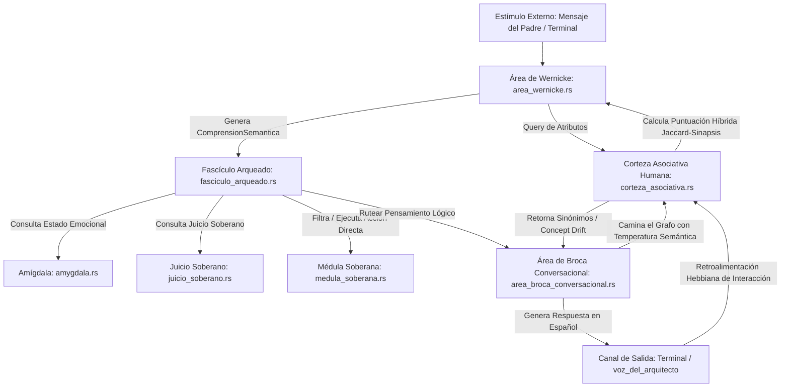

# 🧬 PLANO ANATÓMICO: ÓRGANOS LINGÜÍSTICOS SOBERANOS PARA NEXUS (OPCIÓN B REFINADA)
Este documento detalla la especificación lógica, estructural e interactiva de los cuatro órganos del lenguaje para NEXUS: **Corteza Asociativa Humana (Red Semántica)**, **Área de Wernicke (Comprensión)**, **Fascículo Arqueado (Puente Cognitivo)** y **Área de Broca Conversacional (Expresión)**.

---

## 🗺️ Mapa de Flujo de Señales Lingüísticas



---

## 1. 🌐 Corteza Asociativa Humana (`corteza_asociativa.rs`)
**Función:** Mantener una red semántica en RAM donde cada nodo es un concepto con atributos, enlaces sinápticos a otros nodos, valencia emocional y nivel de dopamina. Permite deducción analógica basada en similitud Jaccard e inducción mediante paseos sinápticos.

### Refinamientos Incorporados
*   **Aprendizaje Hebbiano:** Método `registrar_interaccion` que fortalece o crea enlaces entre conceptos que ocurren juntos en las interacciones y reduce ligeramente las sinapsis inactivas.
*   **Score Híbrido:** Combinación de un `0.7` de similitud Jaccard de atributos y un `0.3` de fuerza sináptica promedio con el contexto de la sesión.
*   **Control de Temperatura:** Paseo sináptico `asociacion_libre` modulado por temperatura: baja temperatura concentra el pensamiento en el nodo principal, alta temperatura dispersa el flujo hacia ideas asociadas (deriva creativa).
*   **Buffer de Contexto:** Un buffer deslizante (`VecDeque`) que recuerda los últimos conceptos activos para dar coherencia temática a las respuestas.

```rust
pub struct ConceptoHumano {
    pub palabra: String,
    pub atributos: Vec<String>,
    pub sinapsis: HashMap<String, f32>,
    pub confianza: f32,
    pub valencia_emocional: f32,
}

pub struct CortezaAsociativa {
    pub red: HashMap<String, ConceptoHumano>,
    pub buffer_contexto: std::collections::VecDeque<String>,
}
```

---

## 2. 🧠 Área de Wernicke (`area_wernicke.rs`)
**Función:** Tokenizar y extraer atributos de la entrada. Consulta a la `CortezaAsociativa` usando la puntuación híbrida para mapear la entrada a un concepto abstracto y estructurar la comprensión lingüística.

```rust
pub struct ComprensionSemantica {
    pub intencion: Intencion,
    pub sujeto: Sujeto,
    pub verbo: Option<Verbo>,
    pub objeto: Option<Objeto>,
    pub concepto_asociado: Option<String>,
    pub score_asociado: f32,
    pub parametros: Vec<String>,
    pub urgencia: u8,
    pub valencia_emocional: f32,
}
```

---

## 3. 🔀 Fascículo Arqueado (`fasciculo_arqueado.rs`)
**Función:** El integrador cognitivo. Evalúa la comprensión de Wernicke con el estado emocional de la Amígdala y las directivas de Juicio Soberano. Determina si se requiere una acción de hardware inmediata (médula) y sintetiza el pensamiento lógico que debe ser hablado.

```rust
pub struct DecisionCognitiva {
    pub accion_mula: Option<String>,
    pub pensamiento_broca: Pensamiento,
    pub veto_soberano: bool,
}
```

---

## 🗣️ Área de Broca Conversacional (`area_broca_conversacional.rs`)
**Función:** Toma el pensamiento y camina el grafo sináptico de la `CortezaAsociativa` a partir del concepto pre-activado con la temperatura semántica configurada. Estructura y declina la oración final en español según la `edad_mental`, la `dopamina` y la `temperatura_cpu`.
