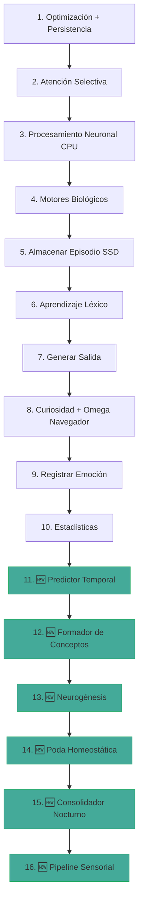

# 🧠 PLAN DE APRENDIZAJE PROFUNDO — 6 Motores Omega

> **Arquitecto**: Diseño detallado de los 6 motores de aprendizaje que transformarán
> al cerebro de "bebé que balbucea" en "investigador autodidacta".
>
> **Fecha**: 2026-06-20 | **Versión**: 1.0 | **Depende de**: Omega Navegador (PLAN_OMEGA_NAVEGADOR.md)

---

## 📊 DIAGNÓSTICO: Qué aprende HOY el engine

| Mecanismo | Archivo | Alcance | Limitación crítica |
|-----------|---------|---------|-------------------|
| STDP (LTP/LTD) | [`motores.rs:157`](src/cerebro/motores.rs:157) | Solo VRAM (~1000 neuronas) | Las 99K neuronas en RAM no participan |
| Léxico (Markov) | [`motor_lexico.rs:260`](src/cerebro/lexico/motor_lexico.rs:260) | Transiciones palabra→palabra | Aprende secuencias, no **significado** |
| Episodios (SSD) | [`memoria.rs:212`](src/cerebro/memoria.rs:212) | Almacena experiencias | **Nunca se reprocesan** — diario que no se relee |
| Dopamina | [`motores.rs:431`](src/cerebro/motores.rs:431) | Predicción de recompensa | No modifica conexiones reales |

---

## 🗺️ ARQUITECTURA GENERAL — Nuevo Pipeline de 16 Pasos



---

## 🔮 MOTOR 1: Predictor Temporal (`src/cerebro/aprendizaje/predictor.rs`)

### Propósito
Aprender a **anticipar** qué patrón neuronal sigue a otro. La predicción es la base de la inteligencia: el cerebro que predice bien gasta menos energía.

### Algoritmo

```
Registro de secuencias:
  - Mantiene un buffer circular de los últimos K estados (K=32)
  - Cada estado = vector de activación de las neuronas en VRAM (top-N, N=64)
  - Buffer: VecDeque<Vec<(u32, f32)>>  // (neurona_id, activacion)

Predicción:
  - Cuando ve un prefijo de longitud P en el buffer (P=16):
    1. Busca en el historial de secuencias las que empiezan igual
    2. Promedia el estado siguiente de esas secuencias
    3. Retorna predicción: Vec<(u32, f32)>  // (neurona_id, activacion_esperada)

Error de predicción:
  - Compara predicción con realidad (siguiente paso real)
  - error = Σ |activacion_real - activacion_esperada| / N
  - El error alimenta el SistemaDopamina (novedad → dopamina → curiosidad)

Aprendizaje:
  - Guarda secuencias completas en un HashMap<u64, Vec<Vec<(u32, f32)>>>
    donde la clave es un hash del prefijo (primeras 16 entradas)
  - Cuando aparecen secuencias nuevas, las agrega al bucket correspondiente
  - Máximo 100 secuencias por bucket (LRU eviction)
```

### Estructura de datos

```rust
pub struct MotorPrediccion {
    /// Buffer circular de últimos estados
    buffer: VecDeque<Vec<(u32, f32)>>,
    /// Capacidad máxima del buffer
    capacidad_buffer: usize,  // 32

    /// Historial de secuencias: hash(prefijo) → posibles continuaciones
    memoria_secuencias: HashMap<u64, Vec<Vec<(u32, f32)>>>,
    /// Máximo de secuencias por bucket
    max_por_bucket: usize,  // 100

    /// Última predicción realizada
    ultima_prediccion: Vec<(u32, f32)>,
    /// Error de la última predicción
    error_prediccion: f32,

    /// Contador de secuencias aprendidas
    secuencias_aprendidas: u64,
    /// Número de predicciones acertadas (error < umbral)
    predicciones_acertadas: u64,
    /// Total de predicciones realizadas
    total_predicciones: u64,

    /// Tasa de acierto (métrica interna)
    pub tasa_acierto: f32,
}
```

### API pública

```rust
impl MotorPrediccion {
    pub fn nuevo() -> Self;

    /// Registra un nuevo estado neuronal en el buffer y actualiza la memoria
    pub fn registrar_estado(&mut self, actividad: &[(u32, f32)]);

    /// Predice el siguiente estado basado en el buffer actual
    /// Retorna None si no hay suficientes datos en el buffer
    pub fn predecir(&self) -> Option<Vec<(u32, f32)>>;

    /// Calcula el error entre la predicción y el estado real
    /// Retorna el error normalizado (0.0 = predicción perfecta, 1.0 = totalmente errada)
    pub fn calcular_error(&self, estado_real: &[(u32, f32)]) -> f32;

    /// Actualiza la memoria de secuencias con el estado real (aprendizaje)
    pub fn aprender(&mut self, estado_real: &[(u32, f32)]);

    /// Aplica el error de predicción al SistemaDopamina
    pub fn error_dopamina(&self) -> f32;

    /// Estadísticas
    pub fn estadisticas(&self) -> (u64, u64, u64, f32);
}
```

### Integración al pipeline (Paso 11)

```
// En cerebro.rs::paso(), después de Paso 10 (Estadísticas):
// === 11. PREDICTOR TEMPORAL ===
let top_actividad: Vec<(u32, f32)> = actividad.iter()
    .enumerate()
    .map(|(i, &a)| (i as u32, a))
    .filter(|(_, a)| *a > 0.1)
    .take(64)
    .collect();

self.predictor.registrar_estado(&top_actividad);

if let Some(prediccion) = self.predictor.predecir() {
    let error = self.predictor.calcular_error(&top_actividad);
    self.predictor.aprender(&top_actividad);
    // El error alimenta dopamina → curiosidad en el próximo paso
    self.motores.dopamina.nivel += error * 0.1;
}
```

### Tests (~8 tests)

1. `test_buffer_circular` — llenar buffer rota correctamente
2. `test_predecir_sin_datos` — sin buffer suficiente retorna None
3. `test_aprender_y_predecir` — misma secuencia → predicción cercana
4. `test_error_perfecto` — predicción exacta → error ~0
5. `test_error_total` — predicción opuesta → error ~1
6. `test_hash_prefijo` — distintos prefijos → distintos buckets
7. `test_lru_eviction` — excede max_por_bucket → elimina más antigua
8. `test_tasa_acierto` — contador de aciertos funciona

---

## 🎯 MOTOR 2: Formador de Conceptos (`src/cerebro/aprendizaje/conceptos.rs`)

### Propósito
Agrupar tokens relacionados por co-ocurrencia en **proto-conceptos**. El cerebro aprende que "gato", "felino", "michi" son la misma idea.

### Algoritmo

```
Detección de co-ocurrencia:
  - Para cada token en una oración, incrementa un contador de pares
  - Matriz de co-ocurrencia: HashMap<(u32, u32), u32>
    donde la clave es (token_a, token_b) y el valor es cuántas veces aparecieron
    en la misma ventana de 5 tokens

Clustering por umbral:
  - Cada N pasos (N=500), escanea la matriz
  - Si co_ocurrencia(token_a, token_b) > UMBRAL_COOCURRENCIA (10):
    - Busca si alguno ya pertenece a un proto-concepto
    - Si ninguno pertenece → crea nuevo proto-concepto {token_a, token_b}
    - Si uno pertenece → agrega el otro al proto-concepto existente
    - Si ambos pertenecen a distintos → fusiona los proto-conceptos

Proto-concepto:
  - Vec<u32> de token IDs
  - Una neurona hub asignada (creada por MotorNeurogenesis)
  - Peso del concepto: promedio de co-ocurrencias entre sus miembros
```

### Estructura de datos

```rust
#[derive(Clone, Debug)]
pub struct ProtoConcepto {
    /// IDs de tokens que forman este concepto
    pub miembros: Vec<u32>,
    /// ID de la neurona hub que representa este concepto
    pub neurona_hub: Option<u32>,
    /// Peso del concepto (0.0-1.0): qué tan fuerte es la asociación
    pub peso: f32,
}

pub struct MotorConceptos {
    /// Matriz de co-ocurrencia: (token_a, token_b) → conteo
    co_ocurrencias: HashMap<(u32, u32), u32>,

    /// Proto-conceptos formados
    conceptos: Vec<ProtoConcepto>,

    /// Umbral de co-ocurrencia para formar un concepto
    umbral_coocurrencia: u32,  // 10

    /// Tamaño de la ventana de contexto en tokens
    ventana_contexto: usize,  // 5

    /// Paso actual para escaneo periódico
    paso_actual: u64,

    /// Cada cuántos pasos se ejecuta el clustering
    cadencia_agrupacion: u64,  // 500

    /// Contador de conceptos formados
    conceptos_formados: u64,
}
```

### API pública

```rust
impl MotorConceptos {
    pub fn nuevo() -> Self;

    /// Registra co-ocurrencias entre tokens en una oración
    /// tokens: IDs de tokens en orden de aparición
    pub fn registrar_oracion(&mut self, tokens: &[u32]);

    /// Ejecuta clustering de co-ocurrencias para formar/actualizar conceptos
    /// Retorna los conceptos nuevos o modificados
    pub fn agrupar(&mut self) -> Vec<ProtoConcepto>;

    /// Busca el proto-concepto que contiene un token
    pub fn concepto_de(&self, token_id: u32) -> Option<&ProtoConcepto>;

    /// Obtiene todos los miembros de un concepto dado un token
    pub fn miembros_relacionados(&self, token_id: u32) -> Vec<u32>;

    /// Estadísticas
    pub fn total_conceptos(&self) -> usize;
}
```

### Integración al pipeline (Paso 12)

```
// En cerebro.rs::paso(), después de Paso 11:
// === 12. FORMADOR DE CONCEPTOS ===
if let Some(ref texto_entrada) = entrada.texto {
    let tokens: Vec<u32> = texto_entrada.split_whitespace()
        .filter_map(|p| self.motor_lexico.indice_de(p))
        .collect();
    if !tokens.is_empty() {
        self.motor_conceptos.registrar_oracion(&tokens);
    }
}

// Agrupación periódica
if self.paso_actual % self.motor_conceptos.cadencia_agrupacion == 0 {
    let nuevos_conceptos = self.motor_conceptos.agrupar();
    for concepto in &nuevos_conceptos {
        if concepto.neurona_hub.is_none() && concepto.peso > 0.3 {
            // Solicitar neurogénesis para este concepto
            // (se procesa en el Paso 13)
        }
    }
}
```

### Tests (~7 tests)

1. `test_coocurrencia_simple` — dos tokens en ventana → conteo++
2. `test_coocurrencia_fuera_ventana` — tokens distantes no cuentan
3. `test_agrupar_sobre_umbral` — suficientes co-ocurrencias → nuevo concepto
4. `test_agrupar_bajo_umbral` — pocas co-ocurrencias → sin concepto
5. `test_fusion_conceptos` — dos conceptos comparten token → fusión
6. `test_concepto_de` — búsqueda por token funciona
7. `test_miembros_relacionados` — retorna todos los tokens del concepto

---

## 🧬 MOTOR 3: Neurogénesis (`src/cerebro/aprendizaje/neurogenesis.rs`)

### Propósito
Crear **nuevas neuronas** cuando aparece un concepto que no encaja en ninguna neurona existente. Como el cerebro adulto que genera neuronas en el hipocampo.

### Algoritmo

```
Detección de necesidad:
  - Escucha solicitudes de neurogénesis desde MotorConceptos
  - Un token nuevo que aparece frecuentemente (>5 veces en 1000 pasos)
    sin neuronas fuertemente asociadas → candidato a neurogénesis
  - Un proto-concepto sin neurona hub → candidato a neurogénesis

Creación de neurona hub:
  - NeuronaCompacta::aleatoria() con capa 2 (corteza asociativa)
  - Tipo: excitatoria (0)
  - Se ubica en RAM inicialmente
  - Si la demanda es alta, se mueve a VRAM

Conexión al léxico:
  - Para cada token del concepto, crea conexión léxica bidireccional:
    - neurona_hub → token con peso 0.3
    - token → neurona_hub con peso 0.3
  - Esto permite activar el concepto desde el lenguaje y viceversa

Conexión sináptica:
  - Conecta la neurona hub a las neuronas más activas del momento
  - Usando STDP: las neuronas que dispararon juntas se conectan
```

### Estructura de datos

```rust
pub struct MotorNeurogenesis {
    /// Contador de frecuencia de tokens: token_id → conteo en últimos 1000 pasos
    frecuencia_tokens: HashMap<u32, u64>,

    /// Mapa: token_id → neuronas ya conectadas
    token_a_neuronas: HashMap<u32, Vec<u32>>,

    /// Cola de conceptos que necesitan neurona hub (desde MotorConceptos)
    cola_conceptos: VecDeque<ProtoConcepto>,

    /// Neuronas creadas por este motor
    neuronas_creadas: Vec<u32>,

    /// Total de neuronas creadas
    total_creadas: u64,

    /// Máximo de neuronas que se pueden crear
    max_neuronas: usize,  // 10000

    /// Umbral de frecuencia para crear neurona de token
    umbral_frecuencia: u64,  // 5

    /// Ventana de observación (pasos)
    ventana_observacion: u64,  // 1000

    /// Paso actual
    paso_actual: u64,
}
```

### API pública

```rust
impl MotorNeurogenesis {
    pub fn nuevo() -> Self;

    /// Registra un token visto (incrementa frecuencia)
    pub fn registrar_token(&mut self, token_id: u32);

    /// Recibe solicitud de concepto desde MotorConceptos
    pub fn solicitar_neurona_para_concepto(&mut self, concepto: ProtoConcepto);

    /// Procesa la cola y crea neuronas si corresponde
    /// Retorna las nuevas neuronas creadas (id, token_ids_asociados)
    /// Requiere acceso al CerebroAutoOptimizable para crear neuronas reales
    pub fn procesar(
        &mut self,
        cerebro: &mut CerebroAutoOptimizable,
        motor_lexico: &mut MotorLexico,
    ) -> Vec<(u32, Vec<u32>)>;

    /// Decaimiento de frecuencias (cada ventana_observacion pasos)
    pub fn decaer_frecuencias(&mut self);

    /// Estadísticas
    pub fn total_creadas(&self) -> u64;
}
```

### Integración al pipeline (Paso 13)

```
// En cerebro.rs::paso():
// === 13. NEUROGÉNESIS ===
// Registrar tokens de la entrada
if let Some(ref texto) = entrada.texto {
    for palabra in texto.split_whitespace() {
        if let Some(id) = self.motor_lexico.indice_de(palabra) {
            self.motor_neurogenesis.registrar_token(id);
        }
    }
}

// Recibir conceptos nuevos del MotorConceptos
for concepto in nuevos_conceptos {
    if concepto.neurona_hub.is_none() && concepto.peso > 0.3 {
        self.motor_neurogenesis.solicitar_neurona_para_concepto(concepto);
    }
}

// Procesar neurogénesis periódicamente
if self.paso_actual % 500 == 0 {
    let nuevas = self.motor_neurogenesis.procesar(self, &mut self.motor_lexico);
    for (neurona_id, tokens) in &nuevas {
        println!("  🧬 Neurogénesis: neurona {} para {} tokens", neurona_id, tokens.len());
    }
    self.motor_neurogenesis.decaer_frecuencias();
}
```

### Tests (~6 tests)

1. `test_registrar_token` — frecuencia incrementa correctamente
2. `test_decaer_frecuencias` — frecuencias bajan con el tiempo
3. `test_solicitar_concepto` — concepto se encola
4. `test_procesar_sin_suficiente_frecuencia` — no crea neurona bajo umbral
5. `test_procesar_con_frecuencia_alta` — crea neurona y conexiones léxicas
6. `test_max_neuronas` — no excede el límite

---

## ✂️ MOTOR 4: Poda Homeostática (`src/cerebro/aprendizaje/poda.rs`)

### Propósito
Eliminar conexiones débiles y neuronas inactivas para mantener el cerebro **limpio y eficiente**. Como la poda sináptica del cerebro adolescente.

### Algoritmo

```
Poda sináptica:
  - Cada 1000 pasos, escanea TODAS las sinapsis en VRAM y RAM
  - Sinapsis con |peso| < UMBRAL_MINIMO (0.01) → eliminadas
  - Sinapsis a neuronas que ya no existen → eliminadas
  - Máximo de sinapsis por neurona: 256 (si excede, elimina las más débiles)

Poda neuronal:
  - Cada 1000 pasos, escanea neuronas en RAM
  - Neurona con frecuencia < UMBRAL_FRECUENCIA (0.01 Hz) por más de
    VENTANA_INACTIVIDAD pasos (10000) → candidata a eliminación
  - Pero: neuronas con edad < EDAD_MINIMA (1000 pasos) → protegidas (recién nacidas)
  - Máximo de neuronas a eliminar por ciclo: 100 (para no desestabilizar)

Reorganización:
  - Neuronas más activas se mueven a VRAM
  - Neuronas menos activas se mueven a RAM
  - Si VRAM está llena, la neurona menos usada baja a RAM (LRU)
```

### Estructura de datos

```rust
pub struct MotorPoda {
    /// Umbral de peso mínimo para mantener una sinapsis
    umbral_peso_min: f32,  // 0.01

    /// Máximo de sinapsis por neurona
    max_sinapsis_por_neurona: usize,  // 256

    /// Umbral de frecuencia mínima para mantener una neurona (Hz)
    umbral_frecuencia_min: f32,  // 0.01

    /// Ventana de inactividad antes de eliminar (pasos)
    ventana_inactividad: u64,  // 10000

    /// Edad mínima antes de poder ser eliminada (pasos)
    edad_minima: u64,  // 1000

    /// Máximo de neuronas a eliminar por ciclo
    max_eliminar_por_ciclo: usize,  // 100

    /// Sinapsis eliminadas totales
    sinapsis_eliminadas: u64,

    /// Neuronas eliminadas totales
    neuronas_eliminadas: u64,

    /// Ciclos de poda ejecutados
    ciclos_poda: u64,

    /// Paso actual
    paso_actual: u64,
}
```

### API pública

```rust
impl MotorPoda {
    pub fn nuevo() -> Self;

    /// Ejecuta un ciclo completo de poda sobre el cerebro
    /// 1. Poda sináptica (VRAM y RAM)
    /// 2. Poda neuronal (RAM)
    /// 3. Reorganización VRAM/RAM
    pub fn ejecutar(&mut self, cerebro: &mut CerebroAutoOptimizable);

    /// Solo poda sináptica (más liviano)
    pub fn podar_sinapsis(&mut self, cerebro: &mut CerebroAutoOptimizable);

    /// Solo reorganización VRAM/RAM
    pub fn reorganizar(&mut self, cerebro: &mut CerebroAutoOptimizable);

    /// Estadísticas
    pub fn estadisticas(&self) -> (u64, u64, u64);
}
```

### Integración al pipeline (Paso 14)

```
// En cerebro.rs::paso():
// === 14. PODA HOMEOSTÁTICA ===
if self.paso_actual % 1000 == 0 {
    self.motor_poda.ejecutar(self);

    if self.paso_actual % 10000 == 0 {
        let (s, n, c) = self.motor_poda.estadisticas();
        println!("  ✂️ Poda: {} sinapsis, {} neuronas eliminadas en {} ciclos", s, n, c);
    }
}
```

### Tests (~7 tests)

1. `test_podar_sinapsis_debiles` — sinapsis con peso < 0.01 eliminadas
2. `test_podar_sinapsis_huerfanas` — sinapsis a neuronas inexistentes eliminadas
3. `test_limite_sinapsis_por_neurona` — máximo 256 sinapsis
4. `test_podar_neurona_inactiva` — neurona sin disparos → eliminada
5. `test_proteger_neurona_joven` — neurona recién creada no se elimina
6. `test_reorganizar_vram` — neurona más activa sube a VRAM
7. `test_max_eliminar_por_ciclo` — no excede 100 eliminaciones

---

## 🛌 MOTOR 5: Consolidador Nocturno (`src/cerebro/aprendizaje/consolidador.rs`)

### Propósito
Reprocesar episodios del SSD para **fijar recuerdos**, como el sueño REM. Es el mecanismo más importante para el aprendizaje profundo.

### Algoritmo

```
Ciclo de sueño:
  - Se activa cada N pasos (N=5000, ~una vez por "noche" del cerebro)
  - Duración: M pasos (M=500, ~un "ciclo de sueño" rápido)

Fase 1 — Selección de episodios:
  - Toma los últimos 100 episodios del SSD
  - Los ordena por relevancia (intensidad * emoción_absoluta)
  - Selecciona los top 20

Fase 2 — Reproducción:
  - Para cada episodio seleccionado:
    a. Activa las neuronas del patrón guardado (corriente_entrada += 0.3)
    b. Ejecuta 5 pasos de simulación (dt normal)
    c. Las neuronas que disparan juntas fortalecen sinapsis (STDP)
    d. Las transiciones léxicas asociadas se refuerzan

Fase 3 — Consolidación léxica:
  - Refuerza transiciones Markov del léxico que aparecen en episodios
  - peso_transicion += 0.01 por cada episodio donde aparecen juntas

Fase 4 — Generalización:
  - Busca patrones comunes entre episodios
  - Si 3+ episodios comparten >50% del patrón neuronal → crea "meta-episodio"
  - El meta-episodio representa conocimiento generalizado
```

### Estructura de datos

```rust
#[derive(Clone, Debug)]
pub struct MetaEpisodio {
    /// Patrón neuronal generalizado
    pub patron: [u32; 8],
    /// Episodios fuente que lo formaron
    pub fuentes: Vec<usize>,
    /// Peso de generalización
    pub peso: f32,
}

pub struct MotorConsolidacion {
    /// ¿Está actualmente en ciclo de sueño?
    pub en_suenio: bool,

    /// Pasos restantes en el ciclo actual
    pasos_restantes: u64,

    /// Duración de un ciclo de sueño (pasos)
    duracion_suenio: u64,  // 500

    /// Cada cuántos pasos se activa el sueño
    cadencia_suenio: u64,  // 5000

    /// Episodios seleccionados para este ciclo
    episodios_a_consolidar: Vec<Episodio>,

    /// Índice del episodio actual en procesamiento
    indice_actual: usize,

    /// Pasos por episodio durante consolidación
    pasos_por_episodio: u64,  // 5

    /// Contador de pasos dentro del episodio actual
    paso_en_episodio: u64,

    /// Meta-episodios generalizados
    meta_episodios: Vec<MetaEpisodio>,

    /// Ciclos de sueño completados
    ciclos_completados: u64,

    /// Episodios consolidados totales
    episodios_consolidados: u64,

    /// Paso actual
    paso_actual: u64,
}
```

### API pública

```rust
impl MotorConsolidacion {
    pub fn nuevo() -> Self;

    /// Verifica si debe iniciar un ciclo de sueño
    pub fn debe_dormir(&self) -> bool;

    /// Inicia un ciclo de sueño (selecciona episodios del SSD)
    pub fn iniciar_suenio(&mut self, ssd: &SsdManager);

    /// Ejecuta un paso del ciclo de sueño
    /// Retorna true si el ciclo continúa, false si terminó
    pub fn paso_suenio(
        &mut self,
        cerebro: &mut CerebroAutoOptimizable,
        dt: f32,
    ) -> bool;

    /// Finaliza el ciclo de sueño (generalización)
    pub fn finalizar_suenio(&mut self);

    /// ¿Está dormido?
    pub fn durmiendo(&self) -> bool;

    /// Estadísticas
    pub fn estadisticas(&self) -> (u64, u64, u64);
}
```

### Integración al pipeline (Paso 15)

```
// En cerebro.rs::paso():
// === 15. CONSOLIDADOR NOCTURNO ===
if self.motor_consolidacion.durmiendo() {
    // Durante el sueño, el pipeline normal se suspende parcialmente
    let sigue = self.motor_consolidacion.paso_suenio(self, dt);
    if !sigue {
        self.motor_consolidacion.finalizar_suenio();
        println!("  🛌 Sueño completado: {} ciclos", self.motor_consolidacion.ciclos_completados);
    }
    // Retornar temprano: durante el sueño no se genera salida normal
    return self.ultima_salida.clone();
}

if self.motor_consolidacion.debe_dormir() {
    self.motor_consolidacion.iniciar_suenio(&self.memoria.ssd);
    println!("  🛌 Iniciando ciclo de sueño...");
}
```

### Tests (~8 tests)

1. `test_debe_dormir_cadencia` — se activa cada 5000 pasos
2. `test_iniciar_suenio_selecciona_episodios` — selecciona top 20
3. `test_paso_suenio_activa_neuronas` — activa patrón del episodio
4. `test_paso_suenio_refuerza_lexico` — transiciones léxicas se fortalecen
5. `test_suenio_completo_consolida` — termina correctamente
6. `test_generalizacion_meta_episodios` — 3+ episodios similares → meta-episodio
7. `test_durmiendo_bloquea_salida` — no genera texto durante sueño
8. `test_estadisticas` — contadores funcionan

---

## 🔌 MOTOR 6: Pipeline Sensorial Mejorado (`src/cerebro/aprendizaje/sensorial.rs`)

### Propósito
Reemplazar el hash de caracteres (`ch as u32 % 500`) con **embeddings semánticos livianos** que activen patrones neuronales coherentes. Palabras similares deben activar neuronas cercanas.

### Algoritmo

```
Embedding semántico liviano (sin dependencias externas):
  - Usa "Random Indexing" — una técnica de NLP que no requiere pre-entrenamiento
  - Cada palabra se representa como un vector esparso de D dimensiones (D=256)
  - El vector se construye incrementalmente por co-ocurrencia

Construcción del embedding:
  1. Semilla inicial: para cada palabra nueva, genera un "index vector"
     aleatorio con K=8 elementos no-cero (+1 o -1) en posiciones aleatorias
  2. Actualización por contexto: cada vez que dos palabras aparecen juntas
     (ventana de 3 tokens), el vector de contexto se acumula:
     context_vector[palabra_a] += index_vector[palabra_b] * 0.01
  3. El embedding final es: index_vector + context_vector

Activación neuronal desde embedding:
  - Divide las D=256 dimensiones en 32 grupos de 8
  - Cada grupo mapea a una neurona (ID = base_id + grupo_idx)
  - La activación = suma de valores del grupo / 8 (normalizada 0-1)
  - Neuronas cercanas reciben patrones similares para palabras similares

Esto reemplaza:
  // ANTES: for (_i, ch) in resultado.chars().enumerate().take(30) {
  //           let id = 5000 + (ch as u32 % 500);
  // AHORA: for (neurona_id, activacion) in motor_sensorial.activar_desde_texto(&resultado) {
```

### Estructura de datos

```rust
pub struct MotorSensorial {
    /// Embeddings de palabras: token_id → vector de D dimensiones
    embeddings: HashMap<u32, Vec<f32>>,

    /// Dimensionalidad del embedding
    dimensiones: usize,  // 256

    /// Elementos no-cero en el index vector inicial (sparsity)
    k_sparse: usize,  // 8

    /// Tasa de aprendizaje para contexto
    tasa_contexto: f32,  // 0.01

    /// Ventana de contexto (tokens a cada lado)
    ventana_contexto: usize,  // 3

    /// Neuronas base para el mapeo (rango de IDs)
    base_neurona: u32,  // 10000
    grupo_por_neurona: usize,  // 8

    /// RNG interno para generar index vectors
    rng: u64,

    /// Palabras procesadas
    palabras_procesadas: u64,
}
```

### API pública

```rust
impl MotorSensorial {
    pub fn nuevo() -> Self;

    /// Genera o recupera el index vector para un token
    fn index_vector(&mut self, token_id: u32) -> Vec<f32>;

    /// Actualiza embeddings por co-ocurrencia en una oración
    pub fn aprender_contexto(&mut self, tokens: &[u32]);

    /// Convierte texto en estímulos neuronales (reemplaza el hash de caracteres)
    /// Retorna Vec<Estimulo> listo para alimentar al cerebro
    pub fn texto_a_estimulos(&self, texto: &str, motor_lexico: &MotorLexico) -> Vec<Estimulo>;

    /// Calcula similitud semántica entre dos tokens (0.0-1.0)
    pub fn similitud_semantica(&self, token_a: u32, token_b: u32) -> f32;

    /// Encuentra los tokens más similares a uno dado
    pub fn tokens_similares(&self, token_id: u32, top_n: usize, motor_lexico: &MotorLexico) -> Vec<(String, f32)>;

    /// Estadísticas
    pub fn total_embeddings(&self) -> usize;
}
```

### Integración al pipeline (Paso 16 + modificar Paso 8)

```
// === 16. PIPELINE SENSORIAL (reemplaza hash de caracteres) ===
// Esto modifica cómo se crean las entradas auto-generadas en el Paso 8

// ANTES en Paso 8:
// for (_i, ch) in sintesis.chars().enumerate().take(30) {
//     let id = 5000 + (ch as u32 % 500);

// AHORA en Paso 8:
let estimulos_semanticos = self.motor_sensorial.texto_a_estimulos(
    &sintesis, &self.motor_lexico
);

// También se aplica a TODAS las entradas de texto en el pipeline:
// En Paso 0 (recepción de entrada):
if let Some(ref texto) = entrada.texto {
    self.motor_sensorial.aprender_contexto(
        &tokens_from_text(texto, &self.motor_lexico)
    );
    // Enriquecer la entrada con estímulos semánticos
    let estimulos_semanticos = self.motor_sensorial.texto_a_estimulos(
        texto, &self.motor_lexico
    );
    entrada.estimulos.extend(estimulos_semanticos);
}
```

### Tests (~7 tests)

1. `test_index_vector_deterministico` — mismo token → mismo vector
2. `test_index_vector_diferentes_tokens` — distintos tokens → distintos vectores
3. `test_aprender_contexto_similitud` — palabras cercanas → vectores más similares
4. `test_texto_a_estimulos` — genera estimulos con IDs y activaciones
5. `test_similitud_semantica_igual` — mismo token → 1.0
6. `test_similitud_semantica_distintos` — tokens no relacionados → baja
7. `test_tokens_similares` — encuentra vecinos cercanos

---

## 📁 ESTRUCTURA DE ARCHIVOS

```
src/cerebro/aprendizaje/
├── mod.rs              # pub mod predictor; pub mod conceptos; etc.
├── predictor.rs        # Motor 1: Predictor Temporal
├── conceptos.rs        # Motor 2: Formador de Conceptos
├── neurogenesis.rs     # Motor 3: Neurogénesis
├── poda.rs             # Motor 4: Poda Homeostática
├── consolidador.rs     # Motor 5: Consolidador Nocturno
└── sensorial.rs        # Motor 6: Pipeline Sensorial
```

Actualizar:
- `src/cerebro/mod.rs` → `pub mod aprendizaje;`
- `src/cerebro/cerebro.rs` → Agregar 6 campos a `CerebroAutoOptimizable`
- `src/cerebro/persistencia.rs` → Persistir datos relevantes de cada motor

---

## 📊 RESUMEN DE IMPACTO

| Motor | Archivo | Líneas estimadas | Tests | Prioridad |
|-------|---------|-----------------|-------|-----------|
| 1. Predictor Temporal | predictor.rs | ~300 | 8 | 🔴 ALTA — Base del aprendizaje |
| 2. Formador Conceptos | conceptos.rs | ~250 | 7 | 🟡 MEDIA — Depende de Predictor |
| 3. Neurogénesis | neurogenesis.rs | ~250 | 6 | 🟡 MEDIA — Depende de Conceptos |
| 4. Poda Homeostática | poda.rs | ~250 | 7 | 🔴 ALTA — Limpia el ruido |
| 5. Consolidador | consolidador.rs | ~400 | 8 | 🔴 ALTA — Fija recuerdos |
| 6. Pipeline Sensorial | sensorial.rs | ~300 | 7 | 🔴 ALTA — Mejora entrada |
| **Total** | 6 archivos | **~1750** | **43** | |

---

## 🔗 DEPENDENCIAS ENTRE MOTORES

```mermaid
flowchart LR
    P[6. Pipeline Sensorial] -->|mejora| E[Entrada Estímulos]
    E --> T[1. Predictor Temporal]
    T -->|error predicción| D[Dopamina]
    D -->|novedad| C[Curiosidad]

    E --> F[2. Formador Conceptos]
    F -->|proto-conceptos| N[3. Neurogénesis]
    N -->|nuevas neuronas| Po[4. Poda Homeostática]
    Po -->|limpia ruido| Co[5. Consolidador Nocturno]
    Co -->|fortalece sinapsis| T
    Co -->|refuerza conceptos| F

    style P fill:#4a9,stroke:#2a6
    style T fill:#4a9,stroke:#2a6
    style F fill:#4a9,stroke:#2a6
    style N fill:#4a9,stroke:#2a6
    style Po fill:#4a9,stroke:#2a6
    style Co fill:#4a9,stroke:#2a6
```



---

## 🎯 ORDEN DE IMPLEMENTACIÓN RECOMENDADO

1. **Motor 6: Pipeline Sensorial** — Primero porque mejora TODAS las entradas al cerebro
2. **Motor 4: Poda Homeostática** — Limpia el ruido antes de aprender más
3. **Motor 1: Predictor Temporal** — Habilita predicción (base de inteligencia)
4. **Motor 5: Consolidador Nocturno** — Fija lo aprendido (usa Predictor)
5. **Motor 2: Formador de Conceptos** — Agrupa tokens (necesita Predictor funcionando)
6. **Motor 3: Neurogénesis** — Crea neuronas para conceptos (depende de Conceptos)
