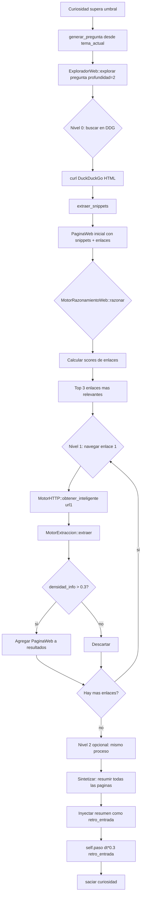

# 🧠 PLAN OMEGA — Navegador Propio del Cerebro Digital

> Arquitecto: Cris | Fecha: 2026-06-19 | Estado: DISEÑO

---

## 🎯 Visión

El cerebro no solo busca en DuckDuckGo. El cerebro **navega autónomamente** como un ser humano: decide qué leer, extrae conocimiento estructurado, sigue enlaces relevantes, y sintetiza múltiples fuentes. Todo con **cero dependencias nuevas en Rust**.

---

## 🏗️ Arquitectura de 3 Motores + 1 Orquestador

```
┌──────────────────────────────────────────────────────────────────┐
│                   🧠 CEREBRO BROWSER ENGINE                       │
│                                                                   │
│  ┌─────────────────────────────────────────────────────────────┐ │
│  │              🧭 MotorRazonamientoWeb (orquestador)            │ │
│  │  • Decide qué fuente visitar (DDG → Wikipedia/arXiv/Blog)    │ │
│  │  • Evalúa relevancia de enlaces encontrados                  │ │
│  │  • Controla profundidad de navegación (máx 3 saltos)        │ │
│  │  • Sintetiza conocimiento de múltiples fuentes               │ │
│  │  • Registra fuentes navegadas para no repetir                │ │
│  └──────────┬──────────────────────┬───────────────────────────┘ │
│             │                      │                              │
│  ┌──────────▼──────────┐  ┌───────▼──────────────────────────┐  │
│  │  🌐 MotorHTTP        │  │  🔍 MotorExtraccion               │  │
│  │                      │  │                                   │  │
│  │ Nivel 1: curl        │  │ • Título (<title>)               │  │
│  │  (HTTP/HTTPS simple) │  │ • Meta descripción               │  │
│  │                      │  │ • Encabezados (H1-H6)            │  │
│  │ Nivel 2: TcpStream   │  │ • Párrafos (<p>)                 │  │
│  │  + openssl s_client  │  │ • Enlaces (<a href>)             │  │
│  │  (más control)       │  │ • Listas (<li>)                  │  │
│  │                      │  │ • Tablas (<table>)               │  │
│  │ Nivel 3: chrome      │  │ • Código (<code>, <pre>)         │  │
│  │  --headless --dump-dom│  │ • Estadísticas de densidad       │  │
│  │  (JavaScript real)   │  │ • Fallback: limpiar_html()       │  │
│  └──────────────────────┘  └──────────────────────────────────┘  │
└──────────────────────────────────────────────────────────────────┘
```

---

## 📦 Componente 1: `MotorHTTP` (~250 líneas)

### Estrategia de 3 niveles con fallback automático

```rust
pub enum MotorHTTPModo {
    Curl,        // curl -s -L --max-time 10 URL
    Nativo,      // TcpStream + openssl s_client
    Chrome,      // google-chrome --headless --dump-dom URL
}
```

### `obtener(url: &str, modo: MotorHTTPModo) -> Result<(String, MotorHTTPModo), String>`

1. **Nivel Chrome** (si se solicita explícitamente para páginas JS):
   ```
   google-chrome --headless --disable-gpu --dump-dom --virtual-time-budget=10000 URL
   ```
   Timeout 15s, captura `stdout` (DOM serializado).

2. **Nivel Curl** (por defecto, más rápido y confiable):
   ```
   curl -s -L --max-time 10 -A "CerebroDigital/1.0" URL
   ```
   Ya implementado como `buscar()`, generalizado para cualquier URL.

3. **Nivel Nativo** (HTTP plano, sin TLS — solo `http://`):
   - `TcpStream::connect(host:80)`
   - Escribir `GET /path HTTP/1.1\r\nHost: host\r\nConnection: close\r\n\r\n`
   - Leer respuesta, separar headers de body
   - Seguir redirecciones 301/302 (máx 3)

4. **Nivel Nativo + TLS** (para `https://`):
   ```
   openssl s_client -quiet -connect host:443 -servername host
   ```
   Escribir HTTP request vía stdin, leer respuesta de stdout.
   Solo como fallback si curl no está disponible.

### `obtener_inteligente(url: &str, necesita_js: bool) -> Result<String, String>`

- Si `necesita_js`: intenta Chrome → cae a curl → cae a nativo
- Si no: intenta curl → cae a nativo
- **Siempre retorna** el contenido y el modo que funcionó

---

## 📦 Componente 2: `MotorExtraccion` (~200 líneas)

### `PaginaWeb` (struct de resultado)

```rust
pub struct PaginaWeb {
    pub url: String,
    pub titulo: String,           // <title>
    pub descripcion: String,      // <meta name="description">
    pub encabezados: Vec<String>, // H1-H6 en orden
    pub parrafos: Vec<String>,    // <p> texto limpio
    pub enlaces: Vec<Enlace>,     // <a href> con texto
    pub listas: Vec<String>,      // <li>
    pub tablas: Vec<Vec<String>>, // Filas de tabla
    pub codigo: Vec<String>,      // <code>, <pre>
    pub texto_plano: String,      // Fallback: todo el texto visible
    pub densidad_info: f32,       // 0-1: qué tan informativa es la página
}
```

### `extraer(html: &str, url: &str) -> PaginaWeb`

1. **Título**: regex `<title[^>]*>(.*?)</title>` → primer match, `limpiar_fragmento()`
2. **Meta descripción**: regex `<meta[^>]+name=["']description["'][^>]+content=["']([^"']+)["']`
3. **Encabezados**: regex `<h([1-6])[^>]*>(.*?)</h\1>` → extraer nivel + texto
4. **Párrafos**: regex `<p[^>]*>(.*?)</p>` → cada uno `limpiar_fragmento()`
5. **Enlaces**: regex `<a[^>]+href=["']([^"']+)["'][^>]*>(.*?)</a>` → extraer href + anchor text limpio
6. **Listas**: regex `<li[^>]*>(.*?)</li>` → `limpiar_fragmento()`
7. **Tablas**: regex para `<tr>` → `<td>` / `<th>` → `limpiar_fragmento()`
8. **Código**: regex `<code[^>]*>(.*?)</code>` y `<pre[^>]*>(.*?)</pre>` (preservar whitespace)
9. **Texto plano**: `limpiar_html()` (ya existe) como fallback
10. **Densidad de info**: `(len(titulo)*3 + len(parrafos)*1.5 + len(encabezados)*2 + len(codigo)*0.5) / len(texto_plano).max(1)`

### `resumir(pagina: &PaginaWeb, max_caracteres: usize) -> String`

Genera un resumen estructurado:
```
Título: {titulo}
Descripción: {descripcion}
---
{encabezados[0]}: {parrafos[0]}
...
Fuente: {url}
```

---

## 📦 Componente 3: `MotorRazonamientoWeb` (~150 líneas)

### Estructura

```rust
pub struct MotorRazonamientoWeb {
    /// Fuentes ya navegadas (URLs visitadas)
    pub fuentes_navegadas: Vec<String>,
    /// Profundidad máxima de navegación (1-3)
    pub profundidad_max: u8,
    /// Enlaces pendientes de explorar en esta sesión
    pub cola_enlaces: Vec<Enlace>,
}
```

### `razonar(pregunta: &str, pagina: &PaginaWeb) -> Vec<Enlace>`

Algoritmo de decisión:
1. Extraer palabras clave de `pregunta` (mismo método que `MotorCuriosidad::generar_pregunta()`)
2. Para cada enlace en `pagina.enlaces`, calcular score de relevancia:
   - `+3.0` si el anchor text contiene una palabra clave exacta
   - `+1.5` si el anchor text contiene una subcadena de palabra clave
   - `+2.0` si el href contiene una palabra clave
   - `+4.0` si el dominio es `wikipedia.org`, `arxiv.org`, `github.com`, `docs.rs`
   - `-10.0` si la URL ya fue navegada (evitar bucles)
   - `-5.0` si el href es `#` o `javascript:`
3. Ordenar por score descendente, tomar top 3
4. Retornar enlaces a navegar

### `navegar_profundidad(pregunta: &str, profundidad: u8) -> Vec<PaginaWeb>`

Loop de navegación:
1. `pagina_actual = buscar(pregunta)` → DDG
2. Para `nivel` de 1 a `profundidad`:
   - Extraer enlaces relevantes con `razonar()`
   - Para cada enlace (máx 2 por nivel):
     - `obtener_inteligente(enlace.href, necesita_js=false)`
     - Extraer página
     - Si `densidad_info > 0.3`, agregar a resultados
3. Retornar todas las páginas recolectadas

---

## 🔄 Integración con lo existente

### [`explorador.rs`](src/cerebro/explorador.rs): REESCRITURA COMPLETA

| Antes | Después |
|-------|---------|
| `ExploradorWeb` (unit struct) | `ExploradorWeb` con 3 submódulos internos |
| `buscar(pregunta)` → DDG | `buscar(pregunta)` → DDG (igual) |
| `buscar_simulado()` | `buscar_simulado()` (igual) |
| `extraer_snippets()` | `extraer_snippets()` (igual, se usa para DDG) |
| `limpiar_fragmento()` | `limpiar_fragmento()` (igual) |
| `limpiar_html()` | `limpiar_html()` (igual) |
| — | **`navegar(url)`** → MotorHTTP + MotorExtraccion |
| — | **`explorar(pregunta, profundidad)`** → MotorRazonamientoWeb |
| — | **`navegar_simulado(url)`** → Para tests offline |

### [`MotorHTTP`](src/cerebro/explorador.rs) — Sección dentro de explorador.rs

```rust
struct MotorHTTP;

impl MotorHTTP {
    fn obtener_curl(url: &str) -> Result<String, String>;
    fn obtener_nativo_http(host: &str, path: &str) -> Result<String, String>;
    fn obtener_nativo_tls(host: &str, path: &str) -> Result<String, String>;
    fn obtener_chrome(url: &str) -> Result<String, String>;
    fn obtener_inteligente(url: &str, necesita_js: bool) -> Result<(String, String), String>;
    // Retorna (contenido, modo_usado)
}
```

### [`MotorExtraccion`](src/cerebro/explorador.rs) — Sección dentro de explorador.rs

```rust
struct MotorExtraccion;

impl MotorExtraccion {
    fn extraer(html: &str, url: &str) -> PaginaWeb;
    fn resumir(pagina: &PaginaWeb, max_caracteres: usize) -> String;
}
```

### [`MotorRazonamientoWeb`](src/cerebro/explorador.rs) — Sección dentro de explorador.rs

```rust
struct MotorRazonamientoWeb {
    fuentes_navegadas: Vec<String>,
    profundidad_max: u8,
    cola_enlaces: Vec<Enlace>,
}

impl MotorRazonamientoWeb {
    fn nuevo() -> Self;
    fn razonar(pregunta: &str, pagina: &PaginaWeb, fuentes_navegadas: &[String]) -> Vec<Enlace>;
    fn es_url_valida(href: &str) -> bool;
    fn puntuar_enlace(enlace: &Enlace, palabras_clave: &[&str], fuentes: &[String]) -> f32;
}
```

---

### [`MotorCuriosidad`](src/cerebro/motores.rs): MODIFICACIONES

Nuevos campos en `MotorCuriosidad`:

```rust
pub struct MotorCuriosidad {
    // ... campos existentes (8) ...
    
    /// NUEVO: Fuentes ya navegadas para no repetir
    pub fuentes_navegadas: Vec<String>,
    /// NUEVO: Profundidad de exploración (1-3)
    pub profundidad_exploracion: u8,
    /// NUEVO: ¿Prefiere fuentes académicas?
    pub preferencia_academica: f32,
}
```

Nuevo método: `navegar_y_aprender(pregunta: &str) -> Vec<PaginaWeb>` que orquesta la exploración multi-salto.

### [`cerebro.rs`](src/cerebro/cerebro.rs): MODIFICACIONES

Paso 9 (Curiosidad) del pipeline se expande:
- Línea 346: `ExploradorWeb::buscar(&pregunta)` → `ExploradorWeb::explorar(&pregunta, profundidad)`
- El resultado multi-página se resume con `MotorExtraccion::resumir()`
- El resumen se inyecta como `retro_entrada.texto`

---

## 🔀 Flujo Completo (Mermaid)



---

## 🧪 Plan de Tests (~20 tests nuevos)

### MotorHTTP (8 tests)
1. `test_obtener_curl_url_valida` — HTTP real (si hay internet)
2. `test_obtener_curl_url_invalida_error`
3. `test_obtener_nativo_http_google` — `http://example.com`
4. `test_obtener_nativo_timeout`
5. `test_obtener_inteligente_fallback_curl`
6. `test_url_redireccion_seguir`
7. `test_obtener_chrome_headless` — solo si chrome existe
8. `test_obtener_sin_internet_error`

### MotorExtraccion (7 tests)
9. `test_extraer_titulo_simple`
10. `test_extraer_parrafos_multiples`
11. `test_extraer_enlaces_con_texto`
12. `test_extraer_tablas`
13. `test_extraer_codigo_pre`
14. `test_extraer_html_vacio_defaults`
15. `test_densidad_info_alta_baja`

### MotorRazonamientoWeb (5 tests)
16. `test_razonar_enlaces_relevantes`
17. `test_razonar_evitar_repetidos`
18. `test_razonar_descartar_javascript`
19. `test_razonar_preferir_wikipedia`
20. `test_puntuar_enlace_palabra_clave`

---

## 📁 Archivos afectados

| Archivo | Acción | Líneas estimadas |
|---------|--------|-----------------|
| [`src/cerebro/explorador.rs`](src/cerebro/explorador.rs) | **Reescribir completo** | 373 → ~700 |
| [`src/cerebro/motores.rs`](src/cerebro/motores.rs) | Modificar `MotorCuriosidad` | +40 líneas |
| [`src/cerebro/cerebro.rs`](src/cerebro/cerebro.rs) | Modificar Paso 9 | ~15 líneas cambiadas |
| [`src/cerebro/persistencia.rs`](src/cerebro/persistencia.rs) | Agregar 5 campos | +20 líneas |

**Cero dependencias nuevas en `Cargo.toml`.**

---

## ⚡ Stack de Herramientas del Sistema

| Herramienta | Propósito | Disponible |
|-------------|-----------|------------|
| `curl` | HTTP/HTTPS rápido (nivel 1) | ✅ `/usr/bin/curl` |
| `openssl` | TLS nativo (nivel 2) | ✅ OpenSSL 3.5.5 |
| `google-chrome` | JavaScript real (nivel 3) | ✅ Chrome 149 |
| `TcpStream` | HTTP plano nativo | ✅ std::net |

---

## 🔒 Políticas de Navegación

1. **Timeout máximo**: 15s por petición (evita bloqueos)
2. **Profundidad máxima**: 3 saltos (evita navegación infinita)
3. **Máx enlaces por nivel**: 2 (evita explosión combinatoria)
4. **Dominios preferidos**: wikipedia.org, arxiv.org, github.com, docs.rs (fuentes confiables)
5. **No navegar 2 veces la misma URL**: `fuentes_navegadas` persiste entre sesiones
6. **User-Agent**: `CerebroDigital/1.0 (MotorCuriosidad)` — ético, se identifica
7. **Tasa máxima**: 1 exploración cada `cadencia_min` (200 pasos), igual que ahora
8. **Cero dependencias**: Todo vía `std::process::Command` + `std::net::TcpStream`

---

## ✅ Checklist de Implementación

1. Crear `MotorHTTP` con 4 métodos de obtención + `obtener_inteligente()`
2. Crear `MotorExtraccion` con `PaginaWeb` struct + `extraer()` + `resumir()`
3. Crear `MotorRazonamientoWeb` con `razonar()` + scoring de enlaces
4. Extender `ExploradorWeb` con `navegar()` + `explorar()` públicos
5. Agregar `navegar_simulado()` para tests offline
6. Extender `MotorCuriosidad` con `fuentes_navegadas` + `profundidad_exploracion` + `preferencia_academica`
7. Modificar Paso 9 en `cerebro.rs` para usar `explorar()` multi-salto
8. Actualizar `persistencia.rs` con 5 nuevos campos (3 de MotorCuriosidad + Vec de fuentes)
9. Escribir 20 tests
10. Compilar: `cargo build` → 0 errores, 0 warnings
11. Ejecutar: `cargo test` → 47/47 tests pasan (27 actuales + 20 nuevos)
12. Actualizar documentación: BITACORA.md, MEMORIA.md, agente_memoria.md, CHAT_CONTEXTO.md
