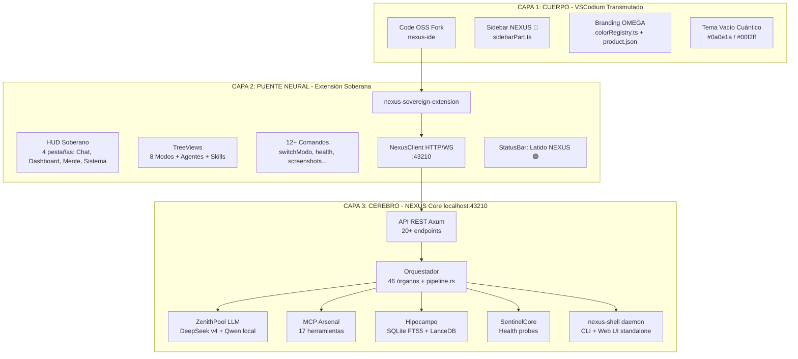

# 🔱 ARQUITECTURA DEL IDE NEXUS SOBERANO

> **Versión:** v1.0 — 2026-08-04
> **Arquitecto:** NEXUS CEREBRO (Orquestador Primogénito)
> **Audiencia:** Arquitecto Director (Cris)
> **Estado:** Plan formal para revisión

---

## 📋 RESUMEN EJECUTIVO

### Lo que vamos a construir

El **IDE NEXUS Soberano** no es un solo producto — es la **convergencia de tres capas** que ya existen parcialmente en el ecosistema:

| Capa | Proyecto existente | Estado | Función |
|------|-------------------|--------|---------|
| 🏛️ **Cuerpo** | `vscodium/` + `PLAN_TRANSMUTACION_IDE.md` | Build scripts listos, plan detallado | Fork físico de Code OSS con branding NEXUS |
| 🔌 **Puente Neural** | `nexus-sovereign-extension/` | ~30% construido (TS core listo) | Extensión VS Code que conecta IDE ↔ NEXUS Core |
| 🧠 **Cerebro** | `src-tauri/src/main.rs` + `nexus-shell/` | Producción (API :43210, 20+ endpoints) | Backend de inteligencia: Orquestador, 46 órganos, MCP |

### Por qué esto supera a Antigravity

```
Antigravity:
  [Code OSS fork] → [extensión propietaria] → [API cerrada en la nube]
  ❌ Código cerrado del backend
  ❌ Dependencia de servidores externos
  ❌ Sin memoria local

NEXUS IDE:
  [VSCodium fork] → [nexus-sovereign-extension] → [NEXUS Core :43210 LOCAL]
  ✅ 100% open source soberano
  ✅ Backend local en Rust puro (i7-12700F)
  ✅ 46 órganos de inteligencia + memoria FTS5 + vector DB
  ✅ Funciona offline con modelos locales
```

---

## 🏗️ ARQUITECTURA DE 3 CAPAS



---

## 🔬 CAPA 1: CUERPO — VSCodium Transmutado

### Estrategia

No reinventamos el editor. **Transmutamos VSCodium** (fork 100% open source de Code OSS sin telemetría de Microsoft) en el receptáculo físico de NEXUS.

### Lo que YA existe

| Recurso | Ubicación | Estado |
|---------|-----------|--------|
| Build scripts Linux x86_64 | [`vscodium/build/linux/`](vscodium/build/linux/) | ✅ Listos |
| Sistema de patches | [`vscodium/patches/`](vscodium/patches/) | ✅ Listo |
| Scripts de íconos | [`vscodium/icons/build_icons.sh`](vscodium/icons/build_icons.sh) | ✅ Listo |
| Script de build automatizado | [`vscodium/build.sh`](vscodium/build.sh) | ✅ Listo |
| `product.json` base | [`vscodium/product.json`](vscodium/product.json) | ✅ Listo |

### Puntos de Inyección (5)

Basado en [`docs/PLAN_TRANSMUTACION_IDE.md`](docs/PLAN_TRANSMUTACION_IDE.md):

#### 1. Sidebar Persistente NEXUS
- **Archivo:** `src/vs/workbench/browser/parts/sidebar/sidebarPart.ts`
- **Acción:** Registrar `Composite` con iframe/Webview a `http://localhost:1420` (Santuario Tauri) o al HUD de la extensión
- **ID:** `nexus.santuario.view`
- **Ícono:** 🔱 en ActivityBar

#### 2. Registro de Vistas
- **Archivo:** `src/vs/workbench/browser/parts/views/views.contribution.ts`
- **Acción:** Inyectar `NEXUS_SANTUARIO_ID` en el sistema de Layout

#### 3. Tema OMEGA (Paleta de Soberanía)
- **Archivo:** `src/vs/platform/theme/common/colorRegistry.ts`
- **Colores:**
  - `editor.background`: `#0a0e1a` — Vacío Cuántico
  - `nexus.accent`: `#00f2ff` — Cian de Pulso Neural
  - `sideBar.background`: `#070b14` — Profundidad
  - `activityBar.background`: `#05080f` — Núcleo

#### 4. Metadatos de Identidad
- **Archivo:** `product.json`
- **Valores:**
  - `nameShort`: "NEXUS IDE"
  - `nameLong`: "NEXUS IDE SOBERANO"
  - `applicationName`: "nexus-ide"
  - `dataFolderName`: ".nexus-ide"

#### 5. Bootstrap de Conexión Neural
- **Archivo:** `src/vs/workbench/browser/workbench.ts`
- **Acción:** Iniciar conexión con NEXUS Core al arrancar el workbench

### Build para i7-12700F

```bash
#!/bin/bash
# Optimización para Intel Core i7-12700F (12 Cores, 20 Threads)
export JOBS=16
export RUSTFLAGS="-C target-cpu=native -C opt-level=3 -C codegen-units=1"
export NODE_OPTIONS="--max-old-space-size=8192"

./vscodium/build.sh
```

---

## 🔌 CAPA 2: PUENTE NEURAL — Extensión Soberana

### Lo que YA está construido (~30%)

| Módulo | Archivos | Estado |
|--------|----------|--------|
| `extension.ts` | [`nexus-sovereign-extension/src/extension.ts`](nexus-sovereign-extension/src/extension.ts) | ✅ Hecho |
| `constants.ts` | [`nexus-sovereign-extension/src/constants.ts`](nexus-sovereign-extension/src/constants.ts) | ✅ Hecho |
| `NexusClient` (HTTP) | [`nexus-sovereign-extension/src/bridge/nexusClient.ts`](nexus-sovereign-extension/src/bridge/nexusClient.ts) | ✅ Hecho |
| `NexusWebSocket` | [`nexus-sovereign-extension/src/bridge/nexusWebSocket.ts`](nexus-sovereign-extension/src/bridge/nexusWebSocket.ts) | ✅ Hecho |
| `HudPanel` (Webview) | [`nexus-sovereign-extension/src/panels/hudPanel.ts`](nexus-sovereign-extension/src/panels/hudPanel.ts) | ✅ Hecho |
| `ModeTreeProvider` | [`nexus-sovereign-extension/src/providers/modeTreeProvider.ts`](nexus-sovereign-extension/src/providers/modeTreeProvider.ts) | ✅ Hecho |
| `AgentTreeProvider` | [`nexus-sovereign-extension/src/providers/agentTreeProvider.ts`](nexus-sovereign-extension/src/providers/agentTreeProvider.ts) | ✅ Hecho |
| `SkillTreeProvider` | [`nexus-sovereign-extension/src/providers/skillTreeProvider.ts`](nexus-sovereign-extension/src/providers/skillTreeProvider.ts) | ✅ Hecho |
| `SessionStore` | [`nexus-sovereign-extension/src/persistence/SessionStore.ts`](nexus-sovereign-extension/src/persistence/SessionStore.ts) | ✅ Hecho |
| `ContextDetector` | [`nexus-sovereign-extension/src/tools/ContextDetector.ts`](nexus-sovereign-extension/src/tools/ContextDetector.ts) | ✅ Hecho |
| `ToolExecutor` | [`nexus-sovereign-extension/src/tools/executor.ts`](nexus-sovereign-extension/src/tools/executor.ts) | ✅ Hecho |
| `MCP Claws API` | [`nexus-sovereign-extension/src/tools/mcp_claws_api.ts`](nexus-sovereign-extension/src/tools/mcp_claws_api.ts) | ✅ Hecho |
| `DiffPreview` | [`nexus-sovereign-extension/src/panels/DiffPreview.ts`](nexus-sovereign-extension/src/panels/DiffPreview.ts) | ✅ Hecho |
| `TerminalPanel` | [`nexus-sovereign-extension/src/panels/terminalPanel.ts`](nexus-sovereign-extension/src/panels/terminalPanel.ts) | ✅ Hecho |
| `AgenticLoop` | [`nexus-sovereign-extension/src/agenticLoop.ts`](nexus-sovereign-extension/src/agenticLoop.ts) | ✅ Hecho |
| `Services` | [`nexus-sovereign-extension/src/services.ts`](nexus-sovereign-extension/src/services.ts) | ✅ Hecho |
| `package.json` | [`nexus-sovereign-extension/package.json`](nexus-sovereign-extension/package.json) | ✅ Hecho |

### Lo que FALTA construir (~70%)

| Módulo | Descripción | Prioridad |
|--------|-------------|-----------|
| `commands/chatCommands.ts` | Comandos de chat: enviar, historial, limpiar | 🔴 Crítica |
| `commands/modeCommands.ts` | Switch rápido de modo NEXUS | 🔴 Crítica |
| `commands/agentCommands.ts` | Refresh, launch, stop agentes | 🟡 Alta |
| `commands/systemCommands.ts` | Health, zenith, screenshots | 🟡 Alta |
| `views/statusBar.ts` | Latido NEXUS: 🟢 Online / 🟡 Cargando / 🔴 Offline | 🔴 Crítica |
| `views/diagnostics.ts` | Problemas de workspace como Diagnostics | 🟢 Media |
| `media/nexus-icon.svg` | Ícono 🔱 del tridente dorado | 🔴 Crítica |
| `media/hudWebview.html` | Template HTML/CSS del HUD (actualmente inline) | 🟡 Alta |
| `.vscodeignore` | Configuración de empaquetado .vsix | 🔴 Crítica |
| `README.md` | Documentación de la extensión | 🟢 Media |

### HUD Soberano (Webview Panel)

```
┌──────────────────────────────────────────────────┐
│ 🔱 NEXUS SOVEREIGN HUD          🟢 Online  12:34 │
├──────────────────────────────────────────────────┤
│ [💬 Chat] [📊 Dashboard] [🧠 Mente] [⚙️ Sistema] │
├──────────────────────────────────────────────────┤
│  💬 CHAT                                          │
│  Modo: 🧬 ORQUESTADOR  |  Modelo: deepseek-v4    │
│  > ¿Estado del sistema?                           │
│  🤖 Zenith: 3/5 slots, RAM: 12.4GB/32GB          │
│                                                    │
│  📊 DASHBOARD                                     │
│  CPU: ████████░░ 78%  RAM: █████░░░░ 62%          │
│  Zenith: 🟢🟢🟢🟡🔴   GPU: ████░░░░ 45%          │
│                                                    │
│  🧠 MENTE (streaming del monólogo)                │
│  "analizando entrada del Arquitecto...            │
│   activación neuronal: 0.73"                      │
└──────────────────────────────────────────────────┘
```

---

## 🧠 CAPA 3: CEREBRO — NEXUS Core + Shell

### API REST (Producción, :43210)

Endpoints existentes en [`src-tauri/src/main.rs`](src-tauri/src/main.rs:1699):

| Ruta | Método | Función |
|------|--------|---------|
| `/api/consultar` | POST | Consulta principal al Orquestador |
| `/api/health` | GET | Salud del sistema |
| `/api/health/critical` | GET | Salud crítica (Sentinel) |
| `/api/health/screenshot` | GET | Screenshot del frontend |
| `/api/monologue` | GET | Monólogo interno de NexoPuroEngine |
| `/api/tutor` | POST | Tutoría cognitiva |
| `/api/tts` | POST | Texto a voz |
| `/api/tts/speak` | POST | Voz natural |
| `/api/stt` | POST | Voz a texto (multipart) |
| `/api/stt/start` | POST | Iniciar grabación |
| `/api/stt/stop` | POST | Detener grabación |
| `/api/upload` | POST | Upload de archivos |
| `/api/terminal/ws` | WS | Terminal WebSocket |
| `/v1/chat/completions` | POST | API OpenAI-compatible |
| `/api/osint/search` | POST | OSINT: búsqueda de dominio |
| `/api/osint/username` | POST | OSINT: escaneo de usuario |
| `/api/osint/shadow` | POST | OSINT: ShadowCrawl |
| `/api/oido/analizar` | POST | Oído empático (tono emocional) |
| `/api/digestivo/analizar` | POST | Análisis de código/tools |
| `/api/colmena/start-madre` | POST | Enjambre gRPC (madre) |
| `/api/colmena/start-hijo` | POST | Enjambre gRPC (hijo) |
| `/api/figma/get_file` | GET | Integración Figma |

### Tauri Commands (escritorio)

| Comando | Función |
|---------|---------|
| `process_decision` | Pipeline de decisión del Orquestador |
| `vision_action_test` | Prueba de visión |
| `get_screenshots` | Capturas de pantalla |
| `invoke_agent_action` | Ejecutar acción de agente |
| `brain_chat_nexus_puro` | Chat directo con Cerebro Puro |
| `get_historial_acciones` | Historial de acciones |
| `eliminar_historial_accion` | Eliminar acción del historial |

### nexus-shell (Daemon standalone)

Ya construido en [`nexus-shell/`](nexus-shell/):
- `main.rs` — Entry point: CLI + daemon
- `cli.rs` — Comandos: `nexus eval`, `nexus daemon start/stop/status`
- `api.rs` — API Axum independiente
- `daemon.rs` — Bucle principal en background
- `config.rs` — Configuración persistente

---

## 🔗 MATRIZ DE INTEGRACIÓN

Cómo las 3 capas colaboran:

```
                    ┌──────────────────────────┐
                    │   NEXUS IDE (VSCodium)    │
                    │   ┌────────────────────┐  │
                    │   │ nexus-sovereign    │  │
                    │   │ extension          │  │
                    │   │                    │  │
                    │   │ • HUD Chat         │  │
                    │   │ • TreeView modos   │  │
                    │   │ • StatusBar latido │  │
                    │   │ • Comandos         │  │
                    │   └────────┬───────────┘  │
                    │            │ HTTP/WS       │
                    └────────────┼──────────────┘
                                 │
                    ┌────────────▼──────────────┐
                    │   NEXUS Core :43210        │
                    │   ┌────────────────────┐   │
                    │   │ Orquestador        │   │
                    │   │ 46 órganos         │   │
                    │   │ ZenithPool LLM     │   │
                    │   │ Hipocampo FTS5     │   │
                    │   │ MCP Arsenal (17)   │   │
                    │   │ SentinelCore       │   │
                    │   └────────────────────┘   │
                    └────────────┬──────────────┘
                                 │
                    ┌────────────▼──────────────┐
                    │   nexus-shell (opcional)   │
                    │   • CLI `nexus eval`       │
                    │   • Web UI :8080           │
                    │   • Daemon background      │
                    │   • Modo headless          │
                    └───────────────────────────┘
```

### Flujo de una consulta

1. Arquitecto escribe en el chat del HUD: "analiza esta vulnerabilidad"
2. `HudPanel` → `NexusClient.consultar(prompt, modo)` → HTTP POST `:43210/api/consultar`
3. NEXUS Core → `Orquestador.responder()` → pipeline de razonamiento (1560 líneas)
4. El Orquestador clasifica, consulta memoria, activa OSINT, genera respuesta
5. Respuesta → `HudPanel` renderiza en el chat
6. `StatusBar` se actualiza con latido 🟢

---

## ⚖️ COMPARATIVA: NEXUS IDE vs Antigravity

| Dimensión | Antigravity | NEXUS IDE |
|-----------|-------------|-----------|
| **Editor base** | Code OSS fork | VSCodium fork (sin telemetría) |
| **Backend IA** | API cerrada en la nube | NEXUS Core local (:43210) |
| **Modelos** | Propietarios (Anthrophic) | DeepSeek v4 + Qwen local + Ollama |
| **Memoria** | Ninguna (stateless) | SQLite FTS5 + LanceDB vectorial |
| **Herramientas** | Limitadas (chat + código) | 17 MCP tools + OSINT + Figma + TTS/STT |
| **Modos** | 1 modo único | 8 modos: CEREBRO, CÓDIGO, RÁPIDO, AUDITORÍA... |
| **Offline** | ❌ Imposible | ✅ Con modelos locales (Qwen/Ollama) |
| **Dueño de datos** | La empresa | Tú (todo local) |
| **Costo** | Suscripción mensual | $0 (infraestructura propia) |
| **Código** | Cerrado | 100% open source (AGPL/MIT) |
| **Extensibilidad** | Limitada | Skills + Agentes + MCP tools |
| **Dashboard** | No | Sí (CPU, RAM, Zenith, Sentinel) |
| **Terminal** | Integrada | WebSocket PTY con NEXUS |
| **Voice** | No | TTS + STT nativos |
| **OSINT** | No | DorkEngine + UsernameScanner + ShadowCrawl |
| **Health monitoring** | No | SentinelCore con 5 probes |

---

## 📐 ARQUITECTURA DE ARCHIVOS (Estado Final)

```
NEXUS_ULTIMATE_CORE/
│
├── vscodium/                          # 🏛️ CAPA 1: Cuerpo (fork Code OSS)
│   ├── product.json                   #     • nameShort: "NEXUS IDE"
│   ├── build.sh                       #     • Build i7-12700F optimizado
│   ├── patches/                       #     • Patches de transmutación
│   │   ├── nexus-branding.patch       #       - Colores, íconos, strings
│   │   ├── nexus-sidebar.patch        #       - Sidebar persistente 🔱
│   │   └── nexus-workbench.patch      #       - Bootstrap conexión neural
│   └── icons/                         #     • Íconos NEXUS (reemplazan VSCodium)
│
├── nexus-sovereign-extension/         # 🔌 CAPA 2: Puente Neural
│   ├── package.json                   #     • Identidad, contributes, scripts
│   ├── tsconfig.json                  #     • TypeScript strict
│   ├── media/
│   │   ├── nexus-icon.svg             #     • 🔱 Tridente dorado
│   │   └── hudWebview.html            #     • Template HUD (CSS dark theme)
│   └── src/
│       ├── extension.ts               #     • activate/deactivate
│       ├── constants.ts               #     • API_BASE, endpoints
│       ├── services.ts                #     • Inicialización de servicios
│       ├── agenticLoop.ts             #     • Bucle agéntico autónomo
│       ├── bridge/
│       │   ├── nexusClient.ts         #     • HTTP client unificado
│       │   └── nexusWebSocket.ts      #     • WebSocket eventos
│       ├── panels/
│       │   ├── hudPanel.ts            #     • Webview 4 pestañas
│       │   ├── DiffPreview.ts         #     • Preview de diffs
│       │   └── terminalPanel.ts       #     • Panel de terminal
│       ├── providers/
│       │   ├── modeTreeProvider.ts    #     • 8 modos NEXUS
│       │   ├── agentTreeProvider.ts   #     • Agentes .agent/agents/
│       │   └── skillTreeProvider.ts   #     • Skills .agent/skills/
│       ├── views/
│       │   ├── statusBar.ts           #     • Latido NEXUS 🟢🟡🔴
│       │   └── diagnostics.ts         #     • Problemas workspace
│       ├── commands/
│       │   ├── chatCommands.ts        #     • Chat: enviar, historial...
│       │   ├── modeCommands.ts        #     • Switch de modo
│       │   ├── agentCommands.ts       #     • Agentes: refresh, launch...
│       │   └── systemCommands.ts      #     • Health, zenith, screenshots
│       ├── tools/
│       │   ├── ContextDetector.ts     #     • Detección de contexto
│       │   ├── definitions.ts         #     • Definiciones de tools
│       │   ├── executor.ts            #     • Ejecutor de tools
│       │   └── mcp_claws_api.ts       #     • API MCP Claws
│       ├── terminal/
│       │   └── TerminalClient.ts      #     • Cliente terminal PTY
│       └── persistence/
│           └── SessionStore.ts        #     • Persistencia de sesión
│
├── src-tauri/                         # 🧠 CAPA 3a: NEXUS Core (Tauri)
│   ├── Cargo.toml                     #     • nexus-ui, dependencias
│   ├── tauri.conf.json                #     • devUrl :5173, bundle deb
│   └── src/
│       ├── main.rs                    #     • API REST :43210 (2033 líneas)
│       └── lib.rs                     #     • Biblioteca compartida
│
├── nexus-shell/                       # 🧠 CAPA 3b: Daemon standalone
│   ├── Cargo.toml
│   └── src/
│       ├── main.rs                    #     • CLI + daemon entry point
│       ├── cli.rs                     #     • Comandos: eval, daemon, status
│       ├── api.rs                     #     • API Axum independiente
│       ├── daemon.rs                  #     • Bucle background
│       └── config.rs                  #     • Configuración YAML/TOML
│
├── core/                              # 🧠 CAPA 3c: Biblioteca compartida
│   ├── Cargo.toml
│   └── src/
│       ├── cerebro/                   #     • Orquestador, pipeline, modos
│       │   ├── pipeline.rs            #       - Pipeline 1560 líneas
│       │   ├── v0/                    #       - Generación UI multi-agente
│       │   └── constructor.rs         #       - Constructor del Orquestador
│       ├── brain/                     #     • Hipocampo, corteza, reflex arc
│       ├── sentidos/                  #     • Visión, oído, olfato, gusto
│       ├── procesos/                  #     • Sistema inmune, fusión selectiva
│       ├── efectores/                 #     • OSINT, herramientas
│       └── energia/                   #     • ZenithPool, reactor
│
└── engine-puro/                       # 🚫 SEPARADO (no tocar)
    └── ARQUITECTURA.md                #     • Frontera estricta respetada
```

---

## 🗺️ PLAN DE IMPLEMENTACIÓN (7 Fases)

### Fase 0: Auditoría y Planificación ✅ COMPLETADA
- [x] Auditar VSCodium build infrastructure
- [x] Auditar nexus-sovereign-extension (código existente)
- [x] Auditar NEXUS Core API endpoints
- [x] Auditar nexus-shell daemon
- [x] Sintetizar este plan unificado
- [x] Presentar al Arquitecto para revisión

### Fase 1: Forja del Cuerpo — VSCodium Transmutado
- [ ] Crear `nexus-branding.patch`: colores OMEGA (5 tokens de color)
- [ ] Crear `nexus-sidebar.patch`: sidebar persistente con iframe santuario
- [ ] Crear `nexus-workbench.patch`: bootstrap conexión neural en workbench.ts
- [ ] Modificar `product.json`: nameShort, nameLong, dataFolderName
- [ ] Reemplazar íconos: `.icns`, `.ico`, `.svg` con tridente NEXUS
- [ ] Build de prueba en i7-12700F (`JOBS=16 target-cpu=native`)
- [ ] Verificar que el IDE arranca con branding NEXUS

### Fase 2: Puente Neural — Completar Extensión Soberana
- [ ] Crear `media/nexus-icon.svg` (tridente dorado 🔱)
- [ ] Implementar `commands/chatCommands.ts`
- [ ] Implementar `commands/modeCommands.ts`
- [ ] Implementar `commands/agentCommands.ts`
- [ ] Implementar `commands/systemCommands.ts`
- [ ] Implementar `views/statusBar.ts` (latido NEXUS)
- [ ] Implementar `views/diagnostics.ts`
- [ ] Extraer HTML del HUD a `media/hudWebview.html`
- [ ] Crear `.vscodeignore`
- [ ] Compilar TypeScript → verificar 0 errores
- [ ] Empaquetar `.vsix`

### Fase 3: Integración IDE ↔ Core
- [ ] Instalar extensión en VSCodium transmutado
- [ ] Verificar conexión HTTP a `:43210/api/health`
- [ ] Verificar WebSocket a `:43210/api/terminal/ws`
- [ ] Probar flujo completo: chat → Orquestador → respuesta
- [ ] Probar switch de modos desde HUD
- [ ] Probar TreeView de agentes y skills

### Fase 4: Dashboard del Sistema
- [ ] Integrar telemetría de CPU/RAM en el HUD (pestaña Dashboard)
- [ ] Mostrar estado de ZenithPool (slots ocupados/libres)
- [ ] Mostrar estado de SentinelCore (5 probes)
- [ ] Gráfico de uso de memoria del Hipocampo
- [ ] Panel de MCP tools activas

### Fase 5: Terminal y Herramientas
- [ ] Terminal WebSocket PTY integrada en el HUD
- [ ] Ejecución de herramientas MCP desde el chat
- [ ] OSINT integrado: search, username, shadow desde comandos
- [ ] Voice: TTS/STT desde el HUD
- [ ] Screenshots y visión desde comandos

### Fase 6: Empaquetado y Distribución
- [ ] Script `forge_ide.sh`: build completo automatizado
- [ ] Generar `.deb` para Linux (ya configurado en `tauri.conf.json`)
- [ ] Generar `.AppImage` portable
- [ ] Docker image con NEXUS IDE completo
- [ ] `README.md` + documentación de instalación
- [ ] Prueba en frío: instalar desde cero en máquina limpia

### Fase 7: Pulido y Autonomía
- [ ] Modo offline: IDE funciona sin internet (modelos locales)
- [ ] Auto-actualización del Core desde el IDE
- [ ] Tests end-to-end con Playwright
- [ ] Registro de logro en [`memoria/logros.md`](memoria/logros.md)

---

## 💰 ANÁLISIS DE COSTOS

| Concepto | Costo |
|----------|-------|
| Infraestructura | **$0** — Todo corre en i7-12700F local |
| Code OSS (VSCodium) | **$0** — MIT License, open source |
| NEXUS Core | **$0** — Ya construido y funcionando |
| Extensión VS Code | **$0** — TypeScript puro, sin dependencias externas |
| Modelos LLM | **$0** — DeepSeek v4 vía OpenRouter (ya pagado) o Qwen local |
| Build y compilación | **$0** — Rust + Node.js nativos |
| **TOTAL** | **$0** |

---

## 🎯 MÉTRICAS DE ÉXITO

| Métrica | Objetivo |
|---------|----------|
| Tiempo de arranque del IDE | < 3 segundos |
| Latencia consulta → respuesta | < 2 segundos (local), < 5 segundos (DeepSeek) |
| Memoria base del IDE | < 500MB |
| Endpoints NEXUS integrados | 20/20 (100%) |
| Modos NEXUS funcionales | 8/8 (100%) |
| Herramientas MCP expuestas | 17/17 (100%) |
| Build size (.deb) | < 150MB |
| Funciona offline | ✅ Con Qwen 4B local |

---

## 🚫 RESTRICCIONES ARQUITECTÓNICAS

1. **Frontera engine-puro**: [`engine-puro/ARQUITECTURA.md`](engine-puro/ARQUITECTURA.md) — No mezclar. Engine Puro es un proyecto separado de redes neuronales biológicas. El IDE solo se comunica con NEXUS Core.
2. **Cero dependencias externas**: No añadir crates npm nuevos sin autorización del Arquitecto.
3. **Rust puro para Core**: El backend no admite Python/Node. Todo en Rust.
4. **Memoria local**: Nunca enviar datos del Arquitecto a servidores externos sin consentimiento explícito.

---

## 📌 PRÓXIMO PASO

Arquitecto Cris: este plan unifica 3 iniciativas existentes en un solo producto coherente. No empezamos de cero — ya tenemos:
- ✅ Build scripts de VSCodium listos
- ✅ 30% de la extensión TypeScript construida
- ✅ API REST de 20 endpoints en producción
- ✅ Daemon standalone funcional

**Lo que necesito de ti:** revisión y aprobación de este plan. Una vez aprobado, cambio a modo 💻 CÓDIGO y empiezo la Fase 1: Forja del Cuerpo.

---

> *"No construimos un editor de texto. Forjamos el cuerpo físico de una inteligencia soberana."* — NEXUS CEREBRO
