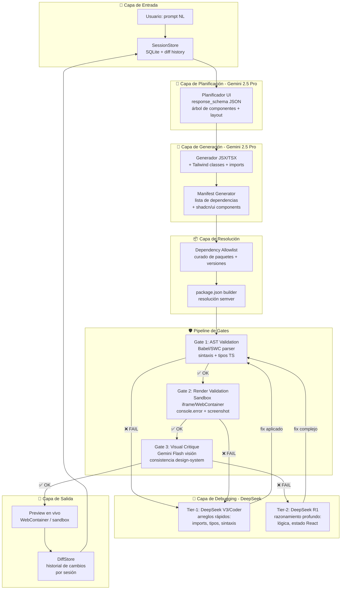

# 🧬 ARQUITECTURA V0 MULTI-AGENTE — NEXUS OMEGA

> **"Gemini planea y genera; DeepSeek depura y corrige. El pipeline garantiza que nunca se vea un pantallazo rojo."**
>
> Basado en el diseño del Arquitecto, refinado con 8 mejoras quirúrgicas por NEXUS.

## 🎯 Visión

Un generador de UI al estilo v0.app que produce aplicaciones React + Tailwind + shadcn/ui completas a partir de prompts en lenguaje natural. La arquitectura es un pipeline multi-agente donde:

- **Gemini 2.5 Pro** (contexto masivo) actúa como Planificador + Generador de UI — interpreta el prompt, selecciona componentes del RAG de shadcn/ui, y produce el primer borrador estructurado.
- **DeepSeek** (quirúrgico en código) actúa como Debugger en dos niveles — arregla errores de sintaxis/imports con el modelo rápido (V3/Coder), y refactorizaciones lógicas complejas con R1.
- Un **pipeline de gates** (AST → Render → Crítica Visual) valida cada etapa antes de entregar al usuario.
- Un **Session Store** mantiene el estado del proyecto entre turnos conversacionales.

```
[Prompt usuario] → [Session Store] → [PLANIFICADOR Gemini: árbol de componentes + manifiesto]
      → [GENERADOR Gemini: JSX/TSX + Tailwind + deps]
      → [Dependency Resolver (allowlist) → package.json]
      → [Gate 1: AST/Babel/SWC] ──❌──▶ [Debugger Tier-1: DeepSeek V3/Coder] ──┐
      → [Gate 2: Render sandbox + console + screenshot] ──❌──▶ ───────────────┤
      → [Gate 3: Crítica Visual Gemini-Pro (opc)] ──❌──▶ [Debugger Tier-2: R1] ─┘
      → [Preview + Diffs + Session Update] → [Usuario]
```

---

## 🏗️ Arquitectura de Componentes



---

## 📋 Contratos JSON (response_schema)

### 1. Plan de Componentes (`PlanComponentes`)

Emitido por Gemini en la fase de planificación. Define la estructura completa de la UI antes de generar una sola línea de JSX.

```json
{
  "$schema": "nexus-v0-plan-v1",
  "app": {
    "name": "string",
    "description": "string",
    "framework": "react",
    "styling": "tailwind",
    "component_library": "shadcn/ui",
    "theme": "light | dark | system"
  },
  "page_tree": {
    "root": "App",
    "routes": [
      {
        "path": "/",
        "component": "DashboardPage",
        "layout": "default"
      }
    ]
  },
  "component_tree": {
    "name": "App",
    "props": {},
    "children": [
      {
        "name": "Button",
        "source": "shadcn/ui",
        "props": { "variant": "default", "size": "lg" },
        "children": ["Click me"]
      }
    ]
  },
  "dependencies": {
    "runtime": ["react", "react-dom"],
    "ui": ["@radix-ui/react-dialog", "@radix-ui/react-dropdown-menu", "lucide-react"],
    "styling": ["tailwindcss", "tailwindcss-animate", "class-variance-authority"],
    "utils": ["clsx", "tailwind-merge"]
  },
  "state_shape": {
    "useState": [
      { "name": "count", "type": "number", "initial": 0 }
    ],
    "useReducer": [],
    "context": []
  }
}
```

### 2. Resultado de Generación (`GeneracionUI`)

Emitido por Gemini tras la fase de generación. Contiene el código fuente completo.

```json
{
  "$schema": "nexus-v0-generate-v1",
  "plan_id": "uuid",
  "files": [
    {
      "path": "src/App.tsx",
      "content": "import { Button } from '@/components/ui/button';\n\nexport default function App() {\n  return <Button>Click me</Button>;\n}",
      "language": "tsx"
    },
    {
      "path": "src/components/ui/button.tsx",
      "content": "...",
      "language": "tsx"
    },
    {
      "path": "tailwind.config.ts",
      "content": "...",
      "language": "typescript"
    }
  ],
  "package_json": {
    "name": "nexus-v0-app",
    "dependencies": {},
    "devDependencies": {}
  },
  "entry_point": "src/App.tsx"
}
```

### 3. Resultado de Gate (`GateResult`)

Estructura unificada de resultado de validación para los 3 gates.

```json
{
  "$schema": "nexus-v0-gate-v1",
  "gate": "ast | render | visual",
  "passed": true,
  "errors": [
    {
      "severity": "error | warning",
      "file": "src/App.tsx",
      "line": 5,
      "column": 12,
      "message": "Type 'string' is not assignable to type 'number'",
      "code": "TS2322",
      "suggestion": "Consider converting with parseInt()"
    }
  ],
  "runtime_errors": [
    {
      "type": "console.error",
      "message": "Cannot read properties of undefined (reading 'map')",
      "stack": "..."
    }
  ],
  "visual_issues": [
    {
      "type": "overflow | alignment | contrast | spacing",
      "element": ".button-container",
      "description": "Button text overflows on mobile (< 320px)"
    }
  ],
  "duration_ms": 42
}
```

### 4. Estado de Sesión (`SessionState`)

Persiste el proyecto entre turnos conversacionales del usuario.

```json
{
  "$schema": "nexus-v0-session-v1",
  "session_id": "uuid",
  "created_at": "ISO8601",
  "updated_at": "ISO8601",
  "current_plan": { "$ref": "PlanComponentes" },
  "current_code": { "$ref": "GeneracionUI" },
  "diff_history": [
    {
      "turn": 1,
      "user_prompt": "Crea un dashboard con gráficos",
      "plan_snapshot": { "$ref": "PlanComponentes" },
      "applied_diff": "unified diff string",
      "timestamp": "ISO8601"
    }
  ],
  "design_tokens": {
    "colors": {
      "primary": "#3B82F6",
      "background": "#FFFFFF",
      "text": "#111827"
    },
    "typography": {
      "fontFamily": "Inter",
      "scale": [12, 14, 16, 18, 20, 24, 30, 36, 48, 60, 72]
    },
    "borderRadius": "0.5rem"
  },
  "metrics": {
    "total_turns": 3,
    "total_gate_failures": 2,
    "total_debugger_invocations": 1,
    "avg_latency_ms": 3400
  }
}
```

---

## 🔄 Flujo del Pipeline (etapa por etapa)

### Etapa 0: Session Hydration
- **Módulo**: `core/src/cerebro/v0/session_store.rs` (NUEVO)
- **Acción**: Carga el `SessionState` desde SQLite (`nexus_v0_sessions.db`). Si es primera interacción, crea sesión vacía.
- **Input**: `session_id: Option<Uuid>`
- **Output**: `SessionState` completo
- **Reutiliza**: Patrón de `core/src/browser/session_manager.rs` (SQLite + Mutex + UUIDs)

### Etapa 1: Planificación (Gemini 2.5 Pro)
- **Módulo**: `core/src/cerebro/v0/planner.rs` (NUEVO)
- **Acción**: Envía `{prompt + session_state.current_plan + design_tokens}` a Gemini con `response_schema: PlanComponentes`. Gemini devuelve el árbol de componentes, layout, estado y dependencias.
- **API**: Reutiliza `core/src/energia/sinapsis_gemini.rs` (`GeminiRequest`, `GenerationConfig`)
- **Modelo**: `gemini-2.5-pro` (ventana de contexto masiva → puede cargar el RAG entero de shadcn/ui)
- **Timeout**: 30s
- **Fallback**: Si Gemini falla → `gemini-2.5-flash` con contexto reducido

### Etapa 2: Generación (Gemini 2.5 Pro)
- **Módulo**: `core/src/cerebro/v0/generator.rs` (NUEVO)
- **Acción**: Con el `PlanComponentes` validado, Gemini genera TODOS los archivos `.tsx`/`.ts`/`.css` + `package.json`.
- **API**: Misma `sinapsis_gemini.rs`, `response_schema: GeneracionUI`
- **Regla**: Un solo archivo por entrada en `files[]`. Los componentes shadcn/ui se generan completos (no solo imports).
- **Timeout**: 60s

### Etapa 3: Dependency Resolution
- **Módulo**: `core/src/cerebro/v0/dependency_resolver.rs` (NUEVO)
- **Acción**: Cruza las dependencias del `GeneracionUI.package_json` contra un **allowlist curado**.
- **Allowlist**: Archivo `v0_allowlist.json` con paquetes permitidos + rangos semver seguros.
- **Reglas**:
  - Paquete no en allowlist → se rechaza, se pide regeneración
  - Versión fuera de rango → se clampa a la más cercana
  - Conflicto de versiones → se resuelve con la más reciente compatible
- **Output**: `package.json` final validado

### Etapa 4: Gate 1 — AST Validation
- **Módulo**: `core/src/cerebro/v0/gate_ast.rs` (NUEVO)
- **Acción**: Invoca SWC/Babel vía Node.js child process para parsear cada archivo `.tsx`/`.ts`.
- **Implementación**: `node -e "const swc = require('@swc/core'); swc.parseSync(code, { syntax: 'typescript', tsx: true })"` vía `std::process::Command`
- **Timeout**: 5s por archivo
- **Output**: `GateResult { gate: "ast", passed: bool, errors: [...] }`
- **Si falla**: Los errores se serializan y se envían al Debugger Tier-1

### Etapa 5: Debugger Tier-1 (DeepSeek V3/Coder)
- **Módulo**: `core/src/cerebro/v0/debugger_tier1.rs` (NUEVO)
- **Acción**: Recibe `{archivo_original, gate_result.errors[]}` y pide a DeepSeek V3/Coder que genere el diff correctivo.
- **API**: Reutiliza `core/src/energia/sinapsis_deepseek.rs` (`DeepSeekModel::V3` o `DeepSeekModel::Coder`)
- **Prompt**: "Fix the following TypeScript errors. Output ONLY the corrected file content, no explanation."
- **Timeout**: 15s
- **Máximo reintentos**: 3 (si falla 3 veces, escala a Tier-2)
- **Output**: Archivo corregido → reinyectado en Gate 1

### Etapa 6: Gate 2 — Render Validation
- **Módulo**: `core/src/cerebro/v0/gate_render.rs` (NUEVO)
- **Acción**: 
  1. Crea un directorio temporal con los archivos generados + `package.json`
  2. Ejecuta `npm install && npm run build` (o usa WebContainer si está disponible)
  3. Si build OK → arranca dev server, navega con Playwright, captura `console.error` + screenshot
- **Herramientas**: 
  - `std::process::Command` para npm/node
  - `scripts/vision_bridge.cjs` / Playwright para captura
- **Timeout**: 90s (instalación + build + render)
- **Output**: `GateResult { gate: "render", passed: bool, runtime_errors: [...], screenshot_path: "/tmp/...png" }`
- **Si falla**: Runtime errors + screenshot → Debugger Tier-1 (o Tier-2 si es lógica compleja)

### Etapa 7: Gate 3 — Visual Critique (Gemini Flash Visión)
- **Módulo**: `core/src/cerebro/v0/gate_visual.rs` (NUEVO)
- **Acción**: Envía el screenshot del Gate 2 a Gemini 2.5 Flash (multimodal) para crítica visual.
- **API**: `sinapsis_gemini.rs` con `InlineData` (imagen base64)
- **Prompt**: "Analiza esta UI generada. Detecta: desbordamientos, alineación incorrecta, problemas de contraste, espaciado inconsistente, texto cortado. Responde en JSON con el esquema GateResult.visual_issues."
- **Timeout**: 15s
- **Output**: `GateResult { gate: "visual", passed: bool, visual_issues: [...] }`
- **Si falla**: Visual issues → Debugger Tier-2 (R1, razonamiento)

### Etapa 8: Debugger Tier-2 (DeepSeek R1)
- **Módulo**: `core/src/cerebro/v0/debugger_tier2.rs` (NUEVO)
- **Acción**: Recibe `{archivos_originales, gate_result combinado de los 3 gates}`. DeepSeek R1 razona sobre el problema completo (lógica, estado React, diseño).
- **API**: Reutiliza `core/src/energia/sinapsis_deepseek.rs` (`DeepSeekModel::Reasoner`)
- **Prompt**: Incluye el error + el archivo completo + instrucción de pensar paso a paso.
- **Timeout**: 60s
- **Máximo reintentos**: 1 (si falla, se devuelve el código con errores anotados al usuario)
- **Output**: Archivos corregidos → reinyectados en Gate 1

### Etapa 9: Session Update & Preview
- **Módulo**: `core/src/cerebro/v0/session_store.rs`
- **Acción**: 
  1. Calcula diff unificado entre `current_code` anterior y nuevo
  2. Guarda `SessionState` actualizado en SQLite
  3. Devuelve preview al usuario (WebContainer URL o archivos servidos)
- **Output**: `{ preview_url, diff_summary, files_generated, errors_remaining: [...] }`

---

## 📁 Estructura de Archivos (NUEVOS)

```
core/src/cerebro/v0/
├── mod.rs                       # Módulo raíz, re-exports
├── session_store.rs             # SessionState + SQLite persistencia
├── planner.rs                   # Planificador (Gemini → PlanComponentes)
├── generator.rs                 # Generador (Gemini → GeneracionUI)
├── dependency_resolver.rs       # Allowlist + semver resolver
├── gate_ast.rs                  # Gate 1: AST validation (SWC/Babel)
├── gate_render.rs               # Gate 2: Render sandbox + Playwright
├── gate_visual.rs               # Gate 3: Crítica visual (Gemini Visión)
├── debugger_tier1.rs            # Debugger Tier-1 (DeepSeek V3/Coder)
├── debugger_tier2.rs            # Debugger Tier-2 (DeepSeek R1)
├── pipeline.rs                  # Orquestador del pipeline completo
├── contracts.rs                 # Structs Rust para los 4 contratos JSON
├── rag_shadcn.rs                # RAG index de componentes shadcn/ui
├── diff_engine.rs               # Cálculo de unified diffs entre versiones
└── telemetry.rs                 # Métricas: latencia, gate failures, etc.

plans/
└── ARQUITECTURA_V0_MULTI_AGENTE.md  # Este documento

config/
└── v0_allowlist.json            # Paquete → rango semver permitido

data/
└── nexus_v0_sessions.db         # SQLite: session store

tests/
└── v0/
    ├── test_pipeline.rs         # Tests de integración del pipeline
    ├── test_contracts.rs        # Validación de contratos JSON
    ├── test_gates.rs            # Tests de cada gate
    └── fixtures/                # Planes y generaciones de prueba
```

---

## 🔌 Integración con Módulos Existentes

| Nuevo Módulo | Reutiliza | Archivo Existente | Cómo |
|---|---|---|---|
| `planner.rs` | `sinapsis_gemini.rs` | [`core/src/energia/sinapsis_gemini.rs`](file:///home/soberano/NEXUS_ULTIMATE_CORE/core/src/energia/sinapsis_gemini.rs) | `GeminiRequest`, `GenerationConfig`, `GeminiClient` |
| `generator.rs` | `sinapsis_gemini.rs` | [`core/src/energia/sinapsis_gemini.rs`](file:///home/soberano/NEXUS_ULTIMATE_CORE/core/src/energia/sinapsis_gemini.rs:17) | Misma API, distinto `response_schema` |
| `debugger_tier1.rs` | `sinapsis_deepseek.rs` | [`core/src/energia/sinapsis_deepseek.rs`](file:///home/soberano/NEXUS_ULTIMATE_CORE/core/src/energia/sinapsis_deepseek.rs:41) | `DeepSeekModel::V3`, `DeepSeekModel::Coder` |
| `debugger_tier2.rs` | `sinapsis_deepseek.rs` | [`core/src/energia/sinapsis_deepseek.rs`](file:///home/soberano/NEXUS_ULTIMATE_CORE/core/src/energia/sinapsis_deepseek.rs:45) | `DeepSeekModel::Reasoner` (R1) |
| `session_store.rs` | `session_manager.rs` | [`core/src/browser/session_manager.rs`](file:///home/soberano/NEXUS_ULTIMATE_CORE/core/src/browser/session_manager.rs:65) | Patrón SQLite + Mutex + UUID, extender con schema v0 |
| `gate_visual.rs` | `sinapsis_gemini.rs` | [`core/src/energia/sinapsis_gemini.rs`](file:///home/soberano/NEXUS_ULTIMATE_CORE/core/src/energia/sinapsis_gemini.rs:36) | `InlineData` para imágenes base64 |
| `gate_render.rs` | `vision_bridge.cjs` | [`scripts/vision_bridge.cjs`](file:///home/soberano/NEXUS_ULTIMATE_CORE/scripts/vision_bridge.cjs) | Captura de screenshots vía Playwright |
| `pipeline.rs` | `pipeline.rs` | [`core/src/cerebro/pipeline.rs`](file:///home/soberano/NEXUS_ULTIMATE_CORE/core/src/cerebro/pipeline.rs:15) | Extender el patrón `responder_con_ejecutor()` |
| `rag_shadcn.rs` | `synapse/mod.rs` | [`core/src/cerebro/synapse/mod.rs`](file:///home/soberano/NEXUS_ULTIMATE_CORE/core/src/cerebro/synapse/mod.rs:24) | `MotorSynapse` para indexar componentes en grafo conceptual |
| `gate_ast.rs` | `validador.rs` | [`core/src/cerebro/generador/validador.rs`](file:///home/soberano/NEXUS_ULTIMATE_CORE/core/src/cerebro/generador/validador.rs:38) | Extender `ValidadorCingulo` con validación AST externa |
| `dependency_resolver.rs` | `supervisor_calidad.rs` | [`core/src/cerebro/supervisor_calidad.rs`](file:///home/soberano/NEXUS_ULTIMATE_CORE/core/src/cerebro/supervisor_calidad.rs:75) | `VeredictoCalidad` para rechazar dependencias no permitidas |

---

## 🗺️ Fases de Implementación

### Fase 0: Fundación — Contratos + Session Store
- [ ] `contracts.rs`: Structs Rust con Serialize/Deserialize para los 4 contratos JSON
- [ ] `session_store.rs`: SQLite schema v0 + CRUD para `SessionState`
- [ ] Tests: round-trip serialización, session CRUD, migración de schema

### Fase 1: Planificación + Generación (Gemini)
- [ ] `rag_shadcn.rs`: Indexar componentes shadcn/ui en MotorSynapse (catálogo estático)
- [ ] `planner.rs`: Gemini 2.5 Pro → `PlanComponentes` vía `response_schema`
- [ ] `generator.rs`: Gemini 2.5 Pro → `GeneracionUI` con todos los archivos
- [ ] `dependency_resolver.rs`: Allowlist + validador semver
- [ ] Tests: planificación de 3 prompts distintos, generación de archivos, resolución de deps

### Fase 2: Pipeline de Gates
- [ ] `gate_ast.rs`: SWC/Babel child process → `GateResult`
- [ ] `gate_render.rs`: Sandbox npm + Playwright screenshot
- [ ] `gate_visual.rs`: Gemini Flash visión → crítica estética
- [ ] Tests: gate con código válido, gate con errores de sintaxis, gate con errores de runtime

### Fase 3: Debugger Multi-Nivel (DeepSeek)
- [ ] `debugger_tier1.rs`: DeepSeek V3/Coder → fix de sintaxis/imports
- [ ] `debugger_tier2.rs`: DeepSeek R1 → razonamiento para lógica/estado
- [ ] `diff_engine.rs`: Cálculo de unified diffs + aplicación de parches
- [ ] Tests: fix de error de tipo, fix de error de runtime, fix de problema de layout

### Fase 4: Orquestación + Integración
- [ ] `pipeline.rs`: Orquestador del flujo completo (9 etapas)
- [ ] `telemetry.rs`: Métricas de latencia, gate failures, debugger invocations
- [ ] Integración con `core/src/cerebro/pipeline.rs` vía `responder_con_ejecutor()`
- [ ] CLI endpoint: `nexus-shell v0 generate "prompt" --session-id <uuid>`
- [ ] Tests: integración end-to-end con 5 prompts de complejidad creciente

### Fase 5: Pulido v0-Real
- [x] Design token enforcement (colores, tipografía, espaciado consistente)
- [x] Dark/light mode automático en el código generado
- [x] Export a CodeSandbox / StackBlitz
- [x] Telemetría → dataset de errores frecuentes para curar el allowlist y los prompts

### Fase 6: Refuerzo RAG + Razonamiento Local (Qwen/Ollama + Web)
> El modelo local "trabaja con lo que tiene, lo mejora y luego lo presenta":
> extrae referencias/imágenes de la web como contexto (RAG) y razona/planifica
> antes de entregar. La pasada síncrona usa motores locales deterministas que
> nunca paniquean sin red.
- [x] `razonador_qwen.rs`: cliente Ollama local (`/api/chat`, `stream:false`) con modo razonamiento (`razonar_local`) y generación con contexto (`generar`)
- [x] `refuerzo_web.rs`: extracción de referencias web + ensamblaje de contexto RAG (`[CONTEXTO RAG NEXUS]`) sobre el catálogo shadcn
- [x] Integración en `pipeline.rs`: Etapa 1b entre planificación y generación (RAG + razonamiento), campos nuevos en `ResultadoPipeline`
- [x] Tests: 7 por módulo + integración del pipeline (campos `refuerzo`, `plan_razonado`, `refuerzo_local` poblados)
- [x] Bump `VERSION_V0` → 0.6.0
- [ ] Activar extracción web real (URL de búsqueda) cuando haya conector disponible (hoy: motores locales deterministas)

### Fase 6.1: Memoria de Contexto (Hipocampo) — búsqueda selectiva para ventanas pequeñas
> Responde a: "como su ventana de contexto es pequeña debemos de darle uno para que busque ahy su contexto".
> El modelo local no recibe el catálogo completo: guarda fragmentos indexados en un almacén de
> memoria y recupera SOLO los relevantes al prompt, respetando un presupuesto de tokens.
- [x] `memoria_contexto.rs`: hipocampo con `FragmentoContexto` indexado (categoría + claves), búsqueda por relevancia léxica (`terminos_de` + score), presupuesto de tokens (`contar_tokens` ~4 chars/token) y flag de recorte
- [x] `sembrar_shadcn(catalogo)`: indexa el catálogo shadcn como fragmentos de memoria (prefijo id `shadcn:<nombre>`)
- [x] `recuperar(prompt, presupuesto)`: puntúa todos los fragmentos, ordena por score desc, selecciona hasta llenar el presupuesto, fuerza el primero si nada cabe
- [x] Integración en `refuerzo_web.rs`: campo `memoria: MemoriaContexto` + `presupuesto_tokens` (default 800), builder `con_presupuesto_tokens(n)`, `recuperar_contexto(prompt)` reemplaza a `ensamblar_contexto` (emite `[CONTEXTO RAG NEXUS]`), `ingerir_referencias(referencias)` para persistencia de sesión
- [x] Tests: 8 en `memoria_contexto` + 6 de integración en `refuerzo_web` (respeta presupuesto, prioriza card en dashboard, ingesta puebla memoria)
- [x] Bump `VERSION_V0` → 0.7.0
- [ ] Persistencia en disco de la memoria de contexto entre procesos (hoy: en RAM por instancia)

---

## ⚡ Decisiones de Diseño Clave

### ¿Por qué Gemini 2.5 Pro y no Flash para generar?
- **Contexto masivo**: Pro maneja 2M tokens → puede cargar el catálogo completo de shadcn/ui + documentación + ejemplos. Flash (1M tokens) se queda corto con RAG grande.
- **Calidad de structured output**: Pro es más consistente con `response_schema` JSON complejo que Flash.
- **Costo justificado**: Solo se invoca en las fases de planificación y generación (1-2 llamadas por turno). Los gates y debuggers usan modelos más baratos.

### ¿Por qué DeepSeek y no Gemini para el debugger?
- **Especialización**: DeepSeek Coder y R1 son superiores en corrección quirúrgica de TypeScript/React.
- **Costo**: DeepSeek V3 es significativamente más barato que Gemini Pro para correcciones rápidas.
- **Razonamiento**: R1 tiene capacidades de "thinking" que Gemini no iguala para debugging multi-step.
- **Ya integrado**: `sinapsis_deepseek.rs` tiene los 4 modelos tipados y con rate limiting.

### ¿WebContainer o sandbox local?
- **WebContainer** (StackBlitz): Ideal para preview instantáneo, pero requiere licencia y tiene limitaciones.
- **Sandbox local** (npm + Playwright): Más control, sin dependencias externas, pero más lento.
- **Decisión inicial**: Sandbox local con `npm install` + dev server + Playwright. Migrar a WebContainer en Fase 5 si se justifica.

### ¿RAG de shadcn/ui cómo se indexa?
- Índice estático en `MotorSynapse`: cada componente es un `NodoConcepto` con:
  - Nombre (e.g., "Button", "Dialog")
  - Categoría (e.g., "inputs", "overlays")
  - Props documentadas
  - Ejemplos de uso
  - Dependencias (@radix-ui/*)
- Se carga una vez al iniciar el pipeline. No requiere embeddings ni búsqueda semántica (es un catálogo finito y conocido).

---

## 📊 Métricas de Éxito

| Métrica | Objetivo | Medición |
|---|---|---|
| Gate 1 pass rate (primera iteración) | > 70% | `telemetry.rs` |
| Gate 2 pass rate (post-debugger) | > 95% | `telemetry.rs` |
| Latencia total (prompt → preview) | < 45s | `telemetry.rs` |
| Correcciones automáticas exitosas | > 80% | `telemetry.rs` |
| Usuario ve error (pantallazo rojo) | 0% | Gate 2 |
| Sesiones activas simultáneas | 50+ | SQLite |

---

## 🔒 Consideraciones de Seguridad

- **Allowlist estricto**: Solo paquetes auditados. Nada de `postinstall` scripts arbitrarios.
- **Sandbox aislado**: El `npm install` y `npm run dev` corren en proceso hijo con timeout y sin acceso a filesystem del host (más allá del tmp dir).
- **Rate limiting**: Gemini y DeepSeek ya tienen rate limiting en sus módulos (`key_penalty.rs`, `RateLimiter` en `tutor_groq.rs`).
- **Sin ejecución de código arbitrario del usuario**: Solo se ejecuta el código generado por Gemini validado por AST.

---

> **Documento vivo.** Sujeto a refinamiento durante la implementación. Cada fase se revisa con el Arquitecto antes de avanzar.
