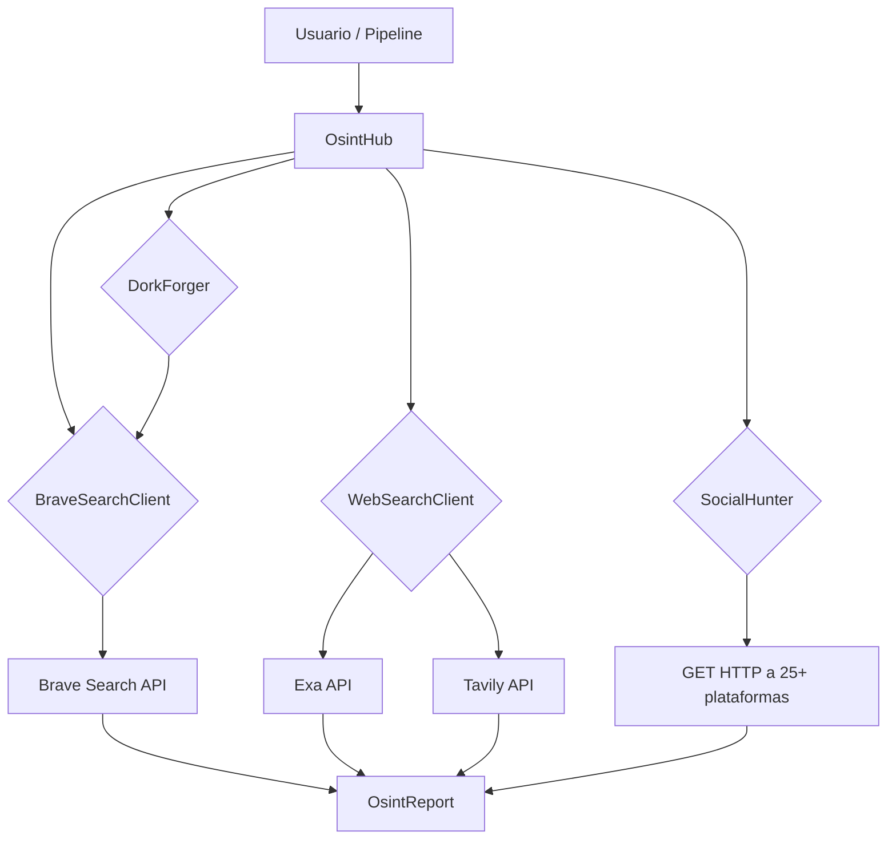

# 🕵️ PLAN DE MEJORA OSINT — NEXUS ULTIMATE CORE

## 📊 Estado Actual del Módulo OSINT

| Componente | Archivo | Líneas | Capacidad | Limitación |
|---|---|---|---|---|
| DorkEngine | `core/src/efectores/osint/dork_engine.rs` | 93 | 5 Google dorks via scraping | Google bloquea con CAPTCHA |
| UsernameScanner | `core/src/efectores/osint/username_enum.rs` | 89 | 7 plataformas via HEAD | HEAD rechazado por sitios modernos |
| ShadowCrawlClient | `core/src/efectores/osint/shadow_client.rs` | 146 | Proxy a servidor externo :5000 | Dependencia externa |
| ShadowCrawlAPI | `core/src/infra/shadowcrawl.rs` | 273 | Exa + Tavily + proxy local | No conectado al módulo OSINT |
| Pipeline OSINT | `core/src/cerebro/pipeline.rs:764-779` | - | Detecta keywords | Solo busca MCP tools |
| API Routes | `src-tauri/src/main.rs:921-1005` | 3 endpoints | DorkEngine, Username, Shadow | Separados, sin orquestación |

### APIs Disponibles (ya en `.env`)
| API | Key | Estado |
|---|---|---|
| Brave Search | `BSAZHbzyNc7Cv-SiK2g8IEw-8ek5AOr` | ✅ No integrada |
| Exa | `d7551e1b-ad92-47fb-83f6-7e592492fed9` | ✅ Solo en ShadowCrawlAPI |
| Tavily | `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` | ✅ Solo en ShadowCrawlAPI |

### Infraestructura Disponible
- `reqwest` con feature `socks` → Tor ya soportado
- `regex` → Parseo de resultados
- `serde` / `serde_json` → Serialización
- Tokio async → Concurrencia

---

## 🎯 PROPUESTA DE MEJORA — 3 TIERS

### TIER 1 — ALTO IMPACTO, BAJO ESFUERZO (Implementación Inmediata)

#### 1. 🆕 `BraveSearchClient` — Nuevo efector
**Archivo:** `core/src/efectores/osint/brave_search.rs`
**Esfuerzo:** ~80 líneas
**Descripción:** Cliente HTTP para Brave Search API. Retorna `Vec<SearchResult>` con título, URL, snippet.
**API:** `GET https://api.search.brave.com/res/v1/web/search`
**Valor:** 2000 queries/mes gratis, sin CAPTCHA, resultados estructurados.
```rust
pub struct BraveSearchClient { api_key: String, client: reqwest::Client }
impl BraveSearchClient {
    pub async fn search(&self, query: &str, count: u8) -> Result<Vec<SearchResult>>;
}
```

#### 2. 🔗 Conectar `ShadowCrawlAPI` al módulo OSINT
**Archivo:** `core/src/efectores/osint/web_search.rs` (nuevo wrapper)
**Esfuerzo:** ~60 líneas
**Descripción:** Wrapper que expone ShadowCrawlAPI (Exa+Tavily) como efector OSINT, con failover automático.
**Valor:** Aprovecha código existente, da 2 APIs más al OSINT.

#### 3. ♻️ Refactorizar `UsernameScanner` → `SocialHunter`
**Archivo:** `core/src/efectores/osint/social_hunter.rs`
**Esfuerzo:** ~150 líneas
**Cambios:**
- HEAD → GET con User-Agent rotatorio
- De 7 → 25+ plataformas (añadir: Telegram, Discord, Pinterest, Tumblr, Medium, Dev.to, StackOverflow, ProductHunt, AngelList, Keybase, etc.)
- Timeout por plataforma
- Retorna `Vec<SocialProfile>` con URL, plataforma, status_code
```rust
pub struct SocialProfile { pub platform: String, pub url: String, pub exists: bool, pub status_code: u16 }
```

#### 4. ♻️ Refactorizar `DorkEngine` → `DorkForger`
**Archivo:** `core/src/efectores/osint/dork_forger.rs`
**Esfuerzo:** ~200 líneas
**Cambios:**
- De 5 → 30+ dorks organizados por categoría
- Backend: Brave Search + Exa + Tavily (no Google directo)
- Categorías: `Archivos`, `Paneles Admin`, `Exposición Datos`, `Vulnerabilidades`, `Cámaras IP`, `Configuraciones`, `Backups`
```rust
pub enum DorkCategory { Files, AdminPanels, DataExposure, Vulnerabilities, IPCameras, Configs, Backups }
```

#### 5. 🧠 `OsintHub` — Orquestador Unificado
**Archivo:** `core/src/efectores/osint/hub.rs`
**Esfuerzo:** ~120 líneas
**Descripción:** Orquestador que recibe un objetivo y ejecuta múltiples tácticas OSINT en paralelo, consolidando resultados.
**Valor:** Un solo punto de entrada para todo OSINT.
```rust
pub struct OsintHub { brave: BraveSearchClient, social: SocialHunter, dork: DorkForger, web: WebSearchClient }
impl OsintHub {
    pub async fn investigar_dominio(&self, dominio: &str) -> OsintReport;
    pub async fn investigar_usuario(&self, username: &str) -> OsintReport;
    pub async fn investigar_email(&self, email: &str) -> OsintReport;
}
```

**Arquitectura del Hub:**


---

### TIER 2 — NUEVAS CAPACIDADES OSINT (Medio Esfuerzo)

#### 6. 🌐 `SubdomainEnumerator` — Enumeración de subdominios
**Archivo:** `core/src/efectores/osint/subdomain_enum.rs`
**Esfuerzo:** ~120 líneas
**Fuentes:**
- `crt.sh` (Certificate Transparency) — query SQL directa vía HTTP
- Brave Search: `site:*.dominio.com -www`
- DNS brute-force básico con hickory-dns
**Retorna:** `Vec<String>` de subdominios encontrados
```rust
pub struct SubdomainEnumerator;
impl SubdomainEnumerator {
    pub async fn enumerate(&self, domain: &str) -> Result<Vec<String>>;
}
```

#### 7. 📧 `EmailHunter` — OSINT de correos electrónicos
**Archivo:** `core/src/efectores/osint/email_hunter.rs`
**Esfuerzo:** ~100 líneas
**Descripción:** Busca direcciones de email en resultados de búsqueda, verifica formato, detecta leaks.
```rust
pub struct EmailHunter;
impl EmailHunter {
    pub async fn buscar_emails(&self, query: &str) -> Result<Vec<String>>;
    pub fn validar_formato(email: &str) -> bool;
}
```

#### 8. 🔍 `CertTransparency` — Certificate Transparency Logs
**Archivo:** `core/src/efectores/osint/cert_transparency.rs`
**Esfuerzo:** ~80 líneas
**Descripción:** Consulta `https://crt.sh/?q=%25.domain&output=json` para listar certificados emitidos.
**Valor:** Revela subdominios, fechas de emisión, CA emisora.

#### 9. 🛡️ `BreachChecker` — Verificación de breaches
**Archivo:** `core/src/efectores/osint/breach_checker.rs`
**Esfuerzo:** ~100 líneas
**Descripción:** 
- HaveIBeenPwned API v3 (k-anonymity: solo envía primeros 5 chars del hash SHA1)
- Busca `dominio` + leak/breach/compromised en Brave Search
```rust
pub struct BreachChecker;
impl BreachChecker {
    pub async fn check_email(&self, email: &str) -> Result<Vec<String>>;
}
```

---

### TIER 3 — RECON AVANZADO (Mayor Esfuerzo)

#### 10. 🖧 `DNSResolver` — Resolución de registros DNS
**Archivo:** `core/src/efectores/osint/dns_resolver.rs`
**Esfuerzo:** ~100 líneas
**Descripción:** Resuelve A, AAAA, MX, TXT, NS usando `hickory-resolver` (Rust puro).
**Requerimiento:** Añadir `hickory-resolver` a Cargo.toml (~40KB).
```rust
pub struct DNSResolver;
impl DNSResolver {
    pub async fn resolve_a(&self, domain: &str) -> Result<Vec<IpAddr>>;
    pub async fn resolve_mx(&self, domain: &str) -> Result<Vec<String>>;
    pub async fn resolve_txt(&self, domain: &str) -> Result<Vec<String>>;
}
```

#### 11. 🌍 `GeoWhois` — Whois + Geolocalización IP
**Archivo:** `core/src/efectores/osint/geo_whois.rs`
**Esfuerzo:** ~80 líneas
**Descripción:** Consulta whois via `whois` command + geolocalización vía ip-api.com (gratis, 45 req/min).
**Nota:** Usa `tokio::process::Command` para ejecutar whois del sistema.

#### 12. 🔌 `PortScanner` — Escaneo de puertos TCP básico
**Archivo:** `core/src/efectores/osint/port_scanner.rs`
**Esfuerzo:** ~80 líneas
**Descripción:** Escanea 15 puertos comunes vía TCP connect (`tokio::net::TcpStream::connect`).
**Puertos:** 21, 22, 25, 53, 80, 110, 143, 443, 993, 995, 3306, 3389, 5432, 6379, 27017, 8080, 8443
```rust
pub struct PortScanner;
impl PortScanner {
    pub async fn scan_common(&self, ip: &str) -> Result<Vec<OpenPort>>;
}
```

#### 13. 📱 `TelegramScraper` — OSINT en Telegram
**Archivo:** `core/src/efectores/osint/telegram_scraper.rs`
**Esfuerzo:** ~100 líneas
**Descripción:** Busca username/grupos/canales en Telegram via t.me/s/username. Usa el bot existente (TELEGRAM_TOKEN ya en .env).
**Requerimiento:** Usar teloxide (ya en Cargo.toml).
```rust
pub struct TelegramScraper;
impl TelegramScraper {
    pub async fn buscar_usuario(&self, username: &str) -> Result<TelegramInfo>;
    pub async fn buscar_grupo(&self, query: &str) -> Result<Vec<TelegramGroup>>;
}
```

#### 14. 🌑 `TorSearch` — Búsqueda en Tor/Ahmia
**Archivo:** `core/src/efectores/osint/tor_search.rs`
**Esfuerzo:** ~100 líneas
**Descripción:** Usa Tor SOCKS5 (ya soportado por reqwest) para consultar Ahmia.fi (buscador onion).
**Requerimiento:** Tor corriendo en localhost:9050.
```rust
pub struct TorSearch;
impl TorSearch {
    pub async fn search_ahmia(&self, query: &str) -> Result<Vec<SearchResult>>;
}
```

---

## 🧬 ARQUITECTURA FINAL DEL MÓDULO OSINT

```
core/src/efectores/osint/
├── mod.rs              # Re-exporta todo + OsintHub
├── hub.rs              # OsintHub — Orquestador principal (NUEVO)
├── brave_search.rs     # Brave Search API client (NUEVO)
├── web_search.rs       # Wrapper ShadowCrawlAPI (NUEVO)
├── social_hunter.rs    # UsernameScanner refactorizado (REFACTOR)
├── dork_forger.rs      # DorkEngine refactorizado (REFACTOR)
├── subdomain_enum.rs   # Enumeración de subdominios (NUEVO)
├── email_hunter.rs     # Búsqueda de emails (NUEVO)
├── cert_transparency.rs # Certificate Transparency logs (NUEVO)
├── breach_checker.rs   # Verificación de breaches (NUEVO)
├── dns_resolver.rs     # Resolución DNS (NUEVO)
├── geo_whois.rs        # Whois + geolocalización (NUEVO)
├── port_scanner.rs     # Escaneo de puertos (NUEVO)
├── telegram_scraper.rs # OSINT en Telegram (NUEVO)
├── tor_search.rs       # Búsqueda en Tor/Ahmia (NUEVO)
├── dork_engine.rs      # (OBSOLETO - reemplazado por dork_forger.rs)
├── username_enum.rs    # (OBSOLETO - reemplazado por social_hunter.rs)
└── shadow_client.rs    # (OBSOLETO - reemplazado por web_search.rs)
```

## 📋 CAMBIOS EN PIPELINE

En `core/src/cerebro/pipeline.rs:764-779`:
- **Antes:** `lower.contains("osint")` → solo busca MCP tools
- **Después:** `lower.contains("osint")` → ejecuta `OsintHub::investigar_dominio()` o `OsintHub::investigar_usuario()` según el contexto, devolviendo resultados reales

## 📋 CAMBIOS EN API ROUTES (src-tauri)

En `src-tauri/src/main.rs`:
- Añadir endpoint `POST /api/osint/hub` — acepta `{target: str, type: "domain"|"username"|"email"}` 
- Refactorizar endpoints existentes para usar OsintHub internamente
- Añadir endpoint `POST /api/osint/subdomains`
- Añadir endpoint `POST /api/osint/breach-check`

## 📋 DEPENDENCIAS NUEVAS A Cargo.toml

```toml
# Opcional: para DNS resolver (Tier 3)
hickory-resolver = "0.24"
```

**Nota:** La mayoría de las implementaciones NO requieren nuevas dependencias — usan `reqwest` (ya disponible), `regex`, `serde`, y `tokio`.

---

## ⚡ PRIORIDAD DE EJECUCIÓN RECOMENDADA

| # | Tarea | Archivos | Depende de | Esfuerzo estimado |
|---|---|---|---|---|
| 1 | BraveSearchClient | brave_search.rs | - | ~80 líneas |
| 2 | WebSearch wrapper | web_search.rs | ShadowCrawlAPI existente | ~60 líneas |
| 3 | SocialHunter (refactor) | social_hunter.rs | - | ~150 líneas |
| 4 | DorkForger (refactor) | dork_forger.rs | BraveSearchClient | ~200 líneas |
| 5 | OsintHub orchestrator | hub.rs + mod.rs | 1-4 | ~120 líneas |
| 6 | Pipeline integration | pipeline.rs | OsintHub | ~20 líneas |
| 7 | SubdomainEnumerator | subdomain_enum.rs | - | ~120 líneas |
| 8 | EmailHunter | email_hunter.rs | - | ~100 líneas |
| 9 | CertTransparency | cert_transparency.rs | - | ~80 líneas |
| 10 | BreachChecker | breach_checker.rs | - | ~100 líneas |
| 11 | DNSResolver | dns_resolver.rs | hickory-resolver | ~100 líneas |
| 12 | GeoWhois | geo_whois.rs | - | ~80 líneas |
| 13 | PortScanner | port_scanner.rs | - | ~80 líneas |
| 14 | TelegramScraper | telegram_scraper.rs | teloxide (ya presente) | ~100 líneas |
| 15 | TorSearch | tor_search.rs | Tor en localhost | ~100 líneas |
| 16 | API routes nuevas | src-tauri/src/main.rs | OsintHub | ~80 líneas |
