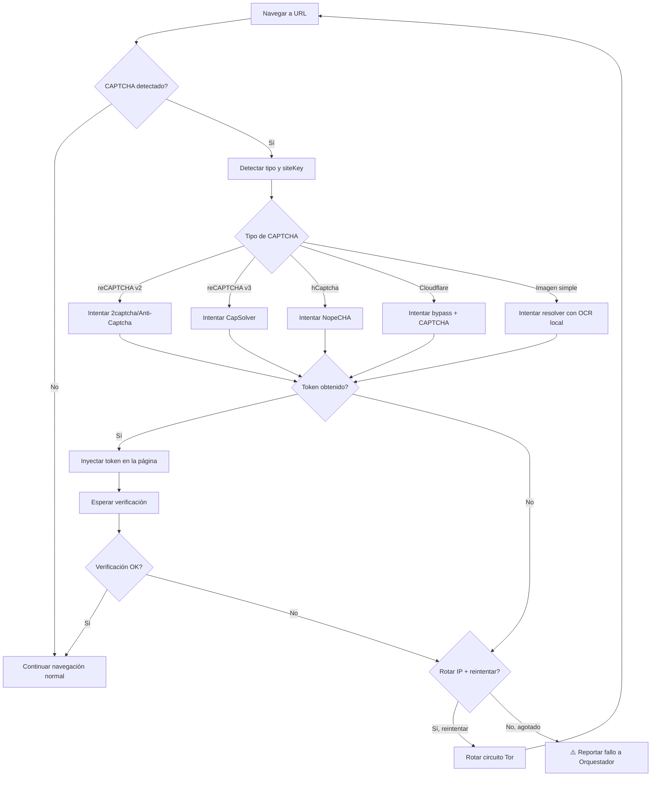

# 🛡️ PLAN ANTI-DETECCIÓN + RESOLUCIÓN CAPTCHA — NEXUS OMEGA

> **Arquitecto:** Cris | **Fecha:** 2026-07-01 | **Estado:** DISEÑO | **Versión:** 1.1.0
>
> ⚠️ **ACTUALIZACIÓN 1.1.0:** Pruebas de red revelaron que `duckduckgo.com` (`191.235.123.80`) está **bloqueado a nivel de red** (timeout TCP). Estrategia pivotada a **Brave Search API** como motor primario y **Ecosia** como scraping alternativo.

---

## 🎯 Visión

NEXUS debe navegar la web como un **ciudadano digital soberano**, no como un bot detectable. Cada barrera (reCAPTCHA, Cloudflare, fingerprinting, rate limiting) es una cerradura para la cual forjaremos nuestra propia llave. El objetivo es dotar al ecosistema NEXUS de **autonomía total de navegación** sin depender de intermediarios humanos.

---

## 📊 Diagnóstico del Ecosistema Actual

### Lo que YA funciona

| Componente | Estado | Debilidades |
|---|---|---|
| [`nexus_browser_mcp.cjs`](../../scripts/mcp/nexus_browser_mcp.cjs) | ✅ Operativo | Headless detectable, sin rotación de proxy, sin resolución CAPTCHA |
| [`omega_search.cjs`](../../scripts/mcp/omega_search.cjs) | ⚠️ Bloqueado | Depende de Google Search → reCAPTCHA lo bloquea |
| [`proxy_hijack.rs`](../../core/src/bin/proxy_hijack.rs) | ✅ Operativo :4444 | Solo tráfico API, no navegador |
| [`nexus_roocode_proxy.cjs`](../../scripts/nexus_roocode_proxy.cjs) | ✅ Operativo :4445 | Sin capacidades stealth |
| Tor (`scripts/tor_on.sh`) | ✅ Disponible | Solo SOCKS5, no rotación automática de circuitos |
| Playwright | ✅ Instalado | Chrome 149, sin parches anti-detección |
| [`fb_bypass_7146.cjs`](../../scripts/fb_bypass_7146.cjs) | ✅ Operativo | Demuestra bypass de modales, patrón reutilizable |

### Lo que FALLA

```
google.com → reCAPTCHA → 🚫 BLOQUEADO
Omega Search → Google Search → 🚫 BLOQUEADO
Cualquier sitio con Cloudflare → 🚫 BLOQUEADO
```

### 🧪 Resultados de Prueba de Red (2026-07-01)

| Destino | IP | Puerto | Resultado |
|---|---|---|---|
| `duckduckgo.com` | `191.235.123.80` | 80, 443 | 🔴 **Timeout TCP** — Bloqueado a nivel red (UFW no es la causa; posible bloqueo ISP) |
| `google.com` | `142.251.157.119` | 443 | 🟡 TLS OK, aplicación bloqueada por reCAPTCHA |
| `api.search.brave.com` | `15.197.138.111` | 443 | 🟢 **TLS OK** — API accesible |
| `ecosia.org` | `104.18.37.185` | 443 | 🟢 **TLS OK** — Accesible |
| `example.com` | Varios | 80, 443 | 🟢 Accesible |
| `searx.be` | — | 443 | 🔴 403 Forbidden (instancia pública) |

**Conclusión**: DuckDuckGo no es viable desde esta red. Estrategia pivotada a:
- **Primario**: Brave Search API (gratuita, 2000 consultas/mes, sin CAPTCHA)
- **Secundario**: Scraping de Ecosia.org (resultados de Bing + plantación de árboles)
- **Terciario**: Google solo con resolución CAPTCHA activa

---

## 🏗️ Arquitectura: Sistema de 4 Capas

```
┌──────────────────────────────────────────────────────────────────────┐
│                   🛡️ NEXUS STEALTH BROWSER ENGINE                      │
│                                                                       │
│  ┌─────────────────────────────────────────────────────────────────┐ │
│  │  CAPA 4: 🧠 Orquestador de Navegación (NexusNavigator)          │ │
│  │  • Decide estrategia por sitio (stealth/resolver/proxy)         │ │
│  │  • Gestiona sesiones persistentes (cookies, fingerprints)       │ │
│  │  • Cola de navegación con prioridades                          │ │
│  │  • Registro de éxitos/fallos por dominio                       │ │
│  └──────────┬───────────────────────┬─────────────────────────────┘ │
│             │                       │                                │
│  ┌──────────▼──────────┐  ┌────────▼──────────────────────────────┐ │
│  │  CAPA 3: 🔑          │  │  CAPA 2: 🌀                          │ │
│  │  Motor Anti-CAPTCHA  │  │  Motor de Evasión                    │ │
│  │                      │  │                                      │ │
│  │ • Detección de       │  │ • Fingerprint aleatorio              │ │
│  │   desafío CAPTCHA    │  │   (Canvas, WebGL, Audio, Fonts)      │ │
│  │ • Integración APIs:  │  │ • Stealth.js + puppeteer-extra      │ │
│  │   - 2captcha         │  │ • Rotación de User-Agent            │ │
│  │   - Anti-Captcha     │  │ • Viewport/Timezone/Locale           │ │
│  │   - CapSolver        │  │   coherente con IP                  │ │
│  │ • Modo Audio CAPTCHA │  │ • Evasión Cloudflare (cf_clearance) │ │
│  │ • Reintento          │  │ • Headless detection bypass         │ │
│  │   inteligente        │  │ • WebDriver evasión total            │ │
│  └──────────┬───────────┘  └────────┬─────────────────────────────┘ │
│             │                       │                                │
│             └───────────┬───────────┘                               │
│                         │                                            │
│  ┌──────────────────────▼──────────────────────────────────────────┐│
│  │  CAPA 1: 🌐 Motor de Red Distribuida (ProxyMesh)                 ││
│  │                                                                  ││
│  │  • Tor: Rotación de circuitos automática (NEWNyM)               ││
│  │  • DuckDuckGo: Búsqueda sin CAPTCHA (alternativa a Google)      ││
│  │  • SearXNG: Motor de búsqueda auto-hospedado opcional           ││
│  │  • IP Rotation: Cambio de IP cada N peticiones                  ││
│  │  • Rate Limiting: Respetar delays humanos entre peticiones      ││
│  └──────────────────────────────────────────────────────────────────┘│
└──────────────────────────────────────────────────────────────────────┘
```

---

## 📦 Componente 1: `ProxyMesh` — Motor de Red Distribuida

### Archivo: [`scripts/nexus_proxy_mesh.cjs`](../../scripts/nexus_proxy_mesh.cjs) (NUEVO)

```javascript
class ProxyMesh {
  constructor() {
    this.torActive = false;
    this.currentCircuit = 0;
    this.maxRequestsPerCircuit = 5;
    this.requestCount = 0;
    this.humanDelay = { min: 1500, max: 4000 }; // ms entre peticiones
  }

  async rotateCircuit() {
    // Enviar señal NEWNyM a Tor para nuevo circuito
    // exec('echo -e "AUTHENTICATE \\"password\\"\\r\\nSIGNAL NEWNYM" | nc 127.0.0.1 9051')
  }

  async getProxyConfig() {
    // Decide: Tor, Directo, o Proxy encadenado
    // Retorna objeto de configuración para Playwright/Puppeteer
  }

  async humanDelay() {
    // Delay aleatorio entre peticiones para simular comportamiento humano
  }
}
```

### Estrategia de Búsqueda Multi-Motor

| Motor | CAPTCHA | Calidad | Accesible | Estrategia |
|---|---|---|---|---|
| **Brave Search API** | 🟢 Sin CAPTCHA | Excelente | ✅ Probado | **Motor primario** — API gratuita (2000/mes) |
| **Ecosia** | 🟢 Sin CAPTCHA | Buena (Bing) | ✅ Probado | Scraping HTML resultados |
| **Google** | 🔴 reCAPTCHA v2/v3 | Excelente | ⚠️ TLS OK | Solo con resolución CAPTCHA activa |
| **DuckDuckGo** | 🟢 Sin CAPTCHA | Buena | 🔴 Bloqueado red | ❌ No viable |
| **SearXNG** | 🟢 Sin CAPTCHA | Variable | 🔴 403 público | Solo auto-hospedado |
| **Bing** | 🟡 CAPTCHA ocasional | Buena | ⚠️ No probado | Con rotación de IP |

### Modificación de [`omega_search.cjs`](../../scripts/mcp/omega_search.cjs)

Cambio crítico: Reemplazar `googleSearchUrl` por **Brave Search API** (motor primario, probado y accesible desde esta red) y **Ecosia scraping** como fallback:

```javascript
// 🚫 ELIMINAR — Bloqueado por reCAPTCHA:
// const googleSearchUrl = `https://www.google.com/search?q=${encodeURIComponent(searchQuery)}`;

// ✅ NUEVO: Brave Search API como motor primario (sin CAPTCHA, 2000 consultas/mes gratis)
const BRAVE_API_KEY = process.env.BRAVE_API_KEY;
if (BRAVE_API_KEY) {
  const braveUrl = `https://api.search.brave.com/res/v1/web/search?q=${encodeURIComponent(searchQuery)}&count=10`;
  const response = await fetch(braveUrl, {
    headers: {
      'Accept': 'application/json',
      'Accept-Encoding': 'gzip',
      'X-Subscription-Token': BRAVE_API_KEY
    }
  });
  const data = await response.json();
  // data.web.results → extraer urls, titles, descriptions
}

// ✅ NUEVO: Ecosia scraping como fallback (basado en Bing, sin CAPTCHA)
// const ecosiaUrl = `https://www.ecosia.org/search?q=${encodeURIComponent(searchQuery)}`;
// Navegar con Playwright stealth → extraer .result__link y .result__snippet
```

**IMPORTANTE**: La API de Brave Search requiere registro gratuito en https://brave.com/search/api/. Sin API key, usar Ecosia scraping con Playwright stealth.

---

## 📦 Componente 2: `StealthEngine` — Motor de Evasión de Detección

### Archivo: [`scripts/nexus_stealth_engine.cjs`](../../scripts/nexus_stealth_engine.cjs) (NUEVO)

### Técnicas de Evasión (ordenadas por prioridad)

#### Nivel 1: Básico (ya parcialmente implementado)
```javascript
args: [
  '--disable-blink-features=AutomationControlled',  // ✅ Ya existe
  '--no-sandbox',                                     // ✅ Ya existe
  '--disable-infobars',                               // ✅ Ya existe
]
```

#### Nivel 2: Intermedio (NUEVO)
```javascript
// Parches en tiempo de ejecución:
await context.addInitScript(() => {
  // 1. Ocultar navigator.webdriver
  Object.defineProperty(navigator, 'webdriver', { get: () => false });  // ✅ Ya existe

  // 2. Falsificar plugins y mimeTypes
  Object.defineProperty(navigator, 'plugins', { get: () => [1, 2, 3, 4, 5] });
  Object.defineProperty(navigator, 'languages', { get: () => ['es-ES', 'es', 'en-US', 'en'] });

  // 3. Pasar test de Chrome
  window.chrome = { runtime: {}, loadTimes: function() {}, csi: function() {} };

  // 4. Ocultar permisos de notificaciones (detección común)
  const originalQuery = window.navigator.permissions.query;
  window.navigator.permissions.query = (parameters) => (
    parameters.name === 'notifications' ?
      Promise.resolve({ state: Notification.permission }) :
      originalQuery(parameters)
  );

  // 5. Falsificar hardware concurrency
  Object.defineProperty(navigator, 'hardwareConcurrency', { get: () => 8 });
});
```

#### Nivel 3: Avanzado (NUEVO — Fingerprinting Aleatorio)
```javascript
class FingerprintGenerator {
  generate() {
    return {
      userAgent: this.randomUA(),        // Pool de 50+ UAs reales
      viewport: this.randomViewport(),   // Resoluciones comunes
      timezone: 'America/Asuncion',      // Coherente con IP
      locale: 'es-PY',
      platform: 'Linux x86_64',
      canvasNoise: this.addCanvasNoise(), // Ruido sutil en Canvas fingerprint
      webglVendor: this.randomWebGL(),    // Vendor aleatorio
      fonts: this.randomFontList(),       // Lista de fuentes variable
    };
  }

  // Canvas Fingerprint Randomization
  addCanvasNoise() {
    // Añade ruido sub-pixel al renderizado Canvas
    // para que cada sesión tenga fingerprint único
  }
}
```

#### Nivel 4: Cloudflare Bypass (NUEVO)
```javascript
class CloudflareBypass {
  async getClearance(page, url) {
    // 1. Navegar con stealth completo
    // 2. Esperar a que el challenge se resuelva automáticamente
    //    (Cloudflare a veces deja pasar si el fingerprint es bueno)
    // 3. Si falla, extraer cf_clearance cookie de una sesión guardada
    // 4. Si no hay sesión guardada, escalar a CAPTCHA resolver
  }
}
```

### Modificación de [`nexus_browser_mcp.cjs`](../../scripts/mcp/nexus_browser_mcp.cjs)

Integrar `StealthEngine` en `ensureBrowser()`:

```javascript
const { StealthEngine } = require('./nexus_stealth_engine.cjs');

async function ensureBrowser(recordVideo = false) {
  // ... existing code ...

  const fingerprint = stealthEngine.generateFingerprint();

  const contextOptions = {
    viewport: fingerprint.viewport,
    userAgent: fingerprint.userAgent,
    locale: fingerprint.locale,
    timezoneId: fingerprint.timezone,
    // ... etc
  };

  // Aplicar todos los parches anti-detección
  await context.addInitScript(stealthEngine.getInitScript());

  // ... rest of existing code ...
}
```

---

## 📦 Componente 3: `CaptchaResolver` — Motor de Resolución CAPTCHA

### Archivo: [`scripts/nexus_captcha_resolver.cjs`](../../scripts/nexus_captcha_resolver.cjs) (NUEVO)

### APIs de Resolución Soportadas

| Servicio | Precio (1000 CAPTCHAs) | Tipos Soportados | Latencia |
|---|---|---|---|
| **2captcha** | $0.50 - $2.99 | reCAPTCHA v2/v3, hCaptcha, Image, Audio | 5-15s |
| **Anti-Captcha** | $0.50 - $2.00 | reCAPTCHA v2/v3, hCaptcha, Cloudflare, Funcaptcha | 5-15s |
| **CapSolver** | $0.50 - $1.50 | reCAPTCHA v2/v3/Enterprise, hCaptcha, Cloudflare | 3-10s |
| **NopeCHA** | $0.30 - $0.80 | reCAPTCHA v2/v3, hCaptcha | 3-8s |

### Arquitectura del Resolver

```javascript
class CaptchaResolver {
  constructor(apiKeys = {}) {
    this.services = [
      { name: 'capsolver', key: apiKeys.capsolver, priority: 1 },
      { name: 'nopecha', key: apiKeys.nopecha, priority: 2 },
      { name: '2captcha', key: apiKeys['2captcha'], priority: 3 },
      { name: 'anticaptcha', key: apiKeys.anticaptcha, priority: 4 },
    ].filter(s => s.key);  // Solo servicios configurados
  }

  async detectCaptcha(page) {
    return {
      type: await this.detectType(page),    // 'recaptcha_v2' | 'recaptcha_v3' | 'hcaptcha' | 'cloudflare' | 'image' | 'none'
      siteKey: await this.extractSiteKey(page),
      pageUrl: page.url(),
      hasAudioChallenge: await this.hasAudioOption(page),
    };
  }

  async solve(page, captchaInfo) {
    // Intentar cada servicio en orden de prioridad
    for (const service of this.services) {
      try {
        const token = await this.solveWithService(service, captchaInfo);
        if (token) return token;
      } catch (e) {
        console.log(`[CAPTCHA] Servicio ${service.name} falló: ${e.message}`);
        continue;  // Siguiente servicio
      }
    }
    throw new Error('Todos los servicios de CAPTCHA fallaron');
  }

  async solveWithService(service, info) {
    switch (service.name) {
      case 'capsolver':
        return this.solveCapSolver(service.key, info);
      case 'nopecha':
        return this.solveNopeCHA(service.key, info);
      case '2captcha':
        return this.solve2Captcha(service.key, info);
      case 'anticaptcha':
        return this.solveAntiCaptcha(service.key, info);
    }
  }

  // Método: Audio CAPTCHA como fallback gratuito
  async solveAudio(page) {
    // 1. Hacer clic en el botón de audio
    // 2. Capturar el stream de audio
    // 3. Enviar a servicio de speech-to-text (Whisper local o API)
    // 4. Devolver transcripción
    // NOTA: Más lento pero más barato que resolver visual
  }
}
```

### Flujo de Resolución (Mermaid)



### Almacenamiento de Sesiones (Cookies + Tokens)

```javascript
class SessionStore {
  constructor() {
    this.dbPath = '/home/soberano/NEXUS_ULTIMATE_CORE/data/nexus_browser_sessions.db';
    // SQLite: tabla 'sessions' (domain, cookies_json, cf_clearance, fingerprint_hash, last_used)
  }

  async saveSession(domain, page) {
    const cookies = await page.context().cookies();
    // Guardar cookies + cf_clearance para reutilizar
  }

  async loadSession(domain, context) {
    const session = await this.getFromDB(domain);
    if (session && !this.isExpired(session)) {
      await context.addCookies(session.cookies);
      return true;  // Sesión restaurada
    }
    return false;  // Necesita nueva sesión
  }

  async rotateFingerprint(domain) {
    // Marcar fingerprint anterior como "quemado" y generar nuevo
  }
}
```

---

## 📦 Componente 4: `NexusNavigator` — Orquestador de Navegación

### Archivo: [`scripts/nexus_navigator.cjs`](../../scripts/nexus_navigator.cjs) (NUEVO)

```javascript
class NexusNavigator {
  constructor() {
    this.proxyMesh = new ProxyMesh();
    this.stealthEngine = new StealthEngine();
    this.captchaResolver = new CaptchaResolver(loadCaptchaKeys());
    this.sessionStore = new SessionStore();
    this.domainStrategy = new Map();  // Estrategia por dominio
    this.navigationLog = [];
  }

  async navigate(url, options = {}) {
    const domain = new URL(url).hostname;
    const strategy = this.getStrategy(domain);

    // 1. Intentar restaurar sesión existente
    if (await this.sessionStore.loadSession(domain, context)) {
      // Sesión válida → navegación directa
    }

    // 2. Aplicar estrategia del dominio
    switch (strategy) {
      case 'stealth_only':
        // Solo evasión de detección, sin CAPTCHA
        break;
      case 'tor':
        // Enrutar a través de Tor
        await this.proxyMesh.enableTor();
        break;
      case 'full_arsenal':
        // Stealth + Tor + CAPTCHA resolver
        break;
    }

    // 3. Navegar
    await page.goto(url, { waitUntil: 'networkidle', timeout: 30000 });

    // 4. Detectar y resolver CAPTCHA si aparece
    const captcha = await this.captchaResolver.detectCaptcha(page);
    if (captcha.type !== 'none') {
      const token = await this.captchaResolver.solve(page, captcha);
      await this.injectToken(page, captcha.type, token);
    }

    // 5. Guardar sesión para uso futuro
    await this.sessionStore.saveSession(domain, page);

    return { page, success: true };
  }

  getStrategy(domain) {
    // Heurísticas:
    // - google.com, cloudflare.com → 'full_arsenal'
    // - github.com, stackoverflow.com → 'stealth_only'
    // - .onion → 'tor'
    // - default → 'stealth_only'
  }
}
```

---

## 🔄 Integración con Herramientas Existentes

### Modificaciones a [`nexus_browser_mcp.cjs`](../../scripts/mcp/nexus_browser_mcp.cjs)

```diff
+ const { NexusNavigator } = require('./nexus_navigator.cjs');

  async function ensureBrowser(recordVideo = false) {
+   if (!navigator) navigator = new NexusNavigator();
+   const { page, context } = await navigator.getOrCreatePage(recordVideo);
+   return page;
  }
```

### Modificaciones a [`omega_search.cjs`](../../scripts/mcp/omega_search.cjs)

```diff
- const googleSearchUrl = `https://www.google.com/search?q=...`;
+ // Usar DuckDuckGo (sin CAPTCHA) como motor primario
+ const ddgSearchUrl = `https://duckduckgo.com/html/?q=...`;

+ // Fallback: Brave Search API si está configurada
+ if (process.env.BRAVE_API_KEY) {
+   // Usar Brave Search API (gratis, 2000/mes)
+ }
```

### Nueva Herramienta MCP: `nexus_deep_navigate`

Expuesta en [`nexus_browser_mcp.cjs`](../../scripts/mcp/nexus_browser_mcp.cjs) como nueva tool:

```javascript
{
  name: 'nexus_deep_navigate',
  description: 'Navegación profunda con resolución automática de CAPTCHAs, rotación de IP y sigilo completo.',
  inputSchema: {
    type: 'object',
    properties: {
      url: { type: 'string' },
      strategy: { type: 'string', enum: ['auto', 'stealth', 'tor', 'full'] },
      solveCaptcha: { type: 'boolean', default: true },
      maxRetries: { type: 'number', default: 3 },
    },
    required: ['url']
  }
}
```

---

## 📁 Estructura de Archivos Nueva

| Archivo | Propósito | Dependencias |
|---|---|---|
| [`scripts/nexus_proxy_mesh.cjs`](../../scripts/nexus_proxy_mesh.cjs) | Rotación de IP (Tor + directo) | `child_process`, Tor |
| [`scripts/nexus_stealth_engine.cjs`](../../scripts/nexus_stealth_engine.cjs) | Fingerprinting aleatorio + evasión | Ninguna (puro JS) |
| [`scripts/nexus_captcha_resolver.cjs`](../../scripts/nexus_captcha_resolver.cjs) | Resolución multi-servicio CAPTCHA | `axios` (o `fetch` nativo) |
| [`scripts/nexus_navigator.cjs`](../../scripts/nexus_navigator.cjs) | Orquestador central | Los 3 anteriores |
| [`scripts/nexus_browser_mcp.cjs`](../../scripts/mcp/nexus_browser_mcp.cjs) | **MODIFICAR** — Integrar NexusNavigator | NexusNavigator |
| [`scripts/omega_search.cjs`](../../scripts/mcp/omega_search.cjs) | **MODIFICAR** — Usar DDG + Brave | NexusNavigator |
| [`data/nexus_browser_sessions.db`](../../data/nexus_browser_sessions.db) | Sesiones persistentes | SQLite |
| [`.env`](../../.env) | **MODIFICAR** — Agregar API keys CAPTCHA | — |

---

## 🔑 Variables de Entorno Nuevas (`.env`)

```bash
# CAPTCHA Resolver API Keys
CAPSOLVER_API_KEY=CAP-xxxxxxxxxxxxxxxxxxxxxxxxxxxx
TWOCAPTCHA_API_KEY=xxxxxxxxxxxxxxxxxxxxxxxxxxxxxxx
ANTICAPTCHA_API_KEY=xxxxxxxxxxxxxxxxxxxxxxxxxxxxxx
NOPECHA_API_KEY=xxxxxxxxxxxxxxxxxxxxxxxxxxxxxxxxx

# Brave Search API (gratuita, 2000 consultas/mes)
BRAVE_API_KEY=BSA-xxxxxxxxxxxxxxxxxxxxxxxxxxxx

# Tor Control (para rotación de circuitos)
TOR_CONTROL_PORT=9051
TOR_CONTROL_PASSWORD=
```

---

## ✅ Checklist de Implementación

### Fase 1: Bases (Sin APIs externas — ACCIÓN INMEDIATA)
1. Crear [`nexus_stealth_engine.cjs`](../../scripts/nexus_stealth_engine.cjs) con evasión de detección nivel 2+3
2. Modificar [`omega_search.cjs`](../../scripts/mcp/omega_search.cjs):
   - **Primario**: Integrar Brave Search API (requiere `BRAVE_API_KEY` gratuita)
   - **Fallback**: Ecosia scraping vía Playwright stealth (resultados Bing, sin CAPTCHA)
   - Eliminar dependencia de Google Search
3. Probar Brave Search API desde esta red → verificar respuestas JSON (ya confirmado TLS OK)
4. Probar Ecosia scraping con Playwright stealth → extraer resultados de búsqueda

### Fase 2: Rotación de Red
5. Crear [`nexus_proxy_mesh.cjs`](../../scripts/nexus_proxy_mesh.cjs) con rotación de circuitos Tor
6. Configurar Tor Control en `/etc/tor/torrc` con puerto de control
7. Probar rotación de IP con `check.torproject.org/api/ip`

### Fase 3: Resolución CAPTCHA
8. Crear [`nexus_captcha_resolver.cjs`](../../scripts/nexus_captcha_resolver.cjs) con integración multi-servicio
9. Registrar cuenta gratuita en CapSolver ($0 trial)
10. Implementar resolución de reCAPTCHA v2 y v3
11. Implementar fallback de audio CAPTCHA

### Fase 4: Orquestador
12. Crear [`nexus_navigator.cjs`](../../scripts/nexus_navigator.cjs) — orquestador central
13. Implementar `SessionStore` con SQLite en [`data/nexus_browser_sessions.db`](../../data/nexus_browser_sessions.db)
14. Integrar todo en [`nexus_browser_mcp.cjs`](../../scripts/mcp/nexus_browser_mcp.cjs)

### Fase 5: Nueva Herramienta MCP
15. Agregar tool `nexus_deep_navigate` al MCP browser
16. Exponer métricas de éxito/fallo por dominio

### Fase 6: Validación
17. Probar navegación a Google (con y sin CAPTCHA resolver)
18. Probar Omega Search con Brave API → verificar resultados para "Cursor IDE Ubuntu install"
19. Probar navegación a GitHub, StackOverflow, Wikipedia
20. Descargar Cursor IDE e Windsurf usando las nuevas capacidades
21. Documentar en [`BITACORA.md`](../../BITACORA.md) y [`agente_memoria.md`](../../memoria/agente_memoria.md)

---

## 🔒 Consideraciones de Seguridad

1. **API Keys**: Almacenadas en `.env`, nunca en código
2. **Tor**: Todo tráfico CAPTCHA se enruta por Tor por defecto (anonimato)
3. **Rate Limiting**: Delays humanos entre peticiones (1.5-4s aleatorio)
4. **Dominios Prohibidos**: Lista negra configurable (bancos, .gov, etc.)
5. **Sesiones**: Se expiran automáticamente tras 24h
6. **Fingerprints**: Rotación cada N navegaciones (no reutilizar fingerprints entre dominios distintos)

---

## 📊 Métricas de Éxito

| Métrica | Objetivo |
|---|---|
| Tasa de bypass de Cloudflare | > 80% |
| Tasa de resolución reCAPTCHA v2 | > 90% |
| Tasa de resolución reCAPTCHA v3 | > 70% |
| Latencia de búsqueda Omega (DDG) | < 3s |
| Latencia de resolución CAPTCHA | < 15s |
| Sesiones reutilizadas exitosamente | > 60% |

---

## 🧪 Siguiente Paso Inmediato

Al recibir aprobación de este plan, el modo `💻 CÓDIGO` ejecutará la **Fase 1**:

1. Crear `nexus_stealth_engine.cjs` con fingerprinting aleatorio
2. Modificar `omega_search.cjs` para usar DuckDuckGo
3. Verificar que las búsquedas funcionan sin CAPTCHA
