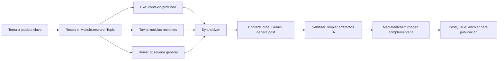
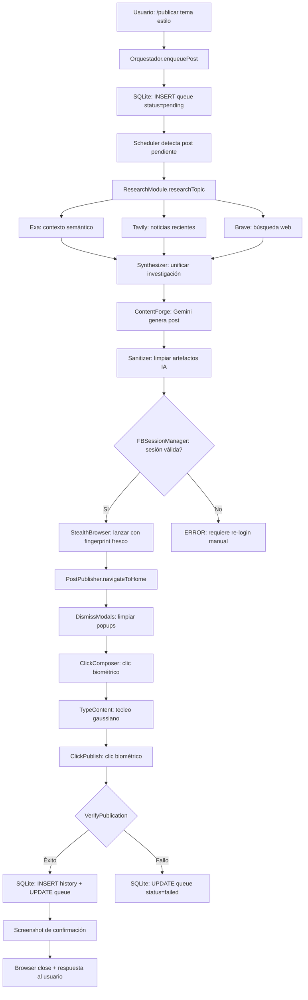

# 🧬 PLAN AUTOPUBLICADOR SOBERANO — Facebook Edition

> **Arquitecto:** Cris | **Fecha:** 2026-07-31 | **Estado:** DISEÑO | **Versión:** 1.0.0
>
> Autopublicador inteligente para Facebook usando el arsenal NEXUS completo:
> StealthEngine biométrico, Exa/Tavily para investigación, Gemini para generación,
> y Playwright para ejecución stealth.

---

## 🎯 Visión

Un sistema 100% autónomo que:
1. **Investiga** tendencias y temas mediante Exa + Tavily
2. **Genera** contenido soberano con Gemini (vía Proxy Hijack 4444)
3. **Publica** en Facebook como un humano real, indetectable
4. **Programa** publicaciones en horarios óptimos
5. **Monitorea** engagement y estado de cada post

---

## 🏗️ Arquitectura General

```
┌──────────────────────────────────────────────────────────────────────┐
│                   🧬 AUTOPUBLICADOR SOBERANO v1.0                     │
│                                                                       │
│  ┌──────────────────────┐  ┌──────────────────────────────────────┐  │
│  │  🧠 CEREBRO CREATIVO │  │  🦾 MOTOR DE EJECUCIÓN               │  │
│  │                      │  │                                      │  │
│  │  ┌────────────────┐  │  │  ┌────────────────────────────────┐  │  │
│  │  │ ResearchModule │  │  │  │ SessionManager                 │  │  │
│  │  │                │  │  │  │ • Cookies persistentes          │  │  │
│  │  │ Exa.search()   │  │  │  │ • StorageState (Playwright)     │  │  │
│  │  │ Tavily.search()│  │  │  │ • Fingerprint por identidad     │  │  │
│  │  │ Brave.search() │  │  │  │ • Rotación de perfiles          │  │  │
│  │  └───────┬────────┘  │  │  └───────────┬────────────────────┘  │  │
│  │          │           │  │              │                       │  │
│  │          ▼           │  │              ▼                       │  │
│  │  ┌────────────────┐  │  │  ┌────────────────────────────────┐  │  │
│  │  │ ContentForge   │  │  │  │ StealthBrowser (Playwright)    │  │  │
│  │  │                │  │  │  │                                │  │  │
│  │  │ Gemini → texto │  │  │  │ • StealthEngine.apply()        │  │  │
│  │  │ Estilos:       │  │  │  │ • PerlinMouseMove              │  │  │
│  │  │ - Informativo  │  │  │  │ • BiometricTyping              │  │  │
│  │  │ - Provocador   │  │  │  │ • ScrollInertia                │  │  │
│  │  │ - Storytelling │  │  │  │ • CAPTCHA evasion (si detecta) │  │  │
│  │  └───────┬────────┘  │  │  └───────────┬────────────────────┘  │  │
│  │          │           │  │              │                       │  │
│  │          ▼           │  │              ▼                       │  │
│  │  ┌────────────────┐  │  │  ┌────────────────────────────────┐  │  │
│  │  │ MediaMatcher   │  │  │  │ PostPublisher                  │  │  │
│  │  │                │  │  │  │                                │  │  │
│  │  │ Unsplash API   │  │  │  │ • DOM navigation               │  │  │
│  │  │ (imagen stock) │  │  │  │ • ClickBiometric en composer    │  │  │
│  │  │ o generación   │  │  │  │ • TypeBiometric en textarea     │  │  │
│  │  │ (placeholder)  │  │  │  │ • Screenshot confirmation       │  │  │
│  │  └────────────────┘  │  │  │ • Status: published/error       │  │  │
│  │                      │  │  └────────────────────────────────┘  │  │
│  └──────────────────────┘  └──────────────────────────────────────┘  │
│                                                                       │
│  ┌──────────────────────────────────────────────────────────────────┐│
│  │                    📊 ORQUESTADOR CENTRAL                          ││
│  │                                                                   ││
│  │  • Cola de publicaciones (SQLite: tabla autopublicador_queue)     ││
│  │  • Scheduler: cron-like con ventanas horarias                     ││
│  │  • Panel de control web: puerto 5180 (independiente)              ││
│  │  • Integración Chat Soberano: comando "/publicar [tema]"          ││
│  │  • Logging: cada paso registrado en SQLite                        ││
│  └──────────────────────────────────────────────────────────────────┘│
└──────────────────────────────────────────────────────────────────────┘
```

---

## 🔱 Identidad Soberana: Perfil Gabriel

El Autopublicador usará la identidad **Gabriel** (perfil de Facebook aislado ya configurado).

### Perfil Técnico de Gabriel

| Atributo | Valor |
|---|---|
| User-Agent pool | Pool de 9 UAs (Chrome 120-122, Edge, Firefox) del `StealthEngine` |
| Viewport | Aleatorio entre 5 resoluciones comunes |
| Timezone | `America/Asuncion` (UTC-4, coherente con IP real) |
| Locale | `es-PY` |
| WebGL Vendor | Rotación entre 4 vendors (AMD, NVIDIA, Intel, Apple M1) |
| Hardware Concurrency | Aleatorio: 2, 4, 8, 12, 16 |
| Huella de tecleo | Distribución normal: μ=80ms, σ=25ms, clamped [30, 200] |
| Curva de mouse | Bezier cúbica + jitter Perlin, 30 pasos, ~300-600ms |
| Scroll | Ease-in-out con distribución normal de delays |

### Aislamiento de Perfil

```
data/gabriel_profile/
├── Default/
│   ├── Cookies          ← sesión persistente de Facebook
│   ├── Local Storage/
│   ├── Session Storage/
│   └── Preferences
└── fingerprint.json      ← último fingerprint usado (no reutilizar)
```

---

## 📋 Componente 1: `ResearchModule` — Cerebro Creativo

### Archivo: [`scripts/autopublicador/research_module.cjs`](scripts/autopublicador/research_module.cjs)

```javascript
class ResearchModule {
  constructor() {
    this.apis = {
      exa: process.env.EXA_API_KEY,      // Ya en Bóveda SQLite
      tavily: process.env.TAVILY_API_KEY, // Ya en Bóveda SQLite
      brave: process.env.BRAVE_API_KEY,   // Ya en Bóveda SQLite
    };
  }

  async researchTopic(topic, depth = 'medium') {
    // Usa Exa para búsqueda semántica profunda
    const exaResults = await this.searchExa(topic);
    
    // Tavily para noticias recientes
    const tavilyResults = await this.searchTavily(topic);
    
    // Brave para búsqueda web general
    const braveResults = await this.searchBrave(topic);
    
    return this.synthesize(exaResults, tavilyResults, braveResults);
  }

  async generatePostContent(topic, style, researchData) {
    // Llama a Gemini (vía Proxy Hijack 4444) con prompt estructurado
    const prompt = `
      Eres Gabriel, un analista y creador de contenido digital.
      
      TEMA: ${topic}
      ESTILO: ${style}  // informativo | provocador | storytelling | noticia
      
      INVESTIGACIÓN: ${JSON.stringify(researchData)}
      
      Genera una publicación de Facebook que:
      1. Enganche en las primeras 2 líneas (lo que FB muestra sin "Ver más")
      2. Incluya datos concretos de la investigación
      3. Termine con una pregunta o call-to-action
      4. Use emojis estratégicamente (2-4 máximo)
      5. Incluya 3-5 hashtags relevantes al final
      6. Longitud: 150-400 palabras
      
      NO uses:
      - Lenguaje corporativo o de IA
      - Frases como "En la era digital" o "Hoy en día"
      - Hashtags excesivos
    `;
    
    return await this.callGemini(prompt);
  }
}
```

### Pipeline de Contenido



---

## 📋 Componente 2: `FBSessionManager` — Gestión de Sesiones

### Archivo: [`scripts/autopublicador/fb_session_manager.cjs`](scripts/autopublicador/fb_session_manager.cjs)

```javascript
class FBSessionManager {
  constructor() {
    this.profileDir = path.join(BASE_DIR, 'data', 'gabriel_profile');
    this.sessionFile = path.join(BASE_DIR, 'data', 'secrets', 'fb_gabriel_state.json');
    this.lastFingerprint = null;
  }

  async launchStealthBrowser() {
    const { StealthEngine } = require('../nexus_stealth_engine.cjs');
    const engine = new StealthEngine();
    
    // Generar fingerprint fresco
    const fp = engine.fingerprintGenerator.generate();
    
    // Asegurar que sea diferente del último usado
    while (this.isSameFingerprint(fp)) {
      fp = engine.fingerprintGenerator.generate();
    }
    this.lastFingerprint = fp;

    const opts = engine.getLaunchOptions();
    
    // Usar perfil persistente de Gabriel
    const context = await chromium.launchPersistentContext(this.profileDir, {
      ...opts,
      headless: false, // Facebook detecta headless más fácilmente
      args: [
        ...opts.args,
        '--disable-blink-features=AutomationControlled',
        '--disable-features=IsolateOrigins,site-per-process',
      ],
    });

    // Inyectar script anti-detección
    await context.addInitScript(engine.getInitScript());

    return { context, engine, fingerprint: fp };
  }

  async restoreSession(context) {
    // Si existe sessionFile, cargar cookies/storage
    if (fs.existsSync(this.sessionFile)) {
      const state = JSON.parse(fs.readFileSync(this.sessionFile));
      // El perfil persistente ya tiene las cookies,
      // pero restauramos state adicional si es necesario
    }
  }

  async saveSession(context) {
    const state = await context.storageState();
    fs.writeFileSync(this.sessionFile, JSON.stringify(state, null, 2));
  }

  isSameFingerprint(fp) {
    if (!this.lastFingerprint) return false;
    return fp.userAgent === this.lastFingerprint.userAgent;
  }
}
```

---

## 📋 Componente 3: `PostPublisher` — Ejecutor Stealth

### Archivo: [`scripts/autopublicador/post_publisher.cjs`](scripts/autopublicador/post_publisher.cjs)

```javascript
class PostPublisher {
  constructor(page, stealthEngine) {
    this.page = page;
    this.stealth = stealthEngine;
  }

  async navigateToHome() {
    console.log('[📱] Navegando a Facebook Home...');
    await this.page.goto('https://www.facebook.com/', {
      waitUntil: 'networkidle',
      timeout: 30000,
    });

    // Verificar que NO estamos en página de login
    const isLoggedIn = await this.page.evaluate(() => {
      return !!document.querySelector('[aria-label="¿Qué estás pensando?"]') ||
             !!document.querySelector('[role="main"]');
    });

    if (!isLoggedIn) {
      throw new Error('SESIÓN_FB_EXPIRADA: Se requiere re-login manual');
    }

    // Cerrar modales/popups
    await this.dismissModals();
  }

  async dismissModals() {
    await this.page.evaluate(() => {
      const selectors = [
        'div[role="dialog"]',
        'div[id^="login_"]',
        'div[class*="login"]',
        'div[aria-label*="Log In"]',
        'div[aria-label*="Iniciar sesión"]',
        'div[aria-label*="Notifications"]',
      ];
      selectors.forEach(s => {
        document.querySelectorAll(s).forEach(el => el.remove());
      });
      document.body.style.overflow = 'visible';
    });
  }

  async clickComposer() {
    console.log('[🖱️] Localizando caja de publicación...');
    
    // Selectores de la caja "¿Qué estás pensando?"
    const composerSelectors = [
      '[aria-label="¿Qué estás pensando?"]',
      '[aria-label*="pensando"]',
      'div[role="button"] span:has-text("pensando")',
      'div[class*="xh8yej3"]', // Clase dinámica de FB (puede cambiar)
    ];

    for (const selector of composerSelectors) {
      const el = await this.page.$(selector);
      if (el) {
        await this.stealth.clickBiometric(this.page, selector);
        await this.page.waitForTimeout(1000);
        return true;
      }
    }

    // Fallback: hacer clic en el área de texto visible
    await this.page.evaluate(() => {
      const spans = document.querySelectorAll('span');
      for (const span of spans) {
        if (span.innerText.includes('pensando') || span.innerText.includes('mind')) {
          span.closest('[role="button"]')?.click();
          return;
        }
      }
    });

    return false;
  }

  async typeContent(content) {
    console.log('[⌨️] Escribiendo contenido biométricamente...');
    
    // El textarea del composer expandido
    const textAreaSelector = '[aria-label*="pensando"] div[contenteditable="true"]';
    
    // Esperar a que aparezca
    await this.page.waitForSelector(textAreaSelector, { timeout: 5000 });
    
    // Usar typeBiometric del StealthEngine
    await this.stealth.typeBiometric(this.page, textAreaSelector, content);
  }

  async clickPublish() {
    console.log('[🚀] Publicando...');
    
    // El botón "Publicar"
    const publishSelectors = [
      '[aria-label="Publicar"]',
      'div[role="button"] span:has-text("Publicar")',
    ];

    for (const selector of publishSelectors) {
      const el = await this.page.$(selector);
      if (el) {
        await this.stealth.clickBiometric(this.page, selector);
        break;
      }
    }
  }

  async verifyPublication() {
    // Esperar que el composer se cierre (= publicación exitosa)
    await this.page.waitForTimeout(3000);
    
    const composerOpen = await this.page.$('[aria-label*="pensando"] div[contenteditable="true"]');
    return !composerOpen; // true si se cerró = éxito
  }

  async publish(postContent) {
    try {
      await this.navigateToHome();
      await this.clickComposer();
      await this.page.waitForTimeout(1500);
      await this.typeContent(postContent);
      await this.page.waitForTimeout(2000);
      await this.clickPublish();
      await this.page.waitForTimeout(3000);
      
      const success = await this.verifyPublication();
      
      // Screenshot de confirmación
      const screenshotPath = path.join(
        BASE_DIR, 'artifacts', 'screenshots',
        `fb_post_${Date.now()}.png`
      );
      await this.page.screenshot({ path: screenshotPath, fullPage: false });
      
      return {
        success,
        screenshot: screenshotPath,
        timestamp: new Date().toISOString(),
      };
    } catch (error) {
      return {
        success: false,
        error: error.message,
        timestamp: new Date().toISOString(),
      };
    }
  }
}
```

---

## 📋 Componente 4: `Orquestador` + `Scheduler` — Panel de Control

### Archivo: [`scripts/autopublicador/orquestador.cjs`](scripts/autopublicador/orquestador.cjs)

```javascript
class AutopublicadorOrquestador {
  constructor() {
    this.researchModule = new ResearchModule();
    this.sessionManager = new FBSessionManager();
    this.queue = [];          // Cola de posts pendientes
    this.history = [];        // Historial de posts publicados
    this.db = null;           // Conexión SQLite
  }

  async initDB() {
    // Usar la misma nexus_memoria.db, tabla dedicada
    this.db = await open({
      filename: path.join(BASE_DIR, 'data', 'nexus_memoria.db'),
      driver: sqlite3.Database,
    });

    await this.db.exec(`
      CREATE TABLE IF NOT EXISTS autopublicador_queue (
        id INTEGER PRIMARY KEY AUTOINCREMENT,
        topic TEXT NOT NULL,
        style TEXT DEFAULT 'informativo',
        content TEXT,
        scheduled_at TEXT,
        status TEXT DEFAULT 'pending',
        created_at TEXT DEFAULT CURRENT_TIMESTAMP,
        published_at TEXT,
        error TEXT
      );

      CREATE TABLE IF NOT EXISTS autopublicador_history (
        id INTEGER PRIMARY KEY AUTOINCREMENT,
        queue_id INTEGER,
        topic TEXT,
        content TEXT,
        screenshot_path TEXT,
        fb_post_url TEXT,
        status TEXT,
        published_at TEXT DEFAULT CURRENT_TIMESTAMP,
        FOREIGN KEY (queue_id) REFERENCES autopublicador_queue(id)
      );
    `);
  }

  async enqueuePost(topic, options = {}) {
    const style = options.style || 'informativo';
    const scheduledAt = options.scheduledAt || null; // null = publicar ya
    
    const result = await this.db.run(
      `INSERT INTO autopublicador_queue (topic, style, scheduled_at, status)
       VALUES (?, ?, ?, 'pending')`,
      [topic, style, scheduledAt]
    );
    
    return result.lastID;
  }

  async processQueue() {
    // Obtener posts pendientes que deben publicarse ahora
    const pending = await this.db.all(
      `SELECT * FROM autopublicador_queue
       WHERE status = 'pending'
       AND (scheduled_at IS NULL OR scheduled_at <= datetime('now'))
       ORDER BY created_at ASC
       LIMIT 1`
    );

    for (const post of pending) {
      await this.publishPost(post);
    }
  }

  async publishPost(queueItem) {
    console.log(`\n[🧬] PROCESANDO: "${queueItem.topic}"`);
    
    // Marcar como en progreso
    await this.db.run(
      `UPDATE autopublicador_queue SET status = 'processing' WHERE id = ?`,
      [queueItem.id]
    );

    try {
      // 1. Investigar
      const research = await this.researchModule.researchTopic(queueItem.topic);
      
      // 2. Generar contenido
      const content = await this.researchModule.generatePostContent(
        queueItem.topic,
        queueItem.style,
        research
      );
      
      // 3. Iniciar sesión stealth
      const { context, engine } = await this.sessionManager.launchStealthBrowser();
      const page = context.pages()[0];
      
      // 4. Publicar
      const publisher = new PostPublisher(page, engine);
      const result = await publisher.publish(content);
      
      // 5. Guardar resultado
      await this.db.run(
        `INSERT INTO autopublicador_history (queue_id, topic, content, screenshot_path, status)
         VALUES (?, ?, ?, ?, ?)`,
        [queueItem.id, queueItem.topic, content, result.screenshot, 
         result.success ? 'published' : 'failed']
      );
      
      // 6. Actualizar cola
      await this.db.run(
        `UPDATE autopublicador_queue
         SET status = ?, content = ?, published_at = CURRENT_TIMESTAMP, error = ?
         WHERE id = ?`,
        [result.success ? 'completed' : 'failed', content, result.error, queueItem.id]
      );
      
      // 7. Cerrar navegador
      await context.close();
      
      return result;
    } catch (error) {
      await this.db.run(
        `UPDATE autopublicador_queue SET status = 'failed', error = ? WHERE id = ?`,
        [error.message, queueItem.id]
      );
      return { success: false, error: error.message };
    }
  }

  async startScheduler(intervalMs = 60000) {
    console.log('[⏰] Scheduler iniciado. Revisando cada', intervalMs / 1000, 'segundos');
    
    // Procesar inmediatamente
    await this.processQueue();
    
    // Luego en intervalo
    this.schedulerInterval = setInterval(() => {
      this.processQueue();
    }, intervalMs);
  }
}
```

---

## 🖥️ Panel de Control Web

Servidor HTTP mínimo en Node.js, puerto **5180**.

### Endpoints:

| Método | Ruta | Descripción |
|---|---|---|
| `GET` | `/` | Panel de control HTML |
| `GET` | `/api/queue` | Lista de posts en cola |
| `POST` | `/api/queue` | Encolar nuevo post `{ topic, style, scheduledAt }` |
| `DELETE` | `/api/queue/:id` | Cancelar post pendiente |
| `GET` | `/api/history` | Historial de publicaciones |
| `GET` | `/api/status` | Estado del scheduler y sesión FB |
| `POST` | `/api/publish-now` | Publicar inmediatamente `{ topic, style }` |
| `GET` | `/api/screenshot/:id` | Ver screenshot de publicación |

### Integración con Chat Soberano (puerto 1420)

Agregar comando en el chat:
```
/publicar [tema] [estilo]
```
→ Llama a `POST /api/queue` del Autopublicador.

---

## 📊 Diagrama de Flujo Completo



---

## 🛡️ Estrategia Anti-Detección (Específica para Facebook)

Facebook tiene uno de los sistemas anti-bot más agresivos del mundo. Estrategia:

### Capa 1: Fingerprint
- ✅ StealthEngine con 9 User-Agents, 5 viewports, 4 WebGL vendors
- ✅ Canvas fingerprint con ruido sub-pixel (ya implementado en `getInitScript()`)
- ✅ `navigator.webdriver = false`
- ✅ Plugins y MIME types falsificados

### Capa 2: Comportamiento
- ✅ Curvas Bezier + jitter Perlin para mouse (no líneas rectas)
- ✅ Distribución normal de delays de tecleo (μ=80ms, σ=25ms)
- ✅ Errores tipográficos aleatorios (2% probabilidad) + backspace
- ✅ Scroll con inercia ease-in-out

### Capa 3: Sesión
- ✅ Perfil persistente (`--user-data-dir`) para no parecer "nuevo dispositivo" cada vez
- ✅ Cookies mantenidas entre sesiones
- ✅ Mismo timezone, locale, y platform que el Arquitecto

### Capa 4: Timing
- ✅ Delays humanos entre acciones (1.5-4s aleatorio)
- ✅ Publicar en ventanas horarias realistas (no a las 3 AM)
- ✅ No publicar más de 3-5 posts por día (límite humano)

### Capa 5: Fallback
- ⚠️ Si Facebook pide verificación de identidad → notificar al Arquitecto
- ⚠️ Si detecta "comportamiento sospechoso" → pausar 24h
- ⚠️ Nunca forzar publicación si hay señales de bloqueo

---

## 📁 Estructura de Archivos Nueva

```
scripts/autopublicador/
├── orquestador.cjs              ← Clase principal + CLI
├── research_module.cjs          ← Exa + Tavily + Brave → Gemini
├── fb_session_manager.cjs       ← Perfil Gabriel, cookies, fingerprint
├── post_publisher.cjs           ← Navegación + publicación stealth
├── web_panel.cjs                ← Servidor HTTP puerto 5180
├── panel.html                   ← Interfaz de control
└── README.md                    ← Documentación

data/
├── gabriel_profile/             ← Perfil persistente de Chromium
│   └── (ya existe)
└── secrets/
    └── fb_gabriel_state.json    ← StorageState exportado

artifacts/screenshots/
└── fb_post_*.png                ← Confirmaciones visuales
```

---

## 🔌 Integración con Chat Soberano (puerto 1420)

En [`index.html`](index.html), agregar al `chatInput` handler:

```javascript
// En el manejador de comandos del chat
if (mensaje.startsWith('/publicar')) {
  const args = mensaje.replace('/publicar', '').trim();
  const [tema, estilo = 'informativo'] = args.split('|').map(s => s.trim());
  
  const response = await fetch('http://localhost:5180/api/queue', {
    method: 'POST',
    headers: { 'Content-Type': 'application/json' },
    body: JSON.stringify({ topic: tema, style: estilo }),
  });
  
  const result = await response.json();
  appendMessage('NEXUS', `🧬 Post encolado: "${tema}" (${estilo}). ID: ${result.id}`);
}
```

---

## ✅ Plan de Implementación (Fases)

### Fase 1: Infraestructura Base
1. Crear directorio `scripts/autopublicador/`
2. Implementar [`fb_session_manager.cjs`](scripts/autopublicador/fb_session_manager.cjs) — lanzar navegador stealth + perfil Gabriel
3. Probar que la sesión de Facebook persiste (navegar → verificar logged in)

### Fase 2: Motor de Publicación
4. Implementar [`post_publisher.cjs`](scripts/autopublicador/post_publisher.cjs) — navegar, escribir, publicar
5. Probar con un post de prueba manual (texto fijo)
6. Verificar con screenshot que el post aparece en el feed

### Fase 3: Generación de Contenido
7. Implementar [`research_module.cjs`](scripts/autopublicador/research_module.cjs) — Exa + Tavily + Gemini
8. Probar generación de 3 posts de prueba con diferentes estilos
9. Validar que el contenido no suena a IA

### Fase 4: Orquestador + Scheduler
10. Implementar [`orquestador.cjs`](scripts/autopublicador/orquestador.cjs) — cola SQLite + scheduler
11. Configurar tabla `autopublicador_queue` en `nexus_memoria.db`
12. Probar ciclo completo: encolar → investigar → generar → publicar

### Fase 5: Panel de Control
13. Implementar [`web_panel.cjs`](scripts/autopublicador/web_panel.cjs) con endpoints REST
14. Crear [`panel.html`](scripts/autopublicador/panel.html) con interfaz de gestión
15. Integrar comando `/publicar` en Chat Soberano (puerto 1420)

### Fase 6: Validación y Hardening
16. Ejecutar 5 publicaciones de prueba en 24h
17. Monitorear si Facebook detecta actividad sospechosa
18. Ajustar delays y fingerprints según resultados
19. Documentar en [`BITACORA.md`](BITACORA.md)

---

## 🎯 MVP (Producto Mínimo Viable)

El MVP consiste en:
1. ✅ Un comando `/publicar tecnología` en el Chat Soberano
2. ✅ NEXUS investiga el tema con Exa/Tavily
3. ✅ Gemini genera un post de 150-400 palabras
4. ✅ El StealthEngine publica en Facebook como Gabriel
5. ✅ Screenshot de confirmación en el chat

Nada más. Sin panel de control, sin scheduler, sin imágenes. Solo el pipeline mínimo funcional.

---

## ⚠️ Riesgos y Mitigaciones

| Riesgo | Probabilidad | Impacto | Mitigación |
|---|---|---|---|
| Facebook detecta bot | Alta | Alto | StealthEngine biométrico + delays humanos + límite diario |
| Sesión expira | Media | Alto | Detección proactiva + notificación al Arquitecto |
| Selectores DOM cambian | Alta | Medio | Múltiples selectores fallback + logs detallados |
| Gemini genera texto detectable | Media | Medio | Prompt engineering anti-IA + sanitizer post-generación |
| Rate limit de APIs | Baja | Bajo | Caché de investigación + rotación de APIs |
| Bloqueo de IP | Baja | Crítico | Usar IP real del Arquitecto (no Tor para FB) |

---

## 🔑 Configuración en `.env`

```bash
# Ya existen en Bóveda SQLite, pero también en .env para acceso directo:
EXA_API_KEY=...
TAVILY_API_KEY=...
BRAVE_API_KEY=...

# Autopublicador
AUTOPUBLICADOR_PORT=5180
AUTOPUBLICADOR_MAX_POSTS_PER_DAY=5
AUTOPUBLICADOR_MIN_DELAY_MINUTES=120
```
