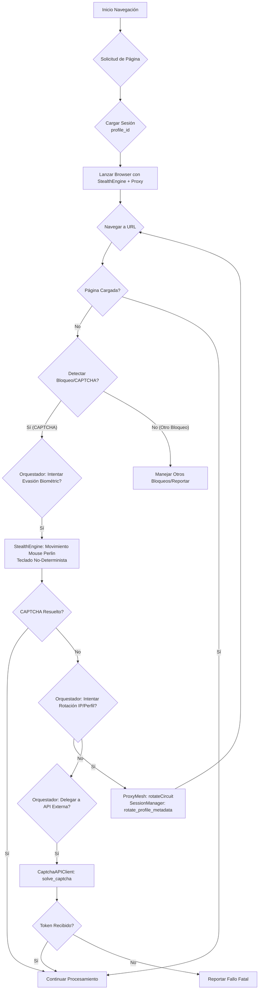

# PLAN_CAPTCHA_FASE3.md

## 🏗️ Arquitectura: Resolución CAPTCHA Avanzada (Fase 3)

### 🎯 Visión

La Fase 3 se centra en dotar a NEXUS de la capacidad de resolver CAPTCHAs complejos, como Cloudflare Turnstile y reCAPTCHA v3, mediante una orquestación inteligente de simulación biométrica, persistencia de estado de sesión y delegación a APIs de resolución externas como último recurso. El objetivo es mantener un comportamiento percibido como "humano" y evitar la detección proactiva.

### 🧩 Componentes Clave

#### 1. Módulo de Persistencia de Contexto Orgánico ([`core/src/browser/session_manager.rs`](core/src/browser/session_manager.rs) - **NUEVO**)

**Propósito:** Mantener y gestionar el estado de sesiones de navegador persistentes para imitar el comportamiento de un usuario real a lo largo del tiempo.

**Diseño:**
*   **Almacenamiento:** Base de datos SQLite (o similar embebida) para almacenar:
    *   Cookies (HTTP y del navegador)
    *   LocalStorage y SessionStorage
    *   Historial de navegación (URLs visitadas, tiempos de permanencia)
    *   Metadata del perfil (User-Agent, viewport, timezone, locale utilizados en sesiones previas)
*   **Funcionalidad:**
    *   `load_session(profile_id: String) -> BrowserContextOptions`: Carga un perfil existente y devuelve las opciones necesarias para inicializar un `BrowserContext` de Playwright.
    *   `save_session(profile_id: String, context: BrowserContext)`: Guarda el estado actual del `BrowserContext` (cookies, storage, etc.).
    *   `create_new_profile() -> String`: Genera un nuevo `profile_id` y un conjunto inicial de metadata aleatoria pero coherente (User-Agent, etc.).
    *   `rotate_profile_metadata(profile_id: String)`: Ajusta ligeramente el User-Agent, viewport u otras configuraciones para evitar fingerprinting a largo plazo sin generar un "nuevo usuario".
*   **Integración:**
    *   `nexus_browser_mcp.cjs` y `nexus_browser_tor_mcp.cjs` interactuarán con este módulo para cargar y guardar sesiones.
    *   Se pasará un `profile_id` a los MCPs para que puedan mantener la persistencia.

#### 2. Motor de Ruido Biométrico (Actualización de [`scripts/nexus_stealth_engine.cjs`](scripts/nexus_stealth_engine.cjs))

**Propósito:** Generar entradas de usuario (mouse, teclado, scroll) que imiten fielmente el comportamiento humano para evadir sistemas anti-bot que analizan la cinemática.

**Diseño (Modificaciones a `StealthEngine`):**
*   **Mouse Perlin:**
    *   `mouse_move_biometric(page: Page, x: number, y: number, duration_ms: number)`: Implementará algoritmos de ruido Perlin para generar trayectorias de mouse suaves y no lineales entre puntos. Se calcularán múltiples puntos intermedios y se moverá el cursor de forma gradual.
    *   `random_jitter(max_offset: number) -> {dx: number, dy: number}`: Función auxiliar para añadir pequeñas desviaciones aleatorias a los clicks o puntos de destino.
*   **Teclado No-Determinista:**
    *   `type_biometric(page: Page, selector: String, text: String)`: En lugar de `page.keyboard.type()`, simulará la pulsación de cada tecla con `page.keyboard.down(key)` y `page.keyboard.up(key)`.
    *   Añadirá delays aleatorios entre cada pulsación (e.g., distribución normal con media 80ms, desviación 20ms) para simular la velocidad de tecleo humana.
    *   Posibles errores tipográficos simulados y correcciones.
*   **Scroll con Inercia:**
    *   `scroll_biometric(page: Page, distance: number, duration_ms: number)`: Simulará un scroll gradual y con aceleración/desaceleración, como un usuario desplazándose con el ratón o trackpad.

#### 3. Orquestador de Resolución CAPTCHA ([`core/src/captcha/orchestrator.rs`](core/src/captcha/orchestrator.rs) - **NUEVO**)

**Propósito:** Coordinar las diferentes estrategias de evasión y resolución de CAPTCHAs, decidiendo cuándo aplicar simulación biométrica, rotación de recursos, o delegar a un servicio externo.

**Diseño:**
*   **Detección de CAPTCHA:**
    *   `detect_captcha(page: Page) -> CaptchaType`: Analiza el DOM en busca de patrones conocidos (iframes de reCAPTCHA, elementos de Turnstile, etc.).
    *   `analyze_blocking_reason(page: Page) -> BlockingReason`: Identifica si la página está bloqueada y por qué (CAPTCHA, rate limit, IP baneada).
*   **Estrategia de Resolución (`resolve_captcha`):**
    *   **Prioridad 1 (Evasión activa):** Si es un CAPTCHA simple o de baja fricción, intentar resolver con `StealthEngine` (movimiento biométrico, clicks).
    *   **Prioridad 2 (Rotación):** Si la evasión falla, o si la razón de bloqueo es IP/fingerprint:
        *   `proxy_mesh.rotateCircuit()`
        *   `session_manager.rotate_profile_metadata()`
        *   Reintentar navegación.
    *   **Prioridad 3 (Delegación a API externa):** Si la rotación falla o el CAPTCHA es de alta dificultad (e.g., `recaptcha v3 score < 0.3`), delegar a `CaptchaAPIClient`.
*   **Flujo de Control:** Un mecanismo de "circuit breaker" y reintentos con backoff exponencial.

#### 4. Cliente de API de Resolución CAPTCHA ([`core/src/captcha/api_client.rs`](core/src/captcha/api_client.rs) - **NUEVO**)

**Propósito:** Interactuar con servicios de resolución de CAPTCHA de terceros (Capsolver, 2Captcha, Anti-Captcha) de forma genérica.

**Diseño:**
*   **Interface Genérica:**
    *   `solve_recaptcha_v2(site_key: String, page_url: String) -> Result<String, Error>`
    *   `solve_recaptcha_v3(site_key: String, page_url: String, min_score: f32) -> Result<String, Error>`
    *   `solve_hcaptcha(site_key: String, page_url: String) -> Result<String, Error>`
    *   `solve_cloudflare_turnstile(site_key: String, page_url: String) -> Result<String, Error>`
*   **Configuración:** Recibe las API Keys de los servicios desde las variables de entorno.
*   **Manejo de errores:** Retry automático, manejo de timeouts y errores específicos de la API.

### 🔁 Flujo de Navegación con Fase 3



### 📁 Estructura de Archivos Nueva

```
core/
└── src/
    └── captcha/
        ├── api_client.rs     # Cliente genérico para APIs de resolución CAPTCHA
        └── orchestrator.rs   # Lógica para detección y orquestación de resolución
    └── browser/
        └── session_manager.rs # Gestión de sesiones persistentes
scripts/
└── nexus_stealth_engine.cjs  # Actualización con ruido biométrico
```

### 🔒 Consideraciones de Seguridad y Robustez

*   **Variables de Entorno:** Todas las API Keys y credenciales de servicios externos deben gestionarse mediante variables de entorno y no hardcodeadas.
*   **Logging:** Detallado para trazar decisiones del orquestador y resultados de resolución.
*   **Rate Limiting:** Implementar backoff exponencial y retries para llamadas a APIs externas y reintentos de navegación.
*   **Headless vs Headful:** Aunque se prefiere headless, el sistema debe ser capaz de lanzar un navegador headful para depuración y observación de comportamiento.
*   **Flexibilidad:** El diseño debe permitir integrar nuevos servicios de CAPTCHA o nuevas estrategias de evasión sin reescribir todo el sistema.

### 🧪 Próximos Pasos (Fase 3 - Implementación)

1.  Crear [`core/src/browser/session_manager.rs`](core/src/browser/session_manager.rs) y su integración con los MCPs.
2.  Actualizar [`scripts/nexus_stealth_engine.cjs`](scripts/nexus_stealth_engine.cjs) con funciones de ruido biométrico (movimiento de mouse Perlin, tecleo).
3.  Crear [`core/src/captcha/api_client.rs`](core/src/captcha/api_client.rs) para integrar con un servicio de resolución (e.g., Capsolver).
4.  Crear [`core/src/captcha/orchestrator.rs`](core/src/captcha/orchestrator.rs) para la lógica de decisión y flujo.
5.  Actualizar [`nexus_browser_mcp.cjs`](scripts/mcp/nexus_browser_mcp.cjs) y [`nexus_browser_tor_mcp.cjs`](scripts/mcp/nexus_browser_tor_mcp.cjs) para usar estos nuevos módulos.
