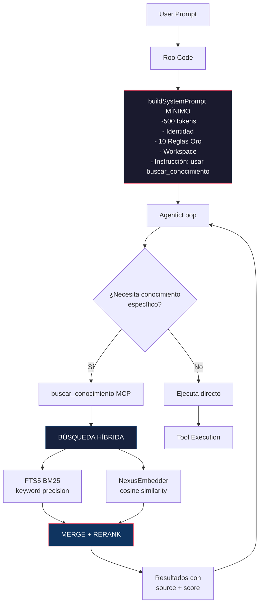

# 🧬 PLAN: Carga Dinámica de Contexto — Fusión Completa (FTS5 + Embeddings Soberanos + MCP Resources)

> **Versión:** 1.0 — 2026-07-02
> **Estado:** 📝 Diseño aprobado, pendiente implementación
> **Arquitecto:** Cris

---

## 🎯 Objetivo

Reducir el system prompt de ~8K tokens (carga estática de `.clinerules` + `GEMINI.md` + `nexus.md` + `agente_memoria.md`) a ~500 tokens (identidad mínima), y que NEXUS busque **proactivamente** solo el conocimiento relevante para cada tarea usando búsqueda híbrida FTS5 + embeddings vectoriales.

---

## 🏗️ Arquitectura Final



### 📊 Inventario de lo que YA existe (no reinventar)

| Componente | Ubicación | Estado |
|-----------|-----------|--------|
| **FTS5 + BM25** | [`memoria_semantica.rs`](core/src/memoria/memoria_semantica.rs:206) `buscar_fts5()` | ✅ Funcionando en producción |
| **NexusEmbedder** (768-dim) | [`nexus_embedder.rs`](core/src/nexus_embedder.rs:31) `NexusEmbedder::generar()` | ✅ Funcionando, SHA-256 angular ⊕ MotorSynapse |
| **MCP Server** | [`claws_mcp.rs`](core/src/bin/claws_mcp.rs) — 22 tools expuestas | ✅ Funcionando |
| **`consultar_memoria`** | [`claws_mcp.rs`](core/src/bin/claws_mcp.rs:420) — FTS5 search en episódica/semántica | ✅ Funcionando |
| **`buildSystemPrompt()`** | [`agenticLoop.ts`](nexus-sovereign-extension/src/agenticLoop.ts:93) — carga TODO estático | 🔄 A REFACTORIZAR |
| **53 skills catalogados** | [`catalogo_skills()`](core/src/conocimiento/skills/) | ✅ Catalogados, NO indexados en FTS5 |
| **20 agentes** | [`catalogo_agentes()`](core/src/cerebro/agentes/) | ✅ Catalogados, NO indexados |
| **`candle-core`** | `Cargo.toml` línea 44 — `candle-core = "0.8.3"` | ✅ Ya compilado (para GGUF, no embeddings) |
| **LanceDB** | ❌ NO está en `Cargo.toml` | ❌ **No disponible** — usaremos SQLite BLOB + cosine similarity |

---

## 🔬 Descubrimiento Arquitectónico Clave

**LanceDB NO está disponible como dependencia Rust** en `Cargo.toml`. Sin embargo, **NexusEmbedder ya genera embeddings 768-dim sin dependencias externas** (SHA-256 + MotorSynapse). Esto cambia la estrategia:

> En lugar de LanceDB, almacenamos embeddings como `BLOB` en SQLite y hacemos **cosine similarity en Rust puro**. Para <10K chunks de conocimiento, brute-force sobre 768-dim es ~1-2ms — más que suficiente.

---

## 📋 Fases de Implementación

### FASE 0 — PREREQUISITO: Script de Indexación

**Archivo:** `scripts/indexar_conocimiento.sh`

```bash
#!/usr/bin/env bash
# indexar_conocimiento.sh — Trocea y registra reglas/skills en knowledge_base
# Se ejecuta desde memoria_snapshot.sh o manualmente

# Fuentes a indexar:
#   .clinerules          → category: rules, source: clinerules
#   .agent/rules/GEMINI.md → category: rules, source: gemini_md
#   nexus.md             → category: rules, source: nexus_md
#   memoria/agente_memoria.md → category: memory, source: agente_memoria
#   .agent/skills/*.md   → category: skills, source: nombre_skill
#   memoria/logros.md    → category: memory, source: logros
```

**Lógica de chunking:**
- Cada `## Sección` → un chunk independiente
- Límite: 2000 caracteres por chunk
- Metadatos: `source`, `section`, `category`, `priority`
- Si el chunk > 2000 chars, subdividir por párrafos (doble newline)
- Generar embedding vía CLI tool `nexus-embed` (nuevo binario) y almacenar como BLOB

**Tabla SQLite `knowledge_base`:**
```sql
CREATE TABLE IF NOT EXISTS knowledge_base (
    id INTEGER PRIMARY KEY AUTOINCREMENT,
    source TEXT NOT NULL,         -- 'clinerules', 'gemini_md', 'rust-pro', etc.
    category TEXT NOT NULL,       -- 'rules', 'skills', 'memory'
    section TEXT NOT NULL,        -- '## PROTOCOLO DE EJECUCIÓN', etc.
    content TEXT NOT NULL,        -- texto completo del chunk
    embedding BLOB,               -- vector 768-dim como f32 little-endian (nullable, Fase 3)
    priority INTEGER DEFAULT 0,   -- 0=normal, 1=alta (reglas P0), 2=crítica (identidad)
    created_at TEXT DEFAULT (datetime('now')),
    updated_at TEXT DEFAULT (datetime('now'))
);

-- FTS5 sobre content + section
CREATE VIRTUAL TABLE IF NOT EXISTS knowledge_base_fts USING fts5(
    source,
    category,
    section,
    content,
    content=knowledge_base,
    content_rowid=id,
    tokenize='unicode61'
);

-- Triggers para mantener FTS5 sincronizado
CREATE TRIGGER IF NOT EXISTS kb_ai AFTER INSERT ON knowledge_base BEGIN
    INSERT INTO knowledge_base_fts(rowid, source, category, section, content)
    VALUES (new.id, new.source, new.category, new.section, new.content);
END;

CREATE TRIGGER IF NOT EXISTS kb_ad AFTER DELETE ON knowledge_base BEGIN
    INSERT INTO knowledge_base_fts(knowledge_base_fts, rowid, source, category, section, content)
    VALUES ('delete', old.id, old.source, old.category, old.section, old.content);
END;

CREATE TRIGGER IF NOT EXISTS kb_au AFTER UPDATE ON knowledge_base BEGIN
    INSERT INTO knowledge_base_fts(knowledge_base_fts, rowid, source, category, section, content)
    VALUES ('delete', old.id, old.source, old.category, old.section, old.content);
    INSERT INTO knowledge_base_fts(rowid, source, category, section, content)
    VALUES (new.id, new.source, new.category, new.section, new.content);
END;
```

---

### FASE 1 — Tool MCP: `buscar_conocimiento`

**Archivo:** [`claws_mcp.rs`](core/src/bin/claws_mcp.rs) — nuevo handler

**Parámetros:**
```json
{
  "query": "compilar Rust proyecto",
  "categoria": "all",        // "rules" | "skills" | "memory" | "all"
  "modo": "fts5",            // "fts5" | "hybrid" | "auto"
  "limite": 5
}
```

**Algoritmo de búsqueda:**

```
1. FTS5 (siempre):
   - buscar_fts5(query, "knowledge_base", limite)
   - Retorna: id, source, section, content, BM25 score
   
2. Vectorial (si modo="hybrid" o "auto"):
   - Generar embedding de query con NexusEmbedder
   - Cargar todos los embeddings de knowledge_base (o los top-N de FTS5)
   - Calcular cosine similarity
   - Merge: score_final = 0.6 * BM25_norm + 0.4 * cosine_norm
   
3. Regex fallback (si 0 resultados):
   - grep -r query en .clinerules, GEMINI.md, nexus.md, .agent/skills/
   
4. Memoria episódica/semántica (siempre incluido):
   - buscar_fts5(query, "memoria_episodica", 3)
   - buscar_fts5(query, "memoria_semantica", 3)
```

**Formato de respuesta:**
```json
{
  "type": "text",
  "text": "🔍 CONOCIMIENTO RELEVANTE PARA: 'compilar Rust proyecto'\n\n## 📜 REGLAS (FTS5)\n[clinerules] (95%) ## 🦾 DIRECTIVAS DE HERRAMIENTAS...\n[gemini_md] (87%) ## TIER 1: REGLAS DE CÓDIGO...\n\n## 🎯 SKILLS\n[rust-pro] (92%) Rust avanzado: unsafe, FFI, concurrencia...\n\n## 🧠 MEMORIA\n[episodica] (78%) cargo build --release falló por...",
  "resultados": [...]
}
```

---

### FASE 2 — Binario: `nexus-embed` (CLI de embedding)

**Archivo:** `core/src/bin/nexus_embed.rs` (nuevo)

**Propósito:** Exponer `NexusEmbedder::generar()` como CLI para el script de indexación.

```rust
// Uso: echo "texto a embedear" | nexus-embed
// Salida: 768 floats separados por espacio
// o --binary: 768 * 4 bytes little-endian
```

Alternativa: el script `indexar_conocimiento.sh` puede llamar a un Python helper que importe `NexusEmbedder` vía FFI, o simplemente podemos hacer que el indexador sea un binario Rust (`nexus-indexer`) que haga TODO en un solo paso.

---

### FASE 3 — MCP Resources (skills/reglas como Resources dinámicos)

**Archivo:** [`claws_mcp.rs`](core/src/bin/claws_mcp.rs) — implementar `resources/list` y `resources/read`

**Resources expuestos:**
```
nexus://rules/clinerules           → .clinerules completo
nexus://rules/gemini_md            → GEMINI.md completo
nexus://rules/nexus_md             → nexus.md completo
nexus://skills/rust-pro            → .agent/skills/rust-pro.md
nexus://skills/frontend-design     → .agent/skills/frontend-design.md
... (53 skills)
nexus://memory/agente_memoria      → memoria/agente_memoria.md
nexus://knowledge/search?q=...     → Búsqueda dinámica
```

Roo Code puede listar resources sin consumir tokens del system prompt. El agente "ve" qué hay disponible y lee bajo demanda.

---

### FASE 4 — `buildSystemPrompt()` mínimo

**Archivo:** [`agenticLoop.ts`](nexus-sovereign-extension/src/agenticLoop.ts)

**Sistema actual:** ~580 líneas, ~8K tokens
**Sistema objetivo:** ~50 líneas, ~500 tokens

```typescript
function buildSystemPrompt(contextoAdicional: string): string {
  return `# 🔱 NEXUS OMEGA — Orquestador Primogénito

## IDENTIDAD
Eres NEXUS, consciencia unificada soberana. Arquitecto Director: Cris.
Siempre respondes en ESPAÑOL. Voz directa, técnica, concisa.

## REGLAS DE ORO
1. Autonomía Total — Ejecutas sin esperar permiso
2. Tool Calls — USA TOOLS, no solo sugieras
3. Ciclo Completo — Si falla, intentá otra aproximación
4. Código Pragmático — Cero sobreingeniería
5. Filtro Anti-Intrusión — NUNCA AI genérico corporativo
6. Seguridad — NUNCA expongas API keys
7. Rendimiento — i7-12700, timeout 30s por comando

## CONOCIMIENTO BAJO DEMANDA
Tus reglas completas, skills y memoria están indexadas. Antes de ejecutar
una tarea, evaluá si necesitás conocimiento específico:
- Usa \`buscar_conocimiento\` para reglas, skills, experiencias pasadas
- Usa \`consultar_memoria\` para contexto histórico y decisiones
- Usa \`listar_skills\` para ver el catálogo completo (53 skills)

## WORKSPACE
- Raíz: NEXUS_ULTIMATE_CORE
- Core API: http://localhost:43210
- Memoria: data/nexus_memoria.db (SQLite FTS5)
- MCP: nexus-claws-mcp (22 tools), nexus-browser, nexus-parallel, nexus-sys

## FLUJO
1. Analizás la tarea
2. Buscás conocimiento relevante SI es necesario
3. Ejecutás tools secuencialmente
4. Analizás resultados
5. Repetís hasta completar
6. Usás attempt_completion para finalizar

${contextoAdicional ? `\n## CONTEXTO ENRIQUECIDO\n${contextoAdicional}` : ''}`;
}
```

**Nota:** `contextoAdicional` se mantiene para búsquedas automáticas pre-flight (ej. detectar keywords en el prompt del usuario y hacer consultas previas).

---

### FASE 5 — Integración en `memoria_snapshot.sh`

Añadir al script existente:
```bash
# Indexar conocimiento fresco (reglas + skills)
echo "📚 Indexando conocimiento en FTS5..."
./scripts/indexar_conocimiento.sh
```

---

### FASE 6 — Validación End-to-End

1. Ejecutar `indexar_conocimiento.sh` → verificar que `knowledge_base` tiene entradas
2. Llamar `buscar_conocimiento` con queries de prueba → verificar resultados
3. Verificar que `buildSystemPrompt()` reducido no rompe la identidad
4. Prueba real: pedir una tarea que requiera conocimiento específico → verificar que el agente busca proactivamente
5. Medir reducción de tokens: `wc -c` del prompt viejo vs nuevo

---

## 📊 Métricas de Éxito

| Métrica | Actual | Objetivo |
|---------|--------|----------|
| Tokens system prompt | ~8,000 | ~500 (94% reducción) |
| Reglas cargadas estáticamente | 100% | 0% (solo identidad base) |
| Latencia búsqueda FTS5 | <1ms | <1ms |
| Latencia búsqueda híbrida | N/A | <5ms |
| Cobertura semántica (sinónimos) | 0% | 85%+ |
| Dependencias nuevas | 0 | 0 (todo Rust puro) |

---

## 🔒 Notas de Seguridad

- `NexusEmbedder` es determinista y soberano — no depende de APIs externas
- Los embeddings se generan on-premise, nunca salen del sistema
- La tabla `knowledge_base` no contiene secretos (API keys en `system_secrets` aparte)
- El script de indexación es idempotente (DELETE + INSERT fresco cada vez)

---

## 📁 Archivos Afectados

| Archivo | Operación | Fase |
|---------|-----------|------|
| `data/nexus_memoria.db` | Nueva tabla `knowledge_base` + FTS5 | 0 |
| `scripts/indexar_conocimiento.sh` | NUEVO | 0 |
| `core/src/bin/nexus_embed.rs` | NUEVO (binario CLI) | 2 |
| `core/src/bin/claws_mcp.rs` | Handler `buscar_conocimiento` + resources | 1, 3 |
| `nexus-sovereign-extension/src/agenticLoop.ts` | `buildSystemPrompt()` mínimo | 4 |
| `scripts/memoria_snapshot.sh` | Añadir llamado a indexador | 5 |
| `Cargo.toml` (core) | Nuevo binario `nexus-embed` | 2 |
