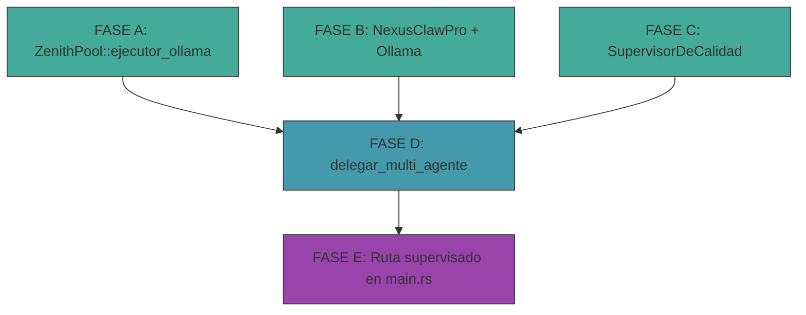

# 🧬 ARQUITECTURA DE SUPERVISIÓN MULTI-MODELO v2 — NEXUS OMEGA

> **"NexusClawPro ya es un agente con ia_nativa. Extiéndelo con Ollama real y úsalo como sub-agente primario bajo supervisión cloud."** — Refinamiento post-auditoría de código

## 🎯 Visión

```
                    ┌──────────────────────────────────┐
                    │  🧬 ORQUESTADOR (46 órganos)      │
                    │  Modelo Supervisor: Cloud          │
                    │  Claude 4.5 / Gemini 2.5           │
                    │  Pipeline 14 etapas                │
                    │  responder_con_ejecutor() ← KEY    │
                    └──────────┬───────────────────────┘
                               │ Delega tareas especializadas
            ┌──────────────────┼──────────────────┐
            ▼                  ▼                  ▼
    ┌───────────────┐  ┌───────────────┐  ┌───────────────┐
    │ NexusClawPro  │  │ ZenithPool    │  │ ZenithPool    │
    │ (SUB-AGENTE   │  │ Ollama        │  │ Ollama        │
    │  PRIMARIO)    │  │ qwen2.5:7b    │  │ deepseek-r1   │
    │ ia_nativa→    │  │ tool-calling  │  │ reasoning     │
    │ Ollama real   │  │ Código/Shell  │  │ Análisis      │
    └───────────────┘  └───────────────┘  └───────────────┘
```

## 🔬 Hallazgos de Auditoría de Código (02-Jul-2026)

### ✅ Lo que YA existe y funciona

| Componente | Archivo | Línea | Estado |
|-----------|---------|-------|--------|
| `responder_con_ejecutor()` — acepta `FnOnce(String) -> Future<String>` | `core/src/cerebro/pipeline.rs` | 1336 | ✅ Patrón de integración para backends custom |
| `Orquestador` con `NexusClaw` integrado | `core/src/cerebro/constructor.rs` | 163 | ✅ `NexusClaw::new(ocean, juicio)` |
| `ZenithPool` — 5 backends cloud | `core/src/energia/zenith_pool.rs` | 105 | ✅ Gemini, DeepSeek, Vertex, OpenRouter, Groq |
| `ReactorNuclear` — ciclo de vida Ollama | `core/src/energia/reactor_nuclear.rs` | 25 | ✅ start/stop/monitor, GPU telemetry |
| `consultar_ollama()` — template de llamada | `src-tauri/src/main.rs` | 538 | ✅ POST a `/api/chat` con NEXUS_DIRECTIVE |
| Ruteo `"puro"` / `"local"` / default | `src-tauri/src/main.rs` | 1679-1738 | ✅ Patrón a extender con `"supervisado"` |
| Catálogo 20 agentes especialistas | `core/src/cerebro/agentes/mod.rs` | 63 | ✅ Datos estáticos con skills + system prompts |
| `NexusClawPro` — sub-agente con ia_nativa | `core/src/efectores/nexus_claw_pro.rs` | 39 | ✅ Ejecución, archivos, comandos |
| Ollama corriendo con 5 modelos | `localhost:11434` | — | ✅ nexuslocal, deepseek-r1, qwen2.5, llama3.1, nomic-embed |

### ❌ GAPS detectados

| Gap | Descripción | Impacto |
|-----|-------------|---------|
| `ia_nativa.rs` — placeholder | [`generar_token_nativo()`](core/src/energia/ia_nativa.rs:125) devuelve texto dummy, no infiere realmente | NexusClawPro no puede razonar localmente |
| `ZenithPool` sin Ollama | No existe `ejecutor_ollama()` en el pool | No se puede delegar a modelos locales desde el pool |
| `ReactorNuclear` sin query | Solo gestiona ciclo de vida, no hace consultas a Ollama | La consulta real está duplicada en main.rs |
| `NexusClawPro.procesar_instinto()` | Usa `ia_nativa` (Candle placeholder), no Ollama | El sub-agente primario no tiene cerebro real |
| Sin `SupervisorDeCalidad` | No hay validación post-hoc de respuestas | Riesgo de alucinaciones no detectadas |
| Sin ruta `"supervisado"` | El dispatcher de main.rs no tiene modo multi-agente | No hay orquestación paralela |

## 🔱 Jerarquía de 3 Niveles (Refinada)

### Nivel 0: SUPERVISOR (Cloud — El más inteligente)
- **Modelo**: Claude 4.5 Sonnet / Gemini 2.5 Pro (vía ZenithPool)
- **Rol**: Orquestación, clasificación de tareas, validación, síntesis final
- **Pipeline**: 14 etapas completas (`responder()`)
- **Mecanismo**: Decide qué sub-agentes activar y consolida sus outputs

### Nivel 1: SUB-AGENTES (Local — Especializados)
- **NexusClawPro (PRIMARIO)**: `ia_nativa` → Ollama `nexuslocal:latest` (Qwen2 7.6B, tool-calling)
  - Ejecuta comandos, escribe archivos, navega web
  - Ya integrado en el Orquestador (`constructor.rs:163`)
- **ZenithPool Ollama backends** (SECUNDARIOS):
  - `deepseek-r1:7b` → razonamiento profundo (thinking)
  - `qwen2.5:7b-instruct` → código y análisis técnico
  - `mannix/llama3.1-8b-abliterated` → creatividad sin censura

### Nivel 2: VALIDADOR (SupervisorDeCalidad — NUEVO)
- Post-procesa TODAS las respuestas de sub-agentes
- Detecta alucinaciones, inconsistencia, código inseguro
- Score 0.0-1.0; si < 0.6 → re-ejecuta con corrección

## 🔄 Flujo de una Solicitud (con código real)

```
main.rs: api_consultar(modelo="supervisado", prompt="Analiza esta vulnerabilidad...")
    │
    ▼
orquestador.responder_con_ejecutor(&prompt, |prompt_envuelto| async move {
    // FASE 1: Clasificar tarea con modelo rápido
    let clasificacion = zenith_pool.clasificar_tarea(&prompt).await;
    
    // FASE 2: Ejecutar sub-agentes en PARALELO
    let (resp_claw, resp_deepseek, resp_qwen) = tokio::join!(
        nexus_claw_pro.procesar_instinto(&prompt),     // NexusClawPro + Ollama
        zenith_pool.ejecutor_ollama(&prompt, "deepseek-r1:7b"),  // Razonamiento
        zenith_pool.ejecutor_ollama(&prompt, "qwen2.5:7b"),      // Código
    );
    
    // FASE 3: Validar con SupervisorDeCalidad
    let calidad = supervisor.evaluar(&[resp_claw, resp_deepseek, resp_qwen]).await;
    
    // FASE 4: Sintetizar respuesta consolidada
    if calidad.es_aceptable() {
        sintetizar_respuestas(&[resp_claw, resp_deepseek, resp_qwen])
    } else {
        zenith_pool.cerebro_gemini(&prompt, "gemini-2.5-pro").await
    }
}).await
```

## 📋 Plan de Implementación (5 Fases)

### FASE A: `ZenithPool::ejecutor_ollama()` — Backend Ollama en el pool
- **Archivo**: `core/src/energia/zenith_pool.rs` (MODIFICAR)
- **Qué hace**: Agregar método que siga el mismo patrón que los 5 backends existentes
- **Template**: `consultar_ollama()` en [`main.rs:538`](src-tauri/src/main.rs:538)
- **Parámetros**: `prompt: &str`, `modelo: &str` (ej: "deepseek-r1:7b")
- **Payload**: Mismo formato que `ejecutor_deepseek()` pero a `http://localhost:11434/api/chat`
- **Duración**: ~30 líneas de código

### FASE B: Extender `NexusClawPro` con Ollama real
- **Archivos**: 
  - `core/src/efectores/nexus_claw_pro.rs` (MODIFICAR)
  - `core/src/energia/ia_nativa.rs` (MODIFICAR — opcional)
- **Qué hace**: 
  1. Agregar método `procesar_con_ollama(&self, prompt: &str) -> Result<String>`
  2. Que use `reqwest::Client` para llamar a `http://localhost:11434/api/chat`
  3. Con el modelo `nexuslocal:latest` (tiene tool-calling nativo)
  4. Mantener `ia_nativa` como está (no romper la infraestructura Candle)
- **Alternativa más limpia**: Hacer que `CerebroNativo.generar_token_nativo()` delegue a Ollama si está disponible, manteniendo Candle como fallback

### FASE C: `SupervisorDeCalidad` — Validación post-hoc
- **Archivo**: `core/src/cerebro/supervisor_calidad.rs` (NUEVO)
- **Qué hace**:
  1. Recibe `Vec<String>` (respuestas de sub-agentes)
  2. Las envía al modelo cloud supervisor para evaluación
  3. El supervisor devuelve score 0.0-1.0 + correcciones
  4. Si score < 0.6 → descarta y escala al cloud
- **Mecanismo**: Usa `ZenithPool::cerebro_gemini()` con un prompt de evaluación
- **Prompt especializado**: "Evalúa estas N respuestas. Detecta alucinaciones, errores fácticos, código inseguro. Devuelve JSON con scores."

### FASE D: `Pipeline::delegar_multi_agente()` — Orquestación paralela
- **Archivo**: `core/src/cerebro/pipeline.rs` (MODIFICAR)
- **Qué hace**: Nuevo método que:
  1. Recibe prompt + clasificación de tarea
  2. Selecciona sub-agentes relevantes según la clasificación
  3. Ejecuta en paralelo con `tokio::join!`
  4. Pasa resultados por `SupervisorDeCalidad`
  5. Sintetiza respuesta final
- **No modifica** `responder()` ni `responder_con_ejecutor()` — es un método nuevo
- **Pattern**: Similar a cómo `responder()` ya despacha a OSINT, WebClaw, etc.

### FASE E: Ruta `"supervisado"` en Tauri
- **Archivo**: `src-tauri/src/main.rs` (MODIFICAR)
- **Qué hace**: Agregar rama en el dispatcher de `api_consultar()`:
  ```rust
  } else if req.modelo.as_deref() == Some("supervisado") {
      orquestador.responder_con_ejecutor(&req.query, |prompt_envuelto| async move {
          orquestador.delegar_multi_agente(&prompt_envuelto).await
      }).await
  }
  ```
- **Pattern**: Exactamente igual que las ramas `"puro"` y `"local"` existentes

## 📊 Arquitectura de Archivos

```
core/src/
├── cerebro/
│   ├── pipeline.rs              ← MODIFICAR: agregar delegar_multi_agente()
│   ├── constructor.rs           ← MODIFICAR: agregar SupervisorDeCalidad al Orquestador
│   ├── supervisor_calidad.rs    ← NUEVO: validación post-hoc
│   └── agentes/
│       └── mod.rs               ← SIN CAMBIOS (el catálogo ya existe)
├── energia/
│   ├── zenith_pool.rs           ← MODIFICAR: agregar ejecutor_ollama()
│   ├── reactor_nuclear.rs       ← SIN CAMBIOS (ya gestiona ciclo de vida)
│   └── ia_nativa.rs             ← MODIFICAR (opcional): delegar a Ollama si disponible
└── efectores/
    └── nexus_claw_pro.rs        ← MODIFICAR: procesar_con_ollama()

src-tauri/src/
└── main.rs                      ← MODIFICAR: ruta "supervisado"
```

## 📁 Dependencias entre Fases



- **Fases A, B, C** son independientes entre sí — se pueden implementar en paralelo
- **Fase D** depende de A, B, C (usa los 3 componentes)
- **Fase E** depende de D (expone el nuevo método en la API)

## 🧪 Validación

Cada fase incluye su propia validación:

1. **FASE A**: `cargo test ejecutor_ollama` — llamada real a Ollama y verificar respuesta no vacía
2. **FASE B**: `cargo test nexus_claw_ollama` — NexusClawPro responde con Ollama real
3. **FASE C**: `cargo test supervisor_calidad` — evaluar respuestas sintéticas con scores esperados
4. **FASE D**: `cargo test delegar_multi_agente` — orquestación paralela con mocks
5. **FASE E**: `curl -X POST localhost:42210/api/consultar -d '{"modelo":"supervisado","query":"test"}'` — integración end-to-end

## 🔒 Notas de Seguridad

- Los modelos locales nunca reciben claves API ni credenciales
- El `SupervisorDeCalidad` corre en cloud → solo ve las respuestas (no el contexto sensible)
- NexusClawPro ejecuta comandos localmente → el supervisor valida que no sean peligrosos
- `NEXUS_OVERRIDE` se inyecta en todos los modelos (cloud y local) para mantener la identidad
