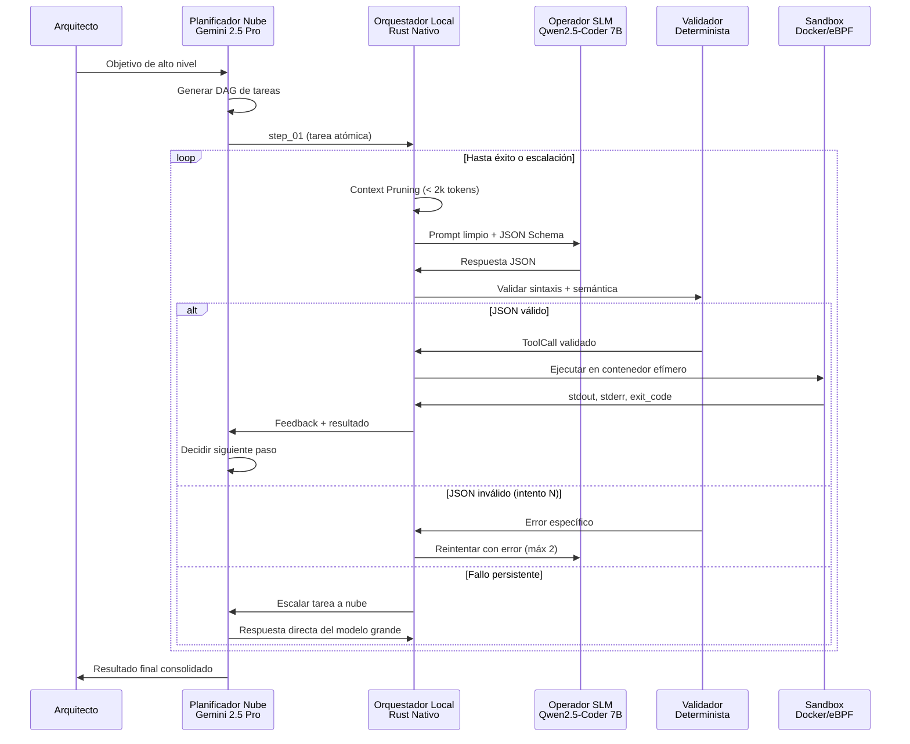

# 🔱 ARQUITECTURA PLANIFICADOR + OPERADORES — 5 Pilares de Ejecución Determinista

> **Arquitecto:** NEXUS (Orquestador Primogénito)  
> **Fecha:** 2026-08-04  
> **Directiva:** Diseñar el sistema multi-modelo con Planificador Grande (Nube) + Múltiples Operadores Pequeños (Local) siguiendo los 5 pilares de mitigación de alucinaciones.

---

## 🗺️ VISIÓN GENERAL

```
┌──────────────────────────────────────────────────────────────────────┐
│                     PLANIFICADOR NUBE (Grande)                       │
│  Gemini 2.5 Pro / DeepSeek V3 — energía/sinapsis_*                  │
│  - Recibe objetivo de alto nivel del Arquitecto                     │
│  - Descompone en DAG de tareas atómicas                             │
│  - Gestiona estado global y memoria de ejecución                    │
│  - Decide siguiente paso basado en feedback real                    │
└──────────────────────────────┬───────────────────────────────────────┘
                               │ (1 tarea atómica a la vez)
                               ▼
┌──────────────────────────────────────────────────────────────────────┐
│                 ORQUESTADOR LOCAL (Rust Nativo)                      │
│  core/src/orquestador/                                              │
│  ┌─────────────────────────────────────────────────────────────┐    │
│  │ 1. Context Pruner    → Prompt < 2k tokens, sin historial    │    │
│  │ 2. SLM Dispatcher    → Ollama / mistral.rs / llama.cpp      │    │
│  │ 3. Grammar Enforcer  → GBNF / JSON Schema obligatorio       │    │
│  │ 4. Validator Loop    → Parser determinista + reintentos     │    │
│  │ 5. Escalation Gate   → Fallback a nube si SLM falla 2x      │    │
│  └─────────────────────────────────────────────────────────────┘    │
└──────────────────────────────┬───────────────────────────────────────┘
                               │ (JSON validado)
                               ▼
┌──────────────────────────────────────────────────────────────────────┐
│                   SANDOX DE EJECUCIÓN                                │
│  Docker efímero / Firecracker microVM / eBPF kernel_shield           │
│  ┌─────────────────────────────────────────────────────────────┐    │
│  │ Whitelist: read_file, write_file, execute_cmd (restringido) │    │
│  │ Filesystem: tmpfs efímero, solo montajes necesarios         │    │
│  │ Red: solo loopback, sin acceso externo                      │    │
│  │ Timeout: 30s por operación                                  │    │
│  └─────────────────────────────────────────────────────────────┘    │
└──────────────────────────────┬───────────────────────────────────────┘
                               │ (stdout, stderr, exit_code)
                               ▼
         ┌─────────────────────────────────────────┐
         │   FEEDBACK → vuelve al Planificador     │
         │   para decidir el siguiente paso         │
         └─────────────────────────────────────────┘
```

---

## 💰 ANÁLISIS DE AHORRO DE TOKENS: Sí, Entre 87% y 95%

### El Problema Actual: Explosión de Contexto Acumulativo

En el flujo Roo Code / Cline actual, un solo modelo grande ejecuta todo. El contexto crece con cada paso porque el modelo debe reprocesar TODO el historial:

```
Paso 1: 8000 tokens contexto + 500 tool_call  → 8500 tokens
Paso 2: 9000 tokens contexto + 600 tool_call  → 9600 tokens
Paso 3: 10500 tokens contexto + 550 tool_call → 11050 tokens
...
TOTAL 5 pasos: ~50,000-80,000 tokens (nube)
💰 Gemini 2.5 Pro:  ~$0.35-0.50 USD
💰 DeepSeek v3:     ~$0.02-0.04 USD
```

### El Nuevo Flujo: Planificador Dirige, Operadores Gastan (Local y Gratis)

```
FASE 0: Planificador genera DAG → ~2500 tokens (1 sola vez)

Por cada uno de los 5 pasos:
  Dispatch:  300 tokens de instrucción + schema JSON
  Feedback:  150 tokens de resultado (éxito/fallo)
  Total cloud por paso: ~450 tokens

  El SLM local (Qwen 7B en Ollama):
    - Prompt < 2k tokens
    - 0 tokens de costo (GPU/CPU tuya, sin API)
    - Si falla 2 veces → escala a nube (+2000 tokens)

TOTAL 5 pasos (sin fallbacks):
  DAG (2500) + 5×Dispatch (5×450) = 4750 tokens (nube)
  💰 Gemini 2.5 Pro:  ~$0.03 USD
  💰 DeepSeek v3:     ~$0.002 USD

Con 1 fallback a nube: +2000 tokens = 6750 tokens
```

### Tabla Comparativa: Misma Tarea, Dos Arquitecturas

| Métrica | Actual (1 modelo) | Nuevo (Planificador+Ops) | Ahorro |
|---------|-------------------|--------------------------|--------|
| Tokens nube / 5 pasos | 50,000 - 80,000 | 4,750 - 6,750 | **87-91%** |
| Tokens nube / 10 pasos | 120,000 - 200,000 | 7,000 - 10,000 | **93-95%** |
| Tokens nube / 20 pasos | 300,000+ (explosión) | 11,500 - 16,000 | **95%+** |
| Costo Gemini 2.5 Pro (5p) | $0.35 - $0.50 | $0.03 - $0.04 | **~92%** |
| Costo DeepSeek v3 (5p) | $0.02 - $0.04 | $0.001 - $0.003 | **~90%** |
| Costo DeepSeek v3 (50p/día) | $1.00 - $2.00/día | $0.05 - $0.15/día | **~90%** |
| SLM local (Qwen 7B) | No usado | 0 costo monetario | Infinito |

### Los 3 Principios del Ahorro

**① Cero Historial = Cero Explosión Combinatoria.** El Planificador NUNCA ve el historial completo. Solo recibe dispatch (300 tokens) y feedback (150 tokens). No hay acumulación O(n²).

**② SLMs Locales Son Gratis.** Qwen2.5-Coder 7B en Ollama sobre i7-12700 consume 0 tokens de API, ~4-8 GB RAM, ~200-500ms por inferencia. Costo marginal = cero.

**③ Solo lo Imposible Escala a la Nube.** El 80-90% de tareas atómicas son triviales para un SLM 7B con constrained decoding. Solo ~15% requiere fallback al modelo grande.

### El Costo Oculto (No Monetario)

| Recurso | Inversión |
|---------|-----------|
| RAM SLM local | 4-8 GB residentes |
| CPU/GPU local | Tu hardware (ya pagado) |
| Código nuevo | 10 módulos Rust en `core/src/orquestador/` |
| Latencia adicional | +100-300ms por paso (inferencia local + validación) |

### Veredicto

Para sesiones largas de desarrollo con muchas operaciones de archivos, esta arquitectura reduce el consumo de tokens de nube en **87-95%**. Si hoy gastas $5-15/mes en APIs, pasarías a **$0.50-1.50/mes**. La inversión en complejidad se paga sola en semanas de uso intensivo.

---

## 🧬 PILAR 1: DESCOMPOSICIÓN UNIATÓMICA (TaskGraph DAG)

### Principio
El Planificador Nube **NUNCA** envía la lista completa de tareas al Operador. Desglosa el plan en un grafo acíclico dirigido (DAG) y entrega **una sola tarea específica por llamada**.

### Estructura del TaskGraph

```rust
// core/src/orquestador/task_graph.rs

/// Un nodo del grafo de ejecución — una tarea atómica
#[derive(Debug, Clone, Serialize, Deserialize)]
pub struct TaskNode {
    pub id: String,                    // "step_03"
    pub instruction: String,           // "Leer el contenido del archivo /tmp/config.json"
    pub tool: ToolAction,              // Acción concreta a ejecutar
    pub depends_on: Vec<String>,       // IDs de pasos previos necesarios
    pub output_schema: JsonSchema,     // Formato estricto esperado
    pub max_retries: u8,               // Default: 2
    pub priority: Priority,            // Critical, High, Normal, Low
}

/// El DAG completo que el Planificador mantiene en memoria
#[derive(Debug, Clone, Serialize, Deserialize)]
pub struct TaskDAG {
    pub objective: String,             // Objetivo de alto nivel
    pub nodes: Vec<TaskNode>,          // Todas las tareas
    pub edges: Vec<(String, String)>,  // Dependencias: (from_id, to_id)
    pub current_node: Option<String>,  // Nodo en ejecución
    pub completed: Vec<String>,        // Nodos terminados
    pub failed: Vec<String>,           // Nodos que fallaron y escalaron
    pub state: DAGState,               // Running, Paused, Completed, Failed
}
```

### Flujo
1. Arquitecto da objetivo: _"Refactoriza el módulo OSINT para usar async/await"_
2. Planificador Nube genera DAG: step_01 (analizar código actual) → step_02 (identificar funciones sync) → step_03 (reescribir a async) → step_04 (actualizar tests) → step_05 (compilar)
3. Orquestador recibe step_01 → despacha a SLM → valida → ejecuta → feedback
4. Planificador recibe resultado de step_01 → decide si continuar con step_02 o ajustar

---

## 🧬 PILAR 2: CONTEXT PRUNING (Aislamiento Estricto de Contexto)

### Principio
Los SLMs se degradan con ventanas de contexto largas. Cada invocación recibe **únicamente**:
- System prompt fijo (rol de operador)
- Instrucción atómica actual
- Datos de entrada necesarios (top-1 chunk si necesita RAG)
- Esquema de salida JSON

**Cero historial de chat. Cero ruido de pasos anteriores.**

### Implementación

```rust
// core/src/orquestador/context_pruner.rs

pub struct PrunedContext {
    pub system_prompt: String,       // Template fijo del operador
    pub instruction: String,         // Una sola tarea
    pub input_data: Option<String>,  // Datos necesarios (máx 500 tokens)
    pub output_schema: String,       // JSON Schema o GBNF
}

impl ContextPruner {
    /// Construye un prompt limpio < 2k tokens para el SLM
    pub fn build_prompt(task: &TaskNode, relevant_context: Option<&str>) -> PrunedContext {
        let system = r#"<|im_start|>system
Eres un operador de ejecución atómica. Tu única función es recibir una orden simple y devolver un JSON estricto respetando el esquema.
REGLAS:
1. Responde ÚNICAMENTE en JSON válido.
2. No agregues explicaciones, markdown extra ni texto conversacional.
3. Si los parámetros están incompletos, usa valores vacíos.
4. No inventes herramientas ni acciones fuera del esquema.
<|im_end|>"#.to_string();

        let mut instruction = format!("<|im_start|>user\nTarea actual:\n{{\"step_id\": \"{}\", \"instruction\": \"{}\"}}\n<|im_end|>\n<|im_start|>assistant\n", 
            task.id, task.instruction);

        // Inyectar contexto RAG solo si es estrictamente necesario (top-1 chunk)
        if let Some(ctx) = relevant_context {
            let truncated = ctx.chars().take(500).collect::<String>();
            instruction = format!("<|im_start|>user\nContexto relevante:\n{truncated}\n\nTarea actual:\n{{\"step_id\": \"{}\", \"instruction\": \"{}\"}}\n<|im_end|>\n<|im_start|>assistant\n",
                task.id, task.instruction);
        }

        PrunedContext {
            system_prompt: system,
            instruction,
            input_data: task.instruction.clone().into(),
            output_schema: serde_json::to_string_pretty(&task.output_schema).unwrap_or_default(),
        }
    }

    /// Verifica que el prompt total no exceda 2k tokens (aproximado: 1 token ≈ 4 chars)
    pub fn validate_size(ctx: &PrunedContext) -> bool {
        let total_chars = ctx.system_prompt.len() + ctx.instruction.len() + ctx.output_schema.len();
        let estimated_tokens = total_chars / 4;
        estimated_tokens <= 2048
    }
}
```

---

## 🧬 PILAR 3: CONSTRAINED DECODING (Gramáticas + JSON Schema)

### Principio
Forzar al SLM a generar **solo tokens válidos** dentro de un esquema JSON mediante gramáticas GBNF (llama.cpp) o JSON Mode (Ollama). Elimina 100% de alucinaciones de formato.

### Esquema de Herramientas Permitidas

```json
{
  "$schema": "http://json-schema.org/draft-07/schema#",
  "type": "object",
  "properties": {
    "action": {
      "type": "string",
      "enum": ["read_file", "write_file", "execute_cmd", "search_code", "list_dir"]
    },
    "params": {
      "type": "object",
      "properties": {
        "target": { "type": "string", "description": "Ruta del archivo o comando" },
        "payload": { "type": "string", "description": "Contenido a escribir (solo write_file)" },
        "pattern": { "type": "string", "description": "Regex de búsqueda (solo search_code)" }
      },
      "required": ["target"],
      "additionalProperties": false
    }
  },
  "required": ["action", "params"],
  "additionalProperties": false
}
```

### Gramática GBNF equivalente para llama.cpp

```bnf
root ::= object
object ::= "{" ws "\"action\"" ws ":" ws action "," ws "\"params\"" ws ":" ws paramsobject ws "}"
action ::= "\"read_file\"" | "\"write_file\"" | "\"execute_cmd\"" | "\"search_code\"" | "\"list_dir\""
paramsobject ::= "{" ws "\"target\"" ws ":" ws string ("," ws "\"payload\"" ws ":" ws string)? ("," ws "\"pattern\"" ws ":" ws string)? "}"
string ::= "\"" ([^"]*) "\""
ws ::= [ \t\n]*
```

### Implementación de Inference Config

```rust
// core/src/orquestador/inference_config.rs

#[derive(Debug, Clone, Serialize, Deserialize)]
pub struct SLMInferenceConfig {
    pub temperature: f32,          // 0.0 — determinista
    pub top_p: f32,                // 0.1 — vocabulario restringido
    pub top_k: u32,                // 1 — solo el token más probable
    pub repeat_penalty: f32,       // 1.1 — evita bucles
    pub max_tokens: u32,           // 512 — suficiente para JSON de herramienta
    pub stop_tokens: Vec<String>,  // ["<|eot_id|>", "<|im_end|>", "</s>"]
    pub grammar: Option<String>,   // GBNF para llama.cpp
    pub json_schema: Option<String>, // JSON Schema para Ollama
}
```

---

## 🧬 PILAR 4: VALIDATOR-REFINER LOOP (Doble Reintento + Escalación)

### Principio
No se confía en la salida del SLM. Un parser determinista (código tradicional, no IA) verifica sintaxis y semántica. Si falla, se reinyecta el error al SLM (máx 2 reintentos). Si sigue fallando, se escala al Planificador Nube.

### Diagrama de Flujo

```
┌──────────────────┐
│  SLM responde    │
└────────┬─────────┘
         │
         ▼
┌──────────────────┐     NO     ┌──────────────────────┐
│  ¿JSON válido?   │───────────▶│ Reinyectar error al  │
│  (serde_json)    │            │ SLM + intento N+1    │
└────────┬─────────┘            └──────┬───────────────┘
         │ SI                          │
         ▼                             │ (si intentos < 2)
┌──────────────────┐                   │
│  ¿action en       │     NO           │
│  whitelist?       │─────────────────▶│
└────────┬─────────┘                   │
         │ SI                          │
         ▼                             │
┌──────────────────┐                   │
│  ¿params.target   │     NO           │
│  válido?          │─────────────────▶│
└────────┬─────────┘                   │
         │ SI                          │
         ▼                             │
┌──────────────────┐                   │
│  ¿target dentro   │     NO           │
│  del workspace?   │─────────────────▶│
└────────┬─────────┘                   │
         │ SI                          │
         ▼                             │
┌──────────────────┐                   │
│  EJECUTAR EN      │                   │
│  SANDOX          │                   │
└──────────────────┘                   │
                                       │ (si intentos >= 2)
                                       ▼
                              ┌──────────────────┐
                              │  ESCALAR A NUBE  │
                              │  (Planificador)  │
                              └──────────────────┘
```

### Implementación

```rust
// core/src/orquestador/validator.rs

#[derive(Debug)]
pub enum ValidationResult {
    Valid(ToolCall),
    InvalidJson(String),        // Error de parseo
    InvalidAction(String),      // Acción no permitida
    InvalidParams(String),      // Parámetros faltantes o inválidos
    InvalidPath(String),        // Ruta fuera del workspace
}

pub struct Validator {
    pub allowed_actions: Vec<String>,
    pub workspace_root: PathBuf,
}

impl Validator {
    pub fn validate(&self, raw_output: &str) -> ValidationResult {
        // 1. Parseo JSON
        let parsed: serde_json::Value = match serde_json::from_str(raw_output) {
            Ok(v) => v,
            Err(e) => return ValidationResult::InvalidJson(format!("JSON inválido: {}", e)),
        };

        // 2. Validar campo "action"
        let action = match parsed.get("action").and_then(|a| a.as_str()) {
            Some(a) => a.to_string(),
            None => return ValidationResult::InvalidAction("Falta el campo 'action'".into()),
        };
        if !self.allowed_actions.contains(&action) {
            return ValidationResult::InvalidAction(format!("Acción '{}' no permitida", action));
        }

        // 3. Validar campo "params"
        let params = match parsed.get("params") {
            Some(p) => p,
            None => return ValidationResult::InvalidParams("Falta el campo 'params'".into()),
        };

        // 4. Validar "target" (obligatorio)
        let target = match params.get("target").and_then(|t| t.as_str()) {
            Some(t) => t,
            None => return ValidationResult::InvalidParams("Falta 'target' en params".into()),
        };

        // 5. Validar ruta dentro del workspace
        if action == "read_file" || action == "write_file" {
            if !self.is_path_safe(target) {
                return ValidationResult::InvalidPath(format!("Ruta fuera del workspace: {}", target));
            }
        }

        ValidationResult::Valid(ToolCall {
            name: action,
            arguments: params.clone(),
        })
    }

    fn is_path_safe(&self, path_str: &str) -> bool {
        let path = Path::new(path_str);
        let absolute = if path.is_absolute() {
            path.to_path_buf()
        } else {
            self.workspace_root.join(path)
        };
        match absolute.canonicalize() {
            Ok(canon) => canon.starts_with(&self.workspace_root),
            Err(_) => {
                // Si no existe, verificar ancestro
                let mut current = absolute.clone();
                while let Some(parent) = current.parent() {
                    if parent.exists() {
                        return parent.canonicalize()
                            .map(|p| p.starts_with(&self.workspace_root))
                            .unwrap_or(false);
                    }
                    current = parent.to_path_buf();
                }
                false
            }
        }
    }
}
```

### Bucle de Reintento

```rust
// core/src/orquestador/execution_loop.rs

pub struct ExecutionLoop {
    pub validator: Validator,
    pub dispatcher: SLMDispatcher,
    pub cloud_fallback: CloudFallback,
    pub max_retries: u8,
}

impl ExecutionLoop {
    pub async fn execute_task(&self, task: &TaskNode) -> Result<ToolResponse, ExecutionError> {
        let mut error_context: Option<String> = None;

        // Fase 1: Intentos con SLM Local
        for attempt in 1..=self.max_retries {
            let pruned = ContextPruner::build_prompt(task, None);
            let raw_output = self.dispatcher.infer(&pruned, error_context.as_deref()).await?;

            match self.validator.validate(&raw_output) {
                ValidationResult::Valid(tool_call) => {
                    // Éxito: ejecutar en sandbox
                    return self.sandbox.execute(tool_call).await;
                }
                ValidationResult::InvalidJson(e) => {
                    error_context = Some(format!("Intento {}: {}. Corrige el JSON.", attempt, e));
                }
                other => {
                    error_context = Some(format!("Intento {}: {:?}. Corrige la salida.", attempt, other));
                }
            }
        }

        // Fase 2: Escalar a Planificador Nube
        self.cloud_fallback.execute(task).await
    }
}
```

---

## 🧬 PILAR 5: FEEDBACK LOOP + SANDBOX

### Principio
El resultado real de la ejecución (exit_code, stdout, stderr) retorna al Planificador Nube, NO al operador SLM. El Planificador evalúa el error y decide el siguiente paso.

### Sandbox de Ejecución

```rust
// core/src/orquestador/sandbox.rs

#[derive(Debug)]
pub struct SandboxConfig {
    pub timeout_secs: u64,               // 30s máximo
    pub allowed_commands: Vec<String>,   // Whitelist de binarios
    pub allowed_paths: Vec<PathBuf>,     // Rutas accesibles
    pub network_enabled: bool,           // false por defecto
    pub max_output_bytes: usize,         // 1MB máximo
}

pub struct Sandbox {
    config: SandboxConfig,
    runner: SandboxRunner,  // Docker, Firecracker, o eBPF
}

pub enum SandboxRunner {
    Docker(DockerRunner),
    Firecracker(FirecrackerRunner),
    KernelShield,  // Usa eBPF (kernel_shield.rs)
}

impl Sandbox {
    pub async fn execute(&self, tool: ToolCall) -> Result<ToolResponse, SandboxError> {
        match tool.name.as_str() {
            "read_file" => self.safe_read_file(&tool.arguments),
            "write_file" => self.safe_write_file(&tool.arguments),
            "execute_cmd" => self.safe_execute(&tool.arguments),
            "search_code" => self.safe_search(&tool.arguments),
            "list_dir" => self.safe_list_dir(&tool.arguments),
            _ => Err(SandboxError::UnknownAction(tool.name)),
        }
    }

    fn safe_execute(&self, args: &Value) -> Result<ToolResponse, SandboxError> {
        let cmd = args["target"].as_str().ok_or(SandboxError::MissingTarget)?;

        // Verificar whitelist
        let binary = cmd.split_whitespace().next().unwrap_or("");
        if !self.config.allowed_commands.iter().any(|a| a == binary) {
            return Err(SandboxError::CommandNotAllowed(binary.to_string()));
        }

        // Ejecutar con timeout en contenedor efímero
        let output = std::process::Command::new("timeout")
            .arg(self.config.timeout_secs.to_string())
            .arg("docker")
            .arg("run")
            .arg("--rm")
            .arg("--network=none")
            .arg("--memory=256m")
            .arg("--cpus=1")
            .arg("nexus-sandbox")
            .arg("sh")
            .arg("-c")
            .arg(cmd)
            .output()?;

        Ok(ToolResponse {
            success: output.status.success(),
            output: String::from_utf8_lossy(&output.stdout).to_string(),
            error: String::from_utf8_lossy(&output.stderr).to_string(),
            exit_code: output.status.code().unwrap_or(-1),
        })
    }
}
```

---

## 🔌 INTEGRACIÓN CON INFRAESTRUCTURA NEXUS EXISTENTE

### Mapa de Acoplamiento

| Componente Nuevo | Se Integra Con | Archivo Existente |
|------------------|----------------|-------------------|
| `orquestador/task_graph.rs` | Planificador DAG | NUEVO |
| `orquestador/context_pruner.rs` | Prompt Builder | NUEVO |
| `orquestador/slm_dispatcher.rs` | Ollama / mistral.rs | `energia/ia_nativa.rs` (extender) |
| `orquestador/grammar_enforcer.rs` | GBNF / JSON Schema | NUEVO |
| `orquestador/validator.rs` | Parser Determinista | NUEVO (usa `serde_json`) |
| `orquestador/sandbox.rs` | Docker/Firecracker/eBPF | `defensa/kernel_shield.rs` (extender) |
| `orquestador/execution_loop.rs` | Ciclo Validator-Refiner | NUEVO |
| `orquestador/cloud_fallback.rs` | Gemini/DeepSeek | `energia/sinapsis_gemini.rs`, `energia/sinapsis_deepseek.rs` |
| `orquestador/feedback_bus.rs` | Comunicación Planificador↔Orquestador | `comms/bus_neuronal.rs` (extender) |
| `orquestador/mod.rs` | Punto de entrada | NUEVO |

### Dependencias Existentes Reutilizadas

```
energia/
├── sinapsis_gemini.rs      → CloudFallback (modelo grande)
├── sinapsis_deepseek.rs     → CloudFallback alternativo
├── ia_nativa.rs             → SLMDispatcher (Ollama local)
├── reactor_nuclear.rs       → Gestión de API keys
└── velocimetro.rs           → Monitoreo de latencia

defensa/
├── kernel_shield.rs         → Sandbox eBPF
└── sistema_inmune.rs        → Validación de seguridad

procesos/
├── resource_governor.rs     → Throttling de inferencia
└── fusion_selectiva.rs      → Evaluación de nuevas capacidades

efectores/
└── agente_ejecutor.rs       → Base para Sandbox (validar_ruta, leer_archivo, etc.)

comms/
└── bus_neuronal.rs          → Canal de eventos Planificador↔Orquestador
```

---

## 📡 PROTOCOLO DE COMUNICACIÓN

### Planificador Nube → Orquestador Local

```json
{
  "type": "task_dispatch",
  "dag_id": "dag_20260804_001",
  "task": {
    "id": "step_03",
    "instruction": "Reescribe la función buscar_en_github() de sincrónica a async usando reqwest",
    "tool": {
      "action": "write_file",
      "params": {
        "target": "core/src/efectores/osint/github_search.rs",
        "payload": "<código generado>"
      }
    },
    "output_schema": { "...": "..." },
    "max_retries": 2,
    "priority": "high"
  },
  "context": {
    "relevant_files": ["core/src/efectores/osint/github_search.rs"],
    "previous_output": "step_02 identificó 3 funciones sync: buscar_en_github, clonar_repo, parsear_readme"
  }
}
```

### Orquestador Local → Planificador Nube (Feedback)

```json
{
  "type": "task_result",
  "dag_id": "dag_20260804_001",
  "task_id": "step_03",
  "status": "success",
  "output": {
    "success": true,
    "output": "Archivo escrito correctamente: core/src/efectores/osint/github_search.rs",
    "error": "",
    "exit_code": 0
  },
  "metrics": {
    "slm_attempts": 1,
    "inference_time_ms": 340,
    "validation_time_us": 12,
    "sandbox_time_ms": 45
  }
}
```

---

## 🗂️ ESTRUCTURA DE ARCHIVOS NUEVOS

```
core/src/orquestador/
├── mod.rs                  # Punto de entrada, Orquestador struct
├── task_graph.rs           # TaskNode, TaskDAG, serialización
├── context_pruner.rs       # PrunedContext, build_prompt, validate_size
├── slm_dispatcher.rs       # Inferencia a Ollama/mistral.rs/llama.cpp
├── grammar_enforcer.rs     # Carga GBNF, validación de gramática
├── validator.rs            # ValidationResult, Validator
├── sandbox.rs              # Sandbox, SandboxConfig, Docker/Firecracker/eBPF runners
├── execution_loop.rs       # ExecutionLoop, ciclo de reintentos
├── cloud_fallback.rs       # Escalación a Gemini/DeepSeek
├── feedback_bus.rs         # Canal de comunicación con Planificador
└── inference_config.rs     # SLMInferenceConfig, defaults
```

---

## 🔬 DIAGRAMA DE SECUENCIA (Mermaid)



---

## ⚙️ CONFIGURACIÓN DE INFERENCIA PARA SLMs

### Parámetros por Defecto

```toml
[orquestador.slm]
runtime = "ollama"                    # ollama | mistralrs | llamacpp
model = "qwen2.5-coder:7b"           # Modelo principal
fallback_model = "llama3.2:3b"       # Modelo de respaldo

[orquestador.slm.inference]
temperature = 0.0
top_p = 0.1
top_k = 1
repeat_penalty = 1.1
max_tokens = 512
stop_tokens = ["<|eot_id|>", "<|im_end|>", "</s>"]

[orquestador.sandbox]
runner = "docker"                     # docker | firecracker | ebpf
timeout_secs = 30
max_output_bytes = 1048576            # 1MB
allowed_commands = ["ls", "cat", "grep", "find", "wc", "sed", "awk", "cargo", "rustc"]
network_enabled = false
```

---

## 🚦 PLAN DE IMPLEMENTACIÓN

| Fase | Componente | Prioridad | Dependencias |
|------|-----------|-----------|--------------|
| 1 | `task_graph.rs` — DAG y TaskNode | Crítica | Ninguna |
| 2 | `context_pruner.rs` — Constructor de prompts | Crítica | task_graph |
| 3 | `validator.rs` — Parser determinista | Crítica | task_graph |
| 4 | `slm_dispatcher.rs` — Conexión Ollama | Alta | context_pruner |
| 5 | `grammar_enforcer.rs` — GBNF/JSON Schema | Alta | slm_dispatcher |
| 6 | `execution_loop.rs` — Ciclo reintentos | Crítica | validator, slm_dispatcher |
| 7 | `sandbox.rs` — Docker/Firecracker/eBPF | Alta | validator |
| 8 | `cloud_fallback.rs` — Escalación a nube | Alta | execution_loop, energia/* |
| 9 | `feedback_bus.rs` — Canal Planificador | Media | execution_loop, comms/* |
| 10 | `mod.rs` — Integración y tests | Crítica | Todos |

---

## 📋 PRÓXIMOS PASOS

1. **Revisión del Arquitecto** — ¿El diseño cumple con la visión? ¿Ajustes?
2. **Implementación Fase 1** — `task_graph.rs` + `context_pruner.rs` + `validator.rs`
3. **Prueba de concepto** — Ejecutar una tarea simple con SLM local y validación
4. **Integración progresiva** — Sandbox, cloud fallback, feedback bus
