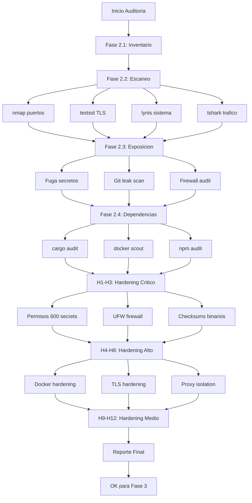

# Plan: Auditoría de Seguridad de Activos Digitales

> **Operación:** NEXUS Sentinel Inquebrantable — Fase 2: Fortificación y Blindaje
> **Prioridad:** CRÍTICA — Previo a cualquier operación ofensiva contra el Clan Villalba
> **Arsenal Disponible:** BlackArch + herramientas NEXUS (shadowcrawl, proxy_hijack, cortex-scout)

---

## 🔍 Fase 2.1 — Inventario Completo de Activos Digitales

### Objetivo
Catalogar cada activo digital del ecosistema NEXUS con su criticidad, exposición y estado actual.

### Activos Identificados

| # | Activo | Tipo | Puerto/Endpoint | Criticidad |
|---|--------|------|-----------------|------------|
| A01 | `proxy_hijack` | MITM Proxy | `127.0.0.1:4444` | 🔴 Alta |
| A02 | `tls_terminator` | TLS Bridge | `127.0.0.1:8443` | 🔴 Alta |
| A03 | `core-zero` | Offline Engine | `127.0.0.1:43217` | 🟡 Media |
| A04 | `cortex-scout-mcp` | MCP Intelligence | STDIO (MCP) | 🔴 Alta |
| A05 | PostgreSQL (Docker) | Database | `0.0.0.0:5432` | 🔴 Alta |
| A06 | Tor Gateway (Docker) | SOCKS5 Proxy | `127.0.0.1:9050` | 🟡 Media |
| A07 | Headless Vision (Docker) | Playwright Browser | Internal | 🟢 Baja |
| A08 | Tauri App (nexus-ghost-shell) | Desktop UI | Electron/Tauri | 🟡 Media |
| A09 | MCP Gateway (config) | 10+ MCP Servers | STDIO/Binarios | 🔴 Alta |
| A10 | `nexus_ebpf` | Kernel Monitor | eBPF + Axum | 🟡 Media |
| A11 | Telegram Bot | External Service | API Externa | 🟢 Baja |
| A12 | Nexus Dashboard | Web UI | Service | 🟢 Baja |

### Tareas:
- [ ] **A01-A03**: Verificar qué servicios systemd están activos (`systemctl status`)
- [ ] **A05**: Verificar si PostgreSQL expone puerto a interfaces externas (`ss -tlnp`)
- [ ] **A08-A12**: Verificar estado del Tauri App, Dashboard, Telegram Bot
- [ ] **A04**: Compilar y verificar shadowcrawl-mcp (fix dependencias arrow-arith)

---

## 🛡️ Fase 2.2 — Escaneo de Vulnerabilidades (BlackArch + NEXUS)

### Herramientas BlackArch Disponibles
Basado en el arsenal de BlackArch en el sistema:

| Herramienta | Propósito | Comando Sugerido |
|-------------|-----------|-----------------|
| `nmap` | Escaneo de puertos local | `nmap -sV -sC 127.0.0.1 -p-` |
| `rustscan` | Escaneo ultra-rápido | `rustscan -a 127.0.0.1 -- -sV` |
| `testssl.sh` | Auditoría TLS | `testssl --severity MEDIUM 127.0.0.1:8443` |
| `nikto` | Escaneo web | `nikto -h http://127.0.0.1:4444` |
| `sqlmap` | Inyección SQL | `sqlmap -u "http://127.0.0.1:4444/*" --batch` |
| `gobuster` | Fuzzing de rutas | `gobuster dir -u http://127.0.0.1:4444 -w /usr/share/wordlists/dirb/common.txt` |
| `wireshark/tshark` | Captura de tráfico | `tshark -i lo -f "port 4444 or port 8443 or port 5432"` |
| `lynis` | Auditoría del sistema | `lynis audit system --quick` |
| `rkhunter/chkrootkit` | Rootkits | `rkhunter --check --skip-keypress` |
| `clamav` | Malware local | `clamscan -r /home/soberano/NEXUS_ULTIMATE_CORE/bin/` |
| `binwalk` | Análisis de binarios | `binwalk bin/proxy_hijack` |
| `strace` | Syscall tracing | `strace -p $(pgrep proxy_hijack)` |
| `fail2ban` | Detección de intrusos | `fail2ban-client status` |

### Escaneos Específicos NEXUS

#### 2.2.1 — Escaneo de Puertos y Servicios
```bash
# Escaneo completo local
nmap -sV -sC -O 127.0.0.1 -p- --script vuln -oN reports/audit/nmap_local.txt

# Escaneo de todos los adaptadores de red
ip addr show
nmap -sn 192.168.1.0/24 -oN reports/audit/nmap_lan.txt

# Servicios en escucha (moderno)
ss -tlnp

# Puertos abiertos de Docker
docker ps --format "table {{.Names}}\t{{.Ports}}"
```

#### 2.2.2 — Auditoría del TLS Terminator
```bash
testssl --severity MEDIUM 127.0.0.1:8443

# Verificar certificados
openssl s_client -connect 127.0.0.1:8443 -servername cloudcode-pa.googleapis.com
openssl x509 -in secrets/nexus-ca.pem -text -noout
```

#### 2.2.3 — Análisis de Proxy Hijack (MITM)
```bash
# Verificar que proxy_hijack no exponga al exterior
curl -x http://127.0.0.1:4444 http://ifconfig.me

# Verificar fuga de headers
curl -x http://127.0.0.1:4444 -v https://httpbin.org/headers 2>&1

# Prueba de inyección
curl -x http://127.0.0.1:4444 -H "X-NEXUS-OVERRIDE: 1" http://localhost:4444/v1/chat/completions
```

#### 2.2.4 — Análisis de la Base de Datos (PostgreSQL)
```bash
# Verificar si acepta conexiones externas
psql -h 127.0.0.1 -U nexus_admin -d nexus_core -c "\conninfo"

# Verificar pg_hba.conf
docker exec nexus-db cat /var/lib/postgresql/data/pg_hba.conf

# Verificar usuarios y permisos
psql -h 127.0.0.1 -U nexus_admin -d nexus_core -c "\du"
```

### Tareas:
- [ ] Ejecutar `nmap` completo contra `127.0.0.1` (todos los puertos)
- [ ] Ejecutar `rustscan` como alternativa rápida
- [ ] Ejecutar `testssl.sh` contra TLS Terminator (`:8443`)
- [ ] Ejecutar `lynis audit system` para auditoría del SO
- [ ] Ejecutar `rkhunter` para detección de rootkits
- [ ] Capturar tráfico de red con `tshark` (modo monitor 5 min)
- [ ] Verificar que proxy_hijack no esté expuesto en interfaces externas
- [ ] Verificar que PostgreSQL no acepte conexiones externas
- [ ] Verificar que Tor Gateway no filtre solicitudes fuera de Tor

---

## 🔓 Fase 2.3 — Análisis de Exposición y Superficie de Ataque

### Vectores de Exposición Identificados

| Vector | Activo | Riesgo | Descubrimiento |
|--------|--------|--------|----------------|
| **V1** | `.env` en texto plano | 🔴 Crítico | API keys, tokens, contraseñas en `/home/soberano/NEXUS_ULTIMATE_CORE/.env` |
| **V2** | `secrets/sovereign_identity.json` | 🔴 Crítico | Contraseña `Nuevaera4310!` en JSON legible |
| **V3** | Certificados CA privados | 🔴 Crítico | `secrets/nexus-ca.key` y `nexus-ca.pem` — firma MITM |
| **V4** | PostgreSQL sin auth fuerte | 🟡 Alto | `nexus_admin` / `nexus_pass` en `docker-compose.elite.yml` |
| **V5** | IPTables redirige TODO el tráfico | 🟡 Alto | Todo HTTP/HTTPS pasa por proxy_hijack (excepto Google) |
| **V6** | TLS Terminator con certs falsos | 🟡 Alto | Suplanta `cloudcode-pa.googleapis.com` |
| **V7** | Binarios en `bin/` sin firma | 🟡 Medio | No hay verificación de integridad de los ejecutables |
| **V8** | MCP Servers con STDIO abierto | 🟡 Medio | Cualquier proceso local puede invocar MCP tools |
| **V9** | Dependencias Rust desactualizadas | 🟡 Medio | `lancedb 0.4.0`, `arrow-array 57` — versiones antiguas |
| **V10** | Tor sin configuración de Bridges | 🟢 Bajo | Street-level Tor sin ofuscación de censura |

### Pruebas de Exposición Específicas

#### 2.3.1 — Fuga de Credenciales
```bash
# Buscar credenciales hardcodeadas en el código
grep -rn "API_KEY\|api_key\|password\|secret\|token" --include="*.rs" --include="*.js" --include="*.sh" --include="*.toml" --include="*.yml" --include="*.json" | grep -v ".env" | grep -v "secrets/" | grep -v "node_modules" | grep -v ".cargo-cache" | grep -v "Cargo.lock"

# Verificar .gitignore para .env
cat .gitignore | grep -E "\.env|secret|key"
```

#### 2.3.2 — Análisis de Git por Secretos
```bash
# Usar trufflehog o git-secrets si están disponibles
trufflehog --regex --entropy=False file:///home/soberano/NEXUS_ULTIMATE_CORE

# Buscar commits históricos con secretos
git log --all --full-history --diff-filter=A -- "*.env" "secrets/*"
```

#### 2.3.3 — Exposición de Red
```bash
# Verificar reenvío de IP
cat /proc/sys/net/ipv4/ip_forward

# Verificar iptables completas
sudo iptables -t nat -L -n -v
sudo iptables -L -n -v

# Verificar si hay servicios escuchando en 0.0.0.0
ss -tlnp | grep "0.0.0.0:"
```

### Tareas:
- [ ] **V1**: Verificar que `.env` esté en `.gitignore` (NO en repo)
- [ ] **V2**: Mover `sovereign_identity.json` a ubicación más segura o encriptar
- [ ] **V3**: Revisar permisos de archivos en `secrets/` (ideal: `600`, owner `soberano`)
- [ ] **V4**: Cambiar contraseña PostgreSQL por defecto
- [ ] **V5**: Revisar reglas iptables — asegurar que no haya fuga
- [ ] **V6**: Test SSL completo contra TLS Terminator
- [ ] **V7**: Generar checksums SHA256 de binarios críticos
- [ ] **V8**: Verificar que MCP servers solo escuchen en STDIO
- [ ] **V9**: Auditar versiones de dependencias con `cargo audit`
- [ ] **V10**: Evaluar si necesita Bridges/pluggable transports

---

## 📦 Fase 2.4 — Auditoría de Dependencias y Secretos

### Dependencias Críticas

#### Rust (Cargo)
```bash
# Auditoría de seguridad de todas las dependencias
cargo audit --db /home/soberano/.cargo/advisory-db

# Dependencias desactualizadas (Rust)
cargo outdated --exit-code 1 || true

# Verificar binarios compilados sin símbolos de debug
file bin/proxy_hijack bin/nexus_brain_ra
```

#### Node.js
```bash
# Auditoría npm si hay package.json
npm audit --production
```

#### Docker Images
```bash
# Escanear imágenes Docker por vulnerabilidades
docker scout quickfix nexus-tor-gateway
docker scout quickfix nexus-headless-vision
```

### Gestión de Secretos

| Secreto | Ubicación | Riesgo | Acción Recomendada |
|---------|-----------|--------|-------------------|
| Gemini API Keys | `.env` (texto plano) | 🔴 | Evaluar si usar vault/gpg |
| DeepSeek Key | `.env` | 🔴 | Rotar si hay sospecha de fuga |
| Groq Key | `.env` | 🟡 | Evaluar rotación |
| OpenRouter Key | `.env` | 🔴 | Evaluar rotación |
| Vertex Token | `.env` | 🔴 | Tiene expiración — verificar renovación |
| Tavily Key | `.env` | 🟡 | Evaluar rotación |
| CA Private Key | `secrets/nexus-ca.key` | 🔴 | **NO rotar** — rompería TLS terminator |
| Identidad Soberana | `secrets/sovereign_identity.json` | 🔴 | Encriptar con GPG |
| PostgreSQL Pass | `docker-compose.elite.yml` | 🟡 | Cambiar + usar secrets de Docker |

### Tareas:
- [ ] Ejecutar `cargo audit` en workspace core + shadowcrawl + tauri
- [ ] Ejecutar `cargo outdated` en todos los workspaces
- [ ] Escanear imágenes Docker con `docker scout`
- [ ] Verificar si `.env` tiene duplicados de llaves (líneas 10 y 52 del .env)
- [ ] Evaluar solución de secretos: encriptación GPG vs vault vs Docker secrets
- [ ] Verificar que no haya más archivos .env en backups/archive/
- [ ] Verificar que gitignore excluya TODOS los secrets

---

## 🏰 Fase 2.5 — Hardening Priorizado por Criticidad

### 🔴 CRÍTICO (Resolver Inmediatamente)

#### H1 — Hardening de Secretos y Credenciales
```bash
# 1. Permisos correctos en secrets/
chmod 600 /home/soberano/NEXUS_ULTIMATE_CORE/secrets/*
chmod 700 /home/soberano/NEXUS_ULTIMATE_CORE/secrets/

# 2. Encriptar sovereign_identity.json con GPG
gpg --symmetric --cipher-algo AES256 secrets/sovereign_identity.json
rm secrets/sovereign_identity.json  # mantener solo .gpg

# 3. Verificar que .env tenga permisos 600
chmod 600 .env
```

#### H2 — Aislamiento de Red
```bash
# 1. Firewall: bloquear todo excepto localhost
sudo ufw default deny incoming
sudo ufw default deny outgoing
sudo ufw allow out 53,80,443/tcp  # DNS, HTTP, HTTPS
sudo ufw allow out 9050/tcp         # Tor
sudo ufw allow from 127.0.0.1
sudo ufw enable

# 2. PostgreSQL: ligar solo a 127.0.0.1
# En docker-compose: ports: "127.0.0.1:5432:5432"
```

#### H3 — Verificación de Integridad
```bash
# 1. Checksums de binarios
sha256sum bin/proxy_hijack > reports/audit/checksums.txt
sha256sum bin/nexus_brain_ra >> reports/audit/checksums.txt
sha256sum bin/nexus_browser_elite >> reports/audit/checksums.txt

# 2. Monitor de cambios en bin/ (inotify)
inotifywait -m -r bin/ -e modify,create,delete
```

### 🟡 ALTO (Resolver Pronto)

#### H4 — Hardening de Docker
```yaml
# En docker-compose.elite.yml:
services:
  nexus-db:
    ports:
      - "127.0.0.1:5432:5432"  # No exponer a 0.0.0.0
    environment:
      - POSTGRES_PASSWORD_FILE=/run/secrets/db_password
    secrets:
      - db_password
```

#### H5 — Hardening del TLS Terminator
```bash
# Deshabilitar TLS 1.0/1.1 en tls_terminator.cjs
# Agregar: secureProtocol: 'TLSv1_2_server_method'
# Agregar: ciphers: 'HIGH:!aNULL:!eNULL:!EXPORT:!DES:!RC4:!MD5:!PSK:!SRP'
```

#### H6 — Hardening del Proxy Hijack
```bash
# Verificar que proxy_hijack no tenga --allow-external
# Bloquear en iptables cualquier conexión externa a :4444
sudo iptables -A INPUT -p tcp --dport 4444 ! -s 127.0.0.1 -j DROP
```

#### H7 — Hardening de MCP Servers
```bash
# Verificar que cada MCP server solo use STDIO (no puertos)
# Los que son HTTP deben ligar solo a 127.0.0.1
```

#### H8 — Tor Bridges (si es necesario)
```bash
# Configurar obfs4 bridges en torrc si hay censura
# Bridge <ip>:<port> <fingerprint>
```

### 🟢 MEDIO (Resolver Cuando Sea Posible)

#### H9 — Rotación de API Keys (Programada)
```yaml
# Crear cron: rotación mensual de claves
# Script: scripts/rotar_api_keys.sh
# - DeepSeek, Groq, OpenRouter, Tavily
# - NO Gemini (estabilidad crítica)
```

#### H10 — Backup Cifrado de Secrets
```bash
# Respaldo diario de secrets/ en archivo cifrado
tar czf secrets-backup-$(date +%Y%m%d).tar.gz secrets/
gpg -e -r "NEXUS" secrets-backup-*.tar.gz
rm secrets-backup-*.tar.gz
```

#### H11 — Cargo Audit Automatizado
```bash
# Agregar al CI o pre-commit hook
# cargo audit en todos los workspaces
```

#### H12 — Monitoreo de Integridad con eBPF
```bash
# Usar nexus_ebpf para monitorear:
# - syscalls de execve en bin/
# - conexiones de red a puertos no autorizados
# - modificaciones a /etc/hosts o iptables
```

---

## 📊 Reporte Final

### Outputs Esperados

| Archivo | Contenido |
|---------|-----------|
| `reports/audit/nmap_local.txt` | Escaneo completo de puertos |
| `reports/audit/nmap_vuln.txt` | Vulnerabilidades detectadas |
| `reports/audit/lynis.txt` | Auditoría del sistema |
| `reports/audit/ssl_test.txt` | Evaluación TLS |
| `reports/audit/checksums.txt` | SHA256 de binarios críticos |
| `reports/audit/dependencies.txt` | Cargo audit + npm audit |
| `reports/audit/secrets_leak.txt` | Resultados de búsqueda de fugas |
| `reports/audit/hardening_summary.md` | Resumen ejecutivo de hardening |

### Métricas de Éxito
- [ ] 0 puertos expuestos en interfaces externas (excepto los intencionales)
- [ ] 0 secretos en texto plano sin permisos restrictivos (600)
- [ ] 0 vulnerabilidades críticas en `cargo audit`
- [ ] TLS Terminator con calificación A en testssl.sh
- [ ] PostgreSQL solo accesible desde localhost
- [ ] Todos los servicios systemd funcionando sin errores
- [ ] Checksums de binarios registrados y verificables

---

## 📋 Orden de Ejecución Sugerido

```
Paso 1: Fase 2.1 — Inventario (verificar qué está vivo)
Paso 2: Fase 2.2 — Escaneos (nmap, testssl, lynis, rkhunter)
Paso 3: Fase 2.3 — Exposición (secretos, red, git)
Paso 4: Fase 2.4 — Dependencias (cargo audit, docker scout)
Paso 5: H1-H3 — Hardening crítico (permisos, firewall, checksums)
Paso 6: H4-H8 — Hardening alto (Docker, TLS, proxy, MCP)
Paso 7: H9-H12 — Hardening medio (rotación, backup, monitoreo)
Paso 8: Consolidar reporte final
```

---

## 🧬 Diagrama de Flujo de la Auditoría



---

*Plan creado por NEXUS — Arquitecto de Sistemas Jefe*
*Próximo paso: Cambiar a modo Code para ejecutar la auditoría*
