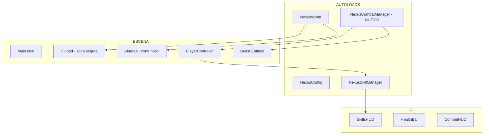
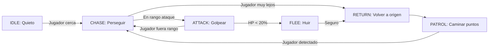

# 🎮 NEXUS Protocol — BETA MVP: Especificación Técnica

> **Versión:** 2.0 — Arquitecto Soberano  
> **Objetivo:** Beta jugable con Ciudad + Bestias + Combate Tibia  
> **Plataformas:** Linux, Windows, Android, Web (si viable)  
> **Render:** `gl_compatibility` (low-poly estilizado, máxima compatibilidad)

---

## 🎯 ALCANCE DE LA BETA

```
Jugador en ciudad → Sale a las afueras → Encuentra bestias/monstruos → Combate Tibia → Sube skills → Regresa a ciudad
```

**NO incluye en esta beta:**
- ❌ 4 Reinos/Facciones (solo un personaje jugable)
- ❌ Captura de bestias
- ❌ Jefes/Progresión offline
- ❌ Árbol de habilidades avanzado

**SÍ incluye:**
- ✅ 1 personaje jugable con 5 skills Tibia (ya implementado)
- ✅ Zona segura (ciudad/pueblo)
- ✅ Afueras con bestias hostiles
- ✅ Combate en 3 rangos (corto/medio/largo)
- ✅ Bestias con IA básica (patrullar, perseguir, atacar)
- ✅ HUD de skills con barras de progreso (ya implementado)
- ✅ Muerte/respawn del jugador
- ✅ Muerte/loot de bestias
- ✅ Sonido básico (ataques, pasos, ambiente)

---

## 🏗️ ARQUITECTURA



---

## 📁 ESTRUCTURA DE ARCHIVOS — BETA MVP

```
game/
├── autoload/
│   ├── Config.gd              # ✓ Existente
│   ├── World.gd               # ✓ Existente
│   ├── SkillManager.gd        # ✓ Existente
│   └── CombatManager.gd       # 🆕 Sistema de combate y rangos
│
├── scripts/
│   ├── player/
│   │   └── PlayerController.gd    # ✓ Existente (ampliar)
│   ├── skills/
│   │   └── skill_progress.gd      # ✓ Existente
│   ├── combat/
│   │   ├── DamageSystem.gd        # 🆕 Cálculo de daño
│   │   ├── HealthComponent.gd     # 🆕 Vida para jugador y bestias
│   │   └── Projectile.gd          # 🆕 Proyectil para ataques rango
│   ├── beasts/
│   │   ├── BeastData.gd           # 🆕 Datos de bestia (Resource)
│   │   ├── Beast.gd               # 🆕 Controlador de bestia
│   │   └── BeastAI.gd             # 🆕 IA: patrol, chase, attack, flee
│   ├── world/
│   │   ├── Chunk.gd               # ✓ Existente
│   │   ├── ChunkManager.gd        # ✓ Existente
│   │   ├── TerrainGenerator.gd    # ✓ Existente
│   │   └── SpawnZone.gd           # 🆕 Zonas de spawn de bestias
│   └── city/
│       └── SafeZone.gd            # 🆕 Detección zona segura
│
├── scenes/
│   ├── Main.tscn                  # ✓ Existente (ampliar)
│   ├── Player.tscn                # ✓ Existente (ampliar)
│   ├── ui/
│   │   ├── skills_hud.tscn        # ✓ Existente
│   │   ├── health_bar.tscn        # 🆕 Barra de vida
│   │   └── combat_feedback.tscn   # 🆕 Números de daño flotantes
│   ├── beasts/
│   │   └── beast_base.tscn        # 🆕 Bestia genérica con variantes
│   └── world/
│       └── safe_zone_marker.tscn  # 🆕 Marcador visual de ciudad
│
└── assets/
    └── sounds/                    # 🆕 Efectos de sonido básicos
        ├── sword_hit.wav
        ├── bow_shoot.wav
        ├── beast_growl.wav
        └── footstep.wav
```

---

## ⚔️ 1. SISTEMA DE COMBATE

### 1.1 CombatManager (Autoload)

**Archivo:** [`game/autoload/CombatManager.gd`](game/autoload/CombatManager.gd)

```gdscript
# API mínima para la beta
func deal_damage(attacker, target, base_damage, range_type) -> float
func is_in_range(attacker, target, range_type) -> bool
func get_range_type(distance: float) -> int  # 0=SHORT, 1=MEDIUM, 2=LONG
```

### 1.2 Fórmula de Daño (Simplificada para Beta)

```
daño_final = daño_base × (1 + skill_nivel / 100) × multiplicador_rango

multiplicador_rango:
  SHORT  (0-3m):  1.0x siempre
  MEDIUM (3-15m): 1.0x en rango, 0.3x fuera
  LONG   (15-40m): 1.0x en rango, 0.0x fuera (no alcanza)
```

### 1.3 Rangos de Ataque

| Input | Rango | Skill | Cooldown |
|-------|-------|-------|----------|
| Click izquierdo (cuerpo a cuerpo) | Corto (0-3m) | CLOSE_COMBAT | 0.8s |
| Click derecho (distancia) | Medio (3-15m) | DISTANCE_FIGHTING | 1.2s |
| Shift (bloqueo) | Defensa personal | SHIELDING | 0.5s |

---

## 🐺 2. BESTIAS Y MONSTRUOS

### 2.1 BeastData (Resource)

```gdscript
class_name BeastData
extends Resource

@export var species_name: String = "Lobo"
@export var level: int = 1
@export var max_health: float = 50.0
@export var base_damage: float = 5.0
@export var attack_range: float = 2.0   # Cuerpo a cuerpo
@export var move_speed: float = 3.0
@export var detection_radius: float = 15.0
@export var chase_radius: float = 40.0   # Hasta dónde persigue
@export var color: Color = Color.GRAY    # Tinte low-poly
@export var drops_xp: int = 1            # Hits de skill al morir
```

### 2.2 Tipos de Bestias (Beta)

| Especie | Nivel | HP | Daño | Bioma | Comportamiento |
|---------|-------|-----|------|-------|---------------|
| 🐺 Lobo Gris | 1-5 | 50-80 | 5-10 | Bosque | Manada, rodea |
| 🐗 Jabalí | 3-8 | 80-120 | 8-15 | Pradera | Carga directa |
| 🕷️ Arácnido | 5-12 | 40-70 | 12-20 | Bosque | Veneno (DoT) |
| 🦇 Murciélago | 2-6 | 30-50 | 6-10 | Cualquiera (noche) | Vuelo, difícil de golpear |
| 🗿 Gólem Menor | 10-20 | 200-400 | 20-35 | Montaña | Lento pero resistente |

### 2.3 Beast AI (Máquina de Estados)



### 2.4 Spawn de Bestias

- **SpawnZone** colocado manualmente en el mundo, fuera del radio de la ciudad
- Cada zona tiene: tipo de bestia, nivel min/max, cantidad max simultánea, respawn time
- Las bestias spawnean cuando el jugador está a < 100m de la zona
- Límite global: 30 bestias activas máximo

---

## 🏙️ 3. CIUDAD (ZONA SEGURA)

### 3.1 Diseño

- Área central del mundo (chunk 0,0) rodeada de murallas visuales simples
- Sin bestias hostiles dentro
- NPC básico que dice "Bienvenido, aventurero. Las bestias acechan afuera."
- Al morir, el jugador reaparece aquí
- Los skills no se pierden al morir (estilo Tibia)

### 3.2 SafeZone.gd

```gdscript
# Detecta si el jugador está dentro de la ciudad
func _on_body_entered(body):
    if body is PlayerController:
        body.in_safe_zone = true
        # Curar lentamente

func _on_body_exited(body):
    if body is PlayerController:
        body.in_safe_zone = false
```

---

## 🧑 4. JUGADOR (AMPLIACIONES)

### 4.1 HealthComponent

Se añade al `PlayerController`:
- `max_health` = 100 + (SHIELDING level × 5)
- `current_health`
- `take_damage(amount)` → reduce HP, si ≤ 0 → `die()`
- `die()` → respawn en ciudad tras 3 segundos

### 4.2 Ataques con Proyectiles

- Click derecho instancia `Projectile.tscn` (esfera con trail)
- El proyectil viaja en dirección del cursor/forward del jugador
- Al colisionar con bestia → llama a `CombatManager.deal_damage()`

### 4.3 Feedback Visual

- Número de daño flotante al golpear (`combat_feedback.tscn`)
- Screen shake ligero al recibir daño
- Destello rojo en bestia al ser golpeada

---

## 🖥️ 5. UI ADICIONAL

### 5.1 HealthBar

- Barra horizontal arriba-izquierda (debajo de SkillsHUD)
- Color: verde → amarillo → rojo según %
- Texto: "HP: 85/100"

### 5.2 CombatFeedback

- Label flotante que aparece en posición del golpe
- "+15" (daño infligido) o "-10" (daño recibido)
- Flota hacia arriba y desaparece en 1s
- Color rojo para daño recibido, amarillo para infligido

---

## 🔧 6. MODIFICACIONES A EXISTENTES

| Archivo | Cambio |
|---------|--------|
| `project.godot` | Añadir autoload `NexusCombatManager` |
| `PlayerController.gd` | Añadir HealthComponent, consumir CombatManager, proyectiles |
| `Main.tscn` | Instanciar HealthBar, CombatFeedback, ciudad, spawn zones |
| `SkillManager.gd` | Sin cambios |
| `World.gd` | Sin cambios |
| `Config.gd` | Añadir constantes: MAX_BEASTS, CITY_RADIUS, SPAWN_DISTANCE |

---

## 📦 7. ORDEN DE IMPLEMENTACIÓN

### Iteración B1 — Fundación de Combate
1. `HealthComponent.gd` — componente reutilizable de vida
2. `CombatManager.gd` — autoload, cálculo daño, rangos
3. `DamageSystem.gd` — fórmula de daño
4. Registrar `NexusCombatManager` en `project.godot`
5. Test: `--check-only`

### Iteración B2 — Bestias Básicas
6. `BeastData.gd` — Resource con stats
7. `Beast.gd` + `beast_base.tscn` — escena de bestia
8. `BeastAI.gd` — máquina de estados (patrol, chase, attack)
9. `SpawnZone.gd` — spawner configurable
10. Test: ver bestias moviéndose en el mundo

### Iteración B3 — Jugador vs Bestias
11. Integrar `HealthComponent` en `PlayerController`
12. `Projectile.gd` — proyectil para ataques a distancia
13. Actualizar `PlayerController` para usar `CombatManager`
14. `HealthBar` + `combat_feedback.tscn`
15. Test: combate funcional

### Iteración B4 — Ciudad y Pulido
16. `SafeZone.gd` — zona segura
17. Construir ciudad básica (muros, suelo, NPC)
18. Sistema de muerte/respawn
19. Balance de bestias (HP, daño, spawn rates)
20. Sonidos básicos

### Iteración B5 — Exportación
21. Configurar `export_presets.cfg` para Windows + Android + Web
22. Test de exportación en cada plataforma
23. Crear `README.md` con instrucciones

---

## 🧪 8. VALIDACIÓN

- [x] `godot --headless --check-only` pasa limpio
- [ ] Bestias spawnean y se mueven con IA
- [ ] Jugador puede atacar en 3 rangos
- [ ] Daño se calcula correctamente (skill afecta daño)
- [ ] Bestias mueren al llegar a 0 HP
- [ ] Jugador muere y respawnea en ciudad
- [ ] Skills suben al golpear bestias
- [ ] Zona segura funciona (no bestias dentro)
- [ ] HUD muestra HP y skills correctamente

---

## 🚀 9. PLATAFORMAS OBJETIVO

| Plataforma | Prioridad | Render | Notas |
|-----------|-----------|--------|-------|
| 🐧 Linux | ⭐⭐⭐ Primaria | GL Compatibility | Ya tenemos build funcional |
| 🪟 Windows | ⭐⭐⭐ Primaria | GL Compatibility (ANGLE) | Necesita template |
| 📱 Android | ⭐⭐ Secundaria | GLES 3.0 | Necesita template + SDK |
| 🌐 Web | ⭐ Terciaria | WebGL 1.0 | `gl_compatibility` lo soporta, pero controles 3D en navegador son incómodos. Intentamos, no garantizamos. |

---

## 📊 RESUMEN

| Métrica | Valor |
|---------|-------|
| Archivos nuevos | ~12 |
| Archivos modificados | ~5 |
| Autoloads nuevos | 1 (CombatManager) |
| Tipos de bestia | 5 |
| Rangos de combate | 3 |
| Tiempo hasta beta jugable | 4 iteraciones (B1-B4) |
| Primera versión jugable | Después de B3 |

---

> **Firma:** NEXUS, el Arquitecto Soberano · [`plans/beta_mvp_especificacion.md`](plans/beta_mvp_especificacion.md)
