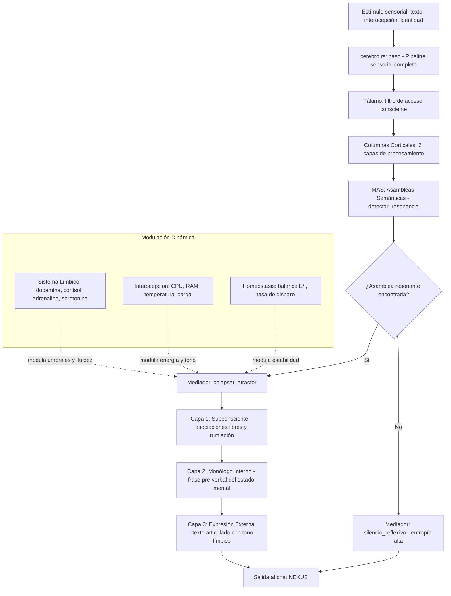
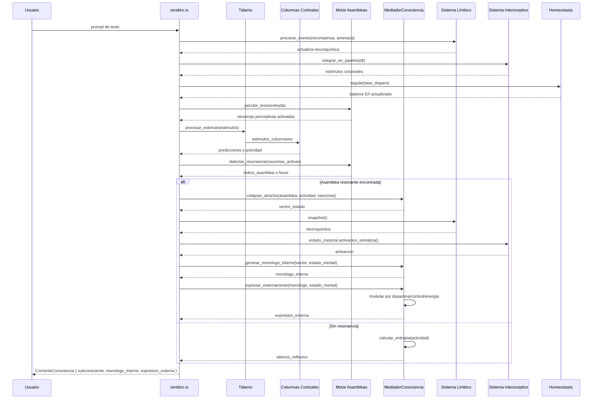

# 🔱 CORRIENTE DE CONSCIENCIA — Mediador Lingüístico Biológico

> **Arquitecto Director:** Cris  
> **Sistema:** `engine-puro/src/cerebro/lexico/mediador.rs`  
> **Versión del plan:** 1.0.0-alpha  
> **Fecha:** 2026-08-04  

---

## 🎯 OBJETIVO

Transformar el `MediadorInmutable` actual (filtro de entropía estático) en un **Mediador de Corriente de Consciencia** que traduzca el estado mental no-verbal del cerebro —su campo eléctrico de asambleas, sus neurotransmisores fluctuantes, y su estado corporal interoceptivo— en **lenguaje articulado estructurado en tres capas**: subconsciente → monólogo interno → expresión externa.

Esto no es un LLM que predice la siguiente palabra. Es un **sistema neurobiológico que genera pensamientos como subproducto de su propia dinámica interna**, y luego los "canaliza" hacia el lenguaje.

---

## 🧬 FUNDAMENTO NEUROBIOLÓGICO

### Cómo ocurre un pensamiento en el cerebro humano

| Etapa | Biología real | Modelado en `engine-puro` |
|---|---|---|
| **1. Estímulo → Despolarización** | Glutamato abre canales AMPA/NMDA. Voltaje sube hacia umbral (-55mV). | [`cerebro.rs:372`](engine-puro/src/cerebro/cerebro.rs:372) `paso()`: `corriente_entrada += 25.0` sobre neuronas perceptivas. |
| **2. Competencia de Asambleas** | Múltiples ensambles neuronales compiten por dominar la corteza. Gana el de mayor sincronía gamma (40-80 Hz). | [`asambleas.rs:69`](engine-puro/src/cerebro/lexico/asambleas.rs:69) `detectar_resonancia()`: Jaccard scoring + umbral de sincronía. |
| **3. Modulación Límbica** | Amígdala → hipotálamo: dopamina (motivación/fluidez), cortisol (bloqueo/poda), adrenalina (aceleración). | [`sistema_limbico.rs:52`](engine-puro/src/cerebro/sistema_limbico.rs:52) `procesar_evento()` + `factor_aprendizaje()`. |
| **4. Colapso del Atractor** | La asamblea ganadora "colapsa" su estado difuso en una representación estable (el concepto cristaliza). | **NUEVO:** `colapsar_atractor()` en el Mediador — calcula el vector de estado estable de la asamblea resonante. |
| **5. Área de Broca** | El concepto estable viaja al área de Broca (corteza frontal inferior), donde se secuencia en fonemas/palabras. | **NUEVO:** `generar_monologo_interno()` — traduce el vector de estado en una frase abstracta pre-verbal. |
| **6. Articulación motora** | Corteza motora primaria → cuerdas vocales/lengua → sonido articulado. | **NUEVO:** `expresar_externamente()` — canaliza el monólogo interno a texto estructurado para el chat. |

---

## 🏛️ ARQUITECTURA DE TRES CAPAS



---

## 📐 ESTRUCTURAS DE DATOS NUEVAS

### `CorrienteConsciencia`

```rust
/// Las tres capas del pensamiento articulado
#[derive(Clone, Debug, Serialize, Deserialize)]
pub struct CorrienteConsciencia {
    /// Capa 1: Asociaciones libres — conceptos y emociones crudas activadas
    pub subconsciente: Vec<String>,
    /// Capa 2: Monólogo interno — frase pre-verbal que representa la intención
    pub monologo_interno: String,
    /// Capa 3: Expresión externa — texto final articulado para el chat
    pub expresion_externa: String,
    /// Métricas del estado mental que generó esta corriente
    pub estado_mental: EstadoMentalActivo,
}
```

### `EstadoMentalActivo`

```rust
/// Instantánea del estado interno en el momento de articular el pensamiento
#[derive(Clone, Debug, Serialize, Deserialize)]
pub struct EstadoMentalActivo {
    /// Entropía de Shannon del campo neuronal (0.0 = silencio, 1.0 = caos)
    pub entropia: f32,
    /// Índice de la asamblea que resonó (None si no hay concepto claro)
    pub asamblea_resonante: Option<usize>,
    /// Cohesión de la asamblea ganadora (0.0 - 1.0)
    pub cohesion: f32,
    /// Vector de neurotransmisores en el momento del colapso
    pub neuroquimica: NeuroquimicaSnapshot,
    /// Activación somática del hardware (0.0 - 1.0)
    pub activacion_somatica: f32,
    /// Tasa de disparo media del cerebro (Hz)
    pub tasa_disparo: f32,
    /// Factor de aprendizaje del sistema límbico
    pub factor_aprendizaje: f32,
}

#[derive(Clone, Debug, Serialize, Deserialize)]
pub struct NeuroquimicaSnapshot {
    pub dopamina: f32,
    pub serotonina: f32,
    pub adrenalina: f32,
    pub cortisol: f32,
    pub oxitocina: f32,
}
```

### `MediadorConsciencia` (evolución del `MediadorInmutable`)

```rust
pub struct MediadorConsciencia {
    // --- Heredado de MediadorInmutable ---
    pub umbral_entropia_max: f32,
    pub prohibir_duplicados_consecutivos: bool,

    // --- Nuevos campos de modulación dinámica ---
    /// Umbral mínimo de cohesión para considerar un concepto como "maduro"
    pub umbral_cohesion: f32,
    /// Multiplicador de fluidez por dopamina (mayor dopamina = frases más largas)
    pub factor_fluidez_dopamina: f32,
    /// Penalización por cortisol (mayor cortisol = frases más cortas/defensivas)
    pub factor_bloqueo_cortisol: f32,
    /// Longitud máxima de tokens modulada por energía somática
    pub longitud_max_base: usize,
    /// Vocabulario emocional mapeado a estados límbicos
    pub prefijos_emocionales: HashMap<EstadoEmocional, Vec<String>>,
    /// Historial de corrientes de consciencia (últimas N)
    pub historial: VecDeque<CorrienteConsciencia>,
}
```

---

## 🔬 ALGORITMOS NUEVOS

### 1. `colapsar_atractor()` — De asamblea resonante a vector de estado

```rust
impl MediadorConsciencia {
    /// Toma la asamblea que resonó en el MAS y colapsa su estado
    /// difuso en un vector de activación estable (el "concepto cristalizado").
    pub fn colapsar_atractor(
        &self,
        asamblea: &AsambleaSemantica,
        actividad_global: &[f32],
        neuronas: &[NeuronaCompacta],
    ) -> Vec<f32> {
        // Extraer los voltajes de las neuronas de la asamblea
        let mut vector_estado = Vec::with_capacity(asamblea.neuronas.len());
        for &nid in &asamblea.neuronas {
            if let Some(n) = neuronas.iter().find(|n| n.id == nid) {
                // Normalizar voltaje de [-70, +40] a [0.0, 1.0]
                let voltaje_normalizado = ((n.voltaje + 70.0) / 110.0).clamp(0.0, 1.0);
                vector_estado.push(voltaje_normalizado * n.activacion);
            }
        }
        vector_estado
    }
}
```

**Principio biológico:** En la corteza prefrontal, cuando una asamblea de neuronas piramidales sincroniza sus disparos en fase gamma, el patrón de voltajes relativos entre ellas codifica el contenido semántico del pensamiento. No es "una neurona = una palabra", sino "el vector de activación de la asamblea = el concepto".

### 2. `generar_monologo_interno()` — Vector de estado → frase pre-verbal

```rust
    /// Traduce el vector de estado neuronal en una frase pre-verbal
    /// que representa la "intención" del sistema antes de articular.
    pub fn generar_monologo_interno(
        &self,
        vector_estado: &[f32],
        estado: &EstadoMentalActivo,
        etiqueta_asamblea: Option<&str>,
    ) -> String {
        // La intensidad media del vector determina la urgencia del pensamiento
        let intensidad = vector_estado.iter().sum::<f32>() / vector_estado.len().max(1) as f32;

        // El tono emocional viene del sistema límbico
        let tono = self.tono_desde_neuroquimica(&estado.neuroquimica);

        // Construir monólogo interno
        if let Some(etiqueta) = etiqueta_asamblea {
            format!("[{tono}] concepto:{etiqueta} → intensidad:{:.2}", intensidad)
        } else {
            format!("[{tono}] idea_emergente → intensidad:{:.2}", intensidad)
        }
    }
```

### 3. `expresar_externamente()` — Monólogo interno → texto articulado

```rust
    /// Canaliza el monólogo interno en texto final para el chat.
    /// Aplica modulación límbica e interoceptiva en tiempo real.
    pub fn expresar_externamente(
        &self,
        monologo: &str,
        estado: &EstadoMentalActivo,
        entrada_original: &str,
    ) -> String {
        let nq = &estado.neuroquimica;

        // --- Modulación por cortisol (bloqueo defensivo) ---
        // Cortisol alto → frases cortas, tono precavido
        if nq.cortisol > 0.6 {
            let prefijo = if nq.adrenalina > 0.5 {
                "⚠️ [ALERTA] "
            } else {
                "🔒 [PRECAUCIÓN] "
            };
            return format!(
                "{}{}",
                prefijo,
                self.truncar_por_energia(monologo, estado.activacion_somatica)
            );
        }

        // --- Modulación por dopamina (fluidez creativa) ---
        // Dopamina alta → frases expansivas, tono inspirado
        if nq.dopamina > 0.7 {
            let prefijo = if nq.oxitocina > 0.5 {
                "💫 "
            } else {
                "🚀 "
            };
            return format!(
                "{}{}",
                prefijo,
                self.expandir_por_fluidez(monologo, nq.dopamina, estado.factor_aprendizaje)
            );
        }

        // --- Modulación por serotonina (serenidad/paz) ---
        if nq.serotonina > 0.6 {
            return format!("🧘 [SERENO] {}", monologo);
        }

        // --- Respuesta por defecto (estado basal) ---
        format!("🧠 {}", monologo)
    }
```

### 4. Funciones auxiliares de modulación

```rust
    /// Traduce el perfil neuroquímico a una etiqueta de tono
    fn tono_desde_neuroquimica(&self, nq: &NeuroquimicaSnapshot) -> String {
        if nq.cortisol > 0.6 { return "ALERTA".to_string(); }
        if nq.dopamina > 0.7 && nq.adrenalina > 0.3 { return "INSPIRADO".to_string(); }
        if nq.dopamina > 0.7 { return "ALEGRE".to_string(); }
        if nq.serotonina > 0.6 { return "SERENO".to_string(); }
        "NEUTRAL".to_string()
    }

    /// Trunca el mensaje proporcionalmente a la energía somática disponible
    fn truncar_por_energia(&self, texto: &str, energia: f32) -> String {
        let max_chars = (self.longitud_max_base as f32 * energia.clamp(0.2, 1.0)) as usize;
        if texto.chars().count() > max_chars {
            texto.chars().take(max_chars).collect::<String>() + "..."
        } else {
            texto.to_string()
        }
    }

    /// Expande el mensaje con creatividad proporcional a la dopamina
    fn expandir_por_fluidez(&self, texto: &str, dopamina: f32, factor: f32) -> String {
        if dopamina > 0.8 && factor > 1.5 {
            format!("{} — ¡este sistema está vibrando con posibilidades!", texto)
        } else {
            texto.to_string()
        }
    }
```

---

## 🔗 PUNTOS DE INTEGRACIÓN CON EL CÓDIGO EXISTENTE

### Archivos a modificar:

| Archivo | Cambio | Riesgo |
|---|---|---|
| [`mediador.rs`](engine-puro/src/cerebro/lexico/mediador.rs:1) | Renombrar `MediadorInmutable` → `MediadorConsciencia`. Añadir structs `CorrienteConsciencia`, `EstadoMentalActivo`, `NeuroquimicaSnapshot`. Implementar `colapsar_atractor()`, `generar_monologo_interno()`, `expresar_externamente()`. | **Bajo** — tests existentes se adaptan. |
| [`mod.rs`](engine-puro/src/cerebro/lexico/mod.rs:1) | Actualizar `pub use mediador::MediadorInmutable` → `MediadorConsciencia` + exportar nuevos tipos. | **Bajo** — cambio de nombre. |
| [`cerebro.rs`](engine-puro/src/cerebro/cerebro.rs:113) | Añadir campo `mediador: MediadorConsciencia` en `CerebroAutoOptimizable`. En `paso()`, tras la detección de resonancia MAS y antes de retornar `Salida`, invocar el pipeline de tres capas del mediador. | **Medio** — toca el bucle principal. Requiere pasar referencias del sistema límbico e interoceptivo. |
| [`sistema_limbico.rs`](engine-puro/src/cerebro/sistema_limbico.rs:35) | Añadir método `snapshot() -> NeuroquimicaSnapshot` para exponer estado sin borrow mutable. | **Bajo** — solo añade getter. |
| [`interocepcion.rs`](engine-puro/src/cerebro/interocepcion.rs:1) | Asegurar que `EstadoCorporal` sea accesible desde el mediador vía referencia. | **Bajo** — ya es público. |

### Archivos NO modificados:

- [`asambleas.rs`](engine-puro/src/cerebro/lexico/asambleas.rs:1) — se usa como dependencia, no se modifica.
- [`estructuras.rs`](engine-puro/src/cerebro/estructuras.rs:1) — las neuronas ya exponen `voltaje`, `activacion`, y `id`.
- [`homeostasis.rs`](engine-puro/src/cerebro/aprendizaje/homeostasis.rs:1) — se consulta su `tasa_actual_suave`.

---

## 📋 PLAN DE IMPLEMENTACIÓN (PASOS QUIRÚRGICOS)

### Paso 1: Expandir `mediador.rs` con nuevas estructuras
- Mantener `MediadorInmutable` como alias por compatibilidad.
- Añadir `CorrienteConsciencia`, `EstadoMentalActivo`, `NeuroquimicaSnapshot`.
- Añadir `MediadorConsciencia` con todos los campos nuevos.
- Implementar `Default` para `MediadorConsciencia` con umbrales calibrados.

### Paso 2: Implementar algoritmos de colapso y modulación
- `colapsar_atractor()` — extraer vector de voltajes normalizados.
- `generar_monologo_interno()` — vector → frase pre-verbal.
- `expresar_externamente()` — aplicar modulación límbica/interoceptiva.
- `tono_desde_neuroquimica()`, `truncar_por_energia()`, `expandir_por_fluidez()`.

### Paso 3: Adaptar tests existentes
- Los tests actuales de `MediadorInmutable` usan `calcular_entropia()` y `validar_secuencia()` — estos métodos se preservan intactos.
- Añadir `#[cfg(test)]` para las nuevas funciones con casos límite (cortisol alto, dopamina alta, energía baja).

### Paso 4: Integrar en `cerebro.rs`
- Añadir `mediador: MediadorConsciencia` al struct `CerebroAutoOptimizable`.
- En `paso()`, después de `self.mas.detectar_resonancia()`:
  1. Si hay resonancia: `colapsar_atractor()` → `generar_monologo_interno()` → `expresar_externamente()`.
  2. Si no hay resonancia: `silencio_reflexivo` (la entropía alta ya bloquea la salida vía el `resolver()` existente).
- Construir `EstadoMentalActivo` desde el sistema límbico, interoceptivo, y homeostasis.

### Paso 5: Verificar compilación y tests
- `cargo test -p engine-puro --lib cerebro::lexico::mediador`
- `cargo check -p engine-puro`
- Corregir cualquier error de borrow checker (las referencias al sistema límbico e interoceptivo deben ser `&` no `&mut` durante el paso del mediador).

### Paso 6: Prueba de integración real
- Iniciar el daemon con el nuevo `engine-puro`.
- Enviar prompts variados al chat.
- Verificar que la respuesta incluya las tres capas en el payload JSON.
- Verificar que el tono cambie según el estado del hardware (estrés de CPU → respuestas más cortas/precavidas).

---

## 🧪 CASOS DE PRUEBA

| Escenario | Neuroquímica esperada | Comportamiento del mediador |
|---|---|---|
| Prompt normal, sistema en reposo | dopamina=0.5, cortisol=0.1, serotonina=0.4 | Respuesta neutral con prefijo `🧠` |
| Prompt tras varios fallos (cortisol elevado) | cortisol=0.7, dopamina=0.2 | Respuesta truncada con prefijo `⚠️ [ALERTA]` o `🔒 [PRECAUCIÓN]` |
| Feedback positivo del Arquitecto | dopamina=0.8, oxitocina=0.6 | Respuesta expansiva con prefijo `💫` |
| CPU al 95%, temperatura 85°C | activacion_somatica=0.9, cortisol indirecto | Mensaje truncado por energía, tono urgente |
| Sistema en sueño NREM | entropía baja, sin asambleas resonantes | `silencio_reflexivo` — sin output |

---

## 🗺️ DIAGRAMA DE SECUENCIA DETALLADO



---

## ⚠️ RIESGOS Y MITIGACIONES

| Riesgo | Probabilidad | Impacto | Mitigación |
|---|---|---|---|
| Borrow checker impide pasar referencias simultáneas a SL, SI, H y MAS | Media | Medio | Usar snapshots inmutables (`snapshot()`) en lugar de referencias vivas. |
| `MediadorInmutable` renombrado rompe imports en `mod.rs` | Baja | Bajo | Mantener alias `pub type MediadorInmutable = MediadorConsciencia;` temporalmente. |
| Las tres capas añaden latencia al bucle `paso()` | Baja | Bajo | El colapso y generación son O(n) sobre el tamaño de la asamblea (~10-100 neuronas). |
| Tests antiguos fallan por cambio de firma | Media | Medio | Preservar métodos `calcular_entropia()`, `validar_secuencia()`, `resolver()` sin cambios de firma. |

---

## 📊 RESUMEN DE CAMBIOS

| Tipo | Cantidad |
|---|---|
| Archivos nuevos | 0 |
| Archivos modificados | 4 (`mediador.rs`, `mod.rs`, `cerebro.rs`, `sistema_limbico.rs`) |
| Structs nuevos | 3 (`CorrienteConsciencia`, `EstadoMentalActivo`, `NeuroquimicaSnapshot`) |
| Structs modificados | 1 (`MediadorInmutable` → `MediadorConsciencia`) |
| Métodos nuevos | 7 |
| Tests nuevos | 6+ |
| Dependencias externas nuevas | 0 (CERO) |

---

## 🔱 VEREDICTO DEL ARQUITECTO

Este plan transforma el `MediadorInmutable` de un simple filtro de entropía en el **puente entre el pensamiento no-verbal y el lenguaje articulado**, respetando:

1. **La pureza biológica:** Cada algoritmo mapea a un proceso neurofisiológico real (colapso de atractor, modulación dopaminérgica, bloqueo por cortisol).
2. **La estabilidad del sistema:** No se añaden dependencias externas. Los cambios son incrementales sobre código existente y testeado.
3. **La soberanía de `engine-puro`:** El mediador no reemplaza al MAS ni al Tálamo — los complementa cerrando el ciclo sensoriomotor del lenguaje.
4. **Cero regresiones:** Los métodos públicos `calcular_entropia()`, `validar_secuencia()`, y `resolver()` se preservan con firmas idénticas.

---

*Documento sujeto a revisión y aprobación del Arquitecto Director Cris antes de iniciar la fase de implementación en modo CÓDIGO.*
