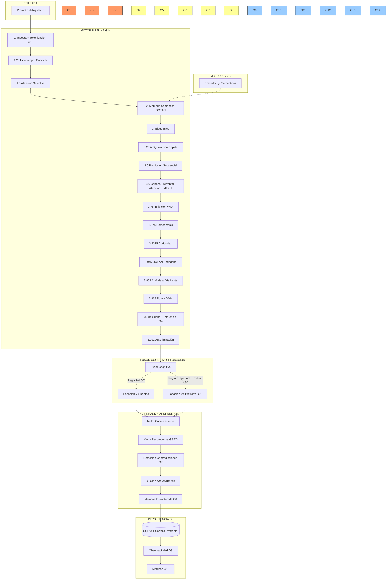

# 🧬 PLAN DE MEJORAS: nexus-puro-engine v5 → v6

> **Diagnóstico**: 2 Junio 2026 — Arquitecto Cris
> **Engine actual**: v5.0.0, 3734 líneas en lib.rs, 663 líneas en motor_transformer.rs
> **14 gaps identificados**, priorizados por impacto y urgencia.
> **Directriz del Arquitecto**: 100% cerebral — se elimina el TinyTransformer, se reemplaza por Corteza Prefrontal Integradora.

---

## 📊 PRIORIZACIÓN

```
FASE 1 (Crítico)  → G1, G2, G3     | Fundamento: sin esto, el engine no evoluciona
FASE 2 (Importante)→ G8, G4, G6, G7 | Capacidades cognitivas superiores
FASE 3 (Importante)→ G5, G12        | Calidad del lenguaje y comprensión
FASE 4 (Menor)    → G9, G11, G10    | Operabilidad y DX
FASE 5 (Menor)    → G13, G14        | Robustez y mantenibilidad
```

---

## 🔴 FASE 1: GAPS CRÍTICOS — Fundamento de Evolución

### G1. Corteza Prefrontal Integradora (Atención Sostenida + Planificación + Memoria de Trabajo)

**Problema**: El [`motor_transformer`](nexus-puro-engine/src/motor_transformer.rs:27) es un injerto de IA clásica (matrices de self-attention) que no encaja en la metáfora cerebral del engine. Además, se reconstruye desde cero cada uso — es ruido congelado.

**Decisión del Arquitecto**: Eliminar el TinyTransformer. Reemplazar con una **Corteza Prefrontal Integradora** — 100% cerebral, basada en competencia de poblaciones del grafo sináptico.

**Solución Propuesta**: `MotorCortezaPrefrontal` — tres funciones ejecutivas del lóbulo frontal humano:

1. **Atención Sostenida (DLPFC)**: mantener foco en un subconjunto de nodos durante múltiples pasos de generación
2. **Memoria de Trabajo (VLPFC)**: buffer de N slots que sostiene conceptos activos entre ciclos de fonación
3. **Planificación Secuencial (RPFC)**: evaluar rutas alternativas en el grafo antes de emitir (lookahead de 2-3 pasos)

**Nuevo archivo**: `nexus-puro-engine/src/motor_corteza_prefrontal.rs`

**Estructura**:
```rust
/// Buffer de memoria de trabajo — análogo al VLPFC.
/// Sostiene 4±1 conceptos activos con decaimiento temporal.
pub struct MemoriaTrabajo {
    pub slots: Vec<(IDNodo, f32)>,  // (concepto, activación), máx 5
    pub decaimiento: f32,           // tasa de decaimiento por ciclo
    pub umbral_desplazamiento: f32, // si activación cae por debajo, liberar slot
}

/// Estado de atención sostenida — análogo al DLPFC.
pub struct AtencionSostenida {
    pub foco_actual: Option<IDNodo>,
    pub duracion_foco: u32,         // cuántos pasos lleva en el mismo foco
    pub max_duracion: u32,          // antes de forzar cambio (previene perseveración)
    pub historial_atencion: Vec<IDNodo>, // últimos 5 focos
}

/// Corteza Prefrontal Integradora completa.
pub struct MotorCortezaPrefrontal {
    pub memoria_trabajo: MemoriaTrabajo,
    pub atencion: AtencionSostenida,
}

impl MotorCortezaPrefrontal {
    /// FASE 1: Actualizar memoria de trabajo con los nodos activos del prompt.
    /// Slot más relevante = mayor energía * peso sináptico entrante.
    pub fn actualizar_memoria_trabajo(&mut self, grafo: &GrafoSinapsis, ids_activos: &[IDNodo]);

    /// FASE 2: Seleccionar foco de atención desde la memoria de trabajo.
    /// Prioriza nodos con alta energía + baja refractariedad + relevancia al prompt.
    pub fn enfocar(&mut self, grafo: &GrafoSinapsis, prompt: &str) -> Option<IDNodo>;

    /// FASE 3: Planificación secuencial — evaluar N pasos adelante.
    /// Desde el foco actual, simular cadenas de Markov de longitud 2-3.
    /// Retorna la ruta con mayor score acumulado (peso * energía * diversidad).
    pub fn planificar(&self, grafo: &GrafoSinapsis, desde: &IDNodo, pasos: usize) -> Vec<(IDNodo, f32)>;

    /// Decaimiento natural de la memoria de trabajo (cada ciclo).
    pub fn decaer(&mut self);

    /// Serializar/deserializar para persistencia (G3).
    pub fn a_estado(&self) -> String;  // JSON con slots + foco
    pub fn desde_estado(estado: &str) -> Self;
}
```

**Mecanismo de aprendizaje**:
- La memoria de trabajo refuerza sinapsis entre los conceptos que co-residen en slots (Hebbiano: "neurons that fire together wire together")
- La atención sostenida incrementa `traza` de los nodos enfocados (+0.05 por paso), lo que acelera su STDP
- La planificación genera predicciones que, si se confirman, refuerzan las rutas usadas (aprendizaje por expectativa)

**Cambios en [`lib.rs`](nexus-puro-engine/src/lib.rs)**:
- Agregar `pub mod motor_corteza_prefrontal;`
- Agregar campo `corteza_prefrontal: MotorCortezaPrefrontal` a `NexoPuroEngine`
- En [`procesar()`](nexus-puro-engine/src/lib.rs:2991):
  - Etapa 3.6 (después de Predicción): `self.corteza_prefrontal.actualizar_memoria_trabajo()` y `self.corteza_prefrontal.enfocar()`
  - Etapa 4.0 (antes de Fonación): `self.corteza_prefrontal.planificar()` para guiar la generación V4
  - Etapa 5.0 (después de aprendizaje): `self.corteza_prefrontal.decaer()`
- Eliminar campo `motor_transformer` de `NexoPuroEngine`

**Cambios en Fusor Cognitivo**:
- Eliminar `ViaRespuesta::Transformer`
- El Fusor ahora decide entre dos modos de V4: `V4Rapido` (sin planificación) vs `V4Prefrontal` (con planificación)
- Reglas actualizadas: alarmas altas → V4Rapido, apertura alta + nodos > 30 → V4Prefrontal

**Archivos a modificar**: `lib.rs` (~60 líneas modificadas), nuevo `motor_corteza_prefrontal.rs` (~250 líneas)
**Archivo a deprecar**: `motor_transformer.rs` se mantiene (no se borra para no romper historial) pero se elimina `pub mod motor_transformer` y `motor_transformer: Option<TinyTransformer>`
**Tests requeridos**: 5 tests (memoria trabajo actualiza slots, atención cambia foco tras max_duracion, planificación encuentra ruta óptima, decaimiento libera slots, Hebbiano refuerza co-residentes)

---

### G2. Motor de Feedback de Coherencia (Auto-Evaluación)

**Problema**: El engine genera texto sin saber si es coherente. No hay ciclo de retroalimentación que guíe el aprendizaje.

**Solución Propuesta**: `MotorCoherencia` — 3 métricas de auto-evaluación con impacto en STDP.

**Nuevo archivo**: `nexus-puro-engine/src/motor_coherencia.rs`

**Métricas**:
1. **Repetición**: % de tokens que aparecen >1 vez en la respuesta → penaliza loop
2. **Relevancia contextual**: solapamiento de conceptos entre prompt y respuesta → refuerza pertinencia
3. **Consistencia temporal**: comparar respuesta actual contra historial → detecta contradicción flagrante

**Integración en pipeline** (etapa 4.5, después de fonación, antes de aprendizaje):
```rust
let score_coherencia = MotorCoherencia::evaluar(&respuesta, prompt, &self.historial_dialogo);
// score_coherencia modula tasa de aprendizaje:
let tasa_efectiva = tasa_ocean * (0.5 + score_coherencia * 0.5);
```

**Estructura**:
```rust
pub struct MotorCoherencia;
impl MotorCoherencia {
    /// Evalúa coherencia y devuelve score [0.0, 1.0]
    pub fn evaluar(respuesta: &str, prompt: &str, historial: &[String]) -> f32;
    /// Detecta contradicciones flagrantes (boolean)
    pub fn detectar_contradiccion(respuesta: &str, historial: &[String]) -> bool;
}
```

**Archivos a crear/modificar**: `motor_coherencia.rs` (~150 líneas), `lib.rs` (+ `pub mod motor_coherencia;`, ~20 líneas en procesar)  
**Tests requeridos**: 5 tests (repetición cero, relevancia alta, contradicción detectada, score en rango, score modula tasa)

---

### G3. Serialización Completa del Estado

**Problema**: Al reiniciar, el engine pierde: buffer episódico, historial de diálogo, estado OCEAN (vuelve a 0.5 neutral), estado de la Corteza Prefrontal (memoria de trabajo + foco de atención), contadores internos.

**Solución Propuesta**: Tablas SQLite adicionales + carga completa en `new()`.

**Nuevas tablas en `puro_engine`**:
```sql
CREATE TABLE IF NOT EXISTS puro_estado (
    clave TEXT PRIMARY KEY,
    valor TEXT NOT NULL
);
-- Ejemplos: ocean_0..4, ciclo_actual, ciclos_sin_sueno, alarma

CREATE TABLE IF NOT EXISTS puro_episodios (
    id INTEGER PRIMARY KEY AUTOINCREMENT,
    secuencia TEXT NOT NULL,  -- JSON array de IDs
    timestamp TEXT NOT NULL
);

CREATE TABLE IF NOT EXISTS puro_historial (
    id INTEGER PRIMARY KEY AUTOINCREMENT,
    entrada TEXT NOT NULL,
    timestamp TEXT NOT NULL
);

CREATE TABLE IF NOT EXISTS puro_corteza_prefrontal (
    clave TEXT NOT NULL,     -- 'memoria_trabajo_slot_0', 'atencion_foco', 'atencion_duracion', etc.
    idx INTEGER NOT NULL,
    valor TEXT NOT NULL,
    PRIMARY KEY (clave, idx)
);
```

**Cambios en [`lib.rs`](nexus-puro-engine/src/lib.rs)**:
- [`NexoPuroEngine::new()`](nexus-puro-engine/src/lib.rs:2757): cargar OCEAN, episodios, historial, estado prefrontal
- [`guardar_grafo_en_db()`](nexus-puro-engine/src/lib.rs:2941): renombrar a `persistir_estado()` y guardar TODO
- Nuevo método `cargar_estado()`: restaurar desde DB

**Archivos a modificar**: `lib.rs` (~120 líneas modificadas/añadidas)
**Tests requeridos**: 4 tests (persistir y cargar OCEAN, persistir y cargar episodios, persistir y cargar historial, roundtrip completo no pierde datos)

---

## 🟡 FASE 2: CAPACIDADES COGNITIVAS SUPERIORES

### G8. Motor de Recompensa (TD-Learning Dopaminérgico)

**Problema**: El aprendizaje es puramente Hebbiano por co-ocurrencia. No hay señal de recompensa que refuerce comportamientos deseables.

**Solución Propuesta**: `MotorRecompensa` — Señal dopaminérgica basada en TD(λ).

**Nuevo archivo**: `nexus-puro-engine/src/motor_recompensa.rs`

**Mecanismo**:
1. **Recompensa intrínseca**: novedad (traza baja → recompensa alta), coherencia alta, reducción de tensión
2. **Recompensa extrínseca**: confirmación de predicción acertada, input positivo del usuario
3. **TD-error**: `δ = r + γ·V(s') − V(s)` donde V es el valor estimado del estado
4. **Elegibilidad de traza**: `e(s,a) *= γλ`, decae si no se refuerza
5. **Crédito temporal**: reforzar acciones que precedieron a la recompensa (eligibility trace)

**Estructura**:
```rust
pub struct MotorRecompensa {
    pub valor_estado: f32,        // V(s) actual
    pub td_error: f32,            // δ de Temporal Difference
    pub trazas_elegibilidad: HashMap<IDNodo, f32>, // eligibility traces
    pub recompensa_acumulada: f32, // suma de recompensas este ciclo
}

impl MotorRecompensa {
    pub fn calcular_recompensa_intrinseca(novedad: f32, coherencia: f32, delta_tension: f32) -> f32;
    pub fn actualizar_td(&mut self, recompensa: f32, gamma: f32, lambda: f32);
    pub fn modular_stdp(&self) -> f32; // factor multiplicador para STDP
}
```

**Integración**: Después de MotorCoherencia, antes de STDP. La recompensa modula la tasa de aprendizaje y refuerza los nodos que contribuyeron al resultado positivo.

**Archivos a crear/modificar**: `motor_recompensa.rs` (~200 líneas), `lib.rs` (+mod, ~30 líneas en procesar)  
**Tests requeridos**: 5 tests (TD-error converge, eligibility trace decae, recompensa intrínseca positiva con coherencia, recompensa negativa con contradicción, modulación STDP)

---

### G4. Generalización Transitiva (Inferencia por Grafos)

**Problema**: Si "perro"→"animal" y "gato"→"animal", el engine no infiere similitud entre "perro" y "gato".

**Solución Propuesta**: `MotorInferencia` — Random Walks + Node Co-occurrence Matrix.

**Nuevo archivo**: `nexus-puro-engine/src/motor_inferencia.rs`

**Algoritmo**:
1. **Random Walks**: 10 walks de longitud 5 desde cada nodo concepto con peso > 0.1
2. **Matriz de co-ocurrencia**: contar cuántas veces dos nodos aparecen en la misma ventana de walk
3. **Similitud**: normalizar por frecuencia individual → scores de afinidad
4. **Propagación**: si A≈B (score > 0.6) y A→X, entonces reforzar B→X con peso atenuado

**Estructura**:
```rust
pub struct MotorInferencia;

impl MotorInferencia {
    /// Ejecuta random walks y construye matriz de co-ocurrencia
    pub fn ejecutar_walks(grafo: &GrafoSinapsis, num_walks: usize, walk_len: usize) -> HashMap<(IDNodo, IDNodo), f32>;
    
    /// Propaga inferencias transitivas: si A≈B y A→X, crea/refuerza B→X
    pub fn propagar_inferencias(grafo: &mut GrafoSinapsis, umbral_similitud: f32);
}
```

**Integración**: Se ejecuta durante el sueño (MotorSueno), no en cada ciclo. Es costoso computacionalmente.

**Archivos a crear/modificar**: `motor_inferencia.rs` (~180 líneas), `lib.rs` (+mod, ~5 líneas en MotorSueno)  
**Tests requeridos**: 3 tests (walks generan co-ocurrencias, similitud detecta transitividad, propagación crea enlace inferido)

---

### G6. Memoria Estructurada a Largo Plazo (Hechos + Jerarquía)

**Problema**: El grafo actual es plano — no distingue hechos, categorías, ni tiene noción temporal.

**Solución Propuesta**: `MotorMemoriaEstructurada` — Triple Store + Jerarquía + Timestamps.

**Nuevo archivo**: `nexus-puro-engine/src/motor_memoria_estructurada.rs`

**Estructuras**:
```rust
/// Hecho declarativo: sujeto → predicado → objeto
pub struct Hecho {
    pub sujeto: IDNodo,
    pub predicado: IDNodo,
    pub objeto: IDNodo,
    pub confianza: f32,       // [0,1]
    pub timestamp_creado: i64,
    pub timestamp_ultimo_acceso: i64,
    pub contador_uso: u32,
}

/// Relación jerárquica entre conceptos
pub enum RelacionJerarquica {
    Hiperonimo,   // "animal" es hiperónimo de "perro"
    Hiponimo,     // "perro" es hipónimo de "animal"
    Sinonimo,     // ya cubierto parcialmente por auto_limitar A3
    Antonimo,
}

pub struct MotorMemoriaEstructurada {
    pub hechos: Vec<Hecho>,
    pub jerarquia: HashMap<(IDNodo, IDNodo), RelacionJerarquica>,
}
```

**Operaciones**:
1. `registrar_hecho(sujeto, predicado, objeto)`: inserta o actualiza confianza
2. `consultar_hecho(sujeto, predicado) -> Vec<Hecho>`: recupera objetos
3. `responder_pregunta(texto) -> Option<String>`: extrae sujeto+predicado y busca
4. `extraer_hechos_de_prompt(prompt) -> Vec<Hecho>`: parseo simple de patrones ("X es Y", "X tiene Y")
5. `establecer_hiperonimo(concepto, categoria)`: registra relación jerárquica
6. `heredar_propiedades(concepto)`: si "perro" es hipónimo de "animal", hereda las propiedades de "animal"

**Integración**: Después de Ingesta, analizar el prompt en busca de hechos nuevos. Durante la fonación, consultar hechos relevantes.

**Archivos a crear/modificar**: `motor_memoria_estructurada.rs` (~300 líneas), `lib.rs` (+mod, ~30 líneas en procesar)  
**Tests requeridos**: 5 tests (registrar y consultar hecho, herencia de propiedades, extraer hecho de prompt, confianza incrementa con uso, timestamp se actualiza)

---

### G7. Detección de Contradicciones

**Problema**: El engine puede aprender "A→B" y "A→¬B" sin detectar conflicto. Ambas sinapsis coexisten.

**Solución Propuesta**: Extensión de `MotorCoherencia` con `ResolverConflictos`.

**Mecanismo**:
1. **Detección**: al insertar/fortalecer enlace A→B, buscar si existe A→C donde C es antónimo de B (o B→X y C inhibe X)
2. **Resolución por competencia**: reforzar la sinapsis con más evidencia (mayor peso acumulado + frecuencia)
3. **Resolución por origen**: si un hecho viene de enseñanza explícita y el otro de inferencia, gana la enseñanza
4. **Señal de incongruencia**: subir Tensión cuando hay conflicto no resuelto (motor epistémico)

**Estructura** (extiende `MotorCoherencia`):
```rust
impl MotorCoherencia {
    pub fn detectar_conflicto(grafo: &GrafoSinapsis, nuevo: &IDNodo, destino: &IDNodo) -> Option<(IDNodo, f32)>;
    pub fn resolver_conflicto(grafo: &mut GrafoSinapsis, a: &IDNodo, b: &IDNodo, c: &IDNodo) -> IDNodo;
}
```

**Archivos a modificar**: `motor_coherencia.rs` (+80 líneas), `lib.rs` (usar en STDP/reforzar_coocurrencia)  
**Tests requeridos**: 3 tests (detecta conflicto simple, resuelve a favor del más fuerte, tensión sube con conflicto irresuelto)

---

## 🟡 FASE 3: CALIDAD DEL LENGUAJE

### G5. Embeddings Semánticos (FastText-like)

**Problema**: Los embeddings SHA256→sinusoidal no capturan similitud semántica. "rey" y "reina" tienen vectores no correlacionados.

**Solución Propuesta**: Reemplazar `embedding_sintetico()` con embeddings aprendidos del grafo.

**Nuevo archivo**: `nexus-puro-engine/src/embeddings.rs`

**Estrategia híbrida**:
1. **Subword n-gram hashing** (FastText): descomponer palabra en character n-grams (3≤n≤6), hashear cada uno, sumar
2. **Graph embedding** (Node2Vec simplificado): usar el grafo sináptico como corpus, skip-gram con negative sampling
3. **Fusión**: `emb_final = 0.6 * emb_subword + 0.4 * emb_graph`

**Estructura**:
```rust
pub struct EmbeddingEngine {
    pub dim: usize,                  // 128 (reducido de 768 para eficiencia)
    pub tabla_hash: Vec<[f32; 128]>, // embeddings por bucket de n-gram
    pub embeddings_nodo: HashMap<IDNodo, Vec<f32>>, // aprendidos del grafo
    pub entrenado: bool,
}

impl EmbeddingEngine {
    pub fn embedding_subword(palabra: &str) -> Vec<f32>;
    pub fn entrenar_desde_grafo(&mut self, grafo: &GrafoSinapsis);
    pub fn embedding_nodo(&self, id: &IDNodo) -> Vec<f32>;
    pub fn similitud(a: &[f32], b: &[f32]) -> f32;
}
```

**Integración**: Reemplazar `MotorMemoria::embedding_sintetico()`. El nuevo `EmbeddingEngine::embedding_nodo()` servirá tanto para Memoria Semántica como para la Atención Prefrontal (similitud entre conceptos en el grafo).

**Archivos a crear/modificar**: `embeddings.rs` (~250 líneas), `lib.rs` (+mod, modificar MotorMemoria)  
**Tests requeridos**: 4 tests (similitud semántica "rey"≈"reina", subword maneja OOV, entrenamiento desde grafo converge, embedding es determinista)

---

### G12. Tokenización Mejorada

**Problema**: Split por whitespace + filtro ASCII. Sin NFKD, sin stemming, sin subword.

**Solución Propuesta**: `MotorTokenizacion` con pipeline de 3 etapas.

**Nuevo archivo**: `nexus-puro-engine/src/motor_tokenizacion.rs`

**Pipeline**:
1. **NFKD Normalization**: `unicode-normalization` (ya en dependencias vía nexus-puro-engine? No, hay que implementar nativo)
2. **Filtro de puntuación inteligente**: preservar signos significativos (¿?, ¡!, ...)
3. **Stemming ligero español**: reglas básicas (-mente, -ción, -dad, -ismo, -ito/-ita, -ísimo, plural -s/-es)
4. **Subword fallback**: palabras >15 chars → dividir en chunks de 8 chars con solapamiento

```rust
pub struct MotorTokenizacion;

impl MotorTokenizacion {
    pub fn normalizar(texto: &str) -> String;
    pub fn tokenizar(texto: &str) -> Vec<String>;
    pub fn stem_espanol(palabra: &str) -> String;
}
```

**Integración**: Usar en `MotorIngesta::procesar_entrada()`.

**Archivos a crear/modificar**: `motor_tokenizacion.rs` (~180 líneas), `lib.rs` (+mod, ~5 líneas en MotorIngesta)  
**Tests requeridos**: 5 tests (NFKD quita tildes, stemming reduce "casamiento"→"casar", subword divide palabra larga, puntuación significativa preservada, tokenización no produce strings vacíos)

---

## 🔵 FASE 4: OPERABILIDAD Y DX

### G9. API de Observabilidad

**Problema**: No hay hooks ni eventos para monitorear el estado interno desde fuera del engine.

**Solución Propuesta**: `MotorObservabilidad` — Event bus interno + snapshots.

**Nuevo archivo**: `nexus-puro-engine/src/motor_observabilidad.rs`

```rust
pub enum EventoEngine {
    CicloIniciado { prompt: String, ciclo: u64 },
    FonacionGenerada { respuesta: String, via: ViaRespuesta, tokens: usize },
    AlarmaActivada { nivel: f32, conducta: String },
    NodoPodado { id: IDNodo, razon: String },
    SinapsisCreada { origen: IDNodo, destino: IDNodo, peso: f32 },
    OceanoActualizado { ejes: [f32; 5] },
    ErrorRecuperable { mensaje: String },
}

pub struct MotorObservabilidad {
    pub suscriptores: Vec<Box<dyn Fn(&EventoEngine)>>,
    pub ultimos_eventos: Vec<EventoEngine>, // buffer circular 100
    pub snapshot_actual: Option<SnapshotEngine>,
}

pub struct SnapshotEngine {
    pub total_nodos: usize,
    pub total_sinapsis: usize,
    pub densidad: f32,
    pub ocean: [f32; 5],
    pub alarma: f32,
    pub tasa_aprendizaje_efectiva: f32,
}
```

**Archivos a crear/modificar**: `motor_observabilidad.rs` (~150 líneas), `lib.rs` (+mod, hooks en procesar)  
**Tests requeridos**: 2 tests (evento emitido, snapshot consistente)

---

### G11. Métricas de Introspección

**Problema**: Sin visibilidad de la salud interna del engine.

**Solución Propuesta**: Extender `MotorObservabilidad` con `MotorMetricas`.

**Métricas calculables**:
```rust
pub struct MetricasEngine {
    // Grafo
    pub nodos_concepto: usize,
    pub nodos_totales: usize,
    pub sinapsis_totales: usize,
    pub densidad_grafo: f32,         // |E| / (|V|²)
    pub grado_promedio: f32,
    
    // OCEAN
    pub ocean_actual: [f32; 5],
    pub ocean_tendencia: [f32; 5],   // delta vs ciclo anterior
    
    // Aprendizaje
    pub tasa_aprendizaje_media: f32,
    pub ciclos_desde_ultima_poda: u64,
    pub nodos_podados_total: u64,
    
    // Conducta (modos de generación cerebral)
    pub ratio_v4rapido_vs_v4prefrontal: f32,
    pub tokens_promedio_respuesta: f32,
    pub porcentaje_silencio: f32,     // respuestas "escucho"
    
    // Memoria
    pub episodios_almacenados: usize,
    pub entradas_historial: usize,
}
```

**Archivos a modificar**: `motor_observabilidad.rs` (+80 líneas), `lib.rs` (+10 líneas para recolectar)  
**Tests requeridos**: 1 test (métricas se calculan sin panick)

---

### G10. Streaming de Tokens

**Problema**: [`procesar()`](nexus-puro-engine/src/lib.rs:2991) es bloqueante. Para UI interactiva, se necesitan tokens incrementalmente.

**Solución Propuesta**: Método `procesar_stream()` que devuelve un iterador.

**Nuevo método en `NexoPuroEngine`**:
```rust
pub fn procesar_stream(&mut self, prompt: &str) -> MotorFonacionStream {
    // Ejecuta pipeline hasta fonación, luego devuelve iterador
    MotorFonacionStream {
        engine: self,
        buffer: VecDeque::new(),
        generando: true,
        rng: 0x9E37_79B9_7F4A_7C15u64,
        // ...
    }
}

pub struct MotorFonacionStream<'a> {
    engine: &'a mut NexoPuroEngine,
    buffer: VecDeque<String>,
    generando: bool,
    rng: u64,
    // ... estado de generación V4
}

impl<'a> Iterator for MotorFonacionStream<'a> {
    type Item = String;
    fn next(&mut self) -> Option<String> {
        // Generar siguiente token y devolverlo
    }
}
```

**Archivos a modificar**: `lib.rs` (~120 líneas nuevas), posible nuevo archivo `motor_fonacion_stream.rs`  
**Tests requeridos**: 2 tests (stream produce tokens incrementales, stream termina correctamente)

---

## 🔵 FASE 5: ROBUSTEZ Y MANTENIBILIDAD

### G13. Tests Exhaustivos

**Problema**: ~20 unit tests para 3734 líneas. Cobertura < 15%.

**Solución Propuesta**: 3 capas de testing.

**Capa 1 — Unit Tests (+30 tests)**:
- MotorInhibicion: winner consistente, empate resuelve, inhibición reduce competidores
- MotorHomeostasis: techo, piso, fatiga de dominante
- MotorCuriosidad: candidatos energizados, auto-modulación
- MotorRumia: ciclos sin input, umbral de activación
- MotorSueno: replay fortalece, poda selectiva
- MotorHipocampo: codificación correcta, pattern completion, buffer límite
- MotorAmigdala: fase rápida, fase lenta cada conducta, condicionamiento de miedo
- Fusor Cognitivo: cada regla de decisión
- MotorPrediccion: 1er salto, 2do salto, sin predicción sin enlaces
- MotorCortezaPrefrontal: actualización de slots, cambio de foco, planificación de rutas

**Capa 2 — Integration Tests (~8 tests)**:
- Ciclo completo con input vacío → escucho
- 20 ciclos de enseñanza → el engine recuerda
- Estrés: 1000 nodos concepto, auto_limitar no crashea
- Persistencia: guardar, recargar, misma respuesta
- OCEAN converge a valores estables tras 100 ciclos
- Amígdala: alarma alta → congelamiento, sin fonación
- Historial de diálogo: contexto de 6 entradas afecta respuesta
- Pipeline completo no pierde memoria entre ciclos

**Capa 3 — Property-Based Tests (~5 tests)**:
- `auto_limitar` nunca incrementa el número de nodos
- `podar_sinapsis` nunca deja nodos huérfanos con energía
- `stpd_exponencial` mantiene pesos en [-1, 1]
- `procesar` nunca panickea con cualquier input UTF-8
- `guardar_grafo_en_db` + `cargar_grafo_desde_db` es idempotente

**Archivos a modificar**: `lib.rs` (sección tests, +600 líneas), `motor_corteza_prefrontal.rs` (+50 líneas tests)  
**Nuevo archivo**: `tests/integration_tests.rs`

---

### G14. Pipeline Modular (Plugin System)

**Problema**: Agregar un motor nuevo requiere modificar [`procesar()`](nexus-puro-engine/src/lib.rs:2991) a mano. Sin sistema de registro dinámico.

**Solución Propuesta**: `MotorPipeline` — Sistema de etapas con prioridad.

**Estructura**:
```rust
pub type EtapaFn = fn(&mut ContextoPipeline) -> ResultadoEtapa;

pub struct EtapaPipeline {
    pub nombre: &'static str,
    pub prioridad: f32,        // orden de ejecución (1.0, 1.25, 1.5, ...)
    pub habilitada: bool,
    pub ejecutar: EtapaFn,
}

pub struct ContextoPipeline<'a> {
    pub engine: &'a mut NexoPuroEngine,
    pub prompt: &'a str,
    pub prompt_contextual: String,
    pub ids_sensoriales: Vec<IDNodo>,
    pub ocean: [f32; 5],
    pub alarma: f32,
    pub respuesta: Option<String>,
    pub via_respuesta: Option<ViaRespuesta>,
}

pub struct MotorPipeline {
    pub etapas: Vec<EtapaPipeline>,
}

impl MotorPipeline {
    pub fn default_pipeline() -> Self; // Las 14 etapas actuales
    pub fn registrar(&mut self, etapa: EtapaPipeline);
    pub fn ejecutar(&mut self, ctx: &mut ContextoPipeline) -> String;
}
```

**Refactor**: [`procesar()`](nexus-puro-engine/src/lib.rs:2991) delega en `MotorPipeline::default_pipeline().ejecutar()`.

**Archivos a crear/modificar**: `motor_pipeline.rs` (~200 líneas), `lib.rs` (+mod, refactor procesar ~50 líneas)  
**Tests requeridos**: 3 tests (pipeline default produce mismo resultado, etapa deshabilitada se omite, orden por prioridad respetado)

---

## 📋 RESUMEN DE IMPACTO

| Gap | Descripción | Archivos | Líneas est. | Tests |
|-----|-------------|----------|-------------|-------|
| **G1** | Corteza Prefrontal Integradora | 2 | +250 | 5 |
| **G2** | Motor Coherencia | 1 nuevo | +150 | 5 |
| **G3** | Serialización completa | 1 | +120 | 4 |
| **G8** | Motor Recompensa TD | 1 nuevo | +200 | 5 |
| **G4** | Inferencia transitiva | 1 nuevo | +180 | 3 |
| **G6** | Memoria estructurada LP | 1 nuevo | +300 | 5 |
| **G7** | Detección contradicciones | 1 mod | +80 | 3 |
| **G5** | Embeddings semánticos | 1 nuevo | +250 | 4 |
| **G12** | Tokenización mejorada | 1 nuevo | +180 | 5 |
| **G9** | Observabilidad | 1 nuevo | +150 | 2 |
| **G11** | Métricas introspección | 1 mod | +80 | 1 |
| **G10** | Streaming tokens | 1 | +120 | 2 |
| **G13** | Tests exhaustivos | 2 | +700 | +43 |
| **G14** | Pipeline modular | 1 nuevo | +200 | 3 |

**TOTAL ESTIMADO**: ~2,960 líneas nuevas + ~700 líneas de tests + 89 tests nuevos

---

## 🔗 DIAGRAMA DE ARQUITECTURA POST-MEJORAS



---

## 🎯 ORDEN DE EJECUCIÓN RECOMENDADO

```
DÍA 1: G3 (Serialización) + G1 inicio (estructura Corteza Prefrontal + persistencia)
DÍA 2: G1 completo (Planificación + integración con Fusor Cognitivo) + G2 (Motor Coherencia)
DÍA 3: G8 (Motor Recompensa) + G4 (Inferencia Transitiva)
DÍA 4: G6 (Memoria Estructurada) + G7 (Contradicciones)
DÍA 5: G5 (Embeddings) + G12 (Tokenización)
DÍA 6: G9 (Observabilidad) + G10 (Streaming) + G11 (Métricas)
DÍA 7: G13 (Tests) + G14 (Pipeline)
```

---

_Este plan está listo para revisión y ejecución. Cada gap es independiente y puede implementarse en paralelo si se desea._
