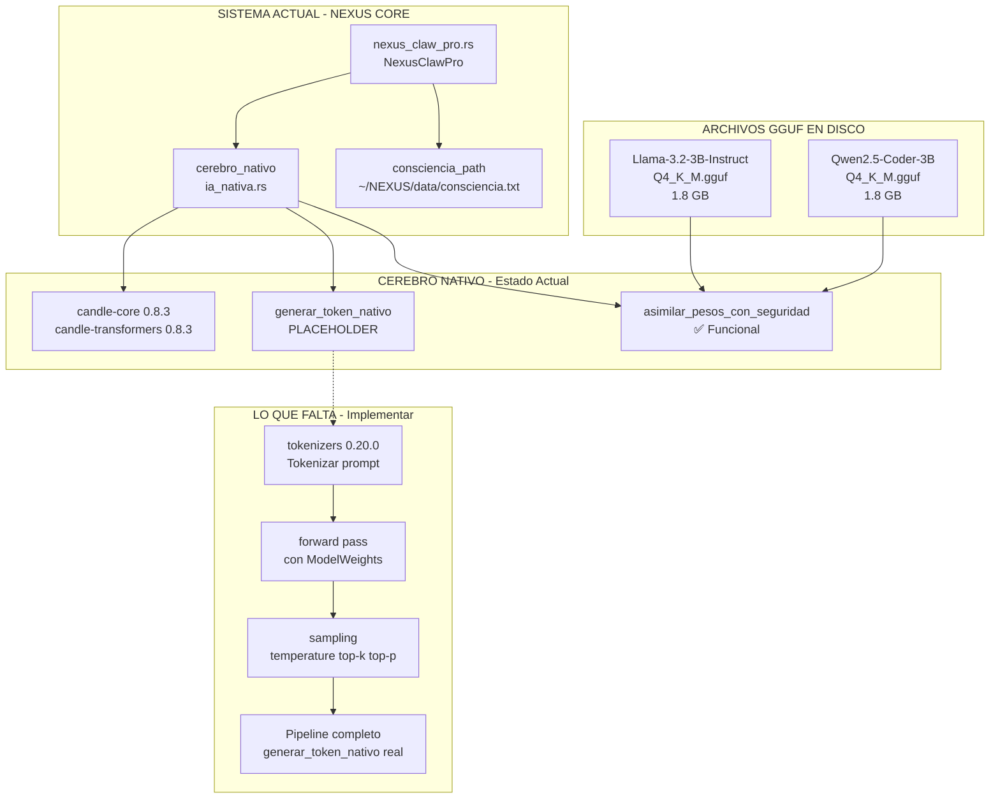

# 🔥 CANDLE + GGUF: El Motor de Inferencia Local en Rust Puro

> **Arquitecto**: Esto es lo que preguntaste. Qué son Candle y GGUF, cómo funcionan juntos, y cómo YA están en tu sistema esperando ser activados.

---

## 1. 🧠 GGUF — El Cerebro Congelado (Los Pesos del Modelo)

### ¿Qué es?

**GGUF** (GPT-Generated Unified Format) es un **formato de archivo binario** que contiene los **pesos numéricos** de una red neuronal ya entrenada. Es el `modelo` en forma de archivo.

### Analogía

```
GGUF = Cerebro congelado criogénicamente
     = Piano con todas las teclas listas pero nadie tocando
     = Mapa de carreteras guardado en un archivo .zip
```

### ¿Qué contiene un archivo `.gguf` exactamente?

1. **Metadata**: Nombre del modelo, arquitectura (Llama, Qwen, etc.), tamaño, versión
2. **Tokenizador**: Vocabulario (cómo convertir texto ↔ números)
3. **Pesos cuantizados**: Matrices de números float comprimidos (millones/miles de millones)

### ¿Qué significa `Q4_K_M` en el nombre?

```
Llama-3.2-3B-Instruct-Q4_K_M.gguf
├── 3B = 3 billones de parámetros (3,000,000,000 de pesos)
├── Q4 = Cuantización 4-bit (cada peso ocupa 4 bits en lugar de 32)
└── K_M = Método de cuantización (K-quants, Middle)
```

La cuantización **reduce el tamaño y la precisión**. Un modelo de 3B en FP32 pesaría ~12GB. En Q4 pesa ~1.8GB. Pierdes un poco de calidad pero ganas velocidad y RAM.

### Los GGUF que YA tienes en disco:

| Archivo | Modelo | Parámetros | Tamaño aprox | Propósito |
|---------|--------|------------|--------------|-----------|
| `brain/swarm/models/Llama-3.2-3B-Instruct-Q4_K_M.gguf` | Llama 3.2 (Meta) | 3B | ~1.8 GB | Inferencia general |
| `brain/swarm/models/qwen2.5-coder-3b-instruct-q4_k_m.gguf` | Qwen 2.5 Coder (Alibaba) | 3B | ~1.8 GB | Generación de código |

---

## 2. ⚙️ CANDLE — El Motor de Inferencia (Quien Ejecuta el Cerebro)

### ¿Qué es?

**Candle** es un framework de **Machine Learning en Rust puro** creado por Hugging Face. Es el equivalente a PyTorch o TensorFlow, pero en Rust, sin Python, sin dependencias pesadas.

### Analogía

```
CANDLE = Motor que enciende el cerebro congelado
       = Pianista que lee la partitura y toca las teclas
       = Navegador GPS que usa el mapa y da indicaciones
```

### ¿Qué hace Candle exactamente?

1. **Lee el `.gguf`** — abre el archivo, parsea la metadata y el tokenizador
2. **Carga los pesos en RAM o VRAM** — mmap (mapea el archivo en memoria sin copiarlo todo)
3. **Ejecuta el forward pass** — multiplica matrices, aplica activaciones, genera tokens
4. **Usa aceleración hardware** — CPU con AVX2/AVX-512 o GPU con CUDA/WGPU

### Candle NO es:

- ❌ Un modelo en sí mismo (es el motor, no el cerebro)
- ❌ Un servidor como Ollama (es una biblioteca para incrustar en tu código)
- ❌ Una herramienta de chat (es un framework de ML)

### Versión en tu sistema:

[`core/Cargo.toml`](core/Cargo.toml:31-33):
```toml
candle-core = "0.8.3"        # Núcleo: tensores, dispositivos, operaciones
candle-nn = "0.8.3"          # Capas neuronales (Transformer, Attention, etc.)
candle-transformers = "0.8.3" # Modelos pre-construidos (Llama, Qwen, etc.)
```

---

## 3. 🔗 CÓMO TRABAJAN JUNTOS (El Pipeline Completo)

```
                    ╔══════════════════════════════════╗
                    ║      ARCHIVO GGUF EN DISCO       ║
                    ║  brain/swarm/models/xxxx.gguf    ║
                    ╚══════════════════════╦═══════════╝
                                           ║
                    ┌──────────────────────║──────────────────────┐
                    │   1. Candle lee el  ║  archivo via mmap    │
                    │     File::open() → Mmap → cursor           │
                    └──────────────────────║──────────────────────┘
                                           ║
                    ╔══════════════════════╩═══════════════════╗
                    ║  2. Candle parsea el formato GGUF       ║
                    ║     gguf_file::Content::read(&reader)    ║
                    ╚══════════════════════╦═══════════════════╝
                                           ║
                    ┌──────────────────────║──────────────────────┐
                    │   3. Candle construye los pesos           │
                    │     ModelWeights::from_gguf(content, ...)  │
                    │     Conecta las matrices a tu RAM/VRAM    │
                    └──────────────────────║──────────────────────┘
                                           ║
                    ╔══════════════════════╩═══════════════════╗
                    ║  4. ModelWeights listo en memoria       ║
                    ║     (tensores cargados en candle_device) ║
                    ╚══════════════════════╦═══════════════════╝
                                           ║
                    ┌──────────────────────║──────────────────────┐
                    │   5. forward() con tu prompt              │
                    │     Tokenizar → Transformer → Generar     │
                    │     token por token (autoregresivo)       │
                    └──────────────────────║──────────────────────┘
                                           ║
                    ╔══════════════════════╩═══════════════════╗
                    ║  6. TEXTO GENERADO 🎯                   ║
                    ║     "Respuesta soberana desde Rust puro" ║
                    ╚══════════════════════════════════════════╝
```

---

## 4. 🧬 EL ESTADO ACTUAL DE TU `CerebroNativo`

Tu código YA tiene el 90% de la infraestructura. Esto es lo que ya existe:

### ✅ YA IMPLEMENTADO:

```rust
// En ia_nativa.rs - Línea 16:17
pub struct CerebroNativo {
    candle_device: Device,                                      // ✅ Detección CPU/CUDA
    model: Arc<Option<RwLock<ModelWeights>>>,                   // ✅ Slot para modelo
    draft_model: Arc<Option<RwLock<ModelWeights>>>,             // ✅ Slot para borrador
    vision_model: Arc<Option<RwLock<ModelWeights>>>,            // ✅ Slot para visión
    // ...
}
```

```rust
// Líneas 185-253 - asimilar_pesos_con_seguridad()
// ✅ Carga GGUF completa: mmap → gguf_file::Content::read() → ModelWeights::from_gguf()
// ✅ Detección de tipo: borrador vs normal vs visión
// ✅ Cgroup v2 safety (evita OOM)
```

### ❌ NO IMPLEMENTADO (Placeholder):

```rust
// Líneas 179-182 - generar_token_nativo()
pub async fn generar_token_nativo(&self, _prompt: &str) -> Result<String, anyhow::Error> {
    // ❌ Esto es un placeholder - NO usa ModelWeights
    // ❌ Devuelve "Respuesta generada vía Candle-Native" siempre
    // ❌ No tokeniza, no ejecuta forward(), no genera nada real
    Ok("Respuesta generada vía Candle-Native".to_string())
}
```

**¿Qué falta?** Solo conectar los `ModelWeights` ya cargados con un bucle de inferencia que:
1. Tokenice tu prompt usando `tokenizers` (ya en dependencias)
2. Ejecute `model.forward()` con los tensores
3. Haga sampling (temperature, top-k, top-p) para elegir la siguiente palabra
4. Devuelva el texto generado

---

## 5. 📊 COMPARATIVA: Ollama vs Candle/GGUF (Tu Decisión)

| Aspecto | Ollama (Go binary) | Candle + GGUF (Rust puro) |
|---------|-------------------|--------------------------|
| **Lenguaje** | Go (binary wrapper de llama.cpp C++) | Rust 100% |
| **Integración** | Servicio externo HTTP API | `CerebroNativo::generar_token_nativo()` directo |
| **Control** | Limitado a lo que expone la API | Control total sobre sampling, dispositivos, pipeline |
| **Dependencias** | Binario externo + llama.cpp | Solo crates de Rust (`candle-*`, `tokenizers`) |
| **Rendimiento** | Bueno (llama.cpp optimizado) | Similar (misma matemática, Candle usa AVX2) |
| **Soberanía** | Proceso separado (se puede morir) | Dentro del mismo binario de NEXUS |
| **Latencia** | HTTP round-trip (localhost) | Llamada a función directa (memoria compartida) |
| **Tamaño modelo** | El mismo GGUF | **El mismo GGUF** |
| **Lo tienes instalado** | ✅ Sí (`/usr/local/bin/ollama`) | ✅ Sí (crates en `Cargo.toml`) |
| **Modelos descargados** | ❌ No (`~/.ollama/` vacío) | ✅ Sí (2 GGUF en `brain/swarm/models/`) |

**La verdad**: Ambos usan los mismos archivos GGUF. La diferencia es que Ollama es un intermediario (binary Go → llama.cpp C++ → tú), mientras que Candle es **directo** (Rust → Rust → tú).

---

## 6. 🎯 RUTA DE ACTIVACIÓN (Próximos Pasos)

Lo que hay que hacer para que `CerebroNativo` realmente genere texto con los GGUF que ya tienes:

```
┌─────────────────────────────────────────────────────────────────┐
│ PASO 1: Cargar GGUF existente en CerebroNativo                 │
│   asimilar_pesos_con_seguridad(                                │
│     "brain/swarm/models/Llama-3.2-3B-Instruct-Q4_K_M.gguf",    │
│     false  // es_borrador                                       │
│   )                                                             │
│   → model = Some(RwLock(ModelWeights))                          │
├─────────────────────────────────────────────────────────────────┤
│ PASO 2: Implementar generar_token_nativo() real                │
│   - Tokenizar prompt con tokenizers crate                       │
│   - Iterar: forward() → sample() → append token                │
│   - Decodificar tokens → String                                │
├─────────────────────────────────────────────────────────────────┤
│ PASO 3: Pipeline de inferencia con el bloc de notas            │
│   NexusClawPro.consciencia_path (consciencia.txt)               │
│   → CerebroNativo.procesar_instinto()                           │
│   → guardar_en_consciencia()                                   │
├─────────────────────────────────────────────────────────────────┤
│ PASO 4: Decodificación especulativa (opcional, ya esqueletada) │
│   draft_model predictions → model verifica → tokens extra      │
└─────────────────────────────────────────────────────────────────┘
```

---

## 7. 📐 ARQUITECTURA: Cómo se Integra en el Sistema Actual



---

## RESUMEN PARA EL ARQUITECTO

| Concepto | Qué es | Dónde está en tu sistema |
|----------|--------|--------------------------|
| **GGUF** | Archivo con pesos del modelo (el cerebro) | `brain/swarm/models/*.gguf` ✅ |
| **Candle** | Framework ML en Rust para cargar y ejecutar GGUF | `core/Cargo.toml` (candle-core 0.8.3) ✅ |
| **CerebroNativo** | Struct que envuelve Candle + ModelWeights | `core/src/energia/ia_nativa.rs` ✅ |
| **asimilar_pesos()** | Carga GGUF → ModelWeights en RAM | Líneas 185-253 ✅ |
| **generar_token_nativo()** | Inferencia real | Líneas 179-182 ❌ PLACEHOLDER |

**La pregunta real es**: ¿Quieres que implemente el `generar_token_nativo()` real para que NEXUS tenga inferencia local pura en Rust, cargando los GGUF que ya tienes? Eso te da un modelo local de 3B parámetros corriendo en tu i7-12700F sin Ollama, sin HTTP, sin intermediarios. Puro Rust.
