# 🔱 FASE 1: PURGA Y UNIFICACIÓN DE NAVEGADORES

> Plan quirúrgico de consolidación del arsenal de navegadores NEXUS.
> Arquitecto: Cris | Orquestador: NEXUS | Fecha: 12-Jun-2026

---

## 🎯 OBJETIVO

Eliminar redundancias en los 3 sistemas de navegador paralelos, unificando
todo bajo un único stack de navegación soberana en Rust puro.

---

## 📊 DIAGNÓSTICO DE REDUNDANCIAS

### BrowserPool Duplicado (🔴 ALTA)

| Archivo | Líneas | Características |
|---------|--------|-----------------|
| [`core/src/infra/browser_pool.rs`](core/src/infra/browser_pool.rs) | 108 | Pool básico, reciclaje 30min, sin ad-block |
| [`shadowcrawl/mcp-server/src/scraping/browser_manager.rs`](shadowcrawl/mcp-server/src/scraping/browser_manager.rs) | 693 | Pool + ad-block + networkidle + auto_scroll + UA pool + mobile mode |

**Decisión:** ShadowCrawl tiene la implementación superior. Migrar el core a usarlo.

### WebClaw HTTP vs WebClawExtractor CDP (🟡 MEDIA)

| Efector | Tipo | Dependencia |
|---------|------|-------------|
| [`webclaw.rs`](core/src/efectores/webclaw.rs) (262 líneas) | HTTP reqwest | Solo red |
| [`webclaw_extractor.rs`](core/src/efectores/webclaw_extractor.rs) (211 líneas) | CDP chromiumoxide | Necesita Brave/Chrome |

**Decisión:** WebClaw HTTP se mantiene como fallback ligero. WebClawExtractor 
se refactoriza para usar el browser_manager unificado de ShadowCrawl.

### NexusClaw Browser Legacy (🟢 BAJA)

[`legacy/nexusclaw/src/tools/browser.rs`](legacy/nexusclaw/src/tools/browser.rs) — 2891 líneas archivadas.
Multi-backend (AgentBrowser, RustNative, ComputerUse, Sovereign, Auto).

**Decisión:** Ya está en `legacy/`. Solo verificar que ningún código activo lo referencia.

---

## 🔪 PASOS QUIRÚRGICOS

### Paso 1: Verificar referencias a NexusClaw Browser legacy

```bash
grep -r "nexusclaw" core/src/ --include="*.rs" | grep -v "legacy/"
grep -r "browser.rs" core/src/ --include="*.rs"
grep -r "BrowserTool" core/src/ --include="*.rs"
```

**Acción:** Si no hay referencias activas → confirmar archivado. Si hay → migrar.

### Paso 2: Extraer browser_manager de ShadowCrawl al core

Crear [`core/src/infra/browser_native.rs`](core/src/infra/browser_native.rs) que envuelva
las capacidades de `shadowcrawl/mcp-server/src/scraping/browser_manager.rs`:

- `find_chrome_executable()` → detección cross-platform
- `build_headless_config()` → flags de stealth
- `random_user_agent()` → pool de 7 UAs realistas
- `wait_until_stable()` → networkidle heurístico
- `auto_scroll()` → trigger lazy content
- `BrowserPool` → pool persistente con tab reuse
- `fetch_html_native()` / `fetch_html_native_mobile()`
- Ad-block patterns (Aho-Corasick)

### Paso 3: Deprecar BrowserPool antiguo

[`core/src/infra/browser_pool.rs`](core/src/infra/browser_pool.rs) → Añadir `#[deprecated]` y redirigir al nuevo.
Actualizar [`webclaw_extractor.rs`](core/src/efectores/webclaw_extractor.rs) para usar el nuevo módulo.

### Paso 4: Refactorizar WebClawExtractor

Cambiar su `BrowserPool` interno por el `BrowserPool` unificado de `browser_native.rs`.
Mantener su lógica específica de Gemini (inyección de cookies, human-like typing).

### Paso 5: Verificar compilación y tests

```bash
cargo build --release -p nexus-ultimate-core 2>&1
cargo test -p nexus-ultimate-core 2>&1
```

### Paso 6: Actualizar documentación

- [`docs/architecture/arsenal.md`](docs/architecture/arsenal.md) — Reflejar la nueva estructura unificada
- [`BITACORA.md`](BITACORA.md) — Registrar el hito de consolidación

---

## 📁 ARCHIVOS A MODIFICAR

| Archivo | Acción | Riesgo |
|---------|--------|--------|
| `core/src/infra/browser_native.rs` | **CREAR** — Módulo unificado | MEDIO |
| `core/src/infra/mod.rs` | **MODIFICAR** — Añadir `pub mod browser_native` | BAJO |
| `core/src/infra/browser_pool.rs` | **MODIFICAR** — Añadir `#[deprecated]` | BAJO |
| `core/src/efectores/webclaw_extractor.rs` | **MODIFICAR** — Usar browser_native | MEDIO |
| `core/src/efectores/webclaw.rs` | **SIN CAMBIOS** — Se mantiene como fallback HTTP | NULO |
| `docs/architecture/arsenal.md` | **MODIFICAR** — Actualizar inventario | BAJO |
| `BITACORA.md` | **MODIFICAR** — Registrar hito | BAJO |

---

## ⚠️ REGLAS DE ORO

1. **Cero dependencias nuevas** — Todo en Rust puro con crates ya existentes
2. **No romper lo que funciona** — WebClaw HTTP se mantiene intacto
3. **ShadowCrawl sigue independiente** — Solo absorbemos su browser_manager, no todo el MCP
4. **Compilación limpia** — `cargo build --release` debe pasar sin warnings

---

## 🔱 DIAGRAMA POST-FASE 1

```mermaid
graph TD
    subgraph CORE["⚡ CORE UNIFICADO"]
        BN["browser_native.rs<br/>BrowserPool unificado<br/>+ stealth + ad-block<br/>+ networkidle + scroll"]
        WC["WebClaw<br/>HTTP fallback<br/>(sin cambios)"]
        WCE["WebClawExtractor<br/>CDP → Gemini<br/>usa browser_native"]
        CC["CookieClaw<br/>Puente SQLite"]
    end

    subgraph SHADOW["🌐 SHADOWCRAWL"]
        BM2["browser_manager.rs<br/>USA browser_native<br/>del core"]
        CDP2["cdp.rs<br/>Stealth pipeline"]
        MCP2["12 MCP handlers"]
    end

    BN --> WCE
    BN --> CDP2
    CC --> WC
    CC --> WCE
    WC --> Gemini
    WCE --> Gemini
    CDP2 --> Web

    style CORE fill:#0d2818,stroke:#00ff88
    style SHADOW fill:#1a0a2e,stroke:#9b59b6
```


