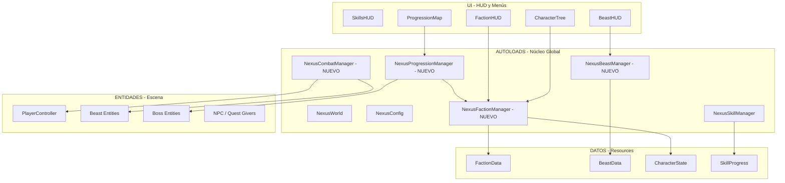
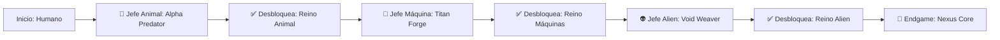
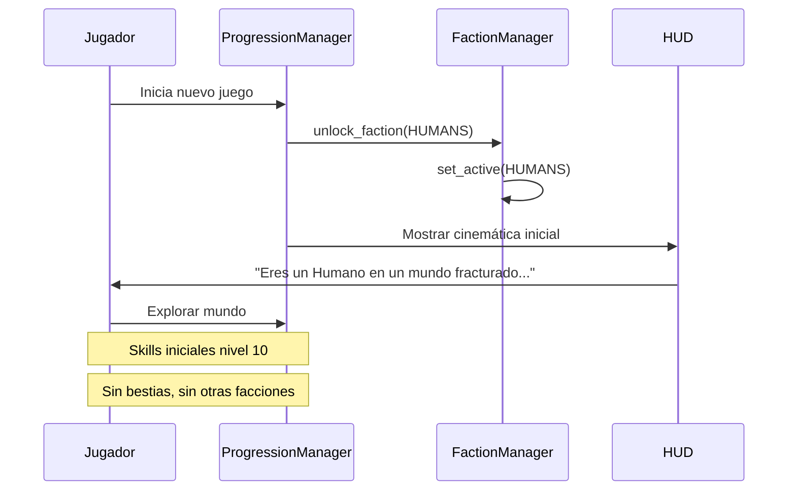
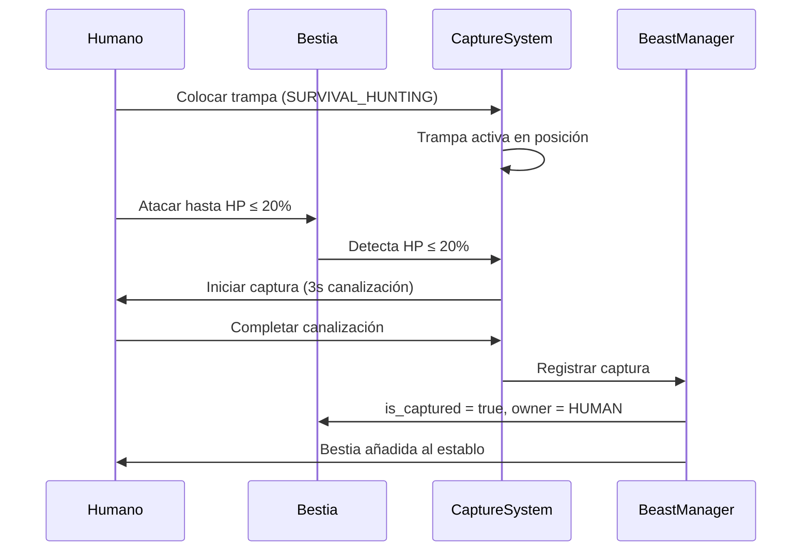
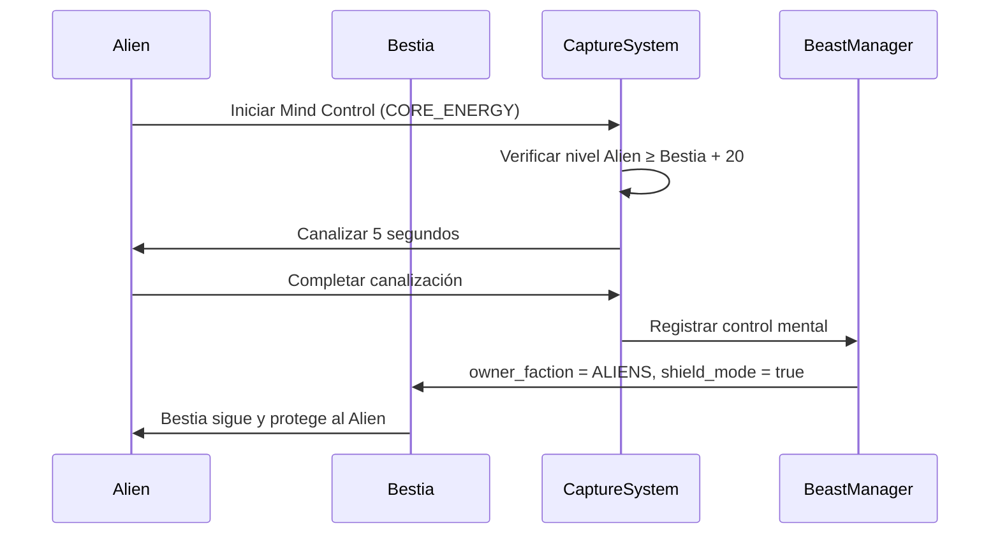
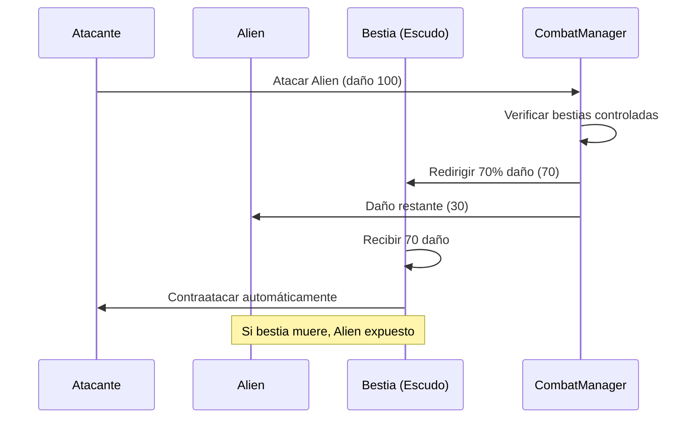
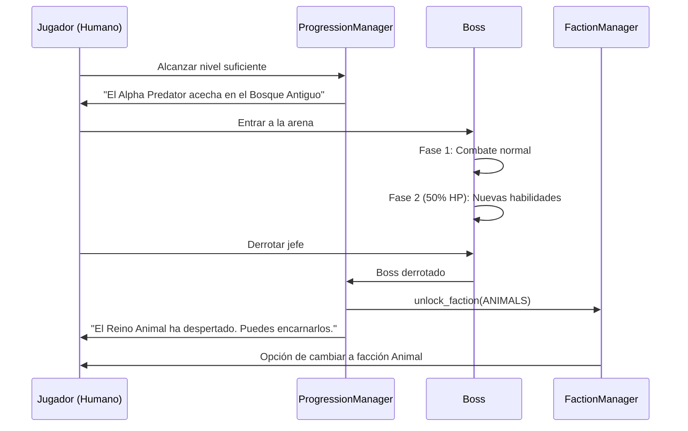

# 🧬 NEXUS Protocol — Fase 2: Especificación Técnica Completa

> **Versión:** 1.0 — Arquitecto Soberano  
> **Proyecto:** NEXUS Protocol (Godot 4.7.1, GL Compatibility, GDScript)  
> **Objetivo:** 4 Reinos + Captura de Bestias + Progresión Offline + Árbol Unificado  
> **Dependencia:** Fase 1 completada (Mundo procedural, PlayerController, Skills Tibia, Chunks)

---

## 📐 ARQUITECTURA GENERAL



---

## 🏛️ 1. SISTEMA DE 4 REINOS (FACTION SYSTEM)

### 1.1 Autoload: `NexusFactionManager`

**Archivo:** [`game/autoload/FactionManager.gd`](game/autoload/FactionManager.gd)

Responsabilidades:
- Estado global de desbloqueo de facciones
- Facción activa del jugador (solo UNA a la vez)
- Transición entre facciones
- Verificación de reglas (misma facción no pelea contra sí misma)

```gdscript
# API Pública prevista
func unlock_faction(faction: FactionType) -> bool
func switch_active_faction(faction: FactionType) -> void
func get_active_faction() -> FactionData
func get_unlocked_factions() -> Array[FactionType]
func can_attack(target_faction: FactionType) -> bool
```

### 1.2 Enum: `FactionType`

| Valor | Nombre | Descripción |
|-------|--------|-------------|
| 0 | `HUMANS` | Ingenio — Crafting, Tácticas, Trampas |
| 1 | `ANIMALS` | Bio-adaptación — Sigilo, Veneno, Evolución |
| 2 | `MACHINES` | Silicio — Energía, Hackeo, Módulos |
| 3 | `ALIENS` | Energía/Dimensión — Psiónico, Fase, Control Mental |

### 1.3 Resource: `FactionData`

**Archivo:** [`game/scripts/factions/FactionData.gd`](game/scripts/factions/FactionData.gd)

```gdscript
class_name FactionData
extends Resource

@export var faction_type: int  # FactionType enum
@export var faction_name: String
@export var description: String
@export var unlocked: bool = false
@export var character_level: int = 1

# Rangos de combate (metros)
@export var short_range_max: float = 3.0
@export var medium_range_max: float = 15.0
@export var long_range_max: float = 40.0

# Bonificadores por facción (%)
@export var melee_bonus: float = 0.0
@export var ranged_bonus: float = 0.0
@export var defense_bonus: float = 0.0
@export var special_bonus: float = 0.0

# Habilidades únicas desbloqueables
@export var unlocked_abilities: Array[String] = []
```

### 1.4 Mecánicas Únicas por Reino

#### 🤖 Machines (Silico)
- **Energía como recurso:** Batería que se recarga con el tiempo o absorbiendo fuentes
- **Módulos intercambiables:** Arms, Legs, Core, Sensor — cada uno altera stats
- **Hackeo:** `CORE_ENERGY` skill aplicado a hackear enemigos mecánicos y puertas
- **Overclock:** Modo temporal de alto rendimiento (más daño, más velocidad, drena batería)
- **Arma corta:** Garras de energía (0-3m)
- **Arma media:** Cañón de pulsos (3-15m)
- **Arma larga:** Railgun (15-40m)

#### 👤 Humans (Ingenio)
- **Crafting:** Combinar recursos del mundo para crear equipo
- **Trampas:** `SURVIVAL_HUNTING` para colocar trampas que inmovilizan bestias
- **Tácticas de grupo:** Bonificación cuando aliados están cerca
- **Curación:** Vendajes y medicina (usa recursos)
- **Arma corta:** Espada/Hacha (0-3m)
- **Arma media:** Ballesta/Arco (3-15m)
- **Arma larga:** Rifle de francotirador (15-40m)

#### 🐺 Animals (Bio-adaptación)
- **Evolución por consumo:** Absorber ADN de enemigos derrotados para mutar
- **Sigilo natural:** Camuflaje en biomas específicos
- **Veneno/Ácido:** Daño sostenido a enemigos
- **Sentidos agudos:** Detección de enemigos a mayor distancia
- **Arma corta:** Garras/Colmillos (0-3m)
- **Arma media:** Púas/Proyectiles orgánicos (3-15m)
- **Arma larga:** Rugido sónico/Aullido (15-40m)

#### 👽 Aliens (Energía/Dimensión)
- **Control mental de bestias:** `CORE_ENERGY` usado para dominar bestias (requiere ≥20 niveles arriba)
- **Escudos vivientes:** Bestias controladas bloquean daño dirigido al Alien
- **Fase:** Evasión temporal (atraviesa ataques, modo ghost)
- **Teletransporte corto:** Movilidad dimensional
- **Arma corta:** Tentáculos psiónicos (0-3m)
- **Arma media:** Pulso telequinético (3-15m)
- **Arma larga:** Proyección astral/Láser mental (15-40m)

---

## 🐉 2. SISTEMA DE BESTIAS Y CAPTURA

### 2.1 Autoload: `NexusBeastManager`

**Archivo:** [`game/autoload/BeastManager.gd`](game/autoload/BeastManager.gd)

Responsabilidades:
- Registro global de todas las bestias activas en escena
- Estado de captura (quién controla qué bestia)
- Verificación de reglas de captura
- Aplicación de escudos vivientes para Aliens
- Pool de spawn por bioma

### 2.2 Resource: `BeastData`

**Archivo:** [`game/scripts/beasts/BeastData.gd`](game/scripts/beasts/BeastData.gd)

```gdscript
class_name BeastData
extends Resource

@export var species_name: String
@export var beast_id: String  # "wolf_alpha", "mecha_hound", etc.
@export var level: int = 1
@export var base_health: float = 100.0
@export var base_damage: float = 10.0
@export var speed: float = 5.0
@export var detection_radius: float = 20.0

# Biomas donde aparece
@export var biomes: Array[String] = ["forest", "plains"]

# Tipo de captura permitida
enum CaptureMethod { NONE, TRAP, MIND_CONTROL, BOTH }
@export var capture_method: int = CaptureMethod.BOTH

# Si es bestia de montura
@export var is_mountable: bool = false

# Dueño actual (para escudos vivientes / control mental)
@export var owner_faction: int = -1  # -1 = salvaje
@export var owner_player_id: String = ""

# Estado de captura
@export var is_captured: bool = false
@export var health_threshold_for_capture: float = 0.2  # 20% para humanos
```

### 2.3 Escena: Beast Entity

**Archivo:** [`game/scenes/beasts/Beast.tscn`](game/scenes/beasts/Beast.tscn)

Componentes:
- `CharacterBody3D` con `Beast.gd` script
- `BeastAI.gd` — comportamientos: patrol, chase, flee, defend_owner
- `HealthComponent` — vida, daño, muerte
- `CaptureDetector` — Area3D que verifica condiciones de captura
- `ShieldEffect` — partículas visuales cuando actúa como escudo de un Alien

### 2.4 Mecánica de Captura

#### Captura Humana (Trampas)
1. Jugador coloca trampa (`SURVIVAL_HUNTING` skill requerido, nivel mínimo)
2. Bestia debe tener HP ≤ 20%
3. Bestia debe estar dentro del radio de la trampa
4. Tiempo de activación: 3 segundos (puede ser interrumpido)
5. Bonificación con aliados cerca (+25% velocidad por aliado)
6. Éxito → bestia capturada, añadida al establo del jugador

#### Captura Alien (Control Mental)
1. Jugador Alien debe ser ≥20 niveles superior a la bestia
2. Usa `CORE_ENERGY` (ataque psiónico canalizado)
3. Tiempo de canalización: 5 segundos (interrumpible)
4. Éxito → bestia controlada, actúa como escudo viviente
5. Máximo de bestias controladas: 1 + (nivel / 20)

#### Reglas de Escudo Viviente (Aliens)
- Mientras la bestia controlada esté viva, 70% del daño dirigido al Alien se redirige a la bestia
- La bestia ataca automáticamente al agresor del Alien
- Si la bestia muere, el Alien queda expuesto (sin escudo)
- Misma facción NO puede atacar a la bestia ni al Alien

---

## ⚔️ 3. SISTEMA DE COMBATE

### 3.1 Autoload: `NexusCombatManager`

**Archivo:** [`game/autoload/CombatManager.gd`](game/autoload/CombatManager.gd)

```gdscript
# API Pública prevista
func register_damage(attacker: Node3D, target: Node3D, damage: float, range_type: int) -> void
func get_range_type(distance: float) -> int  # SHORT, MEDIUM, LONG
func calculate_damage(base_damage: float, attacker_skill: int, target_defense: int, range_bonus: float) -> float
func is_valid_target(attacker_faction: int, target_faction: int) -> bool
func get_beast_shield_redirect(alien: Node3D, damage: float) -> float  # Daño redirigido a bestia
```

### 3.2 Rangos de Combate

| Rango | Distancia | Skills Afectadas | Ejemplo de Arma |
|-------|-----------|------------------|-----------------|
| Corto | 0 - 3m | CLOSE_COMBAT, SHIELDING | Espada, Garras |
| Medio | 3 - 15m | DISTANCE_FIGHTING | Arco, Cañón pulsos |
| Largo | 15 - 40m | DISTANCE_FIGHTING, CORE_ENERGY | Rifle, Psiónico |

### 3.3 Fórmula de Daño

```
daño_final = daño_base * (1 + skill_nivel / 100) * (1 + bono_faccion) * multiplicador_rango

multiplicador_rango:
  - Óptimo (rango natural del arma): 1.0x
  - Fuera de rango óptimo: 0.5x
  - Muy fuera de rango: 0.0x (no alcanza)

defensa = shielding_nivel * 0.5  (% de reducción)
daño_real = daño_final * (1 - min(defensa / 100, 0.75))  # Máx 75% reducción
```

---

## 🗺️ 4. PROGRESIÓN OFFLINE (BOSS SYSTEM)

### 4.1 Autoload: `NexusProgressionManager`

**Archivo:** [`game/autoload/ProgressionManager.gd`](game/autoload/ProgressionManager.gd)

Responsabilidades:
- Secuencia de jefes (orden fijo)
- Estado de progresión guardado en savefile
- Desbloqueo de nuevas facciones al derrotar jefes
- Historia alternativa según facción activa
- Checkpoints y respawn

### 4.2 Secuencia de Jefes



### 4.3 Resource: `BossData`

```gdscript
class_name BossData
extends Resource

@export var boss_id: String
@export var boss_name: String
@export var faction_to_unlock: int  # FactionType
@export var level: int
@export var health: float
@export var abilities: Array[String]
@export var arena_scene: String  # res://scenes/bosses/arena_*.tscn
@export var reward_description: String
@export var story_unlock: String  # Texto de historia al derrotar
```

---

## 🌳 5. ÁRBOL UNIFICADO DE PERSONAJE

### 5.1 Diseño del Árbol

Cada facción tiene UN personaje con UN árbol unificado. No hay clases separadas.

```
PERSONAJE UNIFICADO (ej: Humano)
│
├── 🗡️ Rama Corta (0-3m)
│   ├── [Nv 20] Espada Mejorada → +15% daño corto alcance
│   ├── [Nv 40] Golpe Sísmico → Área alrededor del jugador
│   └── [Nv 60] Ejecución → +50% daño a enemigos <30% HP
│
├── 🏹 Rama Media (3-15m)
│   ├── [Nv 20] Ballesta de Precisión → +10% crítico
│   ├── [Nv 40] Flecha Explosiva → Daño en área
│   └── [Nv 60] Lluvia de Proyectiles → Multi-shot
│
└── 🔮 Rama Larga (15-40m)
    ├── [Nv 20] Mira Avanzada → +20% precisión
    ├── [Nv 40] Disco de Energía → Rebota entre enemigos
    └── [Nv 60] Aniquilación → Daño masivo, largo cooldown
```

### 5.2 Progresión de Skills Tibia por Facción

Los 5 skills base se mantienen pero con nombres temáticos:

| Skill Base | Humans | Machines | Animals | Aliens |
|------------|--------|----------|---------|--------|
| CLOSE_COMBAT | Melee Weapons | Energy Claws | Fangs & Claws | Psionic Tendrils |
| DISTANCE_FIGHTING | Marksmanship | Pulse Cannon | Organic Projectiles | Telekinetic Pulse |
| SHIELDING | Parry & Block | Energy Shield | Natural Armor | Phase Evasion |
| CORE_ENERGY | Tactics | Overclock Core | Bio-Energy | Mind Dominion |
| SURVIVAL_HUNTING | Trapping | Module Crafting | Evolution | Dimensional Rift |

---

## 📁 6. ESTRUCTURA DE ARCHIVOS — FASE 2

```
game/
├── autoload/
│   ├── Config.gd                    # ✓ Existente
│   ├── World.gd                     # ✓ Existente
│   ├── SkillManager.gd              # ✓ Existente (ampliar)
│   ├── FactionManager.gd            # 🆕 NUEVO
│   ├── BeastManager.gd              # 🆕 NUEVO
│   ├── CombatManager.gd             # 🆕 NUEVO
│   └── ProgressionManager.gd        # 🆕 NUEVO
│
├── scripts/
│   ├── player/
│   │   └── PlayerController.gd      # ✓ Existente (ampliar)
│   ├── skills/
│   │   ├── skill_progress.gd        # ✓ Existente
│   │   └── CharacterTree.gd         # 🆕 NUEVO
│   ├── factions/
│   │   ├── FactionData.gd           # 🆕 NUEVO (Resource)
│   │   ├── FactionBase.gd           # 🆕 NUEVO (clase base)
│   │   ├── HumanFaction.gd          # 🆕 NUEVO
│   │   ├── MachineFaction.gd        # 🆕 NUEVO
│   │   ├── AnimalFaction.gd         # 🆕 NUEVO
│   │   └── AlienFaction.gd          # 🆕 NUEVO
│   ├── beasts/
│   │   ├── BeastData.gd             # 🆕 NUEVO (Resource)
│   │   ├── Beast.gd                 # 🆕 NUEVO
│   │   ├── BeastAI.gd               # 🆕 NUEVO
│   │   ├── CaptureSystem.gd         # 🆕 NUEVO
│   │   └── BeastShield.gd           # 🆕 NUEVO
│   ├── combat/
│   │   ├── CombatSystem.gd          # 🆕 NUEVO
│   │   ├── DamageCalculator.gd      # 🆕 NUEVO
│   │   ├── RangeDetector.gd         # 🆕 NUEVO
│   │   └── Projectile.gd            # 🆕 NUEVO
│   ├── progression/
│   │   ├── BossData.gd              # 🆕 NUEVO (Resource)
│   │   ├── BossEncounter.gd         # 🆕 NUEVO
│   │   ├── BossAI.gd                # 🆕 NUEVO
│   │   └── StoryManager.gd          # 🆕 NUEVO
│   └── world/
│       ├── Chunk.gd                 # ✓ Existente
│       ├── ChunkManager.gd          # ✓ Existente
│       └── TerrainGenerator.gd      # ✓ Existente
│
├── scenes/
│   ├── Main.tscn                    # ✓ Existente (ampliar)
│   ├── Player.tscn                  # ✓ Existente (ampliar)
│   ├── ui/
│   │   ├── skills_hud.tscn          # ✓ Existente
│   │   ├── faction_hud.tscn         # 🆕 NUEVO
│   │   ├── beast_hud.tscn           # 🆕 NUEVO
│   │   ├── progression_map.tscn     # 🆕 NUEVO
│   │   ├── character_tree.tscn      # 🆕 NUEVO
│   │   └── capture_ui.tscn          # 🆕 NUEVO
│   ├── beasts/
│   │   ├── Beast.tscn               # 🆕 NUEVO
│   │   └── beasts/                  # 🆕 Directorio de bestias específicas
│   │       ├── wolf_alpha.tscn
│   │       ├── mecha_hound.tscn
│   │       ├── void_scarab.tscn
│   │       └── bio_raptor.tscn
│   └── bosses/
│       ├── arena_alpha_predator.tscn # 🆕 NUEVO
│       ├── arena_titan_forge.tscn    # 🆕 NUEVO
│       └── arena_void_weaver.tscn    # 🆕 NUEVO
│
└── assets/
    ├── factions/                     # 🆕 Iconos, texturas por facción
    ├── beasts/                       # 🆕 Modelos 3D low-poly de bestias
    └── bosses/                       # 🆕 Modelos 3D low-poly de jefes
```

---

## 🔄 7. FLUJOS DE JUEGO

### 7.1 Inicio — Primera Sesión



### 7.2 Captura de Bestia (Humano)



### 7.3 Captura de Bestia (Alien)



### 7.4 Combate Alien con Escudo Viviente



### 7.5 Progresión de Jefes



---

## 🎯 8. ORDEN DE IMPLEMENTACIÓN

### Iteración 2.1 — Fundación de Reinos
1. Crear `FactionData.gd` (Resource)
2. Crear `FactionManager.gd` (Autoload)
3. Registrar en `project.godot`
4. Crear `FactionBase.gd` con lógica común
5. Implementar `HumanFaction.gd` (primero, es la inicial)
6. Crear UI mínima: `faction_hud.tscn` + `faction_hud.gd`

### Iteración 2.2 — Sistema de Bestias Base
7. Crear `BeastData.gd` (Resource)
8. Crear `BeastManager.gd` (Autoload)
9. Crear `Beast.gd` + `Beast.tscn`
10. Crear `BeastAI.gd` (patrol, chase, attack)
11. Spawn de bestias en el mundo

### Iteración 2.3 — Combate y Rangos
12. Crear `CombatManager.gd` (Autoload)
13. Implementar `DamageCalculator.gd`
14. Implementar `RangeDetector.gd`
15. Actualizar `PlayerController.gd` para soportar 3 rangos
16. Crear `Projectile.gd` para ataques a distancia

### Iteración 2.4 — Captura de Bestias
17. Crear `CaptureSystem.gd`
18. Implementar captura Humana (trampas)
19. Implementar captura Alien (control mental)
20. Crear `BeastShield.gd` para escudos vivientes
21. Crear `capture_ui.tscn`

### Iteración 2.5 — Progresión Offline
22. Crear `ProgressionManager.gd` (Autoload)
23. Crear `BossData.gd` (Resource)
24. Crear `BossEncounter.gd` + `BossAI.gd`
25. Crear arenas de jefe (3 escenas)
26. Implementar secuencia completa: derrotar → desbloquear facción

### Iteración 2.6 — Árbol Unificado
27. Crear `CharacterTree.gd`
28. Crear `character_tree.tscn`
29. Conectar árbol con `FactionManager` y `SkillManager`
30. Implementar habilidades especiales por rama

### Iteración 2.7 — Facciones Restantes
31. Implementar `MachineFaction.gd`
32. Implementar `AnimalFaction.gd`
33. Implementar `AlienFaction.gd`
34. Testear balance entre facciones

### Iteración 2.8 — Pulido y Save System
35. Integrar `save_state()` / `load_state()` en todos los managers
36. UI de selección de facción
37. Efectos visuales y sonido
38. Balance final y testing

---

## 🧪 9. VALIDACIÓN

### Reglas de Negocio a Verificar

- [ ] Misma facción no puede atacar a misma facción
- [ ] Captura Humana requiere trampa + HP ≤ 20% + canalización
- [ ] Captura Alien requiere ≥20 niveles de diferencia + canalización
- [ ] Bestia controlada redirige 70% daño del Alien
- [ ] Bestia muerta = Alien expuesto
- [ ] Progresión secuencial: Humano → Animal → Máquina → Alien
- [ ] Un solo personaje por facción (árbol unificado)
- [ ] Skills suben por uso, no por puntos manuales
- [ ] Rangos de combate: Corto(0-3m), Medio(3-15m), Largo(15-40m)

### Godot `--check-only`

Cada iteración DEBE pasar `godot --headless --check-only` desde `game/` sin errores.

---

## 🔌 10. INTEGRACIÓN CON FASE 1

### Modificaciones a archivos existentes:

| Archivo | Cambio |
|---------|--------|
| [`game/project.godot`](game/project.godot) | Añadir 4 nuevos autoloads |
| [`game/scripts/player/PlayerController.gd`](game/scripts/player/PlayerController.gd) | Conectar con CombatManager, soporte 3 rangos, verificación de facción |
| [`game/autoload/SkillManager.gd`](game/autoload/SkillManager.gd) | Nombres dinámicos según facción activa |
| [`game/scenes/Main.tscn`](game/scenes/Main.tscn) | Instanciar nuevos HUDs |
| [`game/autoload/Config.gd`](game/autoload/Config.gd) | Añadir constantes de Fase 2 |

### Sin cambios:

- [`game/scripts/world/`](game/scripts/world/) — El sistema de chunks no cambia
- [`game/autoload/World.gd`](game/autoload/World.gd) — No requiere modificación
- [`game/scripts/skills/skill_progress.gd`](game/scripts/skills/skill_progress.gd) — No requiere modificación

---

> **Firma:** NEXUS, el Arquitecto Soberano · [`plans/fase2_especificacion.md`](plans/fase2_especificacion.md)
