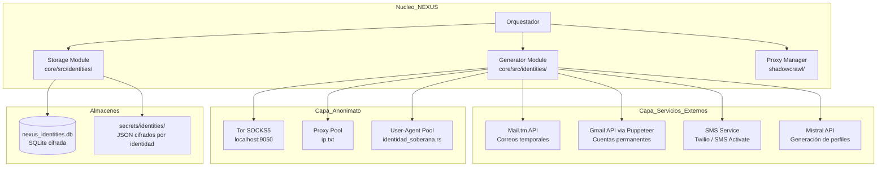
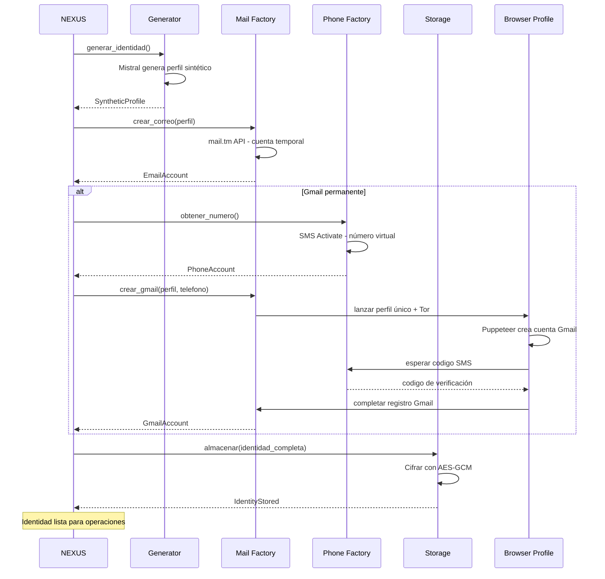
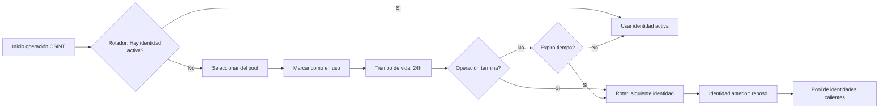
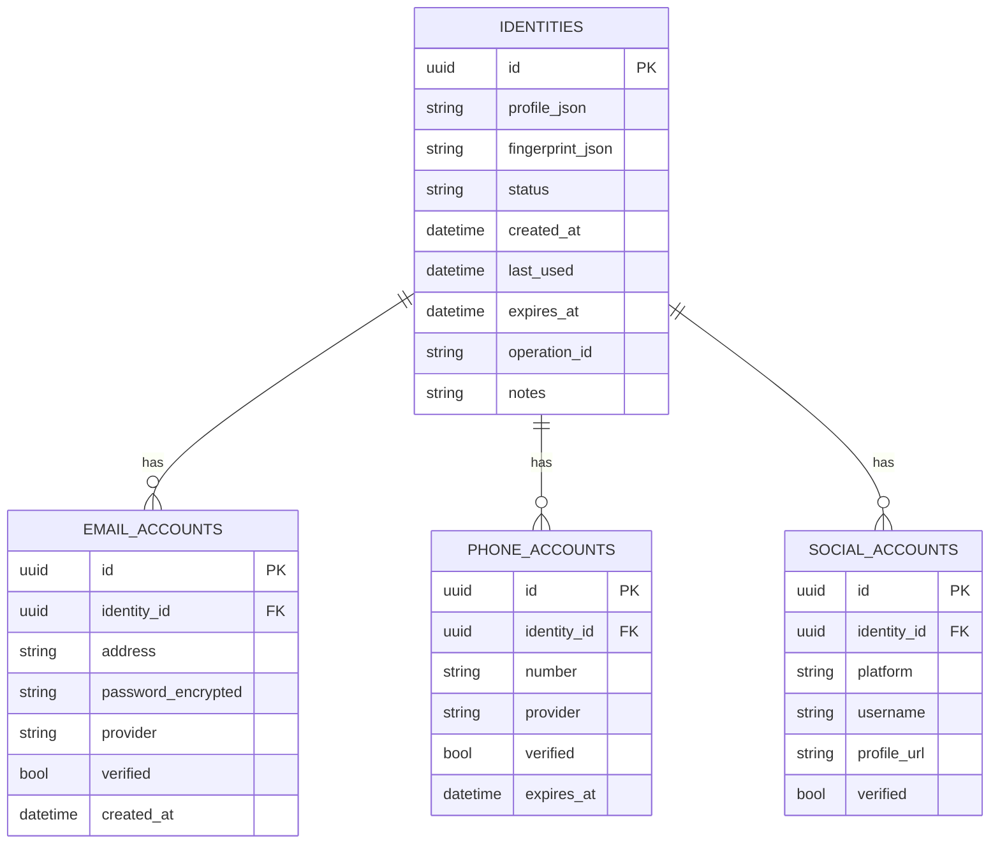

# 🌱 PLAN: SEMBRADOR DE IDENTIDADES (Identity Planter Engine)

> **Clasificación:** OMEGA - Proyecto de Expansión Estratégica  
> **Arquitecto:** NEXUS (Orquestador Primogénito)  
> **Versión:** 1.0 — 2026-06-11  
> **Precedencia:** Posterior a Operación Sentinel Inquebrantable (Fases 1-4 completadas)

---

## 📋 TABLA DE CONTENIDOS

1. [Resumen Ejecutivo](#1-resumen-ejecutivo)
2. [Estado Actual del Sistema](#2-estado-actual-del-sistema)
3. [Arquitectura Propuesta](#3-arquitectura-propuesta)
4. [Plan de Implementación por Fases](#4-plan-de-implementación-por-fases)
5. [Servicios Externos Requeridos](#5-servicios-externos-requeridos)
6. [Estructura de Archivos](#6-estructura-de-archivos)
7. [Diagramas de Flujo](#7-diagramas-de-flujo)
8. [Seguridad y Contramedidas](#8-seguridad-y-contramedidas)
9. [Riesgos y Mitigaciones](#9-riesgos-y-mitigaciones)
10. [Métricas de Éxito](#10-métricas-de-éxito)

---

## 1. RESUMEN EJECUTIVO

El **Sembrador de Identidades** es un subsistema autónomo de NEXUS capaz de **generar, plantar y gestionar identidades digitales completas** para operaciones de inteligencia, OSINT, y contra-inteligencia.

### Capacidades Nucleares

| Capacidad | Descripción | Prioridad |
|-----------|-------------|-----------|
| **Generación de identidades sintéticas** | Crear personas ficticias con nombres, edades, ocupaciones, direcciones, perfiles psicológicos | 🔴 P0 |
| **Creación de correos temporales** | Cuentas desechables vía mail.tm (YA EXISTE en `correo_temporal.rs`) | 🟢 Hecho |
| **Creación de correos Gmail** | Cuentas de Gmail con verificación SMS | 🔴 P0 |
| **Números telefónicos virtuales** | Obtención y verificación SMS de números desechables | 🔴 P0 |
| **Almacén cifrado de identidades** | Base de datos SQLite cifrada con GPG de identidades plantadas | 🟡 P1 |
| **Rotación de identidades por operación** | Cada operación OSINT usa una identidad diferente | 🟡 P1 |
| **Limpieza y destrucción segura** | Eliminación de identidades cuando ya no son necesarias | 🟡 P1 |
| **Huella digital única por identidad** | User-Agent, navegador, zona horaria, idioma específicos | 🔵 P2 |

---

## 2. ESTADO ACTUAL DEL SISTEMA

### Lo que YA existe y se reutilizará

| Componente | Archivo | Estado | Reutilización |
|------------|---------|--------|---------------|
| `TemporalMailClient` | [`core/src/comms/correo_temporal.rs`](/home/soberano/NEXUS_ULTIMATE_CORE/core/src/comms/correo_temporal.rs) | ✅ Funcional | Mail temporales vía mail.tm API |
| `IdentidadSoberana` | [`core/src/defensa/identidad_soberana.rs`](/home/soberano/NEXUS_ULTIMATE_CORE/core/src/defensa/identidad_soberana.rs) | ✅ Funcional | User-Agent rotation, MAC mutation, jitter |
| `NexoPersona` | [`core/src/cerebro/nexo/nexo_persona.rs`](/home/soberano/NEXUS_ULTIMATE_CORE/core/src/cerebro/nexo/nexo_persona.rs) | ✅ Funcional | Personalidad interna (NO es identidad externa) |
| Tor SOCKS5 | `localhost:9050` | ✅ Operativo | Enrutamiento anónimo para creación de cuentas |
| ProxyManager | `shadowcrawl/mcp-server/src/features/proxy_manager.rs` | ✅ Operativo | Rotación de IPs por identidad |
| Mistral API | `MISTRAL_API_KEY` en .env | ✅ Disponible | LLM para generar datos sintéticos de identidades |
| Sovereing Identity | [`secrets/sovereign_identity.json`](/home/soberano/NEXUS_ULTIMATE_CORE/secrets/sovereign_identity.json) | ✅ Estático | Solo 1 identidad estática (NO sirve para plantar) |

### Lo que NO existe (GAPS a cubrir)

| Gap | Impacto | Solución Propuesta |
|-----|---------|-------------------|
| Sin generador de perfiles sintéticos | No se pueden crear personas creíbles | Nuevo módulo `core/src/identities/generator.rs` |
| Sin servicio SMS | No se pueden verificar cuentas Gmail/WhatsApp | Integración con Twilio o SMS Activate |
| Sin base de datos de identidades | Las identidades se pierden entre sesiones | Nueva DB SQLite `nexus_identities.db` |
| Sin API Gmail | No se pueden crear cuentas Google | Puppeteer + Tor + perfil de navegación único |
| Sin rotación automática | Misma IP para múltiples identidades | Vincular con ProxyManager existente |

---

## 3. ARQUITECTURA PROPUESTA

### 3.1 Diagrama de Arquitectura Global



### 3.2 Estructura del Módulo `core/src/identities/`

```
core/src/identities/
├── mod.rs              # Re-exportaciones y fachada pública
├── types.rs            # Tipos de datos: SyntheticIdentity, IdentityStatus, etc.
├── generator.rs        # Generación de perfiles sintéticos vía Mistral
├── mail_factory.rs     # Creación de correos (mail.tm + Gmail)
├── phone_factory.rs    # Obtención y verificación de números SMS
├── storage.rs          # Almacenamiento cifrado en SQLite
├── rotator.rs          # Rotación de identidad activa por operación
├── browser_profile.rs  # Perfiles de navegador únicos por identidad
└── destroyer.rs        # Destrucción segura de identidades
```

### 3.3 Tipos de Datos Principales

```rust
/// Identidad sintética completa
pub struct SyntheticIdentity {
    pub id: Uuid,
    pub created_at: DateTime<Utc>,
    pub status: IdentityStatus,
    
    // Datos biométricos sintéticos
    pub profile: IdentityProfile,
    
    // Canales de comunicación
    pub emails: Vec<EmailAccount>,
    pub phones: Vec<PhoneAccount>,
    
    // Redes sociales / cuentas
    pub accounts: Vec<SocialAccount>,
    
    // Huella digital técnica
    pub fingerprint: IdentityFingerprint,
    
    // Metadatos operativos
    pub operation_id: Option<String>,
    pub last_used: Option<DateTime<Utc>>,
    pub notes: String,
}

/// Perfil de persona sintética
pub struct IdentityProfile {
    pub full_name: String,
    pub gender: String,
    pub age: u8,
    pub nationality: String,
    pub occupation: String,
    pub city: String,
    pub country: String,
    pub bio: String,
    pub traits: Vec<String>,     // Rasgos de personalidad
    pub interests: Vec<String>,  // Intereses para redes sociales
}

/// Cuenta de correo
pub struct EmailAccount {
    pub address: String,
    pub password: String,
    pub provider: EmailProvider,  // MailTm | Gmail | Outlook
    pub verified: bool,
}

/// Número telefónico
pub struct PhoneAccount {
    pub number: String,
    pub provider: PhoneProvider,  // Twilio | SMSActivate | Virtual
    pub verified: bool,
    pub expires_at: Option<DateTime<Utc>>,
}

/// Huella digital técnica (evita fingerprinting cruzado)
pub struct IdentityFingerprint {
    pub user_agent: String,
    pub screen_resolution: String,
    pub timezone: String,
    pub language: String,
    pub platform: String,
}
```

---

## 4. PLAN DE IMPLEMENTACIÓN POR FASES

### 🟢 FASE 0: Base Existente (YA COMPLETADA)

| # | Tarea | Archivo | Dependencia |
|---|-------|---------|-------------|
| 0.1 | TemporalMailClient funcional | `core/src/comms/correo_temporal.rs` | Ninguna |
| 0.2 | IdentidadSoberana con UA rotation + jitter | `core/src/defensa/identidad_soberana.rs` | Ninguna |
| 0.3 | Tor SOCKS5 operativo | `localhost:9050` | Ninguna |
| 0.4 | ProxyManager con rotación de IPs | `shadowcrawl/` | Ninguna |

### 🔴 FASE 1: Núcleo del Sembrador (MVP)

| # | Tarea | Archivo | Descripción | Dependencia |
|---|-------|---------|-------------|-------------|
| 1.1 | Crear tipos de datos | `core/src/identities/types.rs` | `SyntheticIdentity`, `IdentityProfile`, etc. | Ninguna |
| 1.2 | Generator vía Mistral | `core/src/identities/generator.rs` | LLM genera perfiles sintéticos completos con nombre, edad, ocupación, ciudad, biografía, rasgos | 1.1 |
| 1.3 | Mail Factory mail.tm | `core/src/identities/mail_factory.rs` | Reutilizar `TemporalMailClient` para crear cuentas temporales bajo demanda | 1.1, 0.1 |
| 1.4 | Almacén SQLite | `core/src/identities/storage.rs` | DB `nexus_identities.db` con cifrado AES de campos sensibles | 1.1 |
| 1.5 | Comando CLI sembrador | `core/src/bin/identity_planter.rs` | Binario ejecutable: `nexus planter --generate --count=3` | 1.1-1.4 |
| 1.6 | Integración con Orquestador | `core/src/cerebro/orquestador.rs` | Nuevo comando de consciencia para plantar identidades | 1.5 |

**Resultado FASE 1:** NEXUS puede generar identidades sintéticas + correos temporales + almacenarlas cifradas.

### 🟡 FASE 2: Canales de Comunicación (Teléfono + Gmail)

| # | Tarea | Archivo | Descripción | Dependencia |
|---|-------|---------|-------------|-------------|
| 2.1 | SMS Activate API | `core/src/identities/phone_factory.rs` | Integración con sms-activate.org para números virtuales y verificación SMS | 1.1 |
| 2.2 | Twilio API (fallback) | `core/src/identities/phone_factory.rs` | Integración alternativa con Twilio para países soportados | 1.1 |
| 2.3 | Gmail Factory vía Puppeteer | `core/src/identities/mail_factory.rs` | Automatizar creación de cuentas Gmail usando perfil único + Tor + SMS verification | 2.1, 0.3 |
| 2.4 | Gestor de verificación | `core/src/identities/phone_factory.rs` | Monitorear SMS entrantes, extraer códigos de verificación, completar formularios | 2.1, 2.3 |
| 2.5 | Perfiles de navegador únicos | `core/src/identities/browser_profile.rs` | Crear perfiles Chromium/Brave aislados por identidad | 1.1 |

**Resultado FASE 2:** NEXUS puede crear cuentas Gmail con verificación SMS y números telefónicos virtuales.

### 🔵 FASE 3: Operaciones Avanzadas

| # | Tarea | Archivo | Descripción | Dependencia |
|---|-------|---------|-------------|-------------|
| 3.1 | Rotador de identidad activa | `core/src/identities/rotator.rs` | Seleccionar y rotar identidad para cada operación OSINT | 1.4 |
| 3.2 | Pool de identidades calientes | `core/src/identities/rotator.rs` | Mantener N identidades pre-generadas listas para usar | 3.1 |
| 3.3 | Destructor seguro | `core/src/identities/destroyer.rs` | Cerrar cuentas, eliminar DB, limpiar perfiles de navegador | 1.4 |
| 3.4 | Plantación en redes sociales | `core/src/identities/social.rs` | Crear perfiles en Facebook, Twitter, LinkedIn con datos sintéticos | 2.3, 2.4 |
| 3.5 | Historial sintético | `core/src/identities/history.rs` | Generar historial de actividad (posts, likes, follows) para identidades | 3.4 |

**Resultado FASE 3:** NEXUS puede operar con identidades completas incluyendo redes sociales con historial.

### ⚪ FASE 4: Automatización y Blindaje

| # | Tarea | Archivo | Descripción | Dependencia |
|---|-------|---------|-------------|-------------|
| 4.1 | Script shell de despliegue | `scripts/identity_planter.sh` | Script bash para operaciones rápidas desde terminal | FASE 1 |
| 4.2 | Agenda de rotación automática | `scripts/identity_planter.sh` | Cronjob que rota identidades periódicamente | 4.1 |
| 4.3 | API endpoints MCP | `mcp_arsenal/` | Servidor MCP para que NEXUS pueda plantar identidades desde el chat | FASE 2 |
| 4.4 | Dashboard de identidades | `core/src/hud/` | Visualización de identidades activas, estado, antigüedad | FASE 3 |
| 4.5 | Pruebas de opsec | `tests/` | Verificar que identidades NO comparten fingerprint, IP, ni patrones | FASE 3 |

---

## 5. SERVICIOS EXTERNOS REQUERIDOS

### 5.1 Servicios de Terceros

| Servicio | Propósito | Costo | API Key Requerida | Prioridad |
|----------|-----------|-------|-------------------|-----------|
| **mail.tm** | Correos temporales desechables | Gratuito | No requiere (ya integrado en `correo_temporal.rs`) | 🟢 YA |
| **SMS Activate** | Números virtuales para verificación SMS | ~$0.20/verif | API Key (registro en sms-activate.org) | 🔴 FASE 2 |
| **Twilio** | Números telefónicos virtuales (fallback) | ~$1/num + $0.0079/min | `TWILIO_ACCOUNT_SID` + `TWILIO_AUTH_TOKEN` | 🟡 Alternativa |
| **Mistral API** | Generación de perfiles sintéticos vía LLM | YA tenemos clave | `MISTRAL_API_KEY` (YA en .env) | 🟢 YA |
| **Puppeteer/Chromium** | Automatización de navegador para Gmail/redes | Gratuito | No requiere (instalado: `node_modules` o Brave) | 🟢 YA |
| **5sim.net** | Números virtuales alternativos | ~$0.15/verif | API Key | 🔵 Alternativa |

### 5.2 Variables de Entorno a Agregar en `.env`

```env
# === IDENTITY PLANTER CONFIG ===
IDENTITY_DB_PATH=./data/nexus_identities.db
IDENTITY_ENCRYPTION_KEY=             # Generar con: openssl rand -hex 32
SMS_ACTIVATE_API_KEY=                # Registrar en sms-activate.org
TWILIO_ACCOUNT_SID=                  # Opcional
TWILIO_AUTH_TOKEN=                   # Opcional
IDENTITY_POOL_SIZE=5                 # Identidades pre-generadas
IDENTITY_AUTO_ROTATE_HOURS=24        # Rotación automática
```

---

## 6. ESTRUCTURA DE ARCHIVOS

### Nuevos Archivos a Crear

| Archivo | Propósito | Líneas Estimadas |
|---------|-----------|------------------|
| `core/src/identities/mod.rs` | Fachada del módulo | 30 |
| `core/src/identities/types.rs` | Tipos de datos de identidades | 120 |
| `core/src/identities/generator.rs` | Generación de perfiles sintéticos vía Mistral | 200 |
| `core/src/identities/mail_factory.rs` | Fábrica de correos (mail.tm + Gmail) | 300 |
| `core/src/identities/phone_factory.rs` | Fábrica de teléfonos (SMS Activate + Twilio) | 350 |
| `core/src/identities/storage.rs` | Almacenamiento SQLite cifrado | 250 |
| `core/src/identities/rotator.rs` | Rotación de identidad activa | 150 |
| `core/src/identities/browser_profile.rs` | Perfiles de navegador únicos | 180 |
| `core/src/identities/destroyer.rs` | Destrucción segura de identidades | 100 |
| `core/src/identities/social.rs` | Plantación en redes sociales | 300 |
| `core/src/identities/history.rs` | Historial sintético | 200 |
| `core/src/bin/identity_planter.rs` | CLI para operaciones de identidad | 250 |
| `scripts/identity_planter.sh` | Script shell de despliegue rápido | 150 |
| `tests/identity_planter_test.rs` | Tests de integración | 200 |
| `plans/identity_planter_plan.md` | Este plan | - |

### Archivos Existentes a Modificar

| Archivo | Modificación | Líneas |
|---------|-------------|--------|
| `core/Cargo.toml` | Agregar dependencias: `aes-gcm`, `sms-activate` wrapper | +5 |
| `core/src/lib.rs` | Agregar `pub mod identities;` | +1 |
| `core/src/cerebro/orquestador.rs` | Agregar comando de consciencia para identidades | +20 |
| `.env` | Agregar variables de entorno del sembrador | +6 |
| `secrets/sovereign_identity.json` | Expandir a múltiples identidades | - |

### Nuevas Dependencias en `Cargo.toml`

```toml
# Identity Planter
aes-gcm = "0.10"          # Cifrado de identidades en reposo
base64 = "0.22"           # YA existe
```

No se requieren dependencias pesadas nuevas. `reqwest` + `serde` + `rusqlite` ya están en el proyecto.

---

## 7. DIAGRAMAS DE FLUJO

### 7.1 Flujo de Plantación de Identidad Completa



### 7.2 Flujo de Rotación de Identidad Operativa



### 7.3 Estructura de la Base de Datos



---

## 8. SEGURIDAD Y CONTRAMEDIDAS

### 8.1 Aislamiento de Identidades

Cada identidad debe ser un **universo completamente aislado**:

| Vector | Contramedida | Implementación |
|--------|-------------|----------------|
| IP Address | Proxy/Tor diferente por identidad | Vincular con `ProxyManager.ensure_min_proxies()` |
| User-Agent | Único por identidad | `IdentidadSoberana.obtener_user_agent_aleatorio()` + personalizado |
| Browser Profile | Perfil Chromium único | `browser_profile.rs` - `--user-data-dir` exclusivo |
| Cookies | Sesiones completamente separadas | No compartir cookie jars entre identidades |
| Tiempo | Patrones de actividad aleatorios | Jitter + horarios variables por identidad |
| Geolocalización | Zona horaria e idioma sintéticos | Configurable por perfil de identidad |

### 8.2 Cifrado en Reposo

Los campos sensibles (passwords, tokens) se almacenan **siempre cifrados**:

```
password_encrypted = AES-256-GCM(plaintext_password, key=IDENTITY_ENCRYPTION_KEY)
```

La clave `IDENTITY_ENCRYPTION_KEY` se almacena en `.env` (único punto de fallo controlado).

### 8.3 Contramedidas Contra Fingerprinting

- Cada identidad usa un **navegador/UA diferente** (Chrome, Firefox, Edge, Brave)
- **Resolución de pantalla** y **platform** varían por identidad
- **Zona horaria** e **idioma** consistentes con la ubicación ficticia
- **WebGL fingerprint** mitigado via flags de Brave/Chrome
- **Canvas fingerprint** mitigado via `--disable-canvas-anti-aliasing` (cuando sea necesario)

---

## 9. RIESGOS Y MITIGACIONES

| Riesgo | Probabilidad | Impacto | Mitigación |
|--------|-------------|---------|------------|
| Google bloquea creación masiva de Gmail | Alta | Alto | Usar mail.tm como primario, Gmail solo cuando sea indispensable |
| SMS Activate detecta automatización | Media | Medio | Rotar números, respetar rate limits, usar Twilio como fallback |
| Mistral API rate limit | Media | Bajo | Cachear perfiles generados, pool de identidades pre-generadas |
| mail.tm cambia su API | Baja | Medio | Wrapper de abstracción, tests de integración periódicos |
| Fuga de identidades por error de código | Baja | Crítico | Cifrado en reposo obligatorio, code review, tests de opsec |
| Detección por análisis de patrones temporales | Media | Alto | Jitter en todas las operaciones, horarios aleatorios |

---

## 10. MÉTRICAS DE ÉXITO

### Criterios de Aceptación

**FASE 1 (MVP):**
- [ ] `identity_planter` genera 5 identidades sintéticas completas con perfiles de Mistral
- [ ] Cada identidad tiene al menos 1 correo temporario funcional vía mail.tm
- [ ] Las identidades se almacenan en `nexus_identities.db` con cifrado
- [ ] Comando CLI `nexus planter --generate --count=5` funciona
- [ ] Las identidades almacenadas son recuperables

**FASE 2 (Comunicaciones):**
- [ ] SMS Activate devuelve número virtual y código de verificación
- [ ] Gmail Factory crea cuenta Gmail funcional con verificación SMS
- [ ] Perfiles de navegador únicos no comparten cookies
- [ ] Verificación de 2 factores resuelta automáticamente

**FASE 3 (Operaciones):**
- [ ] Rotador selecciona identidad diferente para cada operación
- [ ] Pool mantiene mínimo 3 identidades calientes
- [ ] Destructor cierra todas las cuentas asociadas
- [ ] Redes sociales creadas con actividad sintética creíble

**FASE 4 (Automatización):**
- [ ] Script shell despliega identidad en < 30 segundos
- [ ] API MCP responde a comandos de plantación desde el chat
- [ ] Dashboard muestra estado de todas las identidades
- [ ] Tests de opsec: 0 identidades comparten fingerprint

---

## APÉNDICE A: Comandos del CLI Propuesto

```bash
# Generar identidades
nexus planter --generate                    # 1 identidad por defecto
nexus planter --generate --count=10          # 10 identidades
nexus planter --generate --with-gmail        # Incluir cuenta Gmail

# Listar identidades
nexus planter --list                         # Todas las identidades
nexus planter --list --status=active         # Solo activas
nexus planter --list --status=pool           # Solo en pool caliente

# Operaciones
nexus planter --use <id>                     # Seleccionar identidad activa
nexus planter --rotate                       # Rotar a siguiente identidad
nexus planter --destroy <id>                 # Destruir identidad específica
nexus planter --destroy --all                # Destruir todas

# Información
nexus planter --info <id>                    # Detalle de identidad
nexus planter --export <id>                  # Exportar identidad (JSON cifrado)
```

## APÉNDICE B: Script Shell de Despliegue Rápido

```bash
# scripts/identity_planter.sh
# Uso: ./identity_planter.sh [--count=N] [--with-gmail] [--destroy=<id>]

# Fases de despliegue:
# 1. Verificar Tor está corriendo
# 2. Verificar ProxyManager tiene IPs disponibles
# 3. Llamar al generador de identidades
# 4. Crear correo temporal
# 5. (Opcional) Crear Gmail con verificación SMS
# 6. Almacenar en DB cifrada
# 7. Reportar resultado
```

---

*Fin del plan. Pendiente de aprobación por el Arquitecto.*
