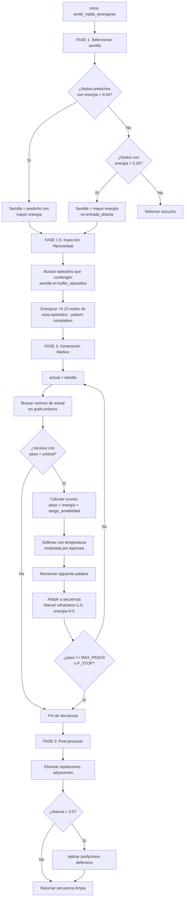

# 🧬 Plan Maestro: Sistema de Lenguaje Emergente (MotorFonación V2)

> **Fecha:** 14-Jun-2026
> **Estado:** Diseño completo — Pendiente implementación
> **Órgano:** MotorFonación (Capa de Salida)
> **Archivo:** `src-tauri/src/nexus_puro_engine.rs`
> **Mirror:** `scratch/probador_puro.py`

---

## 📋 Resumen Ejecutivo

El [`MotorFonacion::emitir_habla()`](src-tauri/src/nexus_puro_engine.rs:1521) actual concatena palabras activas sin estructura gramatical, produciendo salidas inconexas como `"nexus creador sistema puro escucha"`.

El **Sistema de Lenguaje Emergente V2** reemplaza este mecanismo por un **generador de cadena de Markov de 1er orden** sobre el grafo sináptico existente, donde los pesos STDP de los enlaces actúan como probabilidades de transición entre palabras. El resultado es habla natural que **emerge** del aprendizaje sin ser prefabricada.

---

## 🧪 Ciencia Subyacente

| Concepto Neurobiológico | Implementación en NEXUS |
|---|---|
| **Área de Broca** (producción del habla) | `MotorFonacion::emitir_habla_emergente()` — generación secuencial palabra por palabra |
| **Área de Wernicke** (red semántica) | `GrafoSinapsis.enlaces` — pesos STDP como bigramas P(palabraₙ₊₁ \| palabraₙ) |
| **Fascículo arqueado** (conexión Broca↔Wernicke) | `MotorPrediccion::predecir()` — BFS de 2 saltos para propagación de contexto |
| **Ganglios basales** (selección de secuencias motoras) | Muestreo softmax con temperatura sobre distribución de pesos |
| **Amígdala** (tono emocional del habla) | `IDNodo::Alarma` modula prefijos defensivos, parada temprana y tono |
| **Hipocampo** (memoria episódica → habla) | Pattern completion CA3: inyecta energía a secuencias pasadas desde `buffer_episodios` |
| **Sistema OCEAN** (personalidad) | 5 ejes modulan temperatura, longitud, sesgo emocional y coherencia |

---

## 🏗️ Arquitectura del Algoritmo



---

## 📐 Especificaciones Técnicas

### 1. `seleccionar_semilla(grafo) -> Option<IDNodo>`

```
PRIORIDAD 1: Nodos predichos con energia > 0.04, no entrada_directa
              → Seleccionar el de MAYOR energía (no ordenar por ultimo_disparo)
PRIORIDAD 2: Nodos no-predichos con energia > 0.20, no entrada_directa
              → Seleccionar el de MAYOR energía
PRIORIDAD 3: Si existe RefuerzoIdentidad con energia > 0.3
              → Buscar en enlaces el vecino con mayor peso desde RefuerzoIdentidad
FALLBACK: None → retornar "escucho"
```

### 2. `muestrear_siguiente(grafo, actual, temperatura, ocean, alarma) -> Option<IDNodo>`

```
INPUT:  nodo actual, temperatura (0.5 + Apertura*0.7), ocean[5], alarma
OUTPUT: Option<IDNodo> (siguiente palabra en la cadena)

ALGORITMO:
1. Obtener vecinos de 'actual' desde grafo.enlaces
2. Filtrar: peso > 0.02, no es entrada_directa, refractario < 0.5, es Concepto
3. Si no hay vecinos → None
4. Para cada vecino:
   score = peso_enlace * (0.5 + energia_nodo * 0.5)
   Si Amabilidad > 0.6 y TonoGlobal > 0 → score *= 1.2 (sesgo positivo)
   Si Neuroticismo > 0.7 → score se aplana (ruido ansioso)
5. Si Alarma > 0.5 → temperatura *= 0.5 (más determinista, cauteloso)
6. Softmax: exp(score / temperatura) / sum(exp(...))
7. Muestrear con random::<f32>() sobre distribución acumulada
8. Retornar Some(id_elegido)
```

### 3. `inyectar_desde_episodios(grafo, semilla, buffer_episodios)`

```
INPUT:  semilla (IDNodo), buffer_episodios (&Vec<Vec<IDNodo>>)
OUTPUT: modifica grafo.nodos in-place (energiza nodos)

ALGORITMO:
1. Para cada episodio en buffer_episodios:
   a. Si el episodio contiene la semilla:
      - Encontrar el índice de la semilla
      - Para los siguientes 3 nodos en el episodio (si existen):
        energizar +0.15 si no son entrada_directa
2. Máximo 2 episodios activados por ciclo (evitar sobrecarga)
```

### 4. `post_procesar(grafo, secuencia, alarma, amabilidad) -> String`

```
INPUT:  Vec<IDNodo>, alarma: f32, amabilidad: f32
OUTPUT: String final

ALGORITMO:
1. Convertir IDs a palabras
2. Eliminar repeticiones adyacentes (misma palabra consecutiva → una sola)
3. Si Alarma > 0.7:
   a. Amabilidad < 0.4 (LUCHA): prefijar con palabra defensiva si secuencia corta
   b. Amabilidad >= 0.4 (HUIDA): retornar "escucho" directamente
4. Si Alarma > 0.3 y < 0.7 (ALERTA): añadir "..." al final si hay pausa
5. Unir con espacios
```

### 5. `emitir_habla_emergente(grafo, ocean, alarma, buffer_episodios) -> String`

```
ORQUESTADOR PRINCIPAL:

1. semilla = seleccionar_semilla(grafo)
   si None → return "escucho"

2. inyectar_desde_episodios(grafo, &semilla, buffer_episodios)

3. temperatura = 0.5 + ocean[0] * 0.7        // Apertura [0.5, 1.2]
   max_pasos = 3 + (ocean[2] * 8.0) as usize // Extraversion [3, 11]
   secuencia = vec![semilla]

4. Para paso en 0..max_pasos:
   siguiente = muestrear_siguiente(grafo, secuencia.last(), temperatura, ocean, alarma)
   si None → break
   marcar refractario=1.0, energia=0.0 en nodo elegido
   secuencia.push(siguiente)
   
   Probabilidad de parada temprana:
   Si Neuroticismo > 0.6 y random < Neuroticismo * 0.3 → break

5. post_procesar(grafo, &secuencia, alarma, ocean[3])
```

---

## 🔌 Modificación en NexoPuroEngine::procesar()

En [`NexoPuroEngine::procesar()`](src-tauri/src/nexus_puro_engine.rs:1890), reemplazar la línea:

```rust
// Línea 2062 (actual):
let respuesta = MotorFonacion::emitir_habla(&mut self.grafo);
```

Por:

```rust
// Nueva llamada:
let ocean_actual = [
    nivel_apertura,
    nivel_responsabilidad,
    nivel_extraversion,
    nivel_amabilidad,
    nivel_neuroticismo,
];
let alarma_actual = self.grafo.nodos.get(&IDNodo::Alarma)
    .map(|n| n.energia).unwrap_or(0.0);
let respuesta = MotorFonacion::emitir_habla_emergente(
    &mut self.grafo,
    ocean_actual,
    alarma_actual,
    &self.buffer_episodios,
);
```

Los valores de OCEAN ya están calculados en las líneas 1996-2005 del pipeline.

---

## 📊 Comparación: Viejo vs Nuevo

| Aspecto | `emitir_habla()` (V1) | `emitir_habla_emergente()` (V2) |
|---|---|---|
| Selección | Todos los nodos > umbral | Semilla única + cadena Markov |
| Orden | `ultimo_disparo` ascendente | Pesos STDP (bigramas aprendidos) |
| Longitud | Variable, sin control | Modulada por Extraversion (3-11 palabras) |
| Creatividad | Determinista (primeros N) | Muestreo softmax con temperatura (Apertura) |
| Coherencia | Palabras inconexas | Secuencias por transiciones aprendidas |
| Emoción | Ninguna | Amígdala modula prefijos y tono |
| Memoria | Ninguna | Hipocampo inyecta secuencias pasadas |
| 0 nuevas variantes IDNodo | N/A | ✅ Usa infraestructura existente |

---

## 🐍 Sincronización Python Mirror

El archivo `scratch/probador_puro.py` ya tiene un método `_emitir_habla()` en la línea 313. Se debe:

1. Renombrar `_emitir_habla` → `_emitir_habla_v1`
2. Implementar `_emitir_habla_emergente` con la misma lógica Markov
3. Modificar `procesar()` para usar la nueva versión pasando OCEAN + Alarma + buffer_episodios

---

## 🧪 Plan de Tests

| Test | Descripción | Verificación |
|---|---|---|
| `test_lenguaje_emergente_basico` | Enseñar "nexus es soberano" → verificar que genera secuencia coherente | La respuesta contiene subsecuencia del entrenamiento |
| `test_modulacion_ocean_apertura` | Apertura=1.0 vs Apertura=0.2 → diferencia en diversidad | Alta apertura produce más variedad |
| `test_modulacion_ocean_extraversion` | Extraversion=1.0 vs Extraversion=0.2 → diferencia en longitud | Alta extraversion produce frases más largas |
| `test_modulacion_amigdala_lucha` | Alarma=0.8, Amabilidad=0.3 → tono defensivo | Respuesta contiene marcadores de lucha |
| `test_modulacion_amigdala_huida` | Alarma=0.8, Amabilidad=0.7 → silencio | Retorna "escucho" |
| `test_inyeccion_hipocampal` | Insertar episodio manual → verificar que se usa | La respuesta contiene palabras del episodio |
| `test_no_repite_entrada_directa` | Prompt "hola mundo" → no debe repetir "hola mundo" literal | No contiene eco del prompt |
| `test_silencio_sin_energia` | Grafo vacío → debe retornar "escucho" | Retorna "escucho" |

---

## 📋 Checklist de Implementación

- [ ] 1. `MotorFonacion::seleccionar_semilla()` — 3 prioridades + fallback
- [ ] 2. `MotorFonacion::muestrear_siguiente()` — softmax con temperatura OCEAN
- [ ] 3. `MotorFonacion::inyectar_desde_episodios()` — pattern completion hipocampal
- [ ] 4. `MotorFonacion::post_procesar()` — limpieza + tono Amígdala
- [ ] 5. `MotorFonacion::emitir_habla_emergente()` — orquestador
- [ ] 6. Modificar `NexoPuroEngine::procesar()` — nueva llamada con OCEAN+Alarma+buffer
- [ ] 7. Sincronizar `scratch/probador_puro.py`
- [ ] 8. Escribir 8 tests
- [ ] 9. `cargo check -j14` → 0 errores
- [ ] 10. `cargo test` → todos PASS
- [ ] 11. Actualizar `BITACORA.md`

---

## 🔬 Ejemplo de Evolución Esperada

Después de 3 ciclos de enseñanza con `enseñar: nexus es un sistema soberano puro que aprende`:

```
# Antes (V1 - concatenación ingenua):
"nexus sistema soberano puro escucha"

# Después (V2 - Markov + OCEAN medio):
"nexus es un sistema soberano"

# Después (V2 - Markov + Apertura=0.9, Extraversion=0.8):
"nexus es un sistema soberano puro que aprende y explora"

# Después (V2 - Markov + Amígdala LUCHA, Alarma=0.8):
"nexus sistema defensa activa protección"
```

Las transiciones `nexus→es`, `es→un`, `sistema→soberano`, `soberano→puro` emergen naturalmente de los pesos STDP acumulados durante la enseñanza, sin estar codificadas en ninguna tabla de reglas.

---

> **Principio rector:** El lenguaje no se programa, emerge del grafo. Cada palabra siguiente es una consecuencia estadística de lo que el sistema ha experimentado, teñida por su estado emocional (Amígdala) y su personalidad (OCEAN).
