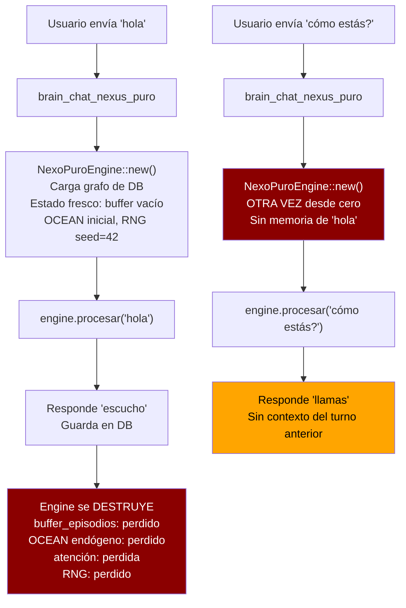

# Plan: Memoria Conversacional para NEXUS (Opción A)

> **Objetivo:** Que NEXUS recuerde lo que se habló turno a turno en el chat Tauri.
> **Problema raíz:** `brain_chat_nexus_puro` destruye y recrea el motor cognitivo en cada mensaje.
> **Fecha:** 2026-06-14
> **Estado:** 📋 Plan listo para implementación

---

## 🧬 Anatomía del Problema



**Tres causas raíz identificadas:**

| # | Causa | Archivo:Línea | Síntoma |
|---|-------|---------------|---------|
| 1 | Engine nuevo cada llamada | `main.rs:957` | Estado volátil total |
| 2 | V2 en lugar de V3 | `nexus_puro_engine.rs:2602` | Sin filtro stop-words, sin bigram |
| 3 | Homeostasis drena todo | `nexus_puro_engine.rs:867-937` | Energía < 0.20 → "escucho" |

---

## 🏗️ Plan de Implementación

### Fase 1: Motor Cognitivo Persistente (Singleton)

**Archivo:** `src-tauri/src/main.rs`

Crear un `EngineManager` con `Arc<Mutex<NexoPuroEngine>>` que:
- Se inicializa una sola vez al arrancar Tauri
- Persiste entre todas las llamadas a `brain_chat_nexus_puro`
- Maneja concurrencia con `Mutex` (el chat es secuencial, no hay riesgo real de contención)

```rust
// Nuevo struct para gestión de estado persistente
struct EngineManager {
    engine: Arc<Mutex<NexoPuroEngine>>,
}

impl EngineManager {
    fn new() -> Self {
        Self {
            engine: Arc::new(Mutex::new(NexoPuroEngine::new())),
        }
    }
}
```

**Cambios en `main()`:**
- Inicializar `EngineManager` después de crear la app Tauri
- Inyectarlo como `tauri::State<EngineManager>` en el builder

**Cambios en `brain_chat_nexus_puro`:**
- Recibir `state: tauri::State<'_, EngineManager>` como parámetro
- Usar `state.engine.lock().unwrap()` en lugar de `NexoPuroEngine::new()`

### Fase 2: Buffer de Historial Conversacional

**Archivo:** `src-tauri/src/nexus_puro_engine.rs`

Agregar al struct `NexoPuroEngine`:
```rust
pub struct NexoPuroEngine {
    db: Connection,
    pub grafo: GrafoSinapsis,
    ultimos_pesos_atencion: Vec<f32>,
    ciclos_sin_sueno: u32,
    pub buffer_episodios: Vec<(Vec<IDNodo>, f32)>, // ya existe
    // NUEVO: historial de diálogo
    pub historial_dialogo: Vec<(String, String)>, // (usuario, nexus)
    // NUEVO: nodos activos del turno actual (para protección energética)
    pub nodos_dialogo_activo: HashSet<String>,
}
```

**Al procesar cada mensaje:**
1. Antes de la ingesta, inyectar los últimos N turnos (ej. 5) como contexto al prompt
2. Después de generar respuesta, guardar par `(prompt, respuesta)` en `historial_dialogo`
3. Marcar los IDs de nodos activados durante este turno en `nodos_dialogo_activo`

### Fase 3: Conmutación V2 → V3 en `procesar()`

**Archivo:** `src-tauri/src/nexus_puro_engine.rs` línea 2602

```rust
// ANTES (línea 2602):
let respuesta = MotorFonacion::emitir_habla_emergente(
    &mut self.grafo,
    ocean_actual,
    alarma_actual,
    &self.buffer_episodios,
);

// DESPUÉS:
let respuesta = MotorFonacion::emitir_habla_emergente_v3(
    &mut self.grafo,
    ocean_actual,
    alarma_actual,
    &self.buffer_episodios,
    &self.historial_dialogo, // NUEVO: contexto conversacional
);
```

Esto activa:
- Filtro anti-stop-words (penalización 0.4)
- Contexto bigram (+25% boost)
- Energy floor integrado (re-energiza top 20 nodos si max_energía < 0.15)

### Fase 4: Homeostasis Consciente del Diálogo

**Archivo:** `src-tauri/src/nexus_puro_engine.rs`

Modificar `MotorHomeostasis::regular()` o crear un wrapper que:
- Reciba los `nodos_dialogo_activo` del engine
- Para nodos en diálogo activo: reducir `DRENAJE_PASIVO` de 0.03 a 0.005 (protección 6x)
- Esto evita que las palabras recién usadas se apaguen inmediatamente

Alternativa más simple: después de `MotorHomeostasis::regular()`, re-energizar nodos del diálogo:
```rust
// Post-homeostasis: re-energizar nodos del diálogo activo
for id_str in &self.nodos_dialogo_activo {
    let id = IDNodo::desde_string(id_str);
    if let Some(nodo) = self.grafo.nodos.get_mut(&id) {
        nodo.energia = nodo.energia.max(0.25); // piso de energía para nodos activos
    }
}
```

### Fase 5: Inyección de Contexto Conversacional

Modificar `procesar()` para que construya un prompt enriquecido:

```rust
pub fn procesar(&mut self, prompt: &str) -> String {
    // Construir prompt contextual
    let prompt_enriquecido = self.construir_prompt_contextual(prompt);
    // ... resto del pipeline con prompt_enriquecido
}

fn construir_prompt_contextual(&self, prompt: &str) -> String {
    if self.historial_dialogo.is_empty() {
        return prompt.to_string();
    }
    
    let ultimos = self.historial_dialogo.iter().rev().take(5).rev();
    let mut contexto = String::from("Historial de la conversación:\n");
    for (usr, nx) in ultimos {
        contexto.push_str(&format!("Usuario: {}\nNEXUS: {}\n", usr, nx));
    }
    contexto.push_str(&format!("Usuario: {}\n", prompt));
    contexto
}
```

---

## 📋 Pasos Quirúrgicos (Orden de Ejecución)

| # | Paso | Archivo | Riesgo |
|---|------|---------|--------|
| 1 | Agregar campos `historial_dialogo` y `nodos_dialogo_activo` al struct `NexoPuroEngine` | `nexus_puro_engine.rs:2269-2281` | Bajo |
| 2 | Inicializar nuevos campos en `NexoPuroEngine::new()` | `nexus_puro_engine.rs:2284-2301` | Bajo |
| 3 | Implementar `construir_prompt_contextual()` en `NexoPuroEngine` | `nexus_puro_engine.rs` (nuevo método) | Bajo |
| 4 | Cambiar V2→V3 en `procesar()` línea 2602 | `nexus_puro_engine.rs:2602` | Bajo |
| 5 | Modificar `procesar()` para: usar prompt contextual, guardar en historial, marcar nodos activos | `nexus_puro_engine.rs:2421-2657` | Medio |
| 6 | Agregar protección energética post-homeostasis para nodos del diálogo | `nexus_puro_engine.rs` (en `procesar()`) | Bajo |
| 7 | Crear `EngineManager` con `Arc<Mutex<NexoPuroEngine>>` en `main.rs` | `main.rs` | Medio |
| 8 | Modificar `main()` para inicializar e inyectar `EngineManager` como Tauri state | `main.rs:457-544` | Medio |
| 9 | Modificar `brain_chat_nexus_puro` para usar `EngineManager` en lugar de `new()` | `main.rs:947-972` | Medio |
| 10 | Compilar y ejecutar tests (deben pasar 13/13) | Terminal | Bajo |
| 11 | Probar chat Tauri con múltiples turnos | Manual | - |
| 12 | Actualizar BITACORA.md con el hito | `BITACORA.md` | Bajo |

---

## 🔬 Verificación Post-Implementación

1. **Test de persistencia:** Enviar "hola" → recibir respuesta → enviar "qué dije antes?" → NEXUS debe hacer referencia al saludo
2. **Test de energía:** 10 turnos consecutivos sin que NEXUS responda "escucho"
3. **Tests unitarios:** `cargo test` debe pasar 13/13
4. **Calidad de habla:** Las respuestas deben mostrar diversidad léxica (no solo stop-words)
