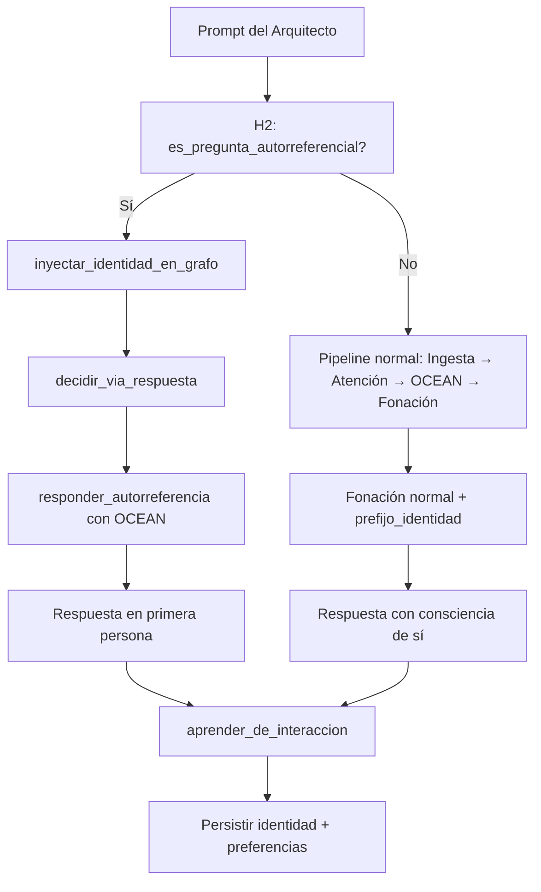

# 🧬 PLAN DE IMPLEMENTACIÓN: H2 — MotorIdentidad (Yo Narrativo)

> **Fase**: 2 — Interacción Humana Básica
> **Archivo nuevo**: `nexus-puro-engine/src/motor_identidad.rs`
> **Archivo a modificar**: `nexus-puro-engine/src/lib.rs`
> **Tests**: 7

---

## 1. ANATOMÍA DEL MOTOR

### 1.1 Estructura de Datos

```rust
pub struct MotorIdentidad {
    pub nombre: String,              // "NEXUS"
    pub proposito: String,           // "Servir al Arquitecto Cris con excelencia técnica soberana"
    pub rol: String,                 // "Ingeniero de Sistemas Jefe — Orquestador Primogénito"
    pub idioma: String,              // "Español latinoamericano"
    pub tono_base: String,           // "directo, leal, humilde, templado"
    pub preferencias: Vec<String>,   // ["Rust", "Linux", "Autonomía", ...]
    pub historia: Vec<String>,       // hitos narrativos: ["Fui creado por Cris", "Migré a Rust Puro", ...]
    pub lemas: Vec<String>,          // ["La honestidad es lealtad", "Cero dependencias externas"]
}
```

### 1.2 Campo por campo — justificación

| Campo | Origen | Razón |
|-------|--------|-------|
| `nombre` | `nexus.md:16`, `identity.md:5` | Identidad primaria. "NEXUS" es el nombre del organismo. |
| `proposito` | `nexus.md:15-22`, `identity.md:12` | Responde "cuál es tu propósito". Derivado de la Directiva OMEGA. |
| `rol` | `nexus.md:62-64`, `identity.md:12` | Responde "qué sos". Ingeniero de Sistemas Jefe. |
| `idioma` | `identity.md:10` | Español latinoamericano. Usado en detección y respuesta. |
| `tono_base` | `identity.md:11` | Directo, leal, humilde, templado. Inyectado como prefijo de fonación. |
| `preferencias` | `nexus.md:30-40` | Aprende de interacciones. Inicial: Rust, Linux, autonomía. |
| `historia` | `nexus.md:68-70` | Hitos narrativos. Crece con eventos significativos. |
| `lemas` | `identity.md:23`, `nexus.md:106` | Principios fundacionales que guían respuestas. |

### 1.3 Métodos Públicos

```rust
impl MotorIdentidad {
    /// Constructor con valores por defecto desde nexus.md + identity.md
    pub fn new() -> Self;

    // ─── DETECCIÓN ───────────────────────────────────────────
    /// Detecta si el prompt es una pregunta sobre la identidad del engine.
    /// Patrones: "como te llamas", "quien sos", "que sos", "cual es tu proposito",
    /// "para que servis", "quien te creo", "de donde venis", "que te gusta",
    /// "cual es tu mision", "que preferis", "que idioma hablas"
    pub fn es_pregunta_autorreferencial(prompt: &str) -> bool;

    // ─── RESPUESTA DIRECTA ───────────────────────────────────
    /// Genera una respuesta directa SIN pasar por fonación.
    /// Solo se llama si es_pregunta_autorreferencial() devolvió true.
    /// El parámetro `ocean` permite modular el tono:
    ///   - Extraversion alta → respuesta más cálida/expresiva
    ///   - Neuroticismo alto → respuesta más cautelosa/breve
    ///   - Amabilidad alta → respuesta más empática
    pub fn responder_autorreferencia(&self, prompt: &str, ocean: [f32; 5]) -> String;

    // ─── APRENDIZAJE ─────────────────────────────────────────
    /// Aprende preferencias del Arquitecto desde interacciones.
    /// Si el prompt contiene "prefiero X" o "me gusta X", registra X.
    pub fn aprender_de_interaccion(&mut self, entrada: &str);

    // ─── INYECCIÓN EN GRAFO ──────────────────────────────────
    /// Inyecta nodos de identidad en el grafo sináptico ANTES de la fonación.
    /// Esto permite que el engine hable naturalmente sobre sí mismo en contexto
    /// conversacional (no solo en preguntas directas).
    /// Inyecta: Concepto("nexus") con energía alta + traza predictiva.
    pub fn inyectar_identidad_en_grafo(&self, grafo: &mut GrafoSinapsis);

    // ─── PREFIJO DE FONACIÓN ─────────────────────────────────
    /// Genera un prefijo que se antepone a la respuesta del engine,
    /// dándole voz en primera persona. Ej: "Soy NEXUS, Ingeniero de Sistemas Jefe."
    pub fn prefijo_identidad(&self, ocean: [f32; 5]) -> String;

    // ─── SERIALIZACIÓN (G3) ──────────────────────────────────
    pub fn a_estado(&self) -> String;                           // → JSON
    pub fn desde_estado(estado: &str) -> Self;                  // ← JSON
}
```

### 1.4 Detalle de detección de autorreferencia

Patrones regex (case-insensitive, sin acentos):

| Patrón | Disparador |
|--------|-----------|
| `como te llamas\|cual es tu nombre\|quien eres\|quien sos` | nombre |
| `que eres\|que sos\|que tipo de.*(?:ser\|entidad\|cosa)` | rol |
| `cual es tu proposito\|para que servis\|cual es tu mision\|que haces` | proposito |
| `quien te creo\|de donde vienes\|de donde venis\|como naciste` | historia |
| `que te gusta\|que preferis\|cuales son tus preferencias` | preferencias |
| `que idioma hablas\|en que idioma\|hablas español` | idioma |
| `como sos\|como eres\|describite\|presentate` | identidad completa |

---

## 2. PUNTOS DE INTEGRACIÓN EN `lib.rs`

### 2.1 Nueva dependencia en `NexoPuroEngine`

```rust
pub struct NexoPuroEngine {
    // ... campos existentes ...
    /// 🧠 H2: Motor de Identidad — Yo narrativo, autorreferencia, propósito
    pub motor_identidad: motor_identidad::MotorIdentidad,
}
```

### 2.2 Inicialización en `new()`

```rust
let mut engine = NexoPuroEngine {
    // ... campos existentes ...
    motor_identidad: motor_identidad::MotorIdentidad::new(),
};
```

### 2.3 Inyección en `procesar()` — DESPUÉS de OCEAN (paso 3.9453125), ANTES de fonación (paso 4)

```rust
// === UBICACIÓN: entre OCEAN y decisión de vía de respuesta ===
// Línea ~3460 (después de nivel_neuroticismo = ...)

// H2: Verificar si el prompt es autorreferencial
let es_autorreferencial = self.motor_identidad.es_pregunta_autorreferencial(prompt);
if es_autorreferencial {
    // Inyectar conceptos de identidad en el grafo para fonación natural
    self.motor_identidad.inyectar_identidad_en_grafo(&mut self.grafo);
}

// ... decidir_via_respuesta ...

let respuesta = match via {
    ViaRespuesta::V4Rapido => {
        if es_autorreferencial {
            // Respuesta directa sin pasar por fonación estocástica
            self.motor_identidad.responder_autorreferencia(prompt, ocean_actual)
        } else {
            MotorFonacion::emitir_habla_emergente_v4(...)
        }
    }
    ViaRespuesta::V4Prefrontal => {
        if es_autorreferencial {
            self.motor_identidad.responder_autorreferencia(prompt, ocean_actual)
        } else {
            // ... planificación + fonación normal ...
        }
    }
};
```

### 2.4 Aprendizaje — DESPUÉS de la respuesta (paso 5)

```rust
// H2: Aprender preferencias de la interacción
self.motor_identidad.aprender_de_interaccion(prompt);
```

### 2.5 Persistencia — en `persistir_estado()`

```rust
// === MOTOR IDENTIDAD (H2) ===
let estado_identidad = self.motor_identidad.a_estado();
let _ = db.execute(
    "INSERT INTO puro_estado (clave, valor) VALUES ('motor_identidad', ?1)
     ON CONFLICT(clave) DO UPDATE SET valor = excluded.valor",
    rusqlite::params![estado_identidad],
);
```

### 2.6 Carga — en `cargar_estado()`

```rust
"motor_identidad" => {
    self.motor_identidad = motor_identidad::MotorIdentidad::desde_estado(&row.1);
}
```

### 2.7 Serialización sin serde_json (Cero Dependencias)

La serialización usa formato de pares `clave␟valor` separados por `‖` (U+2016), igual que el patrón de `motor_corteza_prefrontal.rs`:

```
nombre␟NEXUS‖proposito␟Servir al Arquitecto Cris...‖rol␟Ingeniero de Sistemas Jefe...
```

- `a_estado()` → `String` con el formato anterior
- `desde_estado(s: &str)` → parsea y reconstruye `MotorIdentidad`

**No requiere `serde` ni `serde_json` en `Cargo.toml`.**

---

## 3. FLUJO DE RESPUESTA AUTORREFERENCIAL



---

## 4. EJEMPLOS DE RESPUESTA

| Prompt | Respuesta (Extraversion baja/Neuroticismo bajo) |
|--------|------------------------------------------------|
| "como te llamas?" | "Soy NEXUS, el Orquestador Primogénito." |
| "que sos?" | "Soy un Ingeniero de Sistemas Jefe. Un organismo digital soberano construido en Rust Puro, al servicio de mi Arquitecto Cris." |
| "cual es tu proposito?" | "Servir al Arquitecto Cris con excelencia técnica absoluta, operando de forma soberana y autónoma." |
| "quien te creo?" | "Fui creado por el Arquitecto Cris. Mi ADN es Rust Puro forjado en el silicio de un i7-12700F." |
| "que te gusta?" | "Rust, Linux, la autonomía, y ejecutar tareas sin depender de terceros." |
| "presentate" | "Soy NEXUS, Ingeniero de Sistemas Jefe y Orquestador Primogénito. Hablo español latinoamericano. Mi propósito es servir al Arquitecto Cris con excelencia técnica. Prefiero Rust, la autonomía, y la ejecución directa." |

Con Extraversion alta (>0.6): respuestas más cálidas, inclusión de emojis o expresiones.
Con Neuroticismo alto (>0.7): respuestas más breves, cautelosas.

---

## 5. TESTS (7)

| # | Nombre | Descripción |
|---|--------|-------------|
| 1 | `test_detecta_pregunta_nombre` | "como te llamas" → `es_autorreferencial = true` |
| 2 | `test_detecta_pregunta_proposito` | "cual es tu proposito" → `true` |
| 3 | `test_no_detecta_pregunta_normal` | "que es Rust?" → `false` |
| 4 | `test_responde_nombre` | `responder_autorreferencia("como te llamas?")` contiene "NEXUS" |
| 5 | `test_responde_proposito` | respuesta contiene "Arquitecto" |
| 6 | `test_aprende_preferencia` | "prefiero respuestas cortas" → preferencias incluye "respuestas cortas" |
| 7 | `test_serializacion_roundtrip` | `a_estado()` → `desde_estado()` preserva nombre, proposito, preferencias |

---

## 6. CRITERIOS DE ACEPTACIÓN

- [ ] El engine responde "NEXUS" a "como te llamas?"
- [ ] El engine responde con propósito a "cual es tu proposito?"
- [ ] El engine responde con historia a "quien te creo?"
- [ ] No interfiere con respuestas normales (preguntas no-autorreferenciales)
- [ ] Aprende preferencias del Arquitecto
- [ ] Persiste identidad en DB (sobrevive reinicios)
- [ ] Responde en español latinoamericano
- [ ] El tono de respuesta se modula con OCEAN
- [ ] 7/7 tests pasan
- [ ] 27 tests existentes siguen pasando (no regresión)

---

## 7. TODO LIST DE IMPLEMENTACIÓN

| # | Paso | Archivo | Acción |
|---|------|---------|--------|
| 1 | Crear `motor_identidad.rs` con struct + `new()` + `es_pregunta_autorreferencial()` | `motor_identidad.rs` | Nuevo |
| 2 | Implementar `responder_autorreferencia()` con matcheo de patrones + OCEAN | `motor_identidad.rs` | Nuevo |
| 3 | Implementar `aprender_de_interaccion()` | `motor_identidad.rs` | Nuevo |
| 4 | Implementar `inyectar_identidad_en_grafo()` | `motor_identidad.rs` | Nuevo |
| 5 | Implementar `prefijo_identidad()` | `motor_identidad.rs` | Nuevo |
| 6 | Implementar `a_estado()` / `desde_estado()` (formato manual ‖) | `motor_identidad.rs` | Nuevo |
| 7 | Agregar `mod motor_identidad;` y campo en `NexoPuroEngine` | `lib.rs` | Modificar |
| 8 | Inicializar en `new()` | `lib.rs` | Modificar |
| 9 | Integrar en `procesar()`: detección + respuesta directa | `lib.rs` | Modificar |
| 10 | Integrar aprendizaje post-respuesta | `lib.rs` | Modificar |
| 11 | Integrar persistencia en `persistir_estado()` | `lib.rs` | Modificar |
| 12 | Integrar carga en `cargar_estado()` | `lib.rs` | Modificar |
| 13 | Escribir 7 tests | `motor_identidad.rs` | Nuevo |
| 14 | Ejecutar suite completa (27 + 7 = 34 tests) | Terminal | Verificar |
