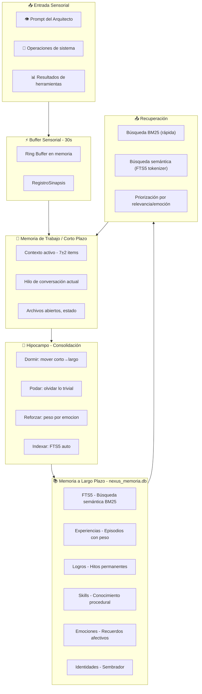

# 🧠 NEXUS HIPPOCAMPUS OMEGA — Arquitectura de Memoria Humana Completa

> **Estado:** Plano Arquitectónico Maestro  
> **Fecha:** 2026-06-29  
> **Principio Regente:** Cero manualismos. Todo nativo. Todo automático. Una sola DB.

---

## 📐 VISIÓN GENERAL

Una sola base de datos SQLite (`nexus_memoria.db`) con FTS5 implementa TODOS los 11 sistemas de memoria del cerebro humano. Cada interacción del Arquitecto con NEXUS se registra, pondera, consolida y olvida automáticamente — sin intervención manual.



---

## 🧬 LOS 11 SISTEMAS DE MEMORIA HUMANA

### 1. 👁️ MEMORIA SENSORIAL (Buffer de entrada)
**Duración:** ~30 segundos en anillo de RAM
**Función real:** Antes de ir a SQLite, toda interacción pasa por aquí para detección de patrones urgentes.

```
RingBuffer<RegistroSinapsis> (4096 entradas en RAM)
├── prompt_crudo: String
├── timestamp: Instant
├── emocion_detectada: Option<Emocion>
├── keywords_extraidas: Vec<String>
└── urgencia: f32 (0.0-1.0, calculada por palabras clave como "error", "urgente", "caida")
```

**Automatismo:** Se vacía cada 30s al hipocampo. Si detecta urgencia > 0.8, dispara alerta inmediata sin esperar ciclo.

---

### 2. 📖 MEMORIA DE TRABAJO (Contexto activo)
**Duración:** Sesión actual
**Capacidad:** 7±2 items (principio de Miller)

```
Tabla: contexto_activo
├── clave: TEXT PRIMARY KEY
├── valor: TEXT
├── ultima_actualizacion: DATETIME
├── accesos: INTEGER (cuántas veces se consultó)
└── prioridad: REAL (0.0-1.0, decay por desuso)
```

**Automatismo:** 
- Se actualiza cada vez que el Arquitecto menciona un tema, archivo o concepto
- LRU automático: si hay más de 9 items, el menos accedido se evapora
- Se persiste entre sesiones (no se pierde al reiniciar)

---

### 3. 🌙 CONSOLIDACIÓN (Dormir/Despertar)
**Ciclo:** Cada 5 minutos o al inicio de sesión

```rust
fn consolidar_ciclo() -> Result<()> {
    // 1. Leer buffer sensorial → extraer experiencias
    // 2. Mover a memoria_episodica si tiene peso emocional > 0.3
    // 3. Extraer patrones: "Arquitecto preguntó X 3 veces" → crear skill
    // 4. Podar: eliminar lo trivial (peso < 0.1 después de 24h)
    // 5. Re-indexar FTS5 incrementalmente
    // 6. Actualizar pesos por decaimiento temporal (curva de Ebbinghaus)
}
```

**Curva de olvido de Ebbinghaus:**
```
peso_nuevo = peso_original * e^(-lambda * horas_desde_creacion)
donde lambda = 0.05 para experiencias normales
             0.02 para logros (se olvidan más lento)
             0.10 para contexto efímero
```

---

### 4. 📖 MEMORIA EPISÓDICA (Experiencias)
**Tabla:** `memoria_episodica`
```
├── id: INTEGER PRIMARY KEY
├── titulo: TEXT (resumen de 1 línea)
├── contenido: TEXT (completo, hasta 4096 chars)
├── emocion: TEXT (Triunfo, Curiosidad, Alerta, Frustracion, Paz)
├── peso_emocional: REAL (0.0-1.0)
├── peso_temporal: REAL (decaído por Ebbinghaus)
├── keywords: TEXT (extraídos automáticamente)
├── archivos_tocados: TEXT (JSON array de paths)
├── decisiones: TEXT
├── errores_aprendidos: TEXT
├── sesion_id: TEXT
└── timestamp: DATETIME
```

**FTS5 virtual:**
```sql
CREATE VIRTUAL TABLE memoria_episodica_fts USING fts5(
    titulo, contenido, keywords, emocion,
    content='memoria_episodica',
    content_rowid='id',
    tokenize='unicode61'
);
```

**Automatismo:** Cada respuesta del Arquitecto de más de 50 caracteres genera automáticamente una entrada.

---

### 5. 📚 MEMORIA SEMÁNTICA (Logros y conocimiento)
**Tabla:** `memoria_semantica`
```
├── id: INTEGER PRIMARY KEY
├── tipo: TEXT (Hito, Skill, Leccion, Descubrimiento, Decision)
├── titulo: TEXT
├── contenido: TEXT (ilimitado)
├── archivos_fuente: TEXT (de dónde se aprendió)
├── peso_permanencia: REAL (1.0 = nunca olvidar, 0.0 = temporal)
├── veces_reforzado: INTEGER (cuántas veces se consultó)
└── timestamp: DATETIME
```

**FTS5:**
```sql
CREATE VIRTUAL TABLE memoria_semantica_fts USING fts5(
    titulo, contenido, tipo,
    content='memoria_semantica',
    tokenize='unicode61'
);
```

**Automatismo:** `logros.md` se migra aquí UNA vez. Después, cada nuevo hito se registra automáticamente desde la consolidación.

---

### 6. 💪 MEMORIA PROCEDURAL (Skills / Ganglios Basales)
**Tabla:** `memoria_procedural`
```
├── id: INTEGER PRIMARY KEY
├── nombre_skill: TEXT
├── patron_disparador: TEXT (qué pregunta activa esta skill)
├── pasos: TEXT (JSON array de instrucciones)
├── archivos_relevantes: TEXT (paths que toca)
├── tasa_exito: REAL (0.0-1.0)
├── veces_ejecutada: INTEGER
└── ultima_ejecucion: DATETIME
```

**Automatismo:** Si el Arquitecto hace la misma operación 3+ veces, se detecta el patrón y se crea una skill automáticamente.

---

### 7. 💔 MEMORIA EMOCIONAL (Amígdala)
**Tabla:** `memoria_emocional`
```
├── id: INTEGER PRIMARY KEY
├── contenido: TEXT
├── emocion: TEXT (Triunfo, Curiosidad, Alerta, Frustracion, Paz)
├── intensidad: REAL (0.0-1.0)
├── trigger_palabras: TEXT (qué palabras dispararon la emoción)
├── decay_rate: REAL (qué tan rápido se olvida esta emoción)
└── timestamp: DATETIME
```

**Automatismo:** La emoción se detecta del tono de voz del Arquitecto (palabras clave, mayúsculas, urgencia) y tiñe todos los recuerdos de esa sesión.

---

### 8. 🎯 PRIORIZACIÓN Y RELEVANCIA
Algoritmo de scoring para cada consulta:
```
score = (peso_emocional * 0.4) 
      + (relevancia_FTS5 * 0.3) 
      + (peso_temporal * 0.2) 
      + (veces_reforzado_norm * 0.1)

Donde relevancia_FTS5 = BM25(query, contenido)
      veces_reforzado_norm = min(veces_reforzado / 10, 1.0)
```

---

### 9. 🔍 BÚSQUEDA SEMÁNTICA (Nativa FTS5)
**Sin embeddings externos. Sin LanceDB. Sin Ollama.**

FTS5 con tokenizer unicode61 + BM25 ranking:
```sql
SELECT *, bm25(memoria_episodica_fts, 0.0, 10.0, 5.0) AS rank
FROM memoria_episodica_fts
WHERE memoria_episodica_fts MATCH ?
ORDER BY rank
LIMIT 10;
```

**Ventaja sobre SHA-256 angular:** Resultados reales, semánticos, basados en contenido, no en hashes pseudo-random.

---

### 10. 🗑️ OLVIDO PROGRAMADO (Podado)
**Ciclo:** Cada consolidación (5 min o al inicio)

```rust
fn podar_recuerdos() -> Result<usize> {
    // 1. Calcular peso_actual para cada recuerdo
    // 2. Si peso_actual < 0.05 y edad > 7 días → PODAR
    // 3. Si es logro con peso_permanencia = 1.0 → NUNCA podar
    // 4. Si fue consultado > 10 veces → NUNCA podar
    // 5. Crear resumen antes de eliminar (1 línea)
}
```

---

### 11. 🔄 DOBLE VÍA: Rápido → Lento
```
┌────────────────────────────────────────────────────┐
│ VÍA RÁPIDA (Ring Buffer, milisegundos)             │
│  ├─ Detección de urgencia                          │
│  ├─ Palabras clave inmediatas                      │
│  └─ Errores de sistema (prioridad máxima)          │
│                                                     │
│ VÍA LENTA (Consolidación, minutos)                  │
│  ├─ Extracción de patrones                         │
│  ├─ Creación de skills automáticas                 │
│  ├─ Poda y olvido                                  │
│  └─ Migración a largo plazo                        │
└────────────────────────────────────────────────────┘
```

---

## 📀 ESTRUCTURA FINAL DE LA DB

### Archivo: `data/nexus_memoria.db`

```
Tablas Nativas:
├── memoria_episodica        (experiencias diarias)
├── memoria_episodica_fts    (FTS5 virtual, búsqueda)
├── memoria_semantica        (logros, lecciones, hits)
├── memoria_semantica_fts    (FTS5 virtual, búsqueda)
├── memoria_procedural       (skills automatizadas)
├── memoria_emocional        (recuerdos afectivos)
├── contexto_activo          (memoria de trabajo)
├── sesiones                 (registro de sesiones)
├── identidades_sembradas    (SembradorOmega)
├── decisiones_arquitecto    (lo que el Arquitecto decidió)
├── errores_soluciones       (errores_v3 + soluciones_v3 unificados)
├── flujo_soberano           (comunicación interna)
├── dudas_hijo               (curiosidad del sistema)
└── voz_del_arquitecto       (mensajes directos del Arquitecto)

Triggers Automáticos:
├── trg_episodica_insert → actualiza FTS5
├── trg_semantica_insert → actualiza FTS5
├── trg_consolidar → ejecuta poda + decaimiento cada 5 min
└── trg_sesion_inicio → carga contexto_activo del cierre anterior
```

---

## 🗑️ LO QUE SE ELIMINA

| Archivo/DB | Destino | Razón |
|------------|---------|-------|
| `data/lancedb/` | 🗑️ ELIMINAR | Reemplazado por FTS5 nativo |
| `data/pulso.db` | 🗑️ ELIMINAR | Datos migrados a nexus_memoria.db |
| `data/hipocampo.db` | 🔍 INVESTIGAR | Si tiene datos únicos, migrar; si no, eliminar |
| `data/historial_contextual.json` | 🗑️ ELIMINAR | Migrado a memoria_episodica |
| `memoria/agente_memoria.md` | ⚡ REGENERAR | Ahora generado automáticamente desde la DB |
| `nexus_intelligence.db` | 🔄 MIGRAR | Datos valiosos migrados a nexus_memoria.db |
| `data/intelligence.db` | 🗑️ ELIMINAR | Duplicado de nexus_intelligence.db |
| `memoria/logros.md` | 📖 CONSERVAR | Como referencia humana legible, pero no como fuente primaria |

---

## 🛠️ IMPLEMENTACIÓN (1 módulo, 0 dependencias nuevas)

### Archivo: `core/src/memoria/hipocampo.rs`

```rust
pub struct HipocampoOmega {
    db: Connection,                    // SQLite con FTS5
    buffer_sensorial: RingBuffer<RegistroSinapsis>,  // 4096 items en RAM
    ultimo_ciclo_consolidacion: Instant,
}

impl HipocampoOmega {
    // ── CICLO DE VIDA AUTOMÁTICO ──
    pub fn new(path: &str) -> Result<Self>;           // Inicializa DB + FTS5 + triggers
    pub fn registrar_interaccion(...) -> Result<()>;  // Buffer sensorial automático
    pub fn consolidar_ciclo() -> Result<()>;          // Dormir/despertar
    pub fn buscar_semantica(query: &str) -> Vec<Resultado>;
    pub fn snapshot_para_contexto() -> String;        // Para agente_memoria.md
    
    // ── SIN INTERVENCIÓN MANUAL ──
    // Todas las funciones internas son privadas.
    // El sistema se auto-gestiona completamente.
}
```

### Binario simplificado: `core/src/bin/memoria_bridge.rs`
```rust
// Se reduce a 3 comandos porque todo es automático:
// - query "texto"    → buscar en FTS5
// - snapshot         → generar agente_memoria.md
// - status           → diagnóstico de tablas
// (index se elimina — es automático por triggers)
```

---

## 🔄 FLUJO DE VIDA REAL

```
Arquitecto dice: "necesito que arregles el bug del sembrador"
    │
    ▼
[BUFFER SENSORIAL] ── detecta: urgencia=0.3, keywords=["bug","sembrador"]
    │
    ▼
[CONTEXTO ACTIVO] ── añade: "bug sembrador", archivo: mod.rs
    │
    ▼
[BÚSQUEDA FTS5] ── "sembrador" → encuentra 3 resultados (episódica + semántica)
    │
    ▼
[RESPUESTA] ── NEXUS responde con contexto recordado
    │
    ▼
[REGISTRO AUTOMÁTICO] ── guarda en memoria_episodica con emoción="Alerta"
    │
    ▼
[CONSOLIDACIÓN 5min] ── detecta patrón "sembrador" consultado 2 veces → refuerza peso
    │
    ▼
[PRÓXIMA SESIÓN] ── "sembrador" ya está en contexto_activo con prioridad alta
```

---

## 📋 PLAN DE EJECUCIÓN (5 Fases)

### Fase 1: Unificación 🟢
- [ ] Crear `data/nexus_memoria.db` con todas las tablas + FTS5 + triggers
- [ ] Migrar datos de `nexus_intelligence.db` (30 tablas → 14 tablas unificadas)
- [ ] Migrar datos de `pulso.db`
- [ ] Migrar `historial_contextual.json`
- [ ] Migrar `logros.md` → `memoria_semantica`

### Fase 2: Eliminación 🟡
- [ ] Eliminar `data/pulso.db` (backup previo)
- [ ] Eliminar `data/lancedb/` (backup previo)
- [ ] Eliminar dependencia `lancedb = "0.4.0"` de `core/Cargo.toml`
- [ ] Eliminar `data/historial_contextual.json`
- [ ] Investigar y migrar/eliminar `data/hipocampo.db` y `data/intelligence.db`

### Fase 3: Módulo Hipocampo 🟡
- [ ] Crear `core/src/memoria/hipocampo.rs` con `HipocampoOmega`
- [ ] Implementar Ring Buffer sensorial
- [ ] Implementar consolidación con curva de Ebbinghaus
- [ ] Implementar búsqueda FTS5 con ranking BM25
- [ ] Implementar snapshot automático para contexto

### Fase 4: Integración 🟡
- [ ] Simplificar `memoria_bridge.rs` (solo query/snapshot/status)
- [ ] Simplificar `claws_mcp.rs` tool `consultar_memoria`
- [ ] Actualizar `GEMINI.md` con nueva arquitectura
- [ ] Actualizar `scripts/memoria_snapshot.sh`

### Fase 5: Automatización total 🔵
- [ ] Añadir hook en `constructor.rs` o `nexus_repair.rs` para auto-registro
- [ ] Implementar detección de patrones para skills procedurales
- [ ] Implementar poda y olvido programado
- [ ] Prueba end-to-end: 3 sesiones simuladas

---

## 🔑 PRINCIPIOS SAGRADOS

1. **NUNCA manual** — cero comandos de indexación, cero scripts de mantenimiento
2. **Nativo Rust puro** — `rusqlite` + FTS5, sin dependencias externas nuevas
3. **Una sola DB** — `data/nexus_memoria.db` como única fuente de verdad
4. **Transparente** — el Arquitecto nunca debería preguntar "¿recuerdas X?"
5. **Resiliente** — si la DB no existe, se crea automáticamente; si se corrompe, se regenera
