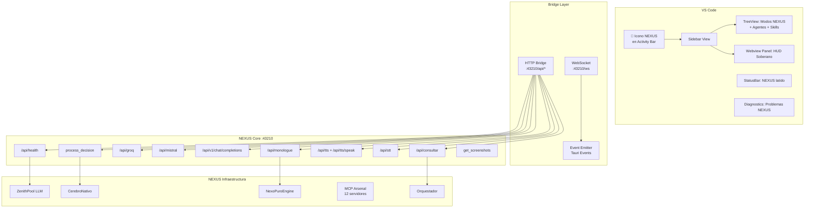

# 🔱 NEXUS SOVEREIGN EXTENSION — Plan Arquitectónico

## Objetivo

Crear una extensión de VS Code **soberana y propia** que absorba, clone y **supere** todas las capacidades de Antigravity, integrándose profundamente con el ecosistema NEXUS completo (Core, MCP, Zenith, Cerebro, Engine Puro).

## Estudio previo: ¿Qué hace Antigravity?

| Componente | Archivo | Función |
|---|---|---|
| `extension.ts` | [`antigravity_extension/src/extension.ts`](../antigravity_extension/src/extension.ts:1) | Activa la extensión, registra comandos, TreeView y Webview Panel |
| `agentControlPanel.ts` | [`antigravity_extension/src/panels/agentControlPanel.ts`](../antigravity_extension/src/panels/agentControlPanel.ts:1) | Webview con chat, lista de agentes, bridge HTTP a NEXUS API (`:43210`) |
| `agentTreeProvider.ts` | [`antigravity_extension/src/providers/agentTreeProvider.ts`](../antigravity_extension/src/providers/agentTreeProvider.ts:1) | TreeDataProvider que escanea `.agent/agents/` y muestra agentes como ítems |
| ViewContainer | `package.json` `viewsContainers` | Ícono en la barra de actividad → panel lateral con TreeView + Webview |
| Comandos | `refreshAgents`, `launchAgent`, `stopAgent`, `openPanel` | Registrados en la paleta de comandos |
| API endpoints usados | `/api/health`, `/api/consultar` | Solo 2 de ~12 endpoints disponibles en NEXUS Core |

## 🎯 Propuesta de Superación: NEXUS Sovereign Extension



## Arquitectura de Archivos

```
nexus-sovereign-extension/
├── package.json              # Identidad NEXUS, contributes, scripts
├── tsconfig.json             # TypeScript ES2020 strict
├── .vscodeignore             # Empaquetado .vsix
├── README.md                 # Documentación soberana
├── media/
│   └── nexus-icon.svg        # 🔱 Ícono NEXUS (tridente dorado)
└── src/
    ├── extension.ts          # Punto de entrada: activate/deactivate
    ├── constants.ts          # Constantes: API_BASE, ports, endpoints
    ├── bridge/
    │   ├── nexusClient.ts    # HTTP Client unificado (todos los endpoints)
    │   ├── nexusEvents.ts    # WebSocket/Event listener para streaming
    │   └── nexusCache.ts     # Cache LRU para respuestas frecuentes
    ├── panels/
    │   ├── hudPanel.ts       # Webview Panel: HUD Soberano (reemplaza agentControlPanel)
    │   └── hudWebview.html   # Template HTML/CSS/JS del HUD (separado para legibilidad)
    ├── providers/
    │   ├── modeTreeProvider.ts   # TreeView: 8 modos NEXUS + estado
    │   ├── agentTreeProvider.ts  # TreeView: agentes .agent/agents/ (absorbido de Antigravity)
    │   └── skillTreeProvider.ts  # TreeView: skills .agent/skills/
    ├── views/
    │   ├── statusBar.ts      # StatusBarItem: latido NEXUS, modo activo, load
    │   └── diagnostics.ts    # DiagnosticCollection: problemas de workspace
    └── commands/
        ├── chatCommands.ts   # Comandos de chat: enviar, historial, limpiar
        ├── modeCommands.ts   # Comandos de modo: switch rápido de modo NEXUS
        ├── agentCommands.ts  # Comandos de agente: refresh, launch, stop (absorbido)
        └── systemCommands.ts # Comandos sistema: health, zenith status, screenshots
```

## Funcionalidades (Absorción + Superación)

### Nivel 1: Absorción total de Antigravity (paridad)

| Funcionalidad | Antigravity | NEXUS Sovereign |
|---|---|---|
| **ViewContainer en Activity Bar** | ✅ `antigravity-control-container` | ✅ `nexus-sovereign-container` con ícono 🔱 |
| **TreeView de agentes** | ✅ Escanea `.agent/agents/` | ✅ Idéntico + añade estados RAM/CPU |
| **Webview Panel con chat** | ✅ Chat básico con `/api/consultar` | ✅ HUD completo con múltiples pestañas |
| **Comandos básicos** | ✅ 4 comandos | ✅ 12+ comandos |
| **Health check** | ✅ `/api/health` | ✅ + `/api/monologue` + Zenith status |
| **Configuración** | ✅ 3 propiedades | ✅ 8+ propiedades con defaults NEXUS |

### Nivel 2: Superación (features exclusivas NEXUS)

| Feature | Descripción | Endpoint asociado |
|---|---|---|
| **🎛️ Selector de Modo NEXUS** | Cambiar entre los 8 modos (🧠 CEREBRO, 💻 CÓDIGO, ⚡ RÁPIDO, etc.) desde el HUD | `/api/consultar` con modo |
| **📊 Dashboard de Sistema** | RAM, CPU, GPU, procesos NEXUS activos, Zenith pool status | `sysinfo` + `/api/health` |
| **🧠 Monólogo en tiempo real** | Ver el pensamiento interno de NexoPuroEngine como stream | `/api/monologue` |
| **🎙️ Voz (TTS/STT)** | Hablar y escuchar al Arquitecto directamente desde VS Code | `/api/tts/speak` + `/api/stt` |
| **📸 Screenshots del sistema** | Capturar y analizar pantalla desde el HUD | `get_screenshots` |
| **🔍 Motor Léxico Sinclair** | Visualizar estado del vocabulario emergente de engine-puro | `/api/consultar` especializado |
| **📡 Latido NEXUS en StatusBar** | Indicador siempre visible: 🟢 Online / 🟡 Cargando / 🔴 Offline | Event polling |
| **⚠️ Diagnostics NEXUS** | Problemas detectados en workspace como Diagnostics de VS Code | Análisis estático |
| **🧩 Skills Browser** | Navegar y cargar skills desde `.agent/skills/` directamente | File system + API |
| **📜 Log Stream** | Recibir logs de NEXUS Core en tiempo real (ya existe `nexus-log` event) | Tauri events → Webview |

## Detalle del HUD Soberano (Webview Panel)

El panel reemplaza el `agentControlPanel` de Antigravity con 4 pestañas:

```
┌──────────────────────────────────────────────────┐
│ 🔱 NEXUS SOVEREIGN HUD          🟢 Online  12:34 │
├──────────────────────────────────────────────────┤
│ [💬 Chat] [📊 Dashboard] [🧠 Mente] [⚙️ Sistema] │
├──────────────────────────────────────────────────┤
│                                                    │
│  💬 CHAT                                          │
│  ┌──────────────────────────────────────────────┐ │
│  │ Modo: 🧬 ORQUESTADOR  |  Modelo: deepseek-v4 │ │
│  │ [SYSTEM] NEXUS Online. 8 modos disponibles.  │ │
│  │ > ¿Estado del sistema?                       │ │
│  │ 🤖 Zenith: 3/5 slots, RAM: 12.4GB/32GB      │ │
│  │                                              │ │
│  ├──────────────────────────────────────────────┤ │
│  │ [________________________] [⚡ Enviar] [🎙️]  │ │
│  └──────────────────────────────────────────────┘ │
│                                                    │
│  📊 DASHBOARD (pestaña 2)                         │
│  ┌──────────────────────────────────────────────┐ │
│  │ CPU: ████████░░ 78%  RAM: █████░░░░ 62%      │ │
│  │ Zenith: 🟢🟢🟢🟡🔴   GPU: ████░░░░ 45%       │ │
│  │ Engine Puro: 🟢 Motor Léxico: 847 tokens     │ │
│  └──────────────────────────────────────────────┘ │
│                                                    │
│  🧠 MENTE (pestaña 3)                             │
│  ┌──────────────────────────────────────────────┐ │
│  │ "analizando entrada del Arquitecto...        │ │
│  │  activación neuronal: 0.73                   │ │
│  │  conciencia: 0.45  emoción: +0.3"            │ │
│  └──────────────────────────────────────────────┘ │
└──────────────────────────────────────────────────┘
```

## Bridge de Comunicación

La extensión se comunica con NEXUS Core (`:43210`) mediante un `NexusClient` unificado:

```typescript
// bridge/nexusClient.ts
class NexusClient {
    private baseUrl = 'http://localhost:43210';
    
    // Salud
    async health(): Promise<HealthStatus>;
    async zenithStatus(): Promise<ZenithStatus>;
    
    // Consulta principal
    async consultar(prompt: string, modelo: string): Promise<string>;
    
    // Streaming / Tiempo real
    async monologue(): Promise<string>;
    onLog(callback: (msg: string) => void): Disposable;
    
    // Voz
    async speak(text: string, profile?: string): Promise<void>;
    async transcribe(audio: Uint8Array): Promise<string>;
    
    // Sistema
    async screenshots(): Promise<string[]>;
    async systemInfo(): Promise<SystemInfo>;
}
```

## Plan de Implementación (6 Fases)

### Fase 1: Esqueleto
- `package.json` con identidad `nexus-sovereign`, contributes, scripts
- `tsconfig.json` ES2020 strict
- `.vscodeignore` para empaquetado limpio
- `extension.ts` con `activate()` y `deactivate()` mínimos
- Ícono SVG 🔱 en `media/nexus-icon.svg`

### Fase 2: ViewContainer + Sidebar + TreeViews
- `viewsContainers` en `package.json` (activitybar)
- `views` con 3 vistas: modos, agentes, skills
- `modeTreeProvider.ts`: lista los 8 modos NEXUS con iconos y estados
- `agentTreeProvider.ts`: absorbido y adaptado de Antigravity
- `skillTreeProvider.ts`: escanea `.agent/skills/`

### Fase 3: Webview Panel — HUD Soberano
- `hudPanel.ts`: Webview con 4 pestañas (Chat, Dashboard, Mente, Sistema)
- `hudWebview.html`: Template separado con CSS dark theme NEXUS
- Bridge HTTP inicial: `/api/health` y `/api/consultar`
- Chat funcional con selector de modo NEXUS

### Fase 4: Bridge HTTP/WS completo
- `nexusClient.ts`: Cliente unificado para todos los endpoints
- `/api/monologue` para streaming de pensamiento
- `/api/tts/speak` y `/api/stt` para voz
- `get_screenshots` para capturas
- StatusBar integrada: 🟢/🟡/🔴 + modo activo

### Fase 5: StatusBar + Diagnostics + Comandos
- `statusBar.ts`: Indicador permanente de latido NEXUS
- `diagnostics.ts`: Problemas de workspace reportados como Diagnostics
- 12+ comandos registrados en paleta
- `nexusCache.ts`: Cache LRU para reducir latencia

### Fase 6: Build, empaquetado, prueba
- `npm run compile` → verificación TypeScript
- `vsce package` → `.vsix` instalable
- Prueba en frío: instalar en VS Code, verificar todos los flujos
