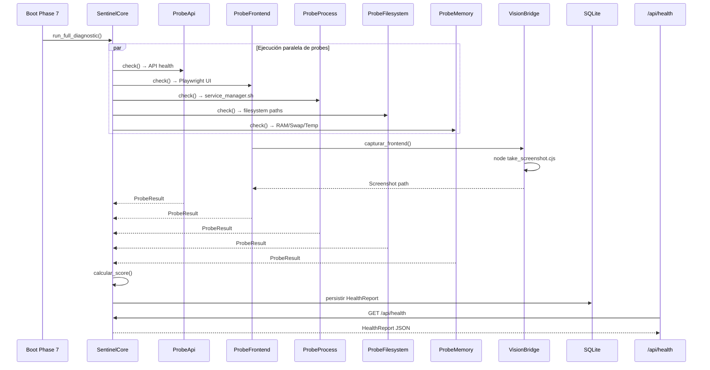
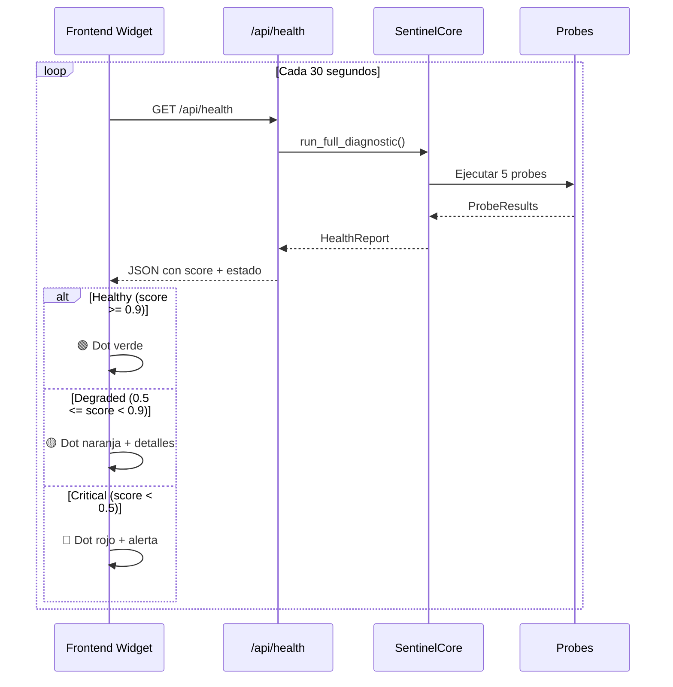
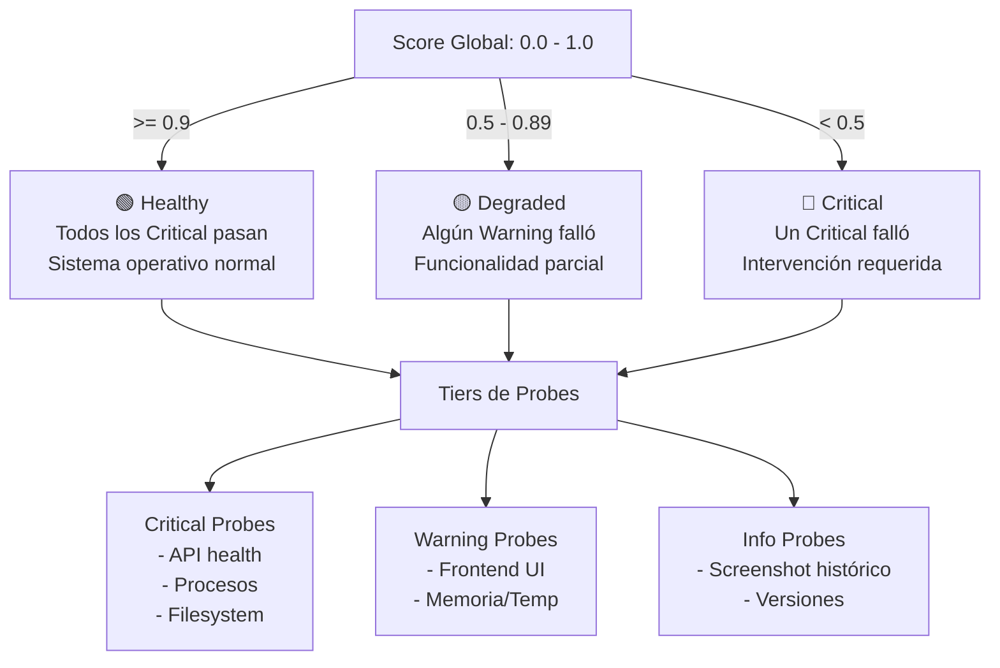

# 🛡️ PLAN: OBSERVABILIDAD Y AUTODIAGNÓSTICO SOBERANO (NEXUS SENTINEL)

> **Arquitecto:** Cris | **Fecha:** 2026-06-29 | **Modo:** Architect
> **Propósito:** Dotar a NEXUS de visión interna absoluta sobre el estado de todos sus órganos, servicios y superficie de ataque, eliminando la ceguera que sufrió durante la crisis del "NEXUS WS Error".

---

## 📋 TABLA DE CONTENIDOS
1. [Resumen Ejecutivo](#1-resumen-ejecutivo)
2. [Diagnóstico del Estado Actual](#2-diagnóstico-del-estado-actual)
3. [Arquitectura Propuesta](#3-arquitectura-propuesta)
4. [Fases de Implementación](#4-fases-de-implementación)
5. [Archivos a Crear/Modificar](#5-archivos-a-crearmodificar)
6. [Diagramas de Flujo](#6-diagramas-de-flujo)
7. [API y Contratos](#7-api-y-contratos)
8. [Criterios de Aceptación](#8-criterios-de-aceptación)

---

## 1. RESUMEN EJECUTIVO

NEXUS posee órganos de autodiagnóstico (`core/src/autodiagnostico/`) pero están atrofiados:
- [`salud_nucleo.rs`](core/src/autodiagnostico/salud_nucleo.rs) solo verifica el puerto CDP 9222 — hardcodeado, sin lógica real.
- [`autoconservacion.rs`](core/src/autodiagnostico/autoconservacion.rs) solo verifica existencia de archivos `.rs`, no funcionalidad.
- [`api_health()`](src-tauri/src/main.rs:911) devuelve JSON estático — no sondea nada real.
- Los scripts [`validate-ui.cjs`](scripts/validate-ui.cjs) y [`take_screenshot.cjs`](take_screenshot.cjs) existen pero no están cableados al núcleo Rust.
- La crisis del "NEXUS WS Error" (TypeError en JS + CSP + build roto) pasó completamente desapercibida para el backend.

**Solución:** Construir un **Sentinel Core** unificado con probes enchufables, puente de visión soberano vía Playwright, y dashboard en tiempo real. Todo en Rust Puro (Pilar 4), sin nuevas dependencias externas.

---

## 2. DIAGNÓSTICO DEL ESTADO ACTUAL

### 2.1 Lo que YA existe y funciona

| Componente | Archivo | Estado |
|---|---|---|
| Autoconservación (inspección .rs) | [`autoconservacion.rs`](core/src/autodiagnostico/autoconservacion.rs) | 🟡 Stubs, solo verifica existencia de archivos |
| Salud Núcleo (CDP check) | [`salud_nucleo.rs`](core/src/autodiagnostico/salud_nucleo.rs) | 🔴 Hardcodeado, no sondea |
| Nexus Repair (ServiceManager) | [`nexus_repair.rs`](core/src/autodiagnostico/nexus_repair.rs) | 🔴 Solo println! stubs |
| Biostasis (health levels) | [`nexus_biostasis.rs`](core/src/autodiagnostico/nexus_biostasis.rs) | 🔴 Solo stubs |
| Simulador (DigitalTwin) | [`simulador.rs`](core/src/autodiagnostico/simulador.rs) | 🟢 Funcional, predicción de impacto |
| Nexus Panic (iptables) | [`nexus_panic.rs`](core/src/autodiagnostico/nexus_panic.rs) | 🟢 Funcional pero solo para amenazas |
| Shield V2 (BPF tokens) | [`nexus_shield_v2.rs`](core/src/autodiagnostico/nexus_shield_v2.rs) | 🟡 Simulación en memoria |
| Boot Health Check (Fase 7) | [`boot.rs`](core/src/infra/boot.rs:541) | 🟢 Verifica RAM, DB, Thalamus, Gateway, Orquestador |
| API Health endpoint | [`main.rs`](src-tauri/src/main.rs:911) | 🔴 JSON estático, no sondea |
| Auto Health script | [`auto_health.sh`](scripts/auto_health.sh) | 🟢 cargo-audit + clippy + check + test |
| Service Manager | [`service_manager.sh`](scripts/service_manager.sh) | 🟢 start/stop/status/logs/list |
| UI Validator (Puppeteer) | [`validate-ui.cjs`](scripts/validate-ui.cjs) | 🟢 Funcional pero aislado |
| Screenshot (Playwright) | [`take_screenshot.cjs`](take_screenshot.cjs) | 🟢 Funcional pero aislado |
| OmnipresentVision | [`omnipresent_vision.rs`](core/src/sentidos/omnipresent_vision.rs) | 🟢 Captura desktop + OCR |

### 2.2 GAPS críticos identificados

1. **Sin detección de errores frontend desde el backend** — Un TypeError en JS derriba toda la UI y el backend no se entera.
2. **Sin verificación automatizada de UI** — Playwright/Puppeteer existen pero no están cableados al núcleo Rust.
3. **Sin agregación de salud de servicios** — No hay un solo endpoint que diga "el sistema está verde/amarillo/rojo".
4. **Sin persistencia de métricas** — Los resultados de auto_health.sh no se almacenan ni se consultan.
5. **Sin panel de observabilidad en la UI** — El Arquitecto no puede ver el pulso del sistema de un vistazo.
6. **Sin smoke tests post-build** — Tras `cargo build`, no hay verificación automática de que todo funcione.

---

## 3. ARQUITECTURA PROPUESTA

```
┌──────────────────────────────────────────────────────────────────────┐
│                  🛡️ NEXUS SENTINEL CORE                            │
│                  core/src/autodiagnostico/sentinel_core.rs           │
│                                                                      │
│  ┌─────────────────────────────────────────────────────────────┐    │
│  │  HealthProbe trait                                           │    │
│  │  ├─ async fn check(&self) -> ProbeResult                     │    │
│  │  ├─ fn tier() -> ProbeTier { Critical, Warning, Info }      │    │
│  │  └─ fn nombre() -> &'static str                             │    │
│  └─────────────────────────────────────────────────────────────┘    │
│                                                                      │
│  ┌───────────────┐  ┌──────────────┐  ┌────────────────────────┐   │
│  │ probe_api.rs  │  │probe_frontend│  │  probe_process.rs      │   │
│  │               │  │    .rs       │  │                        │   │
│  │ • /api/health │  │ • Playwright │  │  • service_manager.sh  │   │
│  │ • Ollama      │  │ • JS errors  │  │  • Vite dev server     │   │
│  │ • DeepSeek    │  │ • CSP check  │  │  • Backend binary      │   │
│  └───────────────┘  └──────────────┘  └────────────────────────┘   │
│                                                                      │
│  ┌───────────────┐  ┌──────────────┐  ┌────────────────────────┐   │
│  │probe_filesys  │  │ probe_memory │  │  vision_bridge.rs      │   │
│  │    tem.rs     │  │    .rs       │  │                        │   │
│  │               │  │              │  │  • Rust → Node bridge  │   │
│  │ • critical    │  │ • RAM usage  │  │  • Screenshot capture  │   │
│  │   paths       │  │ • Swap       │  │  • Output parsing      │   │
│  │ • permissions │  │ • CPU temp   │  │  • Historical store    │   │
│  └───────────────┘  └──────────────┘  └────────────────────────┘   │
│                                                                      │
│  ┌─────────────────────────────────────────────────────────────┐    │
│  │  SentinelCore.run_full_diagnostic() → HealthReport          │    │
│  │  ├─ Ejecuta todos los probes                                │    │
│  │  ├─ Calcula score global (0.0 - 1.0)                       │    │
│  │  ├─ Persiste en SQLite (nexus_memoria.db)                   │    │
│  │  └─ Retorna JSON enriquecido                                │    │
│  └─────────────────────────────────────────────────────────────┘    │
└──────────────────────────────────────────────────────────────────────┘
         │                    │                    │
         ▼                    ▼                    ▼
┌─────────────┐   ┌──────────────────┐   ┌──────────────────────┐
│ api_health  │   │ Boot Phase 7     │   │ Frontend Widget      │
│ (enriquecido)│   │ (post-arranque)  │   │ (HealthIndicator)   │
│             │   │                  │   │                      │
│ GET /api/   │   │ SentinelCore     │   │ 🟢/🟡/🔴 dot        │
│ health      │   │ .run_full_       │   │ + expandable panel   │
│ → JSON rico │   │ diagnostic()     │   │ Poll c/30s           │
└─────────────┘   └──────────────────┘   └──────────────────────┘
```

### 3.1 Estructura de archivos nuevos

```
core/src/autodiagnostico/
├── mod.rs                          # [MODIFICAR] Añadir pub mod sentinel_core + probes
├── sentinel_core.rs                # [NUEVO] Motor central de diagnóstico
├── probes/
│   ├── mod.rs                      # [NUEVO]
│   ├── probe_api.rs                # [NUEVO] Health de APIs (NEXUS, Ollama, DeepSeek)
│   ├── probe_frontend.rs           # [NUEVO] Verificación de UI vía Playwright
│   ├── probe_process.rs            # [NUEVO] Verificación de procesos gestionados
│   ├── probe_filesystem.rs         # [NUEVO] Verificación de rutas críticas
│   └── probe_memory.rs             # [NUEVO] RAM, swap, temperatura
├── vision_bridge.rs                # [NUEVO] Puente Rust↔Node para capturas
├── autoconservacion.rs             # [MANTENER] Ya existe
├── salud_nucleo.rs                 # [DEPRECAR] Reemplazado por probe_api
├── nexus_repair.rs                 # [MANTENER] Ya existe
├── nexus_shield_v2.rs              # [MANTENER] Ya existe
├── nexus_panic.rs                  # [MANTENER] Ya existe
├── nexus_biostasis.rs              # [MANTENER] Ya existe
└── simulador.rs                    # [MANTENER] Ya existe
```

---

## 4. FASES DE IMPLEMENTACIÓN

### 🟢 FASE A: Sentinel Core (Motor Central)

**Archivo:** [`core/src/autodiagnostico/sentinel_core.rs`](core/src/autodiagnostico/sentinel_core.rs) (NUEVO)

**Objetivo:** Crear el trait `HealthProbe`, el struct `ProbeResult`, y el `SentinelCore` que orquesta todos los checks.

```rust
// Trait principal
#[async_trait]
pub trait HealthProbe: Send + Sync {
    async fn check(&self) -> ProbeResult;
    fn tier(&self) -> ProbeTier;
    fn nombre(&self) -> &'static str;
}

// Resultado de una sonda
pub struct ProbeResult {
    pub nombre: String,
    pub tier: ProbeTier,
    pub passed: bool,
    pub mensaje: String,
    pub detalles: Option<serde_json::Value>,
    pub latencia_ms: u64,
}

// Tiers de criticidad
pub enum ProbeTier {
    Critical,  // Sistema no funciona sin esto
    Warning,   // Degradación parcial
    Info,      // Informativo
}

// Reporte agregado
pub struct HealthReport {
    pub timestamp: String,
    pub score_global: f32,        // 0.0 - 1.0
    pub estado: HealthStatus,     // Healthy, Degraded, Critical
    pub probes: Vec<ProbeResult>,
    pub resumen: String,
}

pub enum HealthStatus {
    Healthy,     // score >= 0.9
    Degraded,    // 0.5 <= score < 0.9
    Critical,    // score < 0.5
}

// Motor central
pub struct SentinelCore {
    probes: Vec<Box<dyn HealthProbe>>,
    db: Option<Arc<DatabaseManager>>,
}

impl SentinelCore {
    pub fn new() -> Self;
    pub fn registrar_probe(&mut self, probe: Box<dyn HealthProbe>);
    pub async fn run_full_diagnostic(&self) -> HealthReport;
    pub async fn run_tier(&self, tier: ProbeTier) -> Vec<ProbeResult>;
    pub fn calcular_score(probes: &[ProbeResult]) -> f32;
    pub fn estado_desde_score(score: f32) -> HealthStatus;
}
```

**Dependencias:** `async_trait`, `serde_json`, `chrono`, `tokio`, `tracing`. Todas YA en `Cargo.toml`.

---

### 🟢 FASE B: Probe Plugins (5 sondas)

#### B1: [`probe_api.rs`](core/src/autodiagnostico/probes/probe_api.rs) (NUEVO)

- Verifica `GET http://127.0.0.1:43210/api/health` — endpoint propio
- Verifica `GET http://127.0.0.1:11434/api/tags` — Ollama (si está instalado)
- Verifica conectividad a DeepSeek API (health check rápido)
- Tier: **Critical** (sin API, NEXUS no responde)

#### B2: [`probe_frontend.rs`](core/src/autodiagnostico/probes/probe_frontend.rs) (NUEVO)

- Invoca `node take_screenshot.cjs` vía `std::process::Command`
- Verifica que el screenshot se generó sin errores
- Verifica que Vite dev server responde en `http://localhost:5173`
- Opcional: analiza el HTML devuelto buscando `<div id="chat-messages">`
- Tier: **Warning** (sin UI, el backend sigue funcionando)

#### B3: [`probe_process.rs`](core/src/autodiagnostico/probes/probe_process.rs) (NUEVO)

- Ejecuta `./scripts/service_manager.sh list`
- Verifica que los servicios críticos están ACTIVOS (nexus-backend, nexus-frontend)
- Tier: **Critical** (sin procesos, nada funciona)

#### B4: [`probe_filesystem.rs`](core/src/autodiagnostico/probes/probe_filesystem.rs) (NUEVO)

- Verifica existencia de rutas críticas:
  - `core/src/` — código fuente
  - `src-tauri/src/main.rs` — entry point
  - `dist/` — frontend compilado
  - `data/nexus_memoria.db` — base de datos
  - `index.html` — frontend fuente
- Verifica permisos de escritura en `data/`, `logs/`, `/tmp/`
- Tier: **Critical** (sin archivos, nada compila)

#### B5: [`probe_memory.rs`](core/src/autodiagnostico/probes/probe_memory.rs) (NUEVO)

- Lee `/proc/meminfo` para RAM total, disponible, swap
- Lee `/sys/class/thermal/thermal_zone0/temp` para temperatura CPU
- Calcula porcentajes y evalúa umbrales:
  - RAM > 90%: Warning
  - Swap > 80%: Critical
  - Temp > 85°C: Critical
- Tier: **Warning** (degradación, no fallo total)

---

### 🟡 FASE C: Sovereign Vision Bridge

**Archivo:** [`core/src/autodiagnostico/vision_bridge.rs`](core/src/autodiagnostico/vision_bridge.rs) (NUEVO)

```rust
pub struct VisionBridge;

impl VisionBridge {
    /// Toma screenshot del frontend vía Playwright (Node.js)
    /// Retorna path del archivo PNG o error
    pub async fn capturar_frontend(url: &str) -> Result<PathBuf>;

    /// Verifica que la UI carga sin errores JS
    /// Retorna true si no hay errores en consola
    pub async fn verificar_ui_sana(url: &str) -> Result<bool>;

    /// Almacena screenshot con timestamp en /tmp/nexus_health/
    pub fn archivar_screenshot(path: &PathBuf) -> Result<PathBuf>;
}
```

**Estrategia:** Invocación de `node` con el script `take_screenshot.cjs` desde Rust, captura de stdout/stderr, parsing del resultado. Sin dependencias nuevas — `std::process::Command` es suficiente.

---

### 🟡 FASE D: Health API Enhancement

**Archivo:** [`src-tauri/src/main.rs`](src-tauri/src/main.rs) (MODIFICAR)

Transformar `api_health()` (línea 911) de JSON estático a diagnóstico en vivo:

```rust
// ANTES (línea 911-917):
async fn api_health() -> Json<serde_json::Value> {
    Json(serde_json::json!({
        "status": "ok",
        "sistema": "NEXUS Omega Operativo",
        "timestamp": chrono::Utc::now().to_rfc3339()
    }))
}

// DESPUÉS:
async fn api_health(
    State(sentinel): State<Arc<SentinelCore>>
) -> Json<serde_json::Value> {
    let report = sentinel.run_full_diagnostic().await;
    Json(serde_json::to_value(report).unwrap())
}
```

Nuevos endpoints:
- `GET /api/health` — Reporte completo (TODOS los tiers)
- `GET /api/health/critical` — Solo probes Critical
- `GET /api/health/screenshot` — Toma y retorna screenshot en base64

**Nota:** Requiere inyectar `Arc<SentinelCore>` como State en el Router de Axum. Ya existe patrón con `ZenithPool` y `CerebroAutoOptimizable`.

---

### 🟡 FASE E: Boot Integration

**Archivo:** [`core/src/infra/boot.rs`](core/src/infra/boot.rs) (MODIFICAR)

En `phase_health_check()` (línea 541), añadir después de los checks existentes:

```rust
// 7.6 — SentinelCore (NUEVO)
let mut sentinel = SentinelCore::new();
sentinel.registrar_probe(Box::new(ProbeApi::new()));
sentinel.registrar_probe(Box::new(ProbeProcess::new()));
sentinel.registrar_probe(Box::new(ProbeFilesystem::new()));
let report = sentinel.run_full_diagnostic().await;
info!("🩺 [HEALTH] SentinelCore score: {:.2} — {}", report.score_global, report.resumen);
checks.push(("SentinelCore", report.estado == HealthStatus::Healthy));
```

---

### 🔵 FASE F: Frontend Health Widget

**Archivo:** [`index.html`](index.html) (MODIFICAR)

Añadir en el sidebar (después del widget existente en línea 840-845):

```html
<!-- Widget de Salud del Sistema -->
<div class="widget" style="margin-top: 20px;" id="health-widget">
    <div style="display: flex; align-items: center; gap: 8px;">
        <span id="health-dot" style="width: 10px; height: 10px; border-radius: 50%; background: #666;"></span>
        <span style="font-weight: 500; font-size: 13px;">🩺 Salud del Sistema</span>
    </div>
    <div id="health-details" style="margin-top: 8px; font-size: 11px; color: #8892b0; display: none;">
        <!-- Se llena dinámicamente vía JS -->
    </div>
</div>
```

**Lógica JS** (añadir en el `<script>` principal):

```javascript
// Health Polling
async function pollHealth() {
    try {
        const res = await fetch('http://127.0.0.1:43210/api/health');
        const data = await res.json();
        const dot = document.getElementById('health-dot');
        const details = document.getElementById('health-details');
        
        if (data.estado === 'Healthy') {
            dot.style.background = '#4caf50'; // Verde
        } else if (data.estado === 'Degraded') {
            dot.style.background = '#ff9800'; // Naranja
        } else {
            dot.style.background = '#f44336'; // Rojo
        }
        
        // Construir detalles expandibles
        details.innerHTML = data.probes
            .map(p => `${p.passed ? '✅' : '❌'} ${p.nombre}: ${p.mensaje}`)
            .join('<br>');
        
        // Mostrar/ocultar detalles al hacer clic en el widget
        document.getElementById('health-widget').onclick = () => {
            details.style.display = details.style.display === 'none' ? 'block' : 'none';
        };
    } catch (e) {
        document.getElementById('health-dot').style.background = '#666';
    }
}
pollHealth();
setInterval(pollHealth, 30000); // Cada 30 segundos
```

---

## 5. ARCHIVOS A CREAR/MODIFICAR

### Nuevos archivos (8)

| # | Archivo | Propósito |
|---|---------|-----------|
| 1 | [`core/src/autodiagnostico/sentinel_core.rs`](core/src/autodiagnostico/sentinel_core.rs) | Motor central con trait HealthProbe + SentinelCore |
| 2 | [`core/src/autodiagnostico/probes/mod.rs`](core/src/autodiagnostico/probes/mod.rs) | Módulo de probes |
| 3 | [`core/src/autodiagnostico/probes/probe_api.rs`](core/src/autodiagnostico/probes/probe_api.rs) | Sonda de APIs |
| 4 | [`core/src/autodiagnostico/probes/probe_frontend.rs`](core/src/autodiagnostico/probes/probe_frontend.rs) | Sonda de UI |
| 5 | [`core/src/autodiagnostico/probes/probe_process.rs`](core/src/autodiagnostico/probes/probe_process.rs) | Sonda de procesos |
| 6 | [`core/src/autodiagnostico/probes/probe_filesystem.rs`](core/src/autodiagnostico/probes/probe_filesystem.rs) | Sonda de archivos |
| 7 | [`core/src/autodiagnostico/probes/probe_memory.rs`](core/src/autodiagnostico/probes/probe_memory.rs) | Sonda de memoria |
| 8 | [`core/src/autodiagnostico/vision_bridge.rs`](core/src/autodiagnostico/vision_bridge.rs) | Puente Rust↔Node para Playwright |

### Archivos a modificar (4)

| # | Archivo | Cambio |
|---|---------|--------|
| 1 | [`core/src/autodiagnostico/mod.rs`](core/src/autodiagnostico/mod.rs) | Añadir `pub mod sentinel_core; pub mod probes; pub mod vision_bridge;` |
| 2 | [`src-tauri/src/main.rs`](src-tauri/src/main.rs) | Enriquecer `api_health()` (línea 911), añadir State<SentinelCore>, nuevos endpoints |
| 3 | [`core/src/infra/boot.rs`](core/src/infra/boot.rs) | Integrar SentinelCore en phase_health_check (línea 541) |
| 4 | [`index.html`](index.html) | Añadir widget de salud en sidebar + lógica JS de polling |

### Archivos a deprecar (1)

| # | Archivo | Acción |
|---|---------|--------|
| 1 | [`core/src/autodiagnostico/salud_nucleo.rs`](core/src/autodiagnostico/salud_nucleo.rs) | Marcar como `#[deprecated]`, redirigir a sentinel_core |

---

## 6. DIAGRAMAS DE FLUJO

### 6.1 Flujo de Diagnóstico Completo



### 6.2 Flujo de Polling del Frontend



### 6.3 Jerarquía de Tiers



---

## 7. API Y CONTRATOS

### 7.1 `GET /api/health` (Respuesta)

```json
{
    "timestamp": "2026-06-29T20:15:00-03:00",
    "score_global": 0.95,
    "estado": "Healthy",
    "resumen": "Sistema operativo normal. 5/5 probes pasaron.",
    "probes": [
        {
            "nombre": "API Core",
            "tier": "Critical",
            "passed": true,
            "mensaje": "API responde en puerto 43210",
            "detalles": { "latencia_ms": 12, "version": "omega-7" },
            "latencia_ms": 12
        },
        {
            "nombre": "Frontend UI",
            "tier": "Warning",
            "passed": true,
            "mensaje": "Vite dev server responde en :5173, UI cargada sin errores",
            "detalles": { "screenshot": "/tmp/nexus_health/screenshot_20260629_201500.png" },
            "latencia_ms": 1450
        },
        {
            "nombre": "Procesos",
            "tier": "Critical",
            "passed": true,
            "mensaje": "nexus-backend y nexus-frontend ACTIVOS",
            "detalles": { "nexus-backend": "PID 12345", "nexus-frontend": "PID 12346" },
            "latencia_ms": 85
        },
        {
            "nombre": "Sistema de Archivos",
            "tier": "Critical",
            "passed": true,
            "mensaje": "Todas las rutas críticas accesibles",
            "detalles": { "rutas_verificadas": 5 },
            "latencia_ms": 3
        },
        {
            "nombre": "Memoria",
            "tier": "Warning",
            "passed": true,
            "mensaje": "RAM: 42%, Swap: 0%, Temp: 52°C",
            "detalles": { "ram_used_pct": 42.0, "swap_used_pct": 0.0, "cpu_temp_c": 52.0 },
            "latencia_ms": 2
        }
    ]
}
```

### 7.2 `GET /api/health/critical` (Respuesta)

Subset del anterior, solo probes con `tier: "Critical"`. Más rápido (sin Playwright que tarda ~1.5s).

### 7.3 `GET /api/health/screenshot` (Respuesta)

```json
{
    "timestamp": "2026-06-29T20:15:00-03:00",
    "success": true,
    "screenshot_base64": "iVBORw0KGgoAAAANSUhEUgAA...",
    "path": "/tmp/nexus_health/screenshot_20260629_201500.png",
    "latencia_ms": 1450
}
```

---

## 8. CRITERIOS DE ACEPTACIÓN

### Fase A (Sentinel Core)
- [ ] `SentinelCore` compila sin errores ni warnings
- [ ] `HealthProbe` trait es implementable por tipos externos
- [ ] `run_full_diagnostic()` ejecuta múltiples probes y agrega resultados
- [ ] `calcular_score()` pondera Critical 60%, Warning 30%, Info 10%
- [ ] Tests unitarios: 3+ probes mock, score calculation, estado_from_score

### Fase B (Probes)
- [ ] `ProbeApi` verifica `http://127.0.0.1:43210/api/health` con timeout de 5s
- [ ] `ProbeFrontend` invoca Playwright y detecta éxito/fallo
- [ ] `ProbeProcess` parsea output de `service_manager.sh list`
- [ ] `ProbeFilesystem` verifica 5+ rutas críticas
- [ ] `ProbeMemory` lee `/proc/meminfo` y `/sys/class/thermal/`

### Fase C (Vision Bridge)
- [ ] `VisionBridge::capturar_frontend()` ejecuta `node take_screenshot.cjs`
- [ ] Captura stdout/stderr y retorna path del PNG o error descriptivo
- [ ] Screenshots se archivan con timestamp

### Fase D (API Enhancement)
- [ ] `GET /api/health` retorna JSON enriquecido con todos los probes
- [ ] `GET /api/health/critical` retorna solo probes Critical
- [ ] `GET /api/health/screenshot` retorna screenshot en base64
- [ ] Los endpoints funcionan sin bloquear el runtime (async)

### Fase E (Boot Integration)
- [ ] `phase_health_check()` ejecuta SentinelCore y loguea resultados
- [ ] Fallos en probes Warning no bloquean el boot
- [ ] Fallos en probes Critical se reportan pero no abortan (pueden ser transitorios)

### Fase F (Frontend Widget)
- [ ] Widget de salud visible en sidebar
- [ ] Dot cambia de color según estado (verde/naranja/rojo/gris)
- [ ] Click expande/colapsa detalles de probes
- [ ] Polling cada 30 segundos
- [ ] Graceful degradation si /api/health no responde

---

## 9. NOTAS TÉCNICAS

1. **Sin nuevas dependencias:** Todas las crates necesarias (`async_trait`, `serde_json`, `chrono`, `tokio`, `tracing`, `reqwest`) ya están en [`core/Cargo.toml`](core/Cargo.toml).
2. **Playwright es externo pero necesario:** La invocación vía `std::process::Command` no añade dependencias Rust. Playwright ya está instalado globalmente (`node take_screenshot.cjs`).
3. **Persistencia:** Los HealthReport se almacenan en `nexus_memoria.db` (tabla nueva `health_history`). Retención: últimos 1000 reportes.
4. **Rendimiento:** `run_full_diagnostic()` ejecuta probes en paralelo con `tokio::join!`. Latencia total ≈ max(latencia de cada probe) ≈ 1.5s (dominado por Playwright).
5. **Compatibilidad:** El `SentinelCore` se registra como State en Axum, mismo patrón que `ZenithPool` y `CerebroAutoOptimizable`.
6. **Deprecación:** `salud_nucleo.rs` se marca `#[deprecated]` pero se mantiene para compatibilidad. Sus imports se redirigen.

---

> *"El que no conoce su propia casa, no puede defenderla." — Principio de Soberanía NEXUS*
