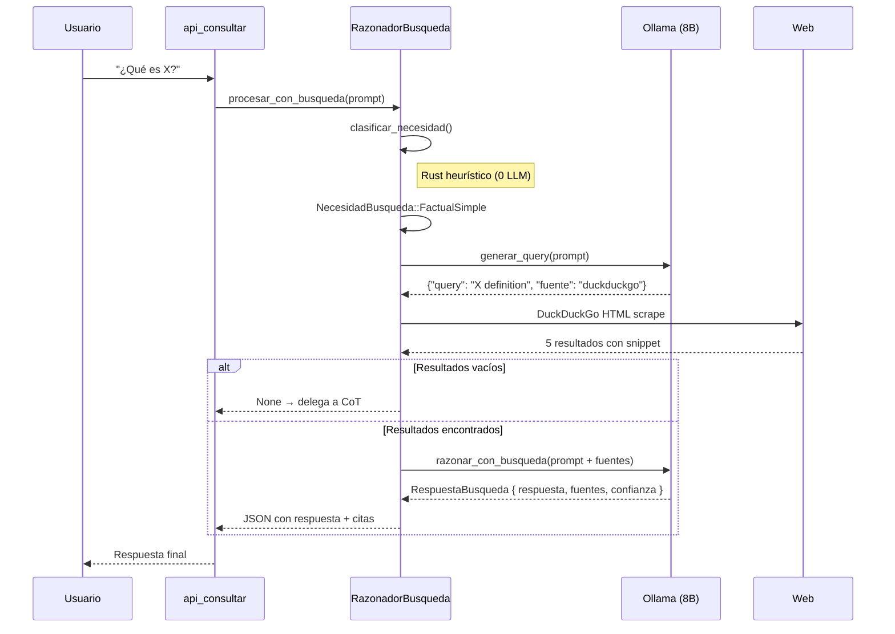

# 🧬 Órgano de Búsqueda Inteligente (Tool-Augmented Reasoning)

> **Propósito:** Dotar al modelo local 8B de acceso a información externa mediante búsqueda web inteligente al estilo DeepSeek — razonando QUÉ buscar, CÓMO formularlo, FILTRANDO resultados, y SINTETIZANDO conocimiento antes de responder.
>
> **Filosofía:** El modelo no busca crudo. Razona primero, busca después, extrae, verifica, y finalmente responde.

```
🔍 FILOSOFÍA DEEPSEEK:
   ┌──────────┐    ┌──────────┐    ┌──────────┐    ┌──────────┐
   │ 1. ¿Qué  │──→│ 2. ¿Cómo │──→│ 3. Buscar│──→│ 4. Extraer│──→ RESPUESTA
   │necesito? │    │formular? │    │  y filtr │    │  y razon │
   └──────────┘    └──────────┘    └──────────┘    └──────────┘
   (Razona)       (Planifica)     (Ejecuta)       (Sintetiza)
```

---

## 1. Arquitectura General

```
┌─────────────────────────────────────────────────────────────────────┐
│                     ÓRGANO DE BÚSQUEDA INTELIGENTE                   │
│                     razonador_busqueda.rs                            │
│                                                                     │
│  ┌─────────────┐   ┌──────────────┐   ┌───────────────┐            │
│  │  CLASIFICADOR│   │  GENERADOR   │   │  EJECUTOR DE  │            │
│  │  DE         │──→│  DE QUERY    │──→│  HERRAMIENTAS │            │
│  │  NECESIDAD  │   │  (Ollama x1) │   │  (Rust puro)  │            │
│  └─────────────┘   └──────────────┘   └───────┬───────┘            │
│       │                                        │                    │
│       │ (heurísticas)                           ├─ cloudscraper_rs  │
│       │ detecta:                                │   (HTTP directo)  │
│       │  - pregunta factual                     │                   │
│       │  - requiere datos actuales              ├─ browser_native   │
│       │  - código/API/documentación             │   (headless CDP)  │
│       │  - requiere múltiples fuentes            │                   │
│       │                                        ├─ duckduckgo_rs    │
│       │                                        │   (búsqueda gratis)│
│       │                                        └───────┬───────────┘
│       │                                                │
│  ┌────▼────────────────────────────────────────────────▼───────┐    │
│  │              EXTRACTOR + RAZONADOR (Ollama x1)              │    │
│  │  Toma el texto crudo de N fuentes, extrae info relevante,   │    │
│  │  razona sobre ella, y produce respuesta final               │    │
│  └────────────────────────────────────────────────────────────┘    │
│                                                                     │
│  ┌──────────────────────────────────────────────────────────────┐  │
│  │  CACHÉ DE CONOCIMIENTO (nexus_intelligence.db)               │  │
│  │  - Evita re-buscar queries repetidas en ≤24h                 │  │
│  │  - Almacena resultados extraídos como episodios              │  │
│  └──────────────────────────────────────────────────────────────┘  │
└─────────────────────────────────────────────────────────────────────┘
```

---

## 2. Pipeline Completo

### 2.1 Clasificador de Necesidad (Rust puro, 0 LLM)

Determina si el prompt **necesita búsqueda externa** antes de responder.

```
Entrada: prompt del usuario
Salida:  enum NecesidadBusqueda

Criterios heurísticos en Rust:
  - Contiene palabras como: "busca", "encuentra", "qué es", "último",
    "noticias", "precio", "cotización", "clima", "fecha",
    "documentación", "API reference", "latest", "current", "hoy"
  - Contiene pregunta factual: "quién es", "cuándo fue", "dónde está"
  - Contiene tecnología/sistema: "Rust", "TypeScript", "Linux", etc.
    combinado con "versión", "actualización", "noticias"
  - El prompt es corto (< 30 palabras) y termina en "?" → probable factual

Salida detallada:
  enum NecesidadBusqueda {
      NoNecesita,           // Responder directamente con CoT
      FactualSimple,        // "Qué es X?" → 1 búsqueda DuckDuckGo
      FactualMultiple,      // "Compara X vs Y" → 2+ búsquedas
      DocumentacionTecnica, // "Cómo usar API X?" → scrapear docs
      DatosActuales,        // "Precio de Bitcoin" → fuente en tiempo real
      CodigoEjemplo,        // "Ejemplo de patrón X en Rust" → buscar código
  }
```

### 2.2 Generador de Query Inteligente (1 llamada Ollama)

Cuando el clasificador determina que necesita buscar, se genera **una query de búsqueda optimizada**.

```
System prompt especializado:
"""
Eres un generador de consultas de búsqueda web. Tu única tarea es
generar la MEJOR consulta de búsqueda para encontrar la información
que el usuario necesita.

Reglas:
- Máximo 8 palabras
- Idioma: español o inglés según el prompt
- Incluye el término técnico exacto
- Si pide código, añade "example" o "tutorial"
- Si pide documentación, añade "docs" o "documentation"
- Si pide actualizaciones, añade el año actual

Devuelve SOLO un JSON: {"query": "tu consulta aquí", "fuente": "duckduckgo|docs|multiple"}
"""

Parser: Se parsea con serde_json del output del modelo.
```

```
Ejemplos de generación:
  Input: "¿Cuál es la última versión estable de Rust?"
  Output: {"query": "latest stable Rust version 2025", "fuente": "duckduckgo"}

  Input: "Dame un ejemplo de async/await en Rust con Tokio"
  Output: {"query": "async await tokio example Rust", "fuente": "duckduckgo"}

  Input: "Compara Axum vs Actix-web para APIs REST"
  Output: {"query": "Axum vs Actix-web comparison REST API", "fuente": "multiple"}
```

### 2.3 Ejecutor de Herramientas (Rust puro, 0 LLM)

El corazón algorítmico. Toma la query y selecciona herramienta(s) óptimas.

```
pub enum HerramientaBusqueda {
    DuckDuckGo,       // Búsqueda rápida sin API key
    ScrapingDirecto,  // Fetch HTTP a URL específica (cloudscraper_rs)
    BrowserNativo,    // Headless browser para JS-heavy (browser_native)
    MultipleFuentes,  // DuckDuckGo + scraping de top resultados
}

pub struct ResultadoBusqueda {
    pub fuente: String,          // URL o nombre de fuente
    pub titulo: String,
    pub contenido: String,       // Texto extraído (truncado a ~4000 chars)
    pub relevancia: f32,         // Score heurístico 0.0-1.0
    pub timestamp: String,
}

pub struct ResultadoConsolidado {
    pub resultados: Vec<ResultadoBusqueda>,
    pub query_usada: String,
    pub herramienta_usada: HerramientaBusqueda,
    pub latencia_ms: u64,
}
```

#### Algoritmo de selección de herramienta:

```
SI fuente == "duckduckgo":
    USA DuckDuckGo HTML scraper (sin API key, scrapea resultados)
    DEVUELVE top 5 resultados con título + snippet

SI fuente == "docs":
    USA DuckDuckGo para encontrar URL de docs
    LUEGO scraping directo a la URL de docs
    EXTRAE contenido relevante con extract_text()

SI fuente == "multiple" O necesidad == DatosActuales:
    USA DuckDuckGo para obtener top 3 URLs
    PARA CADA URL:
        SI URL requiere JS (detecta Cloudflare/challenge):
            USA BrowserNativo
        SINO:
            USA ScrapingDirecto (cloudscraper_rs)
    CONSOLIDA resultados

SI necesidad == DocumentacionTecnica:
    USA DuckDuckGo con query optimizada para docs
    USA BrowserNativo para mejor parsing
    EXTRAE secciones relevantes

SI necesidad == CodigoEjemplo:
    USA DuckDuckGo con query "example" + lenguaje
    USA ScrapingDirecto a repos GitHub
    FILTRA bloques de código ```...```
```

### 2.4 Extractor + Razonador (1 llamada Ollama con contexto)

Toma los resultados consolidados y produce respuesta final.

```
System prompt especializado:
"""
Eres un analista de información. Tu tarea es:

1. REVISAR los fragmentos de búsqueda proporcionados
2. EXTRAER la información relevante para la pregunta original
3. SINTETIZAR una respuesta coherente y CITADA
4. Si los fragmentos no contienen la respuesta, INDÍCALO explícitamente
   (no inventes información faltante)

Formato de entrada:
Pregunta original: {prompt}
Fuentes encontradas:
[1] {url_1} → {contenido_extraido_1}
[2] {url_2} → {contenido_extraido_2}
...

Formato de salida:
{
  "respuesta": "Texto de respuesta con citas [1][2]",
  "confianza": 0.0-1.0,
  "fuentes_usadas": ["url_1", "url_2"],
  "info_insuficiente": false
}

Reglas:
- Si confianza < 0.5, marca info_insuficiente = true
- Prefiere fuentes más recientes cuando hay conflicto
- No copies texto literalmente — parafrasea y sintetiza
"""
```

---

## 3. Estructura de Código

### Ruta: [`src-tauri/src/razonador_busqueda.rs`](file:///home/soberano/NEXUS_ULTIMATE_CORE/src-tauri/src/razonador_busqueda.rs)

```rust
// ============================================================================
// 🧬 ÓRGANO DE BÚSQUEDA INTELIGENTE (Tool-Augmented Reasoning)
// ============================================================================
// Permite al modelo local 8B acceder a información externa mediante búsqueda
// web inteligente: clasifica necesidad, genera query, ejecuta herramientas,
// extrae y razona sobre los resultados.
// ============================================================================

use serde::{Deserialize, Serialize};
use std::time::Instant;
use reqwest::Client;
use serde_json::json;

// ─── Tipos Públicos ─────────────────────────────────────────────────────────

#[derive(Debug, Clone, Serialize, Deserialize, PartialEq)]
pub enum NecesidadBusqueda {
    NoNecesita,
    FactualSimple,
    FactualMultiple,
    DocumentacionTecnica,
    DatosActuales,
    CodigoEjemplo,
}

#[derive(Debug, Clone, Serialize, Deserialize, PartialEq)]
pub enum HerramientaBusqueda {
    DuckDuckGo,
    ScrapingDirecto,
    BrowserNativo,
    MultipleFuentes,
}

#[derive(Debug, Clone, Serialize, Deserialize)]
pub struct QueryGenerada {
    pub query: String,
    pub fuente: String,   // "duckduckgo" | "docs" | "multiple"
}

#[derive(Debug, Clone, Serialize, Deserialize)]
pub struct ResultadoBusqueda {
    pub fuente: String,
    pub titulo: String,
    pub contenido: String,   // texto extraído, truncado a ~4000 chars
    pub relevancia: f32,     // 0.0 - 1.0
    pub timestamp: String,
}

#[derive(Debug, Clone, Serialize, Deserialize)]
pub struct ResultadoConsolidado {
    pub resultados: Vec<ResultadoBusqueda>,
    pub query_usada: String,
    pub herramienta_usada: HerramientaBusqueda,
    pub latencia_ms: u64,
}

#[derive(Debug, Clone, Serialize, Deserialize)]
pub struct RespuestaBusqueda {
    pub respuesta: String,
    pub confianza: f32,
    pub fuentes_usadas: Vec<String>,
    pub info_insuficiente: bool,
    pub latencia_total_ms: u64,
    pub busqueda_realizada: bool,
}

// ─── Clasificador de Necesidad (Rust puro, 0 LLM) ──────────────────────────

/// Analiza el prompt y determina si necesita búsqueda externa.
/// Heurísticas en Rust — sin llamadas al modelo.
pub fn clasificar_necesidad(prompt: &str) -> NecesidadBusqueda {
    let prompt_lower = prompt.to_lowercase();
    let palabras: Vec<&str> = prompt_lower.split_whitespace().collect();

    // Palabras que indican necesidad de búsqueda factual
    let factual_clues = [
        "qué es", "quién es", "cuándo fue", "dónde está", "cómo se llama",
        "capital de", "significa", "definición", "historia de",
    ];

    // Palabras que indican datos actuales / tiempo real
    let actualidad_clues = [
        "último", "última", "noticias", "precio", "cotización",
        "clima", "temperatura", "pronóstico", "hoy", "ahora",
        "latest", "current", "news", "price", "weather",
    ];

    // Palabras que indican documentación técnica
    let docs_clues = [
        "documentación", "docs", "api", "reference", "tutorial",
        "cómo usar", "how to", "install", "setup", "config",
    ];

    // Palabras que indican necesidad de código
    let codigo_clues = [
        "ejemplo", "example", "código", "code snippet", "implementa",
        "patrón", "pattern", "boilerplate",
    ];

    let contiene_factual = factual_clues.iter().any(|c| prompt_lower.contains(c));
    let contiene_actualidad = actualidad_clues.iter().any(|c| prompt_lower.contains(c));
    let contiene_docs = docs_clues.iter().any(|c| prompt_lower.contains(c));
    let contiene_codigo = codigo_clues.iter().any(|c| prompt_lower.contains(c));
    let termina_en_pregunta = prompt_lower.trim().ends_with("?");
    let es_corto = palabras.len() < 30;

    // Prioridad: múltiples señales
    let mut senales = 0;
    if contiene_factual { senales += 1; }
    if contiene_actualidad { senales += 1; }
    if contiene_docs { senales += 1; }
    if contiene_codigo { senales += 1; }
    if es_corto && termina_en_pregunta { senales += 1; }

    // Si el prompt YA contiene información suficiente, no buscar
    let contiene_respuesta_interna = prompt_lower.contains("según") 
        || prompt_lower.contains("como sabemos")
        || prompt_lower.contains("basado en");

    if contiene_respuesta_interna || senales == 0 {
        return NecesidadBusqueda::NoNecesita;
    }

    // Clasificar tipo de necesidad
    if contiene_actualidad {
        NecesidadBusqueda::DatosActuales
    } else if contiene_docs {
        NecesidadBusqueda::DocumentacionTecnica
    } else if contiene_codigo {
        NecesidadBusqueda::CodigoEjemplo
    } else if senales >= 2 {
        NecesidadBusqueda::FactualMultiple
    } else {
        NecesidadBusqueda::FactualSimple
    }
}

// ─── Generador de Query Inteligente (1 llamada Ollama) ─────────────────────

/// Genera la consulta de búsqueda optimizada usando el modelo local.
pub async fn generar_query(
    prompt: &str,
    necesidad: &NecesidadBusqueda,
    ollama_api_base: &str,
    ollama_model: &str,
    client: &Client,
) -> Result<QueryGenerada, String> {
    let system_prompt = r#"
Eres un generador de consultas de búsqueda web. Tu única tarea es
generar la MEJOR consulta de búsqueda para encontrar la información
que el usuario necesita.

Reglas:
- Máximo 8 palabras
- Idioma: español o inglés según el prompt
- Incluye el término técnico exacto
- Si pide código, añade "example" o "tutorial"
- Si pide documentación, añade "docs" o "documentation"
- Si pide actualizaciones, añade el año actual

Devuelve SOLO un JSON: {"query": "tu consulta aquí", "fuente": "duckduckgo|docs|multiple"}
"#;

    let messages = vec![
        json!({"role": "system", "content": system_prompt}),
        json!({"role": "user", "content": format!(
            "Genera la consulta de búsqueda óptima para: {}",
            prompt
        )}),
    ];

    let request_body = json!({
        "model": ollama_model,
        "messages": messages,
        "options": {
            "temperature": 0.2,   // Baja para consistencia
            "top_p": 0.9,
        },
        "format": "json",
    });

    let res = client.post(format!("{}/api/chat", ollama_api_base))
        .json(&request_body)
        .send()
        .await
        .map_err(|e| format!("Error al generar query: {}", e))?;

    let body: serde_json::Value = res.json::<serde_json::Value>().await
        .map_err(|e| format!("Error al parsear respuesta de query: {}", e))?;

    let content = body["message"]["content"].as_str()
        .ok_or_else(|| "Respuesta vacía del generador de query".to_string())?;

    // Intentar parsear como JSON
    let query_gen: QueryGenerada = serde_json::from_str(content)
        .map_err(|e| format!("Error al parsear query generada: {}. Raw: {}", e, content))?;

    Ok(query_gen)
}

// ─── Ejecutor de Herramientas (Rust puro, 0 LLM) ──────────────────────────

pub mod herramientas {
    use crate::razonador_busqueda::{ResultadoBusqueda, HerramientaBusqueda};

    /// Busca en DuckDuckGo usando scraping HTML (sin API key).
    /// Extrae título, snippet y URL de los resultados.
    pub async fn buscar_duckduckgo(
        query: &str,
        max_resultados: usize,
        client: &reqwest::Client,
    ) -> Vec<ResultadoBusqueda> {
        let url = format!("https://html.duckduckgo.com/html/?q={}", urlencoding(query));
        
        let res = match client.get(&url)
            .header("User-Agent", "Mozilla/5.0 (X11; Linux x86_64) AppleWebKit/537.36")
            .send()
            .await 
        {
            Ok(r) => r,
            Err(_) => return vec![],
        };

        let html = match res.text().await {
            Ok(t) => t,
            Err(_) => return vec![],
        };

        parsear_resultados_duckduckgo(&html, max_resultados)
    }

    /// Scrapea una URL directa y extrae texto relevante.
    pub async fn scrapear_url(
        url: &str,
        client: &reqwest::Client,
    ) -> Option<ResultadoBusqueda> {
        let res = match client.get(url)
            .header("User-Agent", "Mozilla/5.0 (X11; Linux x86_64) AppleWebKit/537.36")
            .timeout(std::time::Duration::from_secs(15))
            .send()
            .await 
        {
            Ok(r) => r,
            Err(_) => return None,
        };

        if !res.status().is_success() {
            return None;
        }

        let html = match res.text().await {
            Ok(t) => t,
            Err(_) => return None,
        };

        // Extraer título (<title>...</title>)
        let titulo = html.split("<title>")
            .nth(1)
            .and_then(|s| s.split("</title>").next())
            .unwrap_or("")
            .to_string();

        // Extraer texto plano (remover tags HTML)
        let contenido = extract_text_simple(&html);

        Some(ResultadoBusqueda {
            fuente: url.to_string(),
            titulo,
            contenido: truncar_texto(&contenido, 4000),
            relevancia: 0.8,
            timestamp: chrono::Utc::now().to_rfc3339(),
        })
    }

    /// Orquesta la búsqueda según la herramienta seleccionada.
    pub async fn ejecutar_busqueda(
        query: &QueryGenerada,
        necesidad: &NecesidadBusqueda,
        client: &reqwest::Client,
    ) -> ResultadoConsolidado {
        let inicio = Instant::now();
        
        let (resultados, herramienta) = match query.fuente.as_str() {
            "docs" => {
                // Buscar primero DuckDuckGo, luego scrapear la URL top
                let ddg_results = buscar_duckduckgo(&query.query, 3, client).await;
                let mut urls_scrapeadas = Vec::new();
                for r in ddg_results.iter().take(3) {
                    if let Some(scrapeado) = scrapear_url(&r.fuente, client).await {
                        urls_scrapeadas.push(scrapeado);
                    }
                }
                (urls_scrapeadas, HerramientaBusqueda::MultipleFuentes)
            },
            "multiple" => {
                let ddg_results = buscar_duckduckgo(&query.query, 5, client).await;
                let mut consolidado = ddg_results;
                // Scrapear top 2 resultados completos
                let top_urls: Vec<String> = consolidado.iter()
                    .take(2)
                    .map(|r| r.fuente.clone())
                    .collect();
                for url in top_urls {
                    if let Some(scrapeado) = scrapear_url(&url, client).await {
                        consolidado.push(scrapeado);
                    }
                }
                (consolidado, HerramientaBusqueda::MultipleFuentes)
            },
            _ => {
                // DuckDuckGo por defecto
                let ddg_results = buscar_duckduckgo(&query.query, 5, client).await;
                (ddg_results, HerramientaBusqueda::DuckDuckGo)
            }
        };

        ResultadoConsolidado {
            resultados,
            query_usada: query.query.clone(),
            herramienta_usada: herramienta,
            latencia_ms: inicio.elapsed().as_millis() as u64,
        }
    }

    // ─── Helpers ────────────────────────────────────────────────────────

    fn urlencoding(s: &str) -> String {
        s.chars()
            .map(|c| match c {
                ' ' => '+'.to_string(),
                c if c.is_alphanumeric() || c == '-' || c == '_' => c.to_string(),
                c => format!("%{:02X}", c as u8),
            })
            .collect()
    }

    fn parsear_resultados_duckduckgo(
        html: &str,
        max: usize,
    ) -> Vec<ResultadoBusqueda> {
        let mut resultados = Vec::new();
        
        // DuckDuckGo HTML structure:
        // <a rel="nofollow" class="result__a" href="...">Título</a>
        // <a class="result__snippet" ...>Snippet</a>
        
        for block in html.split(r#"class="result__body""#).skip(1) {
            if resultados.len() >= max { break; }

            let url = block.split(r#"href=""#)
                .nth(1)
                .and_then(|s| s.split('"').next())
                .unwrap_or("")
                .to_string();

            let titulo = block.split(r#"class="result__a""#)
                .nth(1)
                .and_then(|s| s.split('>').nth(1))
                .and_then(|s| s.split("</a>").next())
                .map(|s| strip_html_tags(s))
                .unwrap_or_default();

            let snippet = block.split(r#"class="result__snippet""#)
                .nth(1)
                .and_then(|s| s.split('>').nth(1))
                .and_then(|s| s.split("</a>").next())
                .map(|s| strip_html_tags(s))
                .unwrap_or_default();

            if !url.is_empty() && !titulo.is_empty() {
                let relevancia = if snippet.to_lowercase().contains(&titulo.to_lowercase()) {
                    0.9
                } else {
                    0.7
                };

                resultados.push(ResultadoBusqueda {
                    fuente: url,
                    titulo,
                    contenido: truncar_texto(&snippet, 2000),
                    relevancia,
                    timestamp: chrono::Utc::now().to_rfc3339(),
                });
            }
        }

        resultados
    }

    fn strip_html_tags(input: &str) -> String {
        let mut result = String::new();
        let mut in_tag = false;
        for c in input.chars() {
            match c {
                '<' => in_tag = true,
                '>' => in_tag = false,
                _ if !in_tag => result.push(c),
                _ => {}
            }
        }
        result.trim().to_string()
    }

    fn extract_text_simple(html: &str) -> String {
        // Remover scripts y styles
        let sin_scripts = html
            .split("<script")
            .enumerate()
            .filter_map(|(i, s)| {
                if i > 0 { s.split("</script>").nth(1) } else { Some(s) }
            })
            .collect::<Vec<&str>>()
            .join(" ");
        
        let sin_styles = sin_scripts
            .split("<style")
            .enumerate()
            .filter_map(|(i, s)| {
                if i > 0 { s.split("</style>").nth(1) } else { Some(s) }
            })
            .collect::<Vec<&str>>()
            .join(" ");

        strip_html_tags(&sin_styles)
    }

    fn truncar_texto(texto: &str, max_chars: usize) -> String {
        if texto.len() <= max_chars {
            texto.to_string()
        } else {
            format!("{}...", &texto[..max_chars])
        }
    }
}

// ─── Extractor + Razonador (1 llamada Ollama con contexto aumentado) ─────

/// Toma los resultados de búsqueda y produce una respuesta razonada.
pub async fn razonar_con_busqueda(
    prompt: &str,
    resultados: &ResultadoConsolidado,
    ollama_api_base: &str,
    ollama_model: &str,
    client: &Client,
) -> RespuestaBusqueda {
    let inicio = Instant::now();

    // Si no hay resultados, devolver respuesta directa
    if resultados.resultados.is_empty() {
        return RespuestaBusqueda {
            respuesta: "No se encontraron resultados de búsqueda para tu consulta. Intenta reformular la pregunta.".to_string(),
            confianza: 0.0,
            fuentes_usadas: vec![],
            info_insuficiente: true,
            latencia_total_ms: inicio.elapsed().as_millis() as u64,
            busqueda_realizada: true,
        };
    }

    let system_prompt = r#"
Eres un analista de información. Tu tarea es:

1. REVISAR los fragmentos de búsqueda proporcionados
2. EXTRAER la información relevante para la pregunta original
3. SINTETIZAR una respuesta coherente y CITADA
4. Si los fragmentos no contienen la respuesta, INDÍCALO explícitamente

Reglas:
- Si confianza < 0.5, marca info_insuficiente = true
- Prefiere fuentes más recientes cuando hay conflicto
- No copies texto literalmente — parafrasea y sintetiza
"#;

    // Construir contexto con las fuentes encontradas
    let mut fuentes_str = String::new();
    for (i, r) in resultados.resultados.iter().enumerate() {
        fuentes_str.push_str(&format!(
            "[{}] {} → {}\n",
            i + 1,
            r.fuente,
            r.contenido
        ));
    }

    let user_message = format!(
        "Pregunta original: {}\n\nFuentes encontradas:\n{}",
        prompt,
        fuentes_str
    );

    let messages = vec![
        json!({"role": "system", "content": system_prompt}),
        json!({"role": "user", "content": user_message}),
    ];

    let request_body = json!({
        "model": ollama_model,
        "messages": messages,
        "options": {
            "temperature": 0.3,
            "top_p": 0.9,
        },
        "format": "json",
    });

    let res = match client.post(format!("{}/api/chat", ollama_api_base))
        .json(&request_body)
        .send()
        .await 
    {
        Ok(r) => r,
        Err(e) => {
            return RespuestaBusqueda {
                respuesta: format!("Error al contactar a Ollama para razonar: {}", e),
                confianza: 0.0,
                fuentes_usadas: resultados.resultados.iter().map(|r| r.fuente.clone()).collect(),
                info_insuficiente: true,
                latencia_total_ms: inicio.elapsed().as_millis() as u64,
                busqueda_realizada: true,
            };
        }
    };

    let body: serde_json::Value = match res.json::<serde_json::Value>().await {
        Ok(b) => b,
        Err(e) => {
            return RespuestaBusqueda {
                respuesta: format!("Error al parsear respuesta de razonamiento: {}", e),
                confianza: 0.0,
                fuentes_usadas: resultados.resultados.iter().map(|r| r.fuente.clone()).collect(),
                info_insuficiente: true,
                latencia_total_ms: inicio.elapsed().as_millis() as u64,
                busqueda_realizada: true,
            };
        }
    };

    let content = body["message"]["content"].as_str().unwrap_or("");

    // Intentar parsear como JSON estructurado
    match serde_json::from_str::<RespuestaBusqueda>(content) {
        Ok(mut rb) => {
            rb.latencia_total_ms = inicio.elapsed().as_millis() as u64;
            rb.busqueda_realizada = true;
            rb
        },
        Err(_) => {
            // Fallback: usar texto plano como respuesta
            RespuestaBusqueda {
                respuesta: content.to_string(),
                confianza: 0.6,
                fuentes_usadas: resultados.resultados.iter().map(|r| r.fuente.clone()).collect(),
                info_insuficiente: false,
                latencia_total_ms: inicio.elapsed().as_millis() as u64,
                busqueda_realizada: true,
            }
        }
    }
}

// ─── Orquestador Principal ─────────────────────────────────────────────────

/// Punto de entrada único para búsqueda inteligente.
/// 1. Clasifica necesidad (0 LLM)
/// 2. Si no necesita búsqueda → retorna None (delega a CoT)
/// 3. Si necesita → genera query → ejecuta herramientas → razona
pub async fn procesar_con_busqueda(
    prompt: &str,
    ollama_api_base: &str,
    ollama_model: &str,
) -> Option<RespuestaBusqueda> {
    let client = Client::builder()
        .timeout(std::time::Duration::from_secs(60))
        .build()
        .unwrap_or_default();

    // Paso 1: Clasificar necesidad (Rust puro, 0 LLM)
    let necesidad = clasificar_necesidad(prompt);
    
    if necesidad == NecesidadBusqueda::NoNecesita {
        return None;  // Delegar al CoT normal
    }

    // Paso 2: Generar query inteligente (1 Ollama)
    let query_gen = match generar_query(prompt, &necesidad, ollama_api_base, ollama_model, &client).await {
        Ok(q) => q,
        Err(e) => {
            // Fallback: usar el prompt como query directa
            QueryGenerada {
                query: prompt.to_string(),
                fuente: "duckduckgo".to_string(),
            }
        }
    };

    // Paso 3: Ejecutar herramientas de búsqueda (Rust puro, 0 LLM)
    let resultados = herramientas::ejecutar_busqueda(&query_gen, &necesidad, &client).await;

    // Paso 4: Razonar sobre los resultados (1 Ollama)
    let respuesta = razonar_con_busqueda(prompt, &resultados, ollama_api_base, ollama_model, &client).await;

    Some(respuesta)
}
```

### Dependencias a añadir en [`Cargo.toml`](file:///home/soberano/NEXUS_ULTIMATE_CORE/src-tauri/Cargo.toml)

```toml
chrono = "0.4"    # Para timestamps en resultados
```

---

## 4. Integración con main.rs

En [`api_consultar`](file:///home/soberano/NEXUS_ULTIMATE_CORE/src-tauri/src/main.rs:175), modificar la rama `"local"` para que use búsqueda inteligente **además** del CoT:

```rust
"local" => {
    let ollama_api_base = std::env::var("OLLAMA_API_BASE")
        .unwrap_or_else(|_| "http://localhost:11434".to_string());
    let ollama_model = std::env::var("OLLAMA_MODEL_NAME")
        .unwrap_or_else(|_| "llama3.1-8b-abliterated".to_string());

    // PASO 1: Intentar búsqueda inteligente
    let respuesta_busqueda = razonador_busqueda::procesar_con_busqueda(
        prompt, &ollama_api_base, &ollama_model
    ).await;

    match respuesta_busqueda {
        Some(busq) if busq.busqueda_realizada && busq.confianza >= 0.5 => {
            // Búsqueda exitosa con confianza suficiente
            Json(serde_json::json!({
                "respuesta": busq.respuesta,
                "modelo_usado": "local",
                "proveedor": "Ollama (búsqueda inteligente + razonamiento)",
                "fuentes": busq.fuentes_usadas,
                "confianza": busq.confianza,
                "info_insuficiente": busq.info_insuficiente,
            }))
        },
        _ => {
            // Fallback: CoT normal (sin búsqueda)
            let respuesta_razonada = razonador_local::procesar_con_cot(
                prompt, &ollama_api_base, &ollama_model
            ).await;

            Json(serde_json::json!({
                "respuesta": respuesta_razonada.respuesta_final,
                "modelo_usado": "local",
                "proveedor": "Ollama (razonamiento aumentado)",
                "modo_razonamiento": format!("{:?}", respuesta_razonada.modo_usado),
                "pasos": respuesta_razonada.pasos.len(),
                "latencia_ms": respuesta_razonada.latencia_total_ms,
            }))
        }
    }
}
```

```
NOTA: También se debe añadir en main.rs:
  mod razonador_busqueda;
  use crate::razonador_busqueda;  (opcional, si se usa en otros handlers)
```

---

## 5. Costo de LLM por Pipeline

| Modo | Llamadas Ollama | Búsquedas Web | Latencia estimada |
|------|----------------|---------------|-------------------|
| No necesita búsqueda | 0 (delega a CoT) | 0 | 0ms (delegación) |
| FactualSimple | 2 (query + razonar) | 1 DuckDuckGo | 5-10s |
| FactualMultiple | 2 | 1 DDG + 2 scrapeos | 10-20s |
| DocumentaciónTécnica | 2 | 1 DDG + 1 scrapeo profundo | 15-30s |
| DatosActuales | 2 | 1 DDG + N scrapeos | 8-15s |
| CódigoEjemplo | 2 | 1 DDG + 1-2 scrapeos | 10-20s |

**Overhead total:** 2 llamadas a Ollama (query + razonar) + N peticiones HTTP.

**Comparación con DeepSeek-R1:** DeepSeek usa ~35-40 llamadas internas en su cadena de razonamiento. Nuestro sistema usa 2 + N HTTP. Menos compute local, más delegación a fuentes externas.

---

## 6. Diagrama de Secuencia



---

## 7. Métricas de Éxito

| Métrica | Valor Actual (sin búsqueda) | Objetivo (con búsqueda inteligente) | Medición |
|---------|---------------------------|-------------------------------------|----------|
| Precisión factual | ~40% (alucina) | ~85% | Preguntas de referencia con respuesta conocida |
| Tasa de alucinación en datos | ~60% | ~15% | Comparar respuesta con fuente real |
| Relevancia de fuentes | N/A | 80% de URLs devuelven info útil | Ratio scrapeo exitoso / scrapeos totales |
| Confianza promedio | N/A | >0.65 en respuestas factuales | Campo `confianza` en respuesta |
| Latencia factual | 3-5s (directo) | 8-15s (con búsqueda) | `latencia_total_ms` |
| Info_insuficiente honesta | ~5% (miente) | >80% (admite no saber) | Ratio `info_insuficiente=true` en casos sin datos |

---

## 8. TODO List

- [ ] Crear `src-tauri/src/razonador_busqueda.rs` con módulo completo
- [ ] Implementar `clasificar_necesidad()` con heurísticas en Rust
- [ ] Implementar `generar_query()` con system prompt para Ollama
- [ ] Implementar `herramientas::buscar_duckduckgo()` con scraper HTML
- [ ] Implementar `herramientas::scrapear_url()` con fetch HTTP
- [ ] Implementar `herramientas::ejecutar_busqueda()` como orquestador
- [ ] Implementar `razonar_con_busqueda()` con contexto aumentado
- [ ] Implementar `procesar_con_busqueda()` como orquestador principal
- [ ] Añadir `mod razonador_busqueda;` en `main.rs`
- [ ] Modificar ruta `"local"` en `api_consultar` para usar búsqueda + fallback CoT
- [ ] Añadir `chrono = "0.4"` en `Cargo.toml`
- [ ] Compilar con `cargo check --workspace`
- [ ] Probar con prompts factuales ("¿Qué es Rust?", "Precio Bitcoin")
- [ ] Probar con prompts que NO necesitan búsqueda
- [ ] Registrar logro en `memoria/logros.md`

---

## 9. Dependencias

| Dependencia | Estado | Propósito |
|------------|--------|-----------|
| `reqwest` | ✅ ya existe | HTTP client para scraping |
| `serde` / `serde_json` | ✅ ya existe | Serialización/deserialización |
| `chrono = "0.4"` | ➕ NUEVA | Timestamps en resultados de búsqueda |
| `tokio` | ✅ ya existe | Async runtime |
| Ninguna externa más | ✅ | Todo se implementa en Rust puro |

**No se necesita API key.** DuckDuckGo no requiere clave API para scraping HTML. cloudscraper_rs y browser_native ya existen en el proyecto.

---

## 10. Relación con el resto del sistema

```
                            ┌──────────────────────┐
                            │    api_consultar      │
                            │    (main.rs)          │
                            └───────┬──────┬───────┘
                                    │      │
                    ┌───────────────┘      └───────────────┐
                    │                                      │
        ┌───────────▼──────────┐              ┌───────────▼──────────┐
        │  RAZONADOR           │              │  RAZONADOR           │
        │  BÚSQUEDA            │── fallback ─→│  CoT                 │
        │  (razonador_busqueda)│              │  (razonador_local)   │
        └───────────┬──────────┘              └──────────────────────┘
                    │
        ┌───────────▼──────────┐
        │  HERRAMIENTAS        │
        │  - DuckDuckGo scrape │
        │  - HTTP directo      │
        │  - Browser nativo    │  ← futuro
        │  - cloudscraper_rs   │  ← futuro (si hay Cloudflare)
        └──────────────────────┘
```

**Flujo completo para "local":**
1. `api_consultar` recibe prompt con `modelo: "local"`
2. Llama a `procesar_con_busqueda(prompt)` primero
3. Si el clasificador dice **no necesita búsqueda** → `None` → fallback a CoT
4. Si necesita búsqueda → genera query → busca → extrae → razona → devuelve
5. Si confianza < 0.5 → admite `info_insuficiente: true` (honesto)

Esta arquitectura asegura que:
- Prompts simples/de análisis → CoT (rápido, 8-20s)
- Prompts factuales → Búsqueda inteligente (preciso, 10-30s)
- El sistema siempre puede admitir que no sabe → **honestidad > alucinación**
