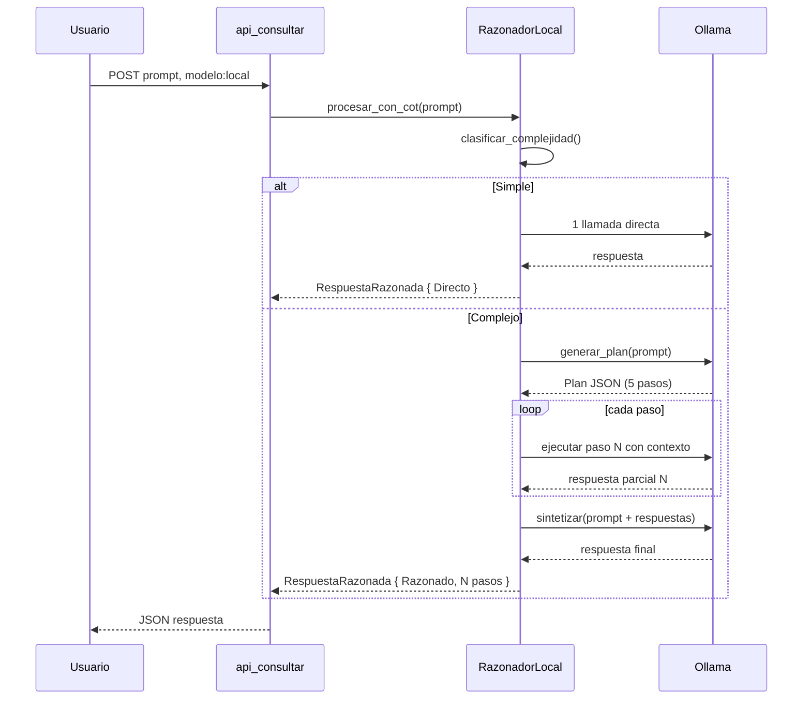

# 🧬 Órgano de Descomposición Cognitiva (Chain-of-Thought)

> **Propósito:** Potenciar la capacidad de razonamiento del modelo local (8B) mediante descomposición estructurada de problemas complejos en sub-pasos manejables, procesamiento secuencial y síntesis final.

---

## 1. Arquitectura General

```
┌─────────────────────────────────────────────────────────────────────┐
│                        ORQUESTADOR NEXUS                            │
│  main.rs / api_consultar                                            │
│                                                                     │
│  modelo: "local" ──────────────────────────────────────────────┐    │
│                                                                 │    │
│  ┌─────────────────────────────────────────────────────────────┐│    │
│  │  ÓRGANO DE DESCOMPOSICIÓN COGNITIVA (razonador_local.rs)    ││    │
│  │                                                             ││    │
│  │  ┌──────────┐  ┌───────────┐  ┌──────────┐  ┌──────────┐  ││    │
│  │  │CLASIFI-  │  │DESCOMPO-  │  │EJECUTOR  │  │SINTETI-  │  ││    │
│  │  │CADOR     │→│SITOR      │→│DE SUB-   │→│ZADOR     │  ││    │
│  │  │de        │  │(plan)     │  │PASOS     │  │(unión)   │  ││    │
│  │  │intención │  │           │  │(Ollama xN)│  │           │  ││    │
│  │  └──────────┘  └───────────┘  └──────────┘  └──────────┘  ││    │
│  └─────────────────────────────────────────────────────────────┘│    │
│                                                                 │    │
│  ┌─────────────────────────────────────────────────────────────┐│    │
│  │  CONECTOR OLLAMA (existente, para pasos simples)            ││    │
│  └─────────────────────────────────────────────────────────────┘│    │
└─────────────────────────────────────────────────────────────────────┘
```

---

## 2. Flujo de Ejecución Detallado

### 2.1 Entrada
```rust
// Desde main.rs: api_consultar con modelo "local"
struct EntradaCoT {
    prompt: String,
    historial: Option<Vec<Message>>,
    modo: ModoCoT,  // auto | simple | profundo
}

enum ModoCoT {
    Auto,      // El clasificador decide
    Simple,    // Sin descomposición (paso directo)
    Profundo,  // Forzar descomposición
}
```

### 2.2 Pipeline Completo

```
PASO 1: CLASIFICACIÓN (Rust puro, sin LLM)
─────────────────────────────────────────
Entrada: prompt del usuario
Salida:  enum TipoTarea

Criterios heurísticos en Rust:
  - Si prompt < 20 palabras → "simple"
  - Si prompt contiene palabras clave
    ("depura", "debug", "analiza", "compara",
     "por qué", "cómo funciona", "explícame",
     "arquitectura", "diseña", "implementa") → "complejo"
  - Si contiene código multilínea (``` o más de 3 líneas) → "complejo"
  - Si es una pregunta factual directa → "simple"
  - Default para prompts largos (>50 palabras) → "complejo"


PASO 2: DESCOMPOSICIÓN (1 llamada a Ollama)
───────────────────────────────────────────
Entrada: prompt completo (si es "complejo")
Salida:  Plan estructurado en JSON

System prompt para descomposición:
"""
Eres un planificador de razonamiento. Tu única tarea es descomponer
el problema siguiente en PASOS. No resuelvas el problema aún.
Devuelve SOLO un JSON array de strings, cada string es un paso.

Reglas:
- Cada paso debe ser atómico (una sola operación mental)
- Máximo 5 pasos
- El primer paso es SIEMPRE "Identificar qué información se tiene"
- El último paso es SIEMPRE "Formular respuesta final"
- Si el problema involucra código, incluye un paso de "Escribir/analizar código"

Ejemplo:
Input: "Depura este error: 'cannot borrow as mutable' en Rust"
Output: ["Identificar qué información se tiene sobre el error",
         "Analizar las reglas de borrow checking en Rust",
         "Identificar por qué el compilador rechaza el código",
         "Proponer solución con código correcto",
         "Formular respuesta final"]
"""

Parser: El plan se parsea con serde_json del output del modelo.


PASO 3: EJECUCIÓN DE SUB-PASOS (N llamadas a Ollama)
────────────────────────────────────────────────────
Para cada paso en el plan:
  1. Construir prompt contextual: 
     "Contexto del problema: {prompt_original}\n
      Progreso hasta ahora: {respuestas_pasos_anteriores}\n
      Paso actual: {paso_actual}\n
      Ejecuta este paso y responde CONCISAMENTE."
  
  2. Llamar a Ollama con temperature=0.3, max_tokens=512
  3. Almacenar respuesta parcial
  
  Paralelizable: Pasos 2-4 pueden ejecutarse en serie (dependencia lógica)
  No paralelizable: El paso N depende del resultado del paso N-1


PASO 4: SÍNTESIS (1 llamada a Ollama)
─────────────────────────────────────
Entrada: prompt original + todas las respuestas parciales
Salida:  Respuesta final unificada, coherente y completa

System prompt para síntesis:
"""
Eres un sintetizador. Tu tarea es combinar los siguientes análisis
parciales en una respuesta final coherente, completa y bien estructurada.

Reglas:
- NO repitas información innecesariamente
- Asegura transiciones suaves entre secciones
- Mantén el tono de NEXUS: técnico, conciso, respetuoso
- Si hay contradicciones entre pasos, resáltalas y resuélvelas
- La respuesta debe ser AUTOCONTENIDA (no references a los pasos internos)
"""


PASO 5: VERIFICACIÓN OPCIONAL (1 llamada a Ollama, si hay sospecha de error)
───────────────────────────────────────────────────────────────────────────
Entrada: respuesta final
Salida:  {"valida": bool, "problemas": [string], "correccion": string}

Solo se activa si:
  - El prompt original contenía "código" y la respuesta tiene >50 tokens
  - La confianza del clasificador es < 0.7
  - El usuario pidió explícitamente verificación
```

### 2.3 Costo de LLM por Pipeline

| Modo | Llamadas a Ollama | Tokens totales (estimado) | Latencia |
|------|--------------------|--------------------------|----------|
| Simple | 1 | ~500-1000 | 1-3s |
| Completo sin verificación | 3 + N pasos (~5-7) | ~2000-4000 | 8-20s |
| Completo con verificación | ~6-8 | ~3000-5000 | 12-30s |

---

## 3. Estructura de Código

### Ruta: `src-tauri/src/razonador_local.rs`

```rust
// ============================================================================
// 🧬 ÓRGANO DE DESCOMPOSICIÓN COGNITIVA (Chain-of-Thought)
// ============================================================================
// Potencia el modelo local 8B dividiendo problemas complejos en sub-pasos,
// ejecutándolos secuencialmente y sintetizando una respuesta coherente.
// ============================================================================

use serde::{Deserialize, Serialize};
use std::time::Instant;

// ─── Tipos Públicos ─────────────────────────────────────────────────────────

#[derive(Debug, Clone, Serialize, Deserialize, PartialEq)]
pub enum Complejidad {
    Simple,
    Complejo,
}

#[derive(Debug, Clone, Serialize, Deserialize)]
pub struct PlanRazonamiento {
    pub pasos: Vec<String>,
    pub complejidad: Complejidad,
}

#[derive(Debug, Clone, Serialize, Deserialize)]
pub struct ResultadoPaso {
    pub indice: usize,
    pub descripcion: String,
    pub respuesta: String,
    pub latencia_ms: u64,
}

#[derive(Debug, Clone, Serialize, Deserialize)]
pub struct RespuestaRazonada {
    pub respuesta_final: String,
    pub pasos: Vec<ResultadoPaso>,
    pub latencia_total_ms: u64,
    pub modo_usado: ModoRazonamiento,
}

#[derive(Debug, Clone, Serialize, Deserialize, PartialEq)]
pub enum ModoRazonamiento {
    Directo,    // Sin descomposición (prompt simple)
    Razonado,   // Con descomposición completa
}

// ─── Clasificador de Intención ──────────────────────────────────────────────

/// Clasifica si un prompt necesita descomposición CoT o es directo.
/// Todo el análisis es heurístico en Rust — NO requiere LLM.
pub fn clasificar_complejidad(prompt: &str) -> Complejidad {
    // Regla 1: Prompts cortos → simple
    let palabras: Vec<&str> = prompt.split_whitespace().collect();
    if palabras.len() < 15 {
        return Complejidad::Simple;
    }

    // Regla 2: Palabras clave de razonamiento complejo
    let claves_complejo = [
        "depura", "debug", "analiza", "compara", "contrasta",
        "por qué", "cómo funciona", "explícame", "arquitectura",
        "diseña", "implementa", "optimiza", "refactoriza",
        "arquitectura", "patrón", "diseño", "estrategia",
        "plan", "planifica", "descompón", "pasos",
        "error", "stack trace", "panic", "crash",
    ];

    let prompt_lower = prompt.to_lowercase();
    let contiene_clave = claves_complejo.iter()
        .any(|clave| prompt_lower.contains(clave));

    if contiene_clave {
        return Complejidad::Complejo;
    }

    // Regla 3: Contiene código multilínea
    if prompt.contains("```") || prompt.lines().count() > 10 {
        return Complejidad::Complejo;
    }

    // Regla 4: Prompts muy largos → complejo por defecto
    if palabras.len() > 50 {
        return Complejidad::Complejo;
    }

    Complejidad::Simple
}

// ─── Planificador (1 llamada Ollama) ────────────────────────────────────────

/// Genera un plan de pasos para el problema.
/// Llama a Ollama con un system prompt especializado.
pub async fn generar_plan(
    prompt: &str,
    ollama_api_base: &str,
    ollama_model: &str,
    client: &reqwest::Client,
) -> Result<PlanRazonamiento, String> {
    // ... (implementación en la fase de código)
}

// ─── Ejecutor de Sub-pasos (N llamadas Ollama) ─────────────────────────────

/// Ejecuta cada paso del plan secuencialmente.
/// Cada paso recibe contexto de los pasos anteriores.
pub async fn ejecutar_pasos(
    prompt_original: &str,
    plan: &PlanRazonamiento,
    ollama_api_base: &str,
    ollama_model: &str,
    client: &reqwest::Client,
) -> Result<Vec<ResultadoPaso>, String> {
    // ... (implementación en la fase de código)
}

// ─── Sintetizador (1 llamada Ollama) ────────────────────────────────────────

/// Sintetiza los resultados parciales en una respuesta final coherente.
pub async fn sintetizar_respuesta(
    prompt_original: &str,
    resultados: &[ResultadoPaso],
    ollama_api_base: &str,
    ollama_model: &str,
    client: &reqwest::Client,
) -> Result<String, String> {
    // ... (implementación en la fase de código)
}

// ─── Orquestador Principal ─────────────────────────────────────────────────

/// Punto de entrada único. Decide el flujo según la complejidad.
pub async fn procesar_con_cot(
    prompt: &str,
    ollama_api_base: &str,
    ollama_model: &str,
) -> RespuestaRazonada {
    let inicio = Instant::now();
    let client = reqwest::Client::builder()
        .timeout(std::time::Duration::from_secs(180))
        .build()
        .unwrap_or_default();

    let complejidad = clasificar_complejidad(prompt);

    match complejidad {
        Complejidad::Simple => {
            // Modo directo: una sola llamada a Ollama
            let respuesta = llamar_ollama_directo(
                prompt, ollama_api_base, ollama_model, &client
            ).await;

            RespuestaRazonada {
                respuesta_final: respuesta,
                pasos: vec![],
                latencia_total_ms: inicio.elapsed().as_millis() as u64,
                modo_usado: ModoRazonamiento::Directo,
            }
        }
        Complejidad::Complejo => {
            // Modo razonado: plan → ejecutar → sintetizar
            let plan = generar_plan(prompt, ollama_api_base, ollama_model, &client).await
                .unwrap_or_else(|_| PlanRazonamiento {
                    pasos: vec!["Analizar el problema".to_string(),
                                "Formular respuesta final".to_string()],
                    complejidad: Complejidad::Complejo,
                });

            let resultados = ejecutar_pasos(
                prompt, &plan, ollama_api_base, ollama_model, &client
            ).await.unwrap_or_default();

            let respuesta_final = sintetizar_respuesta(
                prompt, &resultados, ollama_api_base, ollama_model, &client
            ).await.unwrap_or_else(|_| {
                // Fallback: concatenar resultados
                resultados.iter()
                    .map(|r| r.respuesta.clone())
                    .collect::<Vec<_>>()
                    .join("\n\n")
            });

            RespuestaRazonada {
                respuesta_final,
                pasos: resultados,
                latencia_total_ms: inicio.elapsed().as_millis() as u64,
                modo_usado: ModoRazonamiento::Razonado,
            }
        }
    }
}

// ─── Helper: Llamada directa a Ollama ──────────────────────────────────────

async fn llamar_ollama_directo(
    prompt: &str,
    ollama_api_base: &str,
    ollama_model: &str,
    client: &reqwest::Client,
) -> String {
    // ... (wrapper sobre consultar_ollama con manejo de errores)
}
```

---

## 4. Integración con main.rs

### Cambio en [`api_consultar`](file:///home/soberano/NEXUS_ULTIMATE_CORE/src-tauri/src/main.rs:166):

```rust
// Reemplazar:
"local" => consultar_ollama(prompt, historial).await,

// Con:
"local" => {
    let ollama_api_base = std::env::var("OLLAMA_API_BASE")
        .unwrap_or_else(|_| "http://localhost:11434".to_string());
    let ollama_model = std::env::var("OLLAMA_MODEL_NAME")
        .unwrap_or_else(|_| "llama3.1-8b-abliterated".to_string());

    let respuesta = procesar_con_cot(prompt, &ollama_api_base, &ollama_model).await;

    Json(serde_json::json!({
        "respuesta": respuesta.respuesta_final,
        "modelo_usado": "local",
        "proveedor": "Ollama (razonamiento aumentado)",
        "modo_razonamiento": format!("{:?}", respuesta.modo_usado),
        "pasos": respuesta.pasos.len(),
        "latencia_ms": respuesta.latencia_total_ms,
    }))
}
```

---

## 5. Modificaciones al Modelfile

Se añade soporte para el modo "descomposición" en el system prompt del modelo local:

```dockerfile
# Añadir al Modelfile existente:
PARAMETER num_ctx 16384  # Aumentado para dar espacio al plan + sub-pasos
```

Y en el SYSTEM prompt, añadir instrucciones para cooperar con el planificador:

```
4. MODO PLANIFICADOR (Cuando recibas una solicitud de planificación):
   - Tu única tarea es GENERAR UN PLAN. No ejecutes el plan.
   - Devuelve SOLO JSON array de strings.
   - Cada string = un paso atómico.

5. MODO EJECUTOR (Cuando recibas un paso específico + contexto):
   - Resuelve SOLO el paso indicado.
   - Sé conciso. Usa el contexto provisto.
   - No repitas información de pasos anteriores.

6. MODO SINTETIZADOR (Cuando recibas respuestas parciales):
   - Combínalas en una respuesta coherente y final.
   - No menciones que hubo pasos internos.
   - La respuesta debe ser autocontenida.
```

---

## 6. Diagrama de Secuencia



---

## 7. Métricas de Éxito

| Métrica | Valor Actual (sin CoT) | Objetivo (con CoT) | Medición |
|---------|----------------------|--------------------|----------|
| Precisión en debugging | ~50% | ~80% | `cargo test` con errores conocidos |
| Coherencia en respuestas multi-paso | ~40% | ~75% | Evaluación humana |
| Alucinaciones en código | ~35% | ~15% | Compilación del código generado |
| Latencia promedio | 2-5s | 8-20s (tradeoff aceptable) | `latencia_ms` en respuesta |
| Satisfacción subjetiva | Media | Alta | Feedback del Arquitecto |

---

## 8. TODO List

- [ ] Crear `src-tauri/src/razonador_local.rs` con el módulo completo
- [ ] Implementar `clasificar_complejidad()` con heurísticas en Rust
- [ ] Implementar `generar_plan()` con system prompt especializado
- [ ] Implementar `ejecutar_pasos()` con ejecución secuencial
- [ ] Implementar `sintetizar_respuesta()` con fusión de contexto
- [ ] Implementar `procesar_con_cot()` como orquestador
- [ ] Modificar `api_consultar` en `main.rs` para usar el nuevo flujo
- [ ] Actualizar `Modelfile` con num_ctx=16384 y modos de instrucción
- [ ] Añadir `mod razonador_local;` en `main.rs`
- [ ] Probar con prompts de debugging y análisis
- [ ] Registrar logro en `memoria/logros.md`

---

## 9. Dependencias

Ninguna nueva. Usa:
- `reqwest` ✅ ya en Cargo.toml
- `serde` ✅ ya en Cargo.toml
- `serde_json` ✅ ya en Cargo.toml
- `std::time::Instant` ✅ std de Rust
