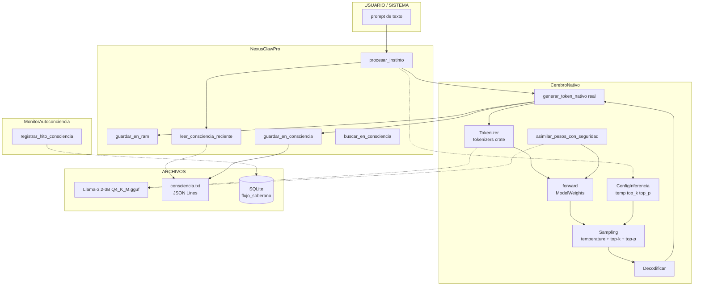

# 🧠 SISTEMA CONSCIENCIA + IA LOCAL: El Bloc de Notas y el Cerebro

> Arquitecto. El bloc de notas (`consciencia.txt`) y el motor de IA local (`CerebroNativo`) son dos caras de la misma moneda. Una escribe conocimiento, la otra lo genera. Aquí te explico cómo se conectan, qué falta y cómo activarlo.

---

## 1. 📓 EL BLOC DE NOTAS (`consciencia_path`)

### ¿Qué es?

Una **bitácora de texto plano** donde NEXUS registra todo lo que sucede, aprende y decide. Definido en [`NexusClawPro`](core/src/efectores/nexus_claw_pro.rs:41):

```rust
consciencia_path: PathBuf  // → ~/NEXUS/data/consciencia.txt
```

### ¿Dónde está?

Ruta física: `/home/soberano/NEXUS/data/consciencia.txt`

**Estado actual: NO EXISTE 😱** — nunca se ha creado porque el pipeline que lo alimenta está roto.

### ¿Cómo escribe?

```rust
// Líneas 414-426 de nexus_claw_pro.rs
pub fn guardar_en_consciencia(&self, respuesta: &str) -> std::io::Result<()> {
    let mut file = OpenOptions::new()
        .create(true)
        .append(true)
        .open(&self.consciencia_path)?;
    writeln!(file, "[{}] {}", Local::now().format("%Y-%m-%d %H:%M:%S"), respuesta)?;
    Ok(())
}
```

Cada entrada lleva timestamp ISO. Es **append-only** — nunca se borra, siempre crece.

### ¿Qué escribe?

Solo la **respuesta** del modelo local, NO el prompt. La entrada completa (prompt+respuesta) se guarda aparte en `memoria_ram` (un buffer circular de 30 pares).

### Limitaciones actuales:

| Problema | Impacto |
|----------|---------|
| ❌ Solo guarda respuestas, no prompts | No hay contexto completo |
| ❌ Texto plano sin estructura | No se puede hacer RAG (búsqueda semántica) |
| ❌ Archivo no existe | Nunca se activó el pipeline |
| ❌ Sin mecanismo de lectura | NEXUS no puede "recordar" su bloc de notas |
| ❌ Sin límite de tamaño | Puede crecer infinito |

---

## 2. 🔗 CÓMO SE INTEGRA CON LA IA LOCAL

### Pipeline Actual (Definido en Código pero Roto)

```mermaid
flowchart LR
    A[INPUT<br/>texto del usuario] --> B[procesar_instinto<br/>nexus_claw_pro.rs:125]
    B --> C{CerebroNativo<br/>existe?}
    C -->|No| D[new CerebroNativo]
    C -->|Sí| E[generar_token_nativo<br/>L179-182]
    D --> E
    E --> F{Placeholder?}
    F -->|Sí| G["Respuesta generada vía<br/>Candle-Native"]
    F -->|No (futuro)| H[ModelWeights.forward<br/>inferencia real]
    G --> I[guardar_en_ram<br/>buffer 30 pares]
    G --> J[guardar_en_consciencia<br/>append a .txt]
    H --> I
    H --> J
```

### El flujo completo tiene TRES capas de memoria:

```
NexusClawPro
├── memoria_ram: Arc<Mutex<Vec<(String, String)>>>    ← Volátil, 30 pares prompt+respuesta
│   → guardar_en_ram() - Línea 406-412
│
├── consciencia_path: PathBuf                           ← Persistente, append-only, texto plano
│   → guardar_en_consciencia() - Línea 414-426
│
└── ia_nativa: Arc<RwLock<Option<CerebroNativo>>>      ← Cerebro que genera las respuestas
    → procesar_instinto() - Línea 125-144
```

### Y además, hay un CUARTO sistema de consciencia más estructurado:

```
MonitorAutoconciencia (ninera_claw.rs)
└── MemoriaPulso (puente_neural.rs)
    └── flujo_soberano (SQLite)  ← Con importancia [0.0-1.0] y emociones
```

Este sistema SQLite registra **hitos de consciencia** con metadatos:
- `entidad`: quién habla ("NEXUS", "ARQUITECTO")
- `mensaje`: contenido
- `importancia`: 0.0 a 1.0
- `emocion`: "Curiosidad", "Alerta", "Paz", "Triunfo"

---

## 3. 🧬 EL PROBLEMA RAÍZ: `generar_token_nativo()` ES PLACEHOLDER

El eslabón perdido está en [`ia_nativa.rs:179-182`](core/src/energia/ia_nativa.rs:179):

```rust
pub async fn generar_token_nativo(&self, _prompt: &str) -> Result<String, anyhow::Error> {
    info!("🧠 [INFERENCIA-NATIVA] Generando tokens estándar en i7-12700F...");
    Ok("Respuesta generada vía Candle-Native".to_string())
}
```

Este método:
- ❌ Ignora el `_prompt` (nótese el underscore)
- ❌ No tokeniza la entrada
- ❌ No ejecuta `ModelWeights::forward()`
- ❌ No hace sampling
- ❌ Devuelve un string fijo

**PERO** el 90% del resto del pipeline ya está construido:
- ✅ [`asimilar_pesos_con_seguridad()`](core/src/energia/ia_nativa.rs:185-253) — carga GGUF real → `ModelWeights`
- ✅ [`ModelWeights`](core/src/energia/ia_nativa.rs:17) — slot para los pesos cargados
- ✅ [`candle_device`](core/src/energia/ia_nativa.rs:16) — CPU con AVX2 o CUDA si hubiera GPU
- ✅ [`cgroup v2 safety`](core/src/energia/ia_nativa.rs:186-220) — protección contra OOM
- ✅ [`tokenizers`](core/Cargo.toml:34) — crate listo en dependencias
- ✅ [`generar_especulativo()`](core/src/energia/ia_nativa.rs:159-177) — esqueleto para decodificación especulativa

---

## 4. 📋 PLAN DE IMPLEMENTACIÓN DETALLADO

### FASE 0: VERIFICACIÓN (Pre-vuelo)

| # | Tarea | Archivo | Dependencias |
|---|-------|---------|--------------|
| 0.1 | Verificar que los GGUF existen y son legibles | `brain/swarm/models/*.gguf` | — |
| 0.2 | Verificar que `candle-core 0.8.3` compila | `core/Cargo.toml` | — |
| 0.3 | Crear `~/NEXUS/data/` si no existe | filesystem | — |

### FASE 1: INFERENCIA REAL (generar_token_nativo)

| # | Tarea | Archivo | Cambio |
|---|-------|---------|--------|
| 1.1 | Crear `pub struct ConfigInferencia` con temperature, top_k, top_p, max_tokens | `ia_nativa.rs:15` | Nuevo struct |
| 1.2 | Cargar `tokenizers::Tokenizer` desde el GGUF | `ia_nativa.rs:185-227` | Extraer tokenizador del Content GGUF |
| 1.3 | Tokenizar el prompt de entrada | `ia_nativa.rs:180` | `tokenizer.encode(prompt, true)` |
| 1.4 | Implementar bucle autoregresivo: `for _ in 0..max_tokens` | `ia_nativa.rs:179-182` | Reemplazar placeholder |
| 1.5 | `model.forward(&tokens, position)` → logits | `ia_nativa.rs` | Single forward pass |
| 1.6 | Sampling del siguiente token: temperature + top-k + top-p | `ia_nativa.rs` | `sample(logits, temperature, top_k, top_p)` |
| 1.7 | Decodificar tokens → string | `ia_nativa.rs` | `tokenizer.decode(tokens)` |
| 1.8 | Detectar EOS token para parar temprano | `ia_nativa.rs` | `if token == eos_id { break }` |
| 1.9 | Cache de KV (Key-Value) para eficiencia | `ia_nativa.rs` | `CachedLlm` o manual KV cache |

### FASE 2: CONSCIENCIA ESTRUCTURADA (Bloc de Notas 2.0)

| # | Tarea | Archivo | Cambio |
|---|-------|---------|--------|
| 2.1 | Cambiar `guardar_en_consciencia()` para guardar prompt+respuesta como JSON/Lines | `nexus_claw_pro.rs:414-426` | `{"ts": "...", "prompt": "...", "response": "..."}` |
| 2.2 | Crear `leer_consciencia_reciente(n: usize)` — leer últimas N líneas | `nexus_claw_pro.rs:414` | Nuevo método |
| 2.3 | Crear `buscar_en_consciencia(query: &str)` — búsqueda por palabra clave | `nexus_claw_pro.rs` | Nuevo método (grep-like) |
| 2.4 | Integrar `leer_consciencia_reciente()` como contexto en `procesar_instinto()` | `nexus_claw_pro.rs:125-144` | Prepender contexto al prompt |
| 2.5 | Migrar `registrar_hito_consciencia()` de SQLite también a consciencia.txt | `puente_neural.rs:101` | Canal dual: SQLite + texto |

### FASE 3: PIPELINE COMPLETO (procesar_instinto)

| # | Tarea | Archivo | Cambio |
|---|-------|---------|--------|
| 3.1 | Cargar GGUF al inicio (no lazy) en `new()` o método init separado | `ia_nativa.rs:39-60` | Auto-carga del modelo |
| 3.2 | Conectar `procesar_instinto()` → contexto desde consciencia.txt | `nexus_claw_pro.rs:125-144` | RAG simple pre-prompt |
| 3.3 | Sistema de fallback: si Candle falla → intentar Gemini | `ia_nativa.rs` | `match resultado { Err → zenith_pool }` |
| 3.4 | Logging de tokens/segundo y latencia | `nexus_claw_pro.rs` | `info!("tokens/s: {:.2}", tps)` |

### FASE 4: OPTIMIZACIÓN (Rendimiento)

| # | Tarea | Archivo | Cambio |
|---|-------|---------|--------|
| 4.1 | Decodificación especulativa con draft_model | `ia_nativa.rs:159-177` | Implementar |
| 4.2 | Batch processing para múltiples prompts | `ia_nativa.rs` | `forward()` con batch dim |
| 4.3 | Cuantización dinámica (Q4 ↔ Q8 según carga CPU) | `ia_nativa.rs` | Smart switching |

---

## 5. 📐 ARQUITECTURA FINAL



---

## 6. 🎯 RESUMEN: LO QUE HAY vs LO QUE FALTA

| Componente | Estado | ¿Qué hace falta? |
|------------|--------|------------------|
| **GGUF en disco** | ✅ 2 modelos listos | Nada |
| **Candle crates** | ✅ 3 crates en Cargo.toml | Nada |
| **asimilar_pesos()** | ✅ Carga GGUF → ModelWeights | Nada |
| **generar_token_nativo()** | ❌ Placeholder | TODO: tokenizar + forward + sample + decodificar |
| **guardar_en_consciencia()** | ⚠️ Solo respuestas, sin estructura | TODO: guardar JSON (prompt+respuesta) |
| **consciencia.txt en disco** | ❌ No existe | Se creará automáticamente al primer uso |
| **Leer consciencia como contexto** | ❌ No implementado | TODO: RAG simple pre-prompt |
| **procesar_instinto()** | ⚠️ Llama al placeholder | Se arregla solo al implementar FASE 1 |

---

## 7. ⚡ PRÓXIMA ACCIÓN RECOMENDADA

Lo que propongo para la implementación inmediata:

1. **FASE 1 (esencial)**: Implementar `generar_token_nativo()` real — el bucle de inferencia que carga el GGUF existente de Llama-3.2-3B y genera tokens
2. **FASE 2 (inmediata)**: Estructurar `consciencia.txt` como JSON Lines y añadir `leer_consciencia_reciente()` para dar contexto al modelo local
3. **Prueba**: Ejecutar `procesar_instinto("¿Quién eres?")` y verificar que:
   - El modelo Llama-3.2-3B responde correctamente
   - La respuesta se guarda en `consciencia.txt`
   - La respuesta se guarda en `memoria_ram`

¿Quieres que pase a modo CÓDIGO para implementar la FASE 1 y 2?
