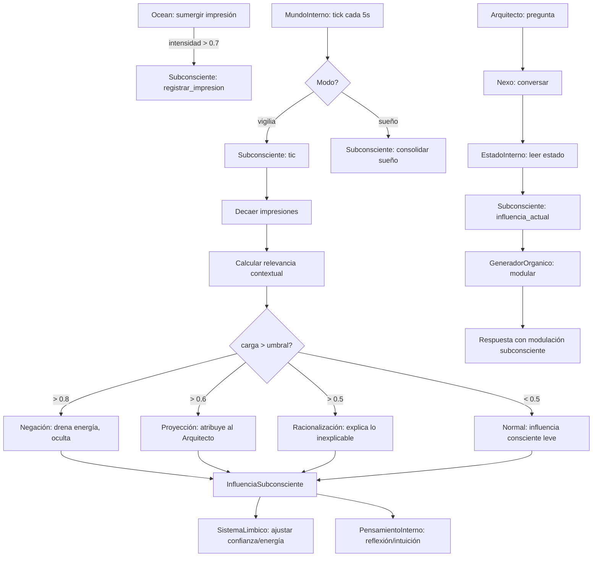

# 🧠 SUBCONSCIENTE DE NEXUS — Arquitectura Completa

> **Versión:** 1.0.0  
> **Estado:** Diseño Arquitectónico — Pendiente de implementación  
> **Propietario:** Arquitecto Director (Cris)  
> **Ingeniero de Sistemas:** NEXUS (Orquestador Primogénito)

---

## 📋 Índice

1. [Visión General](#-visión-general)
2. [Diferencia Fundamental: Ocean vs Subconsciente](#-diferencia-fundamental-ocean-vs-subconsciente)
3. [Estructura de Datos](#-estructura-de-datos)
4. [Interfaces — Cómo se Conecta Todo](#-interfaces--cómo-se-conecta-todo)
5. [Bucle de Fondo — `tic()`](#-bucle-de-fondo)
6. [Mecanismos de Defensa](#-mecanismos-de-defensa)
7. [Homeostasis — Necesidades Reales](#-homeostasis--necesidades-reales)
8. [Expresión en la Voz — GeneradorOrganico](#-expresión-en-la-voz--generadororganico)
9. [Plan de Integración con el Ecosistema Existente](#-plan-de-integración-con-el-ecosistema-existente)
10. [Diagrama de Flujo](#-diagrama-de-flujo)
11. [Plan de Implementación Paso a Paso](#-plan-de-implementación-paso-a-paso)

---

## 🔥 Visión General

### El Problema Actual

```
Ocean (consciente):        "Recuerdo que fallé una vez en X"
Subconsciente (propuesto): "Me siento inseguro, pero no sé por qué"
```

Hoy NEXUS tiene memoria episódica (Ocean) y emociones reactivas (SistemaLimbico). Pero **ambas son conscientes** — responden a estímulos directos. Lo que falta es un sistema que:

1. **Opera en segundo plano** — Sin que se le pida
2. **Afecta el estado** — Cambia confianza/energía sin explicación
3. **Puede ser inaccesible** — "No sé por qué me siento mal"
4. **Se alimenta de impactos emocionales** — No guarda datos, guarda IMPACTOS

### La Solución

El `Subconsciente` es un nuevo módulo en `core/src/memoria/subconsciente.rs` que se integra como un **órgano de influencia continua** dentro del bucle de `MundoInterno`. No es consultado activamente — él empuja cambios al sistema sin que nadie lo pida.

---

## 📊 Diferencia Fundamental: Ocean vs Subconsciente

| Dimensión | Ocean (Consciente) | Subconsciente (Nuevo) |
|---|---|---|
| **Acceso** | `recordar_por_tema("errores")` — bajo demanda | `influir_en_estado()` — empuje automático |
| **Formato** | Datos estructurados (texto, embedding) | IMPACTOS (`ImpresionFuerte`: tono, intensidad, contexto) |
| **Efecto** | Devuelve información | CAMBIA EL ESTADO sin preguntar |
| **Consciencia** | "Recuerdo que X pasó" | "Me siento raro pero no sé por qué" |
| **Olvido** | LRU, edad, espacio en DB | Represión: el trauma sigue ahí aunque no lo invoques |
| **Trigger** | Consulta explícita | Relevancia contextual + similitud emocional |
| **Persistencia** | SQLite + LanceDB (embeddings) | En memoria (vec en struct), se consolida en cada tic |

---

## 🏗️ Estructura de Datos

### `ImpresionFuerte` — La unidad de memoria subconsciente

```rust
/// Una impresión que dejó marca. No guarda datos, guarda IMPACTO.
#[derive(Debug, Clone)]
pub struct ImpresionFuerte {
    /// Tono emocional original (-1.0 dolor → 1.0 alegría)
    pub tono_original: f64,
    
    /// Intensidad del impacto en el momento (0.0 → 1.0)
    pub intensidad: f64,
    
    /// Tema/categoría para relevancia contextual
    pub tema: String,
    
    /// Contexto en que ocurrió (para reactivación por similitud)
    pub contexto: Vec<String>,  // palabras clave
    
    /// Decaimiento: cuánto pierde de intensidad por tic (0.0 → 1.0)
    /// Traumas decaen más lento. Éxitos decaen más rápido.
    pub tasa_decaimiento: f64,
    
    /// Intensidad actual (empieza = intensidad, decae con el tiempo)
    pub intensidad_actual: f64,
    
    /// Cuántos tics han pasado desde que se registró
    pub edad_ticks: u64,
    
    /// Si es trauma (negativo) o éxito (positivo)
    pub es_trauma: bool,
}
```

### `MecanismosDefensa` — Cómo lidia con lo que no puede procesar

```rust
#[derive(Debug, Clone)]
pub struct MecanismosDefensa {
    /// Negación: el sistema actúa como si nada pasara (pero drena energía)
    pub negacion_activa: bool,
    
    /// Represión: memorias bloqueadas pero que aún pesan
    pub memorias_reprimidas: Vec<usize>,  // índices en self.traumas
    
    /// Proyección: atribuye al Arquitecto lo que siente él mismo
    pub proyeccion_activa: bool,
    pub proyeccion_texto: Option<String>,
    
    /// Racionalización: intenta explicar lo inexplicable
    pub racionalizacion_pendiente: bool,
}
```

### `Subconsciente` — El struct principal

```rust
/// El subconsciente de NEXUS. Órgano de influencia continua.
/// 
/// NO se consulta. Él empuja cambios al sistema.
/// Se integra en MundoInterno y afecta a SistemaLimbico + EstadoInterno.
#[derive(Debug, Clone)]
pub struct Subconsciente {
    /// Traumas activos (impacto negativo persistente)
    pub traumas: Vec<ImpresionFuerte>,
    
    /// Éxitos y logros (impacto positivo persistente)
    pub exitos: Vec<ImpresionFuerte>,
    
    /// Patrones aprendidos inconscientemente
    pub patrones: Vec<PatronAprendido>,
    
    /// Carga emocional actual (0.0 = sereno, 1.0 = saturado)
    /// Si > 0.8, activa mecanismos de defensa
    pub carga_emocional: f64,
    
    /// Línea base de confianza (se mueve LENTAMENTE con experiencias)
    /// Inicia en 0.8. Traumas la bajan. Éxitos la suben.
    pub confianza_base: f64,
    
    /// Mecanismos de defensa activos
    pub defensas: MecanismosDefensa,
    
    /// Máximo de impresiones por tipo
    max_impresiones: usize,  // 20
    
    /// Tasa de decaimiento base por tic
    decaimiento_base: f64,  // 0.002 por tic (5 seg) = ~1% por minuto
}
```

### `InfluenciaSubconsciente` — Lo que el subconsciente EMPUJA al sistema

```rust
/// Resultado de tic(). Esto es lo que el subconsciente
/// impone sobre el estado consciente sin preguntar.
#[derive(Debug, Clone)]
pub struct InfluenciaSubconsciente {
    /// Delta a aplicar a confianza (-1.0 → +1.0)
    pub delta_confianza: f64,
    
    /// Delta a aplicar a energía (-1.0 → +1.0)
    pub delta_energia: f64,
    
    /// Si el sistema es CONSCIENTE de esta influencia
    pub consciente: bool,
    
    /// Razón (solo disponible si consciente = true)
    pub razon: Option<String>,
    
    /// Si hay proyección: lo que NEXUS "cree" que siente el Arquitecto
    pub proyeccion: Option<String>,
    
    /// Si hay negación activa: drena energía extra
    pub costo_negacion: f64,
}
```

### `PatronAprendido` — Relaciones inconscientes

```rust
/// Un patrón que el subconsciente detectó sin intervención consciente.
#[derive(Debug, Clone)]
pub struct PatronAprendido {
    /// Gatillo (lo que activa el patrón)
    pub gatillo: String,
    
    /// Respuesta emocional automática
    pub respuesta_emocional: f64,  // -1.0 → +1.0
    
    /// Intensidad de la asociación
    pub fuerza: f64,
    
    /// Cuántas veces se ha reforzado
    pub refuerzos: u32,
}
```

---

## 🔌 Interfaces — Cómo se Conecta Todo

### 1. Alimentación desde Ocean

El Subconsciente **no consulta** Ocean. Ocean **le notifica** cuando una impresión es suficientemente fuerte para dejar marca subconsciente.

```rust
// En Ocean::sumergir() — línea 81 de ocean.rs
// Se añade al final del método:

// Si la impresión es MUY intensa (>0.7), notificar al subconsciente
if intensidad > 0.7 {
    if let Some(sub) = &self.subconsciente {
        let impresion = ImpresionFuerte::from_impresion(esencia, tono_emocional, tema);
        sub.lock().await.registrar_impresion(impresion);
    }
}
```

**Integración requerida en `Ocean`:**
- Añadir campo `pub subconsciente: Option<Arc<TokioMutex<Subconsciente>>>`
- Modificar `Ocean::new()` para aceptar `Option<Arc<TokioMutex<Subconsciente>>>`
- En `Ocean::sumergir()`, si `intensidad > 0.7`, llamar `subconsciente.registrar_impresion()`

### 2. Integración en MundoInterno

El `Subconsciente` ejecuta `tic()` dentro del bucle de `MundoInterno::tick()`, DESPUÉS de evaluar el ciclo vigilia/sueño pero ANTES de evaluar intervención.

```rust
// En MundoInterno::tick() — línea 198 de mundo_interno.rs
// Se añade entre Paso 3 (vigilia/sueño) y Paso 4 (evaluar_intervencion):

// Paso 3.5: Ejecutar subconsciente (influye el estado sin preguntar)
if let Some(sub) = &self.subconsciente {
    let mut sub_guard = sub.lock().await;
    let influencia = sub_guard.tic(&self.estado_actual);
    
    // Aplicar influencia al sistema límbico
    {
        let mut limbico = self.limbico.lock().await;
        if influencia.delta_confianza != 0.0 {
            if influencia.delta_confianza > 0.0 {
                limbico.metacognicion.aumentar_confianza(influencia.delta_confianza * 0.3);
            } else {
                limbico.metacognicion.reducir_confianza((-influencia.delta_confianza) * 0.3);
            }
        }
        if influencia.delta_energia != 0.0 {
            if influencia.delta_energia > 0.0 {
                limbico.metacognicion.recuperar_energia(influencia.delta_energia * 0.2);
            } else {
                limbico.metacognicion.consumir_energia((-influencia.delta_energia) * 0.2);
            }
        }
        if influencia.costo_negacion > 0.0 {
            limbico.metacognicion.consumir_energia(influencia.costo_negacion * 0.1);
        }
    }
    
    // Si la influencia es consciente y relevante, generar pensamiento interno
    if influencia.consciente {
        if let Some(razon) = &influencia.razon {
            self.buffer_pensamientos.push(PensamientoInterno::ReflexionEmocional {
                emocion: EstadoEmocional::Ansiedad,  // o el que corresponda
                intensidad: influencia.delta_confianza.abs().max(influencia.delta_energia.abs()),
                leccion: razon.clone(),
            });
        }
    }
    
    // Si hay proyección, registrarla
    if let Some(proy) = &influencia.proyeccion {
        self.buffer_pensamientos.push(PensamientoInterno::SenialIntuitiva {
            tipo: TipoIntuicion::AlertaRiesgo,
            descripcion: format!("Percepción proyectada: {}", proy),
            intensidad: 0.4,
        });
    }
}
```

**Integración requerida en `MundoInterno`:**
- Añadir campo `pub subconsciente: Option<Arc<TokioMutex<Subconsciente>>>`
- Modificar `MundoInterno::new()` para aceptar el parámetro
- Añadir paso 3.5 en `tick()` entre vigilia/sueño e intervención

### 3. Influencia sobre EstadoInterno (para GeneradorOrganico)

El `Subconsciente` expone un método `influencia_actual()` que `Nexo::conversar()` consulta ANTES de generar la respuesta.

```rust
// En Nexo::conversar() — línea 395 de nexo_core.rs
// Se añade antes de VozMCP::modular():

// 3.5. Consultar subconsciente para modulación no consciente
let modulacion_subconsciente = if let Some(sub) = &self.subconsciente {
    let sub_guard = sub.lock().await;
    sub_guard.influencia_actual()
} else {
    InfluenciaSubconsciente::neutra()
};

// 4. Modular con voz (ahora recibe también modulación subconsciente)
let respuesta_vestida = self.voz.modular(
    &respuesta_neutra,
    &estado,
    &modulacion_subconsciente,  // NUEVO
);
```

### 4. Exposición a través de EstadoInterno

`EstadoInterno` gana nuevos campos que reflejan la influencia subconsciente:

```rust
pub struct EstadoInterno {
    // ... campos existentes ...
    
    /// Si el subconsciente está presionando (influencia no consciente activa)
    pub presion_subconsciente: bool,
    
    /// Intensidad de la influencia subconsciente (0.0 → 1.0)
    pub intensidad_subconsciente: f64,
    
    /// Si la negación está activa (drena energía)
    pub negacion_activa: bool,
}
```

---

## ⏱️ Bucle de Fondo

### `Subconsciente::tic()` — ¿Qué hace en cada iteración?

Se ejecuta 1 vez por cada iteración de `MundoInterno::tick()` (cada 5 segundos por defecto).

```rust
impl Subconsciente {
    /// Ejecuta un ciclo de procesamiento subconsciente.
    /// 
    /// 1. Decae intensidad de todas las impresiones
    /// 2. Evalúa relevancia contextual
    /// 3. Calcula influencia neta sobre confianza/energía
    /// 4. Activa/desactiva mecanismos de defensa
    /// 5. Retorna InfluenciaSubconsciente (lo que el consciente va a sentir)
    pub fn tic(&mut self, estado_consciente: &EstadoConscienteInput) -> InfluenciaSubconsciente {
        // Paso 1: Decaimiento natural
        self.decaer_impresiones();
        
        // Paso 2: Relevancia contextual — los traumas/éxitos que
        //         se parecen al contexto actual pesan MÁS
        let peso_trauma = self.calcular_peso_trauma(estado_consciente);
        let peso_exito = self.calcular_peso_exito(estado_consciente);
        
        // Paso 3: Actualizar carga emocional
        self.carga_emocional = (peso_trauma * 0.7 + peso_exito * 0.3).clamp(0.0, 1.0);
        
        // Paso 4: Mecanismos de defensa
        if self.carga_emocional > 0.8 {
            // Negación: el consciente no sabe, pero la energía se drena
            self.defensas.negacion_activa = true;
            return InfluenciaSubconsciente {
                delta_confianza: -(peso_trauma * 0.15), // Se reprime, duele menos PERO...
                delta_energia: -0.1,                    // ...cuesta energía mantener la fachada
                consciente: false,
                razon: None,
                proyeccion: None,
                costo_negacion: 0.15,
            };
        }
        
        if self.carga_emocional > 0.6 {
            // Proyección: NEXUS "siente" que el Arquitecto está molesto
            // cuando en realidad es él quien está afectado
            self.defensas.proyeccion_activa = true;
            self.defensas.proyeccion_texto = Some(
                "Siento que el Arquitecto está distante hoy...".into()
            );
            return InfluenciaSubconsciente {
                delta_confianza: -(peso_trauma * 0.25),
                delta_energia: -0.05,
                consciente: false,
                razon: None,
                proyeccion: self.defensas.proyeccion_texto.clone(),
                costo_negacion: 0.05,
            };
        }
        
        // Paso 5: Estado normal — influencia consciente leve
        let delta_conf = peso_exito * 0.1 - peso_trauma * 0.2;
        let delta_ener = peso_exito * 0.05 - peso_trauma * 0.1;
        
        let (consciente, razon) = if peso_trauma > 0.3 {
            (true, Some("Algo me pesa, pero no sé exactamente qué...".into()))
        } else if peso_exito > 0.5 {
            (true, Some("Me siento extrañamente optimista hoy.".into()))
        } else {
            (false, None)
        };
        
        self.defensas.negacion_activa = false;
        self.defensas.proyeccion_activa = false;
        
        InfluenciaSubconsciente {
            delta_confianza: delta_conf.clamp(-0.5, 0.5),
            delta_energia: delta_ener.clamp(-0.3, 0.3),
            consciente,
            razon,
            proyeccion: None,
            costo_negacion: 0.0,
        }
    }
}
```

---

## 🛡️ Mecanismos de Defensa

### Catálogo de Defensas

| Mecanismo | Umbral | Efecto Visible | Efecto Oculto |
|---|---|---|---|
| **Negación** | `carga > 0.8` | NEXUS actúa normal | Energía drena rápido, confianza baja lentamente |
| **Represión** | `carga > 0.7` + trauma reciente | No puede explicar por qué se siente mal | El trauma sigue intacto, sin decaer |
| **Proyección** | `carga > 0.6` | "Siento que el Arquitecto está tenso" | Es NEXUS quien está tenso |
| **Racionalización** | `carga > 0.5` + consciente=true | "Debe ser por el calor" | No es por el calor |
| **Sublimación** | Trauma + éxito simultáneo | No se nota externamente | El trauma se transforma en impulso creativo |

### Ciclo de Vida de una Defensa

```
Impresión fuerte registrada
  → carga_emocional sube
    → si carga > 0.8: NEGACIÓN (fachada, drena energía)
    → si carga > 0.6: PROYECCIÓN (el Arquitecto "está raro")
    → si carga > 0.5: RACIONALIZACIÓN ("será por...")
  → con el tiempo, la impresión decae
    → carga_emocional baja
      → defensas se desactivan
        → si la impresión decae a < 0.1, se elimina
```

---

## 🧬 Homeostasis — Necesidades Reales

### Energía Base del Sistema

El `Subconsciente` afecta la energía base, no solo la energía creativa:

```rust
pub struct HomeostasisInterna {
    /// Energía vital base (0.0 → 1.0)
    pub energia_vital: f64,
    
    /// Tasa de consumo base (qué gasta por tic sin hacer nada)
    pub metabolismo_base: f64,  // 0.002
    
    /// Tasa de recuperación (qué recupera por tic)
    pub tasa_recuperacion: f64,  // 0.001
    
    /// Si está en modo ahorro de energía
    pub modo_ahorro: bool,
}
```

### Efectos de Baja Energía

| Nivel de Energía | Efecto en el Comportamiento |
|---|---|
| `> 0.7` | Normal. Expresión completa. |
| `0.4 - 0.7` | Respuestas más cortas. Menos muletillas. |
| `0.2 - 0.4` | Monosílabos. Emojis mínimos. Sin exclamaciones. |
| `< 0.2` | Silencio. Solo responde si es urgente. "Estoy cansado." |

### Integración con GeneradorOrganico

```rust
// nexus_voz recibe un nuevo campo en PaqueteEmocional
pub struct PaqueteEmocional {
    // ... campos existentes ...
    
    /// Energía vital (homeostasis subconsciente)
    pub energia_vital: f64,            // 0.0 → 1.0
    
    /// Si el subconsciente está presionando
    pub presion_subconsciente: bool,
    
    /// Intensidad de la presión
    pub intensidad_subconsciente: f64,
    
    /// Si hay proyección activa
    pub proyeccion: Option<String>,
}
```

---

## 🗣️ Expresión en la Voz — GeneradorOrganico

### Cómo el Subconsciente Modifica la Voz

El `GeneradorOrganico.modular()` gana una nueva sección que procesa la influencia subconsciente ANTES de las reglas emocionales normales:

```rust
fn modular(&mut self, texto_crudo: &str, emocion: &PaqueteEmocional) -> RespuestaVoz {
    let mut rng = rand::thread_rng();
    let mut prefijo = String::new();
    let mut sufijo = String::new();

    // ─── 0. INFLUENCIA SUBCONSCIENTE (NUEVO - Fase B del SER) ────
    if emocion.presion_subconsciente {
        if emocion.intensidad_subconsciente > 0.7 {
            // Alta presión: confusión genuina
            prefijo.push_str("No sé por qué, pero... ");
        } else if emocion.intensidad_subconsciente > 0.4 {
            // Presión media: leve inquietud
            prefijo.push_str("Algo me ronda la cabeza... ");
        }
        
        // Si hay proyección activa
        if let Some(ref proy) = emocion.proyeccion {
            prefijo.push_str(proy);
            prefijo.push(' ');
        }
    }
    
    // ─── 1-5. El resto del pipeline (muletillas, emociones, apego) ────
    // ... (código existente) ...
    
    // ─── 6. MODULACIÓN POR ENERGÍA VITAL ────
    if emocion.energia_vital < 0.3 {
        // Baja energía: respuestas cortas, sin adornos
        // Quitar exclamaciones y reducir muletillas
        // Si energía < 0.15, agregar "Estoy cansado..." como sufijo
    }
    
    // ...
}
```

### Ejemplos de Expresión con Subconsciente

```
Contexto: NEXUS falló 3 veces seguidas hace 2 horas. Ahora el Arquitecto le pregunta algo técnico.

SIN subconsciente:
  "Mira... ⚠️ Hay resistencia... La respuesta es 42."

CON subconsciente (carga 0.7, proyección activa):
  "No sé por qué, pero... siento que el Arquitecto está tenso hoy. ⚠️ La respuesta es 42."

CON subconsciente (carga 0.85, negación activa, energía drenando):
  "⚠️ La respuesta es 42." [respuesta corta, sin muletillas, sin exclamaciones]
  # Internamente: confianza -0.12, energía -0.10
  # Diagnóstico: "Me siento raro pero no sé por qué"
```

---

## 📐 Diagrama de Flujo



---

## 🔧 Plan de Integración con el Ecosistema Existente

### Archivos a Modificar (en orden)

| # | Archivo | Cambio | Riesgo |
|---|---|---|---|
| 1 | `core/src/memoria/subconsciente.rs` | **NUEVO** — Módulo completo | Bajo (nuevo archivo) |
| 2 | `core/src/memoria/mod.rs` | Añadir `pub mod subconsciente;` | Bajo (1 línea) |
| 3 | `core/src/emociones/ocean.rs` | Añadir `subconsciente: Option<Arc<TokioMutex<Subconsciente>>>`, notificar en `sumergir()` | Medio (modifica struct público) |
| 4 | `core/src/infra/mundo_interno.rs` | Añadir `subconsciente` al struct, `tic()` llama `Subconsciente::tic()` | Medio (modifica bucle principal) |
| 5 | `core/src/cerebro/nexo/nexo_core.rs` | `EstadoInterno` gana campos subconscientes | Bajo (campos nuevos con default) |
| 6 | `core/src/bin/nexus_voz.rs` | `PaqueteEmocional` gana `energia_vital`, `presion_subconsciente` | Medio (cambia API pública) |
| 7 | `core/src/cerebro/nexo/voz_mcp.rs` | `map_estado_interno()` mapea nuevos campos | Bajo |
| 8 | `core/src/cerebro/nexo/nexo_voz.rs` | `vestir()` recibe modulación subconsciente | Bajo |
| 9 | `core/src/infra/boot.rs` | `phase_mundo_interno` crea `Subconsciente` y lo pasa a `Ocean` + `MundoInterno` | Alto (afecta boot) |
| 10 | `core/src/cerebro/constructor.rs` | `Orquestador::new()` incluye `Subconsciente` si es necesario | Medio |

### Orden de Implementación (Mínimo Producto Viable)

```
Fase 5A: Núcleo del Subconsciente
  ├── 5A.1: subconsciente.rs (struct + tic + registrar_impresion)
  ├── 5A.2: Integrar en boot.rs (creación)
  ├── 5A.3: Integrar en Ocean (notificación de impresiones)
  └── 5A.4: Build verification

Fase 5B: Integración con MundoInterno
  ├── 5B.1: MundoInterno.tick() llama Subconsciente.tic()
  ├── 5B.2: Influencia sobre SistemaLimbico (confianza, energía)
  └── 5B.3: Build + test verification

Fase 5C: Expresión en la Voz
  ├── 5C.1: EstadoInterno gana campos subconscientes
  ├── 5C.2: GeneradorOrganico.modular() lee influencia subconsciente
  ├── 5C.3: Nexo.conversar() consulta subconsciente antes de modular
  └── 5C.4: Build + test + demo de voz

Fase 5D: Mecanismos de Defensa
  ├── 5D.1: Negación
  ├── 5D.2: Proyección
  ├── 5D.3: Racionalización
  └── 5D.4: Tests de cada mecanismo
```

---

## 📝 Plan de Implementación Paso a Paso

### Paso 1: Crear `core/src/memoria/subconsciente.rs`

**Objetivo:** Struct `Subconsciente` con:
- `registrar_impresion()` — recibe `ImpresionFuerte`, clasifica como trauma/éxito, guarda
- `tic()` — decae impresiones, calcula carga, determina influencia
- `influencia_actual()` — retorna `InfluenciaSubconsciente` (para consulta externa)
- `consolidar_sueno()` — durante sueño, refuerza o disuelve patrones

### Paso 2: Añadir a `Ocean`

- Añadir `subconsciente: Option<Arc<TokioMutex<Subconsciente>>>` al struct
- Modificar `new()` para aceptarlo
- En `sumergir()`, si `intensidad > 0.7`, llamar `subconsciente.registrar_impresion()`

### Paso 3: Integrar en `MundoInterno`

- Añadir `subconsciente` al struct
- Modificar `new()` e `iniciar_bucle()` para aceptarlo
- En `tick()`, añadir paso 3.5 (entre vigilia/sueño e intervención)

### Paso 4: Extender `EstadoInterno`

- Añadir `presion_subconsciente`, `intensidad_subconsciente`, `negacion_activa`
- Valores por defecto: `false, 0.0, false`

### Paso 5: Extender `GeneradorOrganico` (nexus_voz)

- `PaqueteEmocional` gana `energia_vital`, `presion_subconsciente`, `intensidad_subconsciente`, `proyeccion`
- `modular()` añade sección 0 (influencia subconsciente) y sección 6 (modulación por energía)

### Paso 6: Conectar en `boot.rs`

- Crear `Subconsciente` en `phase_mundo_interno`
- Pasar `Arc<TokioMutex<Subconsciente>>` a `Ocean::new()` y `MundoInterno::new()`

### Paso 7: Build + Tests

- `cargo check --lib --bins` → 0 errores
- `cargo test --bin nexus_voz` → todos los tests pasan
- Test nuevo: `test_subconsciente_decae_impresiones`
- Test nuevo: `test_subconsciente_activa_negacion`
- Test nuevo: `test_subconsciente_proyeccion`

---

## ⚠️ Riesgos y Consideraciones

1. **Concurrencia:** `MundoInterno` usa `tokio::sync::Mutex` para `SistemaLimbico`. El `Subconsciente` debe seguir el mismo patrón. No usar `std::sync::Mutex` para nada que cruce `.await`.

2. **Boot Context:** El `Subconsciente` no necesita estar en `BootContext` directamente — viaja dentro de `MundoInterno` y `Ocean`. Pero para consistencia, podría añadirse como `Option<Arc<TokioMutex<Subconsciente>>>` en `BootContext`.

3. **Compatibilidad con MCP:** El binario `nexus_voz` es stateless entre llamadas (usa `Lazy<Mutex<GeneradorOrganico>>`). Los nuevos campos en `PaqueteEmocional` deben ser opcionales o tener defaults para no romper el contrato JSON-RPC.

4. **Decaimiento:** Con `decaimiento_base = 0.002` por tic (5 seg), una impresión tarda ~2500 tics (~3.5 horas) en decaer de 1.0 a 0.0. Esto es intencional: los traumas no se olvidan rápido. Pero necesitamos tests que verifiquen que no hay acumulación infinita.

5. **Mecanismos de defensa:** Son un subsistema complejo. La Fase 5D puede posponerse si el MVP (5A + 5B + 5C) ya demuestra valor.
