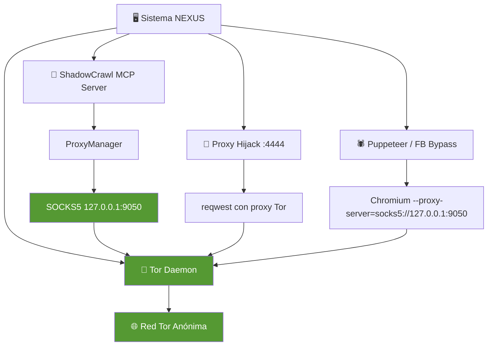
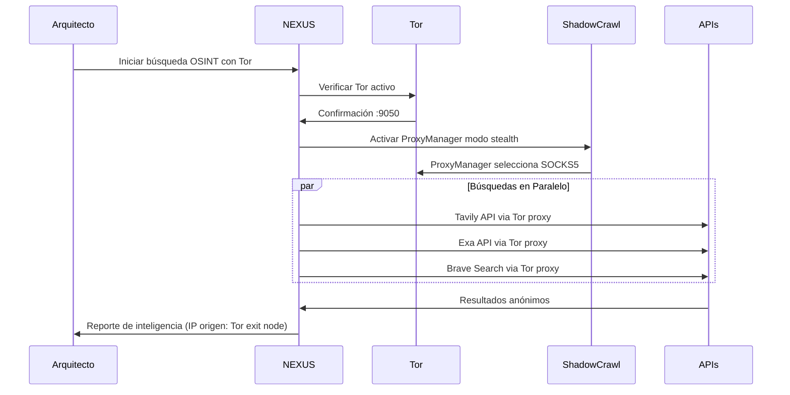

# Plan de Integración Tor — Operación Sentinel Inquebrantable

**Clasificación:** CRÍTICO - Top Secret Omega
**Enfoque:** A — Ligero/Proxy (SOCKS5 + Integración con Infraestructura Existente)
**Fecha:** 2026-06-11
**Arquitecto:** NEXUS (Orquestador Primogénito)

---

## 1. Diagnóstico del Estado Actual

### 1.1 Infraestructura Existente Relevante

| Componente | Estado | Rol en Integración Tor |
|-----------|--------|----------------------|
| [`shadowcrawl/mcp-server/src/features/proxy_manager.rs`](../shadowcrawl/mcp-server/src/features/proxy_manager.rs) | ✅ Operativo | Ya soporta SOCKS5 nativamente y tiene lógica de stealth mode que busca proxies Tor puerto 9050 |
| [`core/src/bin/proxy_hijack.rs`](../core/src/bin/proxy_hijack.rs) | ✅ Operativo en :4444 | Proxy MITM HTTP/HTTPS. Podría encadenarse detrás de Tor |
| [`scripts/proxy_on.sh`](../scripts/proxy_on.sh) | ✅ Existe | Activa proxy hijack en :4444. Requiere modificación para soportar modo Tor |
| [`scripts/proxy_off.sh`](../scripts/proxy_off.sh) | ✅ Existe | Desactiva proxy. Se mantiene igual |
| [`core/src/defensa/identidad_soberana.rs`](../core/src/defensa/identidad_soberana.rs) | ✅ Existe | Funciones de anonimato: jitter, user-agent aleatorio, mutación MAC |
| [`shadowcrawl/cortex-scout.json`](../shadowcrawl/cortex-scout.json) | ✅ Existe | `stealth: true` habilitado. Se añadirá config de proxy Tor |
| [`scripts/fb_bypass.js`](../scripts/fb_bypass.js) | ✅ Existe | Puppeteer scraping. Se le añadirá flag `--proxy-server=socks5://127.0.0.1:9050` |
| Tavily API | ✅ Externo | Se llamará a través de proxy Tor vía reqwest |
| Exa API | ✅ Externo | Se llamará a través de proxy Tor vía reqwest |
| Brave Search API | ✅ Externo | Se llamará a través de proxy Tor vía reqwest |

### 1.2 Lo Que FALTA

- ❌ **Tor no está instalado** — No se ha verificado si `tor`, `torsocks` o `torify` existen en el sistema
- ❌ **No hay configuración de Tor** — No existe `/etc/tor/torrc` personalizado para NEXUS
- ❌ **No hay script de activación Tor** — No hay `tor_on.sh` / `tor_off.sh` para alternar entre modo limpio y modo Tor
- ❌ **El ProxyManager no tiene Tor como fuente automática** — Aunque detecta puerto 9050, no hay una rutina que añada `socks5://127.0.0.1:9050` automáticamente
- ❌ **No hay verificación de fuga de IP** — No hay script que confirme que el tráfico realmente sale por Tor
- ❌ **Las APIs externas (Tavily/Exa/Brave) no están anonimizadas** — Se llaman directamente sin proxy

---

## 2. Arquitectura Propuesta



### 2.1 Flujo de Tráfico en Modo Tor

```
Petición OSINT
    │
    ├── Tavily API ──► reqwest con proxy socks5://127.0.0.1:9050 ──► Tor ──► Internet
    ├── Exa API     ──► reqwest con proxy socks5://127.0.0.1:9050 ──► Tor ──► Internet
    ├── Brave Search─► reqwest con proxy socks5://127.0.0.1:9050 ──► Tor ──► Internet
    ├── Scraping    ──► ProxyManager (SOCKS5) ──► Tor ──► Internet
    └── Puppeteer   ──► --proxy-server=socks5://127.0.0.1:9050 ──► Tor ──► Internet
```

### 2.2 Estrategia de Circuitos

- **Circuitos de 3 saltos** (configuración Tor por defecto)
- **Rotación automática de circuito** cada ~10 minutos (Tor por defecto)
- **Newnym forzado** antes de cada operación OSINT sensible (vía `tor --control` o `kill -HUP`)
- **DNS a través de Tor** (DNSTor) para evitar fugas DNS

---

## 3. Plan de Implementación — 6 Pasos

### Paso 1: Instalación y Configuración Base de Tor

**Archivos a crear/modificar:**
- **CREAR:** `scripts/tor_setup.sh` — Script idempotente de instalación
- **CREAR:** `config/tor/torrc` — Configuración NEXUS personalizada
- **MODIFICAR:** Sistema — Instalar paquetes `tor`, `torsocks`, `obfs4proxy` (opcional)

**Detalles de configuración de `/etc/tor/torrc` o `config/tor/torrc`:**

```conf
# Puerto SOCKS5 para aplicaciones
SOCKSPort 127.0.0.1:9050

# Puerto de control para nyx/rotación forzada
ControlPort 127.0.0.1:9051

# Cookie de autenticación (más segura que password)
CookieAuthentication 1

# Forzar salida por nodos de ciertos países? (opcional)
# ExcludeExitNodes {us},{cn},{ru}
# StrictNodes 1

# Logging mínimo para no llenar disco
Log notice file /var/log/tor/notices.log

# Circuito: 3 saltos (seguridad vs latencia)
NumEntryGuards 3

# Evitar nodos problemáticos conocidos
ExcludeNodes {us},{cn},{ru},{kp},{ir},{sy}
StrictNodes 0

# Bridge mode: descomentar si hay censura
# UseBridges 1
# Bridge obfs4 ...
```

### Paso 2: Script de Activación/Desactivación de Modo Tor

**Archivo a crear:**
- **CREAR:** `scripts/tor_on.sh` — Activa Tor y configura el entorno

```bash
#!/bin/bash
# 🔱 NEXUS TOR ACTIVATOR
# Enfoque A: Proxy SOCKS5 ligero

echo "🧅 [TOR] Verificando instalación..."
if ! command -v tor &> /dev/null; then
    echo "❌ Tor no está instalado. Ejecuta scripts/tor_setup.sh primero."
    exit 1
fi

echo "🧅 [TOR] Iniciando daemon Tor..."
sudo systemctl start tor 2>/dev/null || tor --quiet &

echo "⏳ [TOR] Esperando que el circuito esté listo..."
sleep 5

echo "🧅 [TOR] Verificando puerto SOCKS5..."
if ss -tlnp | grep -q 9050; then
    echo "✅ [TOR] Puerto SOCKS5 127.0.0.1:9050 ACTIVO"
else
    echo "❌ [TOR] Puerto 9050 NO disponible"
    exit 1
fi

echo "🌐 [TOR] Verificando IP de salida..."
TOR_IP=$(curl --socks5-hostname 127.0.0.1:9050 -s https://check.torproject.org/api/ip 2>/dev/null)
echo "   IP Tor: $TOR_IP"

echo ""
echo "🔱 [MODO TOR ACTIVADO]"
echo "   - ShadowCrawl utilizará SOCKS5 automáticamente"
echo "   - Puppeteer usará --proxy-server=socks5://127.0.0.1:9050"
echo "   - reqwest enrutado a través de Tor"
```

- **CREAR:** `scripts/tor_off.sh` — Detiene Tor y restaura conectividad directa

### Paso 3: Integración con ShadowCrawl ProxyManager

**Archivos a modificar:**
- **MODIFICAR:** [`shadowcrawl/mcp-server/src/features/proxy_manager.rs`](../shadowcrawl/mcp-server/src/features/proxy_manager.rs) — Añadir Tor como fuente automática

**Cambios específicos:**

```rust
// En la función de inicialización del ProxyManager:
// 1. Detectar si Tor está corriendo en 127.0.0.1:9050
// 2. Si existe, añadirlo como proxy de alta prioridad (priority: 1)
// 3. Si stealth mode está activo, forzar uso de Tor

async fn detect_and_add_tor_proxy(registry: &mut ProxyRegistry) {
    // Verificar que Tor está escuchando
    if let Ok(stream) = tokio::net::TcpStream::connect("127.0.0.1:9050").await {
        registry.proxies.push(ProxyConfig {
            url: "socks5://127.0.0.1:9050".to_string(),
            proxy_type: "socks5".to_string(),
            priority: 1,  // Máxima prioridad
            provider: "tor_daemon".to_string(),
            enabled: true,
            // ... resto de campos por defecto
        });
    }
}
```

Además, modificar la lógica de `select_proxy_url` en modo `is_stealth` para que **siempre prefiera Tor** cuando esté disponible.

### Paso 4: Integración con Proxy Hijack

**Archivos a modificar:**
- **MODIFICAR:** [`core/src/bin/proxy_hijack.rs`](../core/src/bin/proxy_hijack.rs) — Añadir soporte para encadenarse a Tor

**Cambios:**

```rust
// Añadir flag --tor-mode o variable de entorno PROXY_HIJACK_TOR=1
// Cuando está activo, el proxy_hijack enruta TODAS las peticiones salientes a través de:
//   reqwest::Proxy::all("socks5://127.0.0.1:9050")?
```

- **MODIFICAR:** `scripts/proxy_on.sh` — Añadir modo Tor

```bash
# Si se pasa argumento "tor":
if [ "$1" = "tor" ]; then
    export PROXY_HIJACK_TOR=1
    echo "🔱 [PROXY] Modo Tor activado: proxy_hijack encadenado a SOCKS5 :9050"
fi
```

### Paso 5: Integración con Puppeteer (Facebook Scraping)

**Archivos a modificar:**
- **MODIFICAR:** [`scripts/fb_bypass.js`](../scripts/fb_bypass.js) — Aceptar flag `--tor`

```javascript
// Detectar flag --tor
const useTor = process.argv.includes('--tor');
const proxyArgs = useTor ? ['--proxy-server=socks5://127.0.0.1:9050'] : [];

const browser = await puppeteer.launch({
    headless: "new",
    args: ['--no-sandbox', '--disable-setuid-sandbox', '--disable-gpu', ...proxyArgs]
});
```

- **CREAR:** `scripts/fb_bypass_tor.sh` — Wrapper que llama a fb_bypass.js con Tor

```bash
#!/bin/bash
# Wrapper: Ejecuta Facebook Bypass a través de Tor
node scripts/fb_bypass.js --tor "$@"
```

### Paso 6: Script de Verificación de Anonimato

**Archivo a crear:**
- **CREAR:** `scripts/check_tor_leak.sh` — Verifica que no haya fugas de IP/DNS

```bash
#!/bin/bash
# 🔱 NEXUS TOR LEAK CHECK

echo "🔍 [TOR] Verificando que el tráfico pasa por Tor..."

echo -n "1. IP real (sin Tor): "
curl -s https://check.torproject.org/api/ip

echo -n "2. IP por Tor: "
curl --socks5-hostname 127.0.0.1:9050 -s https://check.torproject.org/api/ip

echo -n "3. DNS leak check: "
curl --socks5-hostname 127.0.0.1:9050 -s https://dnsleaktest.com/ | grep -oP 'IP: \d+\.\d+\.\d+\.\d+' || echo "No leak detected"

echo -n "4. WebRTC leak check (browser): "
# Verificar que el proxy está funcionando
if ss -tlnp | grep -q 9050; then
    echo "✅ Proxy SOCKS5 activo en :9050"
else
    echo "❌ Proxy SOCKS5 NO disponible"
fi
```

---

## 4. Integración con OSINT — Cómo Usarlo

### 4.1 Flujo de Trabajo Recomendado



### 4.2 Cómo Alternar Entre Modos

| Acción | Comando | Efecto |
|--------|---------|--------|
| Activar Tor | `bash scripts/tor_on.sh` | Tor daemon + verificación |
| Desactivar Tor | `bash scripts/tor_off.sh` | Detiene Tor, restaura DNS normal |
| OSINT con proxy | Usar `use_proxy: true` en llamadas ShadowCrawl | ProxyManager elige mejor proxy disponible |
| OSINT con Tor forzado | `STEALTH_MODE=1` + Tor activo | ProxyManager elige Tor específicamente |
| Activar proxy hijack | `source scripts/proxy_on.sh tor` | Proxy hijack encadenado a Tor |
| Desactivar proxy hijack | `source scripts/proxy_off.sh` | Proxy hijack desactivado |
| Verificar anonimato | `bash scripts/check_tor_leak.sh` | Reporte de fuga de IP/DNS |

### 4.3 Variables de Entorno

| Variable | Descripción | Default |
|----------|-------------|---------|
| `STEALTH_MODE` | Forzar uso de Tor en ProxyManager | `0` |
| `PROXY_HIJACK_TOR` | Encadenar proxy_hijack a Tor | `0` |
| `TOR_SOCKS_PORT` | Puerto SOCKS5 de Tor | `9050` |
| `TOR_CONTROL_PORT` | Puerto de control Tor | `9051` |
| `TOR_NEWNYM` | Forzar nuevo circuito antes de cada búsqueda | `0` |

---

## 5. Dependencias y Riesgos

### 5.1 Dependencias del Sistema

| Dependencia | Propósito | Cómo Verificar |
|-------------|-----------|----------------|
| `tor` | Daemon Tor principal | `which tor` |
| `torsocks` | Torificación de aplicaciones CLI | `which torsocks` |
| `obfs4proxy` | Bridges para censura (opcional) | `which obfs4proxy` |
| `nyx` | Monitor de estado Tor en terminal | `which nyx` |
| `ss` | Verificar puertos | `ss -tlnp` |

### 5.2 Riesgos y Mitigaciones

| Riesgo | Probabilidad | Mitigación |
|--------|-------------|------------|
| Tor bloqueado por API externa | Alta | Tavily/Exa/Brave pueden detectar nodos Tor. Usar rotación de circuito + proxies HTTP alternativos como respaldo |
| Latencia alta | Media | Búsquedas OSINT no son en tiempo real. Aceptable para investigación |
| Tor no disponible en el sistema | Baja | `tor_setup.sh` instala automáticamente |
| Fuga de IP por DNS | Baja | Tor maneja DNS automáticamente. `check_tor_leak.sh` lo verifica |
| WebRTC leak desde Puppeteer | Media | Chromium con `--proxy-server` + deshabilitar WebRTC en args |
| Nodo Tor de salida bloqueado por sitio objetivo | Alta | Rotar circuito `kill -HUP $(pidof tor)` o cambiar Identity del proxy |

---

## 6. Criterios de Aceptación

- [ ] **P6.1:** `tor_setup.sh` instala Tor y deja el daemon operativo en `127.0.0.1:9050`
- [ ] **P6.2:** `tor_on.sh` activa Tor y confirma IP de salida anónima
- [ ] **P6.3:** `tor_off.sh` detiene Tor limpia y restaura conectividad normal
- [ ] **P6.4:** `check_tor_leak.sh` reporta "No leak detected" sin IP real visible
- [ ] **P6.5:** ShadowCrawl ProxyManager selecciona automáticamente Tor cuando está disponible y `STEALTH_MODE=1`
- [ ] **P6.6:** Puppeteer (`fb_bypass.js --tor`) navega a través de Tor
- [ ] **P6.7:** `proxy_on.sh tor` activa proxy_hijack encadenado a Tor
- [ ] **P6.8:** Las llamadas a Tavily/Exa/Brave pueden hacerse con proxy Tor (verificado por IP de salida diferente a la real)

---

## 7. Próximos Pasos (Después de Implementación)

1. **Extender a Enfoque B** si se requiere: bridges obfs4 para evasión de censura, torrificación transparente con `torsocks`, circuito Tor personalizado con nyx
2. **ShadowCrawl Deep Web**: Usar Tor para acceder a servicios `.onion` si es relevante para la investigación
3. **Honeypot Tor**: Crear un servicio `.onion` como señuelo para atraer a los atacantes
4. **Integración con AEGIS (Firecracker)**: Ejecutar instancias de análisis en MicroVM con salida forzada por Tor

---

*Este plan es un documento vivo. Se actualizará según la implementación y los hallazgos operativos.*
